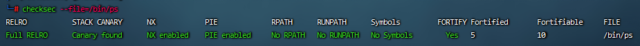
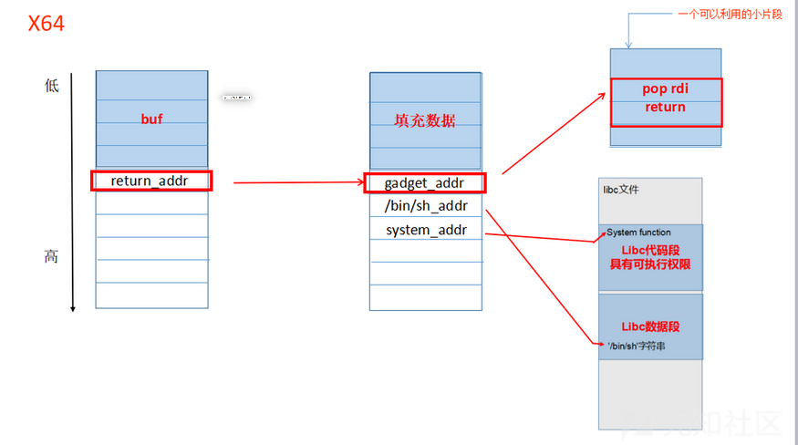

防护与对抗
========================================

windows
----------------------------------------
- 栈保护GS选项
	+ 防护：GS 编译选项为每个函数调用增加了一些额外的数据（“Security Cookie”/“canary”）和操作，用以检测栈中的溢出。
	+ 弊端：难以防御基于函数指针，虚函数的攻击；难以防御异常处理的攻击；只是防御栈，对堆无能为力
	+ 对抗：覆盖SEH链为jmp esp的地址，之后触发异常跳转到esp执行shellcode。
- 堆保护
	+ PEB random
		- DWORD SHOOT PEB中函数回调指针变得困难。
	+ Safe Unlink
		- 原理：堆操作前验证前后向指针完整性防止DWORD SHOOT。
		- 对抗：1.利用chunk重设大小攻击堆。2.Safe Unlink只对空表中双向链表进行有效性验证，没有堆快表中的单链表进行验证，从而可以利用Lookaside表进行堆溢出。
	+ heap cookie
		- 堆中加入cookie防止溢出。
	+ 元数据加密
		- winddows Vista之后再块首重要数据进行了编码。
	+ LFH
		- 防护：在Window7中，它用LFH(Low Fragmentation Heap)取代了之前Windows XP版本中的lookaside。堆分配时候的随机化出现是为了缓解系统中UAF漏洞的利用。
		- 对抗：使用目标对象喷满整个userblocks，然后修改他们的metadata，总会有办法做到代码执行。
- SafeSEH
	+ 防护：SafeSEH是在程序编译的时候，就将所有的异常处理函数进行注册。凡是执行过程中触发异常后，都要经过一个检验函数，检查SEH链指向的地址是否在注册的列表中。
	+ 对抗：如果SEH链指向的地址不在SEH链指向模块（exe、dll）地址的情况下，那就可以执行了。因此在程序中非模块的数据空间找到jmp esp，比方说nls后缀的资源文件等。或者是在支持JS脚本的软件中（浏览器等），通过脚本申请堆空间写入shellcode。
- DEP
	+ 防护：数据执行保护（DEP）指的是堆和栈只有读写权限没有执行权限。
	+ 对抗：对抗DEP的方式是将shellcode写入堆栈中，从程序自身的代码去凑到执行VirtualProtect()将shellcode所在内存属性添加上可执行权限，将函数返回值或者SEH链覆盖成代码片段的起始地址。这种利用程序自身碎片绕过DEP的方式被称作ROP。ROP技术的前提是代码片段的地址固定，这样才能知道往函数返回值或者SEH链中填写哪个地址。
- ASLR
	+ 防护：ALSR即是让exe、dll的地址全都随机。
	+ 对抗：对抗ASLR的方式是暴力把程序空间占满，全铺上shellcode，只要跳转地址没落在已有模块中，落在我们的空间中即可以执行了shellcode，但是这样做无法绕过DEP，这种将程序空间全部占满铺上shellcode的技术被称为堆喷射技术，堆喷射技术只能对抗ASLR，缺无法对抗ASLR+DEP的双重防护。ASLR+DEP的双重防护使得大多数软件的漏洞只能造成崩溃，无法稳定利用。将程序空间占满的技术，称之为堆喷射（Heap Spraying），这种技术只能应用在可以执行JS等脚本的软件上，如浏览器等。堆喷射通过大面积的申请内存空间并构造适当的数据，一旦EIP指向这片空间，就可以执行shellcode。堆喷射已经是不得已而为之，有时候会造成系统卡一段时间，容易被发现；另一点，如果EIP恰好指向shellcode中间部分就会造成漏洞利用失败，因此不能保证100%成功。
- CFG
	+ 防护：微软在最新的操作系统win10当中，对基于执行流防护的实际应用中采用了CFG技术。CFG是Control Flow Guard的缩写，就是控制流保护，它是一种编译器和操作系统相结合的防护手段，目的在于防止不可信的间接调用。
	+ 对抗：无。

linux
-----------------------------------------
- 工具：checksec
	+ checksec用来检查可执行文件属性，例如PIE, RELRO, PaX, Canaries, ASLR, Fortify Source等等属性。
	+ ``checksec --file=/bin/ps``
		|defense1|
		::
		
			RPATH/RUNPATH
			程序运行时的环境变量，运行时所需要的共享库文件优先从该目录寻找，可以fake lib造成攻击.

- RELRO
	+ RELRO机制全名是read only relocation，指定binary的一块区域使其权限变为只读,此项技术主要针对GOT改写的攻击方式。它分为两种，Partial RELRO 和 Full RELRO。
		::
		
			gcc -o hello test.c // 默认情况下，是Partial RELRO
			gcc -z norelro -o hello test.c // 关闭，即No RELRO
			gcc -z lazy -o hello test.c // 部分开启，即Partial RELRO
			gcc -z now -o hello test.c // 全部开启，即Full RELRO

- CANNARY
	+ 栈溢出保护,类似windows下的启用GS选项。
		::
		
			gcc -o test test.c // 默认情况下，不开启Canary保护
			gcc -fno-stack-protector -o test test.c //禁用栈保护
			gcc -fstack-protector -o test test.c //启用堆栈保护，不过只为局部变量中含有char数组的函数插入保护代码
			gcc -fstack-protector-all -o test test.c //启用堆栈保护，为所有函数插入保护代码

- FORTIFY
	+ FORTIFY机制用于检查程序是否存在缓冲区溢出错误，适用于memcpy，memset，stpcpy，strcpy，strncpy，strcat，strncat，sprintf，snprintf，vsprintf，vsnprintf，gets等函数。
	+ 在函数编译时，加入FORTIFY机制的代码会在编译过程中自动添加一部分代码，判断数组的大小，削减缓冲区溢出的危害。
		::
		
			gcc -D_FORTIFY_SOURCE=1 仅仅只会在编译时进行检查
			gcc -D_FORTIFY_SOURCE=2
- NX
	+ 防护：类似windows下的DEP,设置NX会限制数据页面内存中不可执行代码，如果开启的话就不能让IP寄存器指向堆栈,克制ret2shellcode方式的攻击手段。
		::
		
			gcc -z execstack 关闭NX保护
			gcc -z noexecstack 开启NX保护
	+ 对抗：linux下shellcode的功能是通过execute执行/bin/sh，那么系统函数库（Linux称为glibc）有个system函数，它就是通过/bin/sh命令去执行一个用户执行命令或者脚本，我们完全可以利用system来实现Shellcode的功能。EIP一旦改写成system函数地址后，那执行system函数时，它需要获取参数。而根据Linux X86 32位函数调用约定，参数是压到栈上的。噢，栈空间完全由我们控制了，所以控制system的函数不是一件难事情。这种攻击方法称之为ret2libc，即return-to-libc，返回到系统库函数执行 的攻击方法。
	
		|rop1|
		::
		
			工作原理如下：
			①当程序运行到 gadget_addr 时（rsp 指向 gadget_addr），接下来会跳转到小片段里执行命令，
				同时 rsp+8(rsp 指向 bin_sh_addr)
			②然后执行 pop rdi, 将 bin_sh_addr 弹入 rdi 寄存器中，同时 rsp + 8(rsp 指向 system_ad
				dr)
			③执行 return 指令，因为这时 rsp 是指向 system_addr 的，这时就会调用 system 函数，而参
				数是通过 rdi 传递的，也就是会将 /bin/sh 传入，从而实现调用 system('/bin/sh')
			gadget_addr工具ROPgadget：https://github.com/JonathanSalwan/ROPgadget.git
- PIE
	+ PIE叫做代码部分地址无关，类似与windows下的ASLR,PIE能使程序像共享库一样在主存任何位置装载，这需要将程序编译成位置无关，并链接为ELF共享对象。
	+ 关闭pie指令： ``sudo -s echo 0 > /proc/sys/kernel/randomize_va_space``
		- 0:没有随机化。即关闭ASLR。
		- 1:保留的随机化。共享库、栈、mmap()分配的内存空间以及VDSO将被随机化。
		- 2:完全的随机化。在1的基础上，通过 brk()分配的内存空间也将被随机化。
	+ gcc编译
		- -fPIC与-fpic都是在编译时加入的选项，用于生成位置无关的代码(Position-Independent-Code)。这两个选项都是可以使代码在加载到内存时使用相对地址，所有对固定地址的访问都通过全局偏移表(GOT)来实现。-fPIC和-fpic最大的区别在于是否对GOT的大小有限制。-fPIC对GOT表大小无限制，所以如果在不确定的情况下，使用-fPIC是更好的选择。
		- -fPIE与-fpie是等价的。这个选项与-fPIC/-fpic大致相同，不同点在于：-fPIC用于生成动态库，-fPIE用与生成可执行文件。再说得直白一点：-fPIE用来生成位置无关的可执行代码。
			::
			
				gcc -o test test.c // 默认情况下，不开启PIE
				gcc -fpie -pie -o test test.c // 开启PIE，此时强度为1
				gcc -fPIE -pie -o test test.c // 开启PIE，此时为最高强度2
				gcc -fpic -o test test.c // 开启PIC，此时强度为1，不会开启PIE
				gcc -fPIC -o test test.c // 开启PIC，此时为最高强度2，不会开启PIE
- SELinux
	+ 安全增强型 Linux（Security-Enhanced Linux）简称 SELinux，它是一个 Linux 内核模块，也是 Linux 的一个安全子系统。SELinux 主要由美国国家安全局开发。2.6 及以上版本的 Linux 内核都已经集成了 SELinux 模块。
	+ SELinux 主要作用就是最大限度地减小系统中服务进程可访问的资源（最小权限原则）。
- Secommp
	+ Secommp (SECure COMPuting) 是 Linux 内核 2.6.12 版本引入的安全模块，主要是用来限制某一进程可用的系统调用 (system call)。它最初被用于 cpushare 这个项目，让人们可以出租自己空闲的 cpu cycle 来执行 untrusted code。这个 feature 本身并不是一个沙盒 (sandbox)，它只是一种减少 Linux 内核暴露的机制，是构建一个安全的沙盒的重要组成部分。
	+ Seccomp Strict Mode
		- Seccomp在最初引入的时候只支持了 strict mode，意味着只有 read ，write ，_exit ，_sigreturn 四个 system call 会被允许。一旦出现其他的 system call，进程会被立刻终止 (SIGKILL)。
			::
			
				#include <stdio.h>
				#include <sys/prctl.h>

				#include <sys/socket.h>
				#include <linux/seccomp.h>

				int main(int argc, char* argv[]) {
				  printf("Install seccomp\n");
				  prctl(PR_SET_SECCOMP, SECCOMP_MODE_STRICT);

				  printf("Creating socket\n");
				  int sock = socket(AF_INET, SOCK_STREAM, 0);

				  return 0;
				}
				
				编译并执行，结果如下：

				$ g++82 -o seccomp seccomp.c
				$ ./seccomp 
				Install seccomp
				Creating socket
				Killed
				$ echo $?
				137

				上面的程序在 seccomp 被启动之后有两个系统调用：write 和 socket ，
				printf 这个函数本质上向 stdout 写了一些 bytes，是被允许的。然而当进程想要创建 socket 的时候，程序就被终止了。
	+ Seccomp Filter Mode (Seccomp-BPF)
		- strict mode 固然很棒，然而实用性却不高。因为一个复杂的程序根本不可能只用到四个 system call。
		- Linux内核实现了一个能够执行BPF程序的虚拟机。对于每一次 system call，内核都会执行一遍开发者提供的 BPF 程序，用来确定是否需要过滤 system call。
		
		

