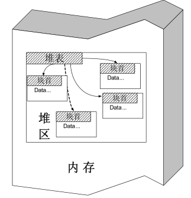
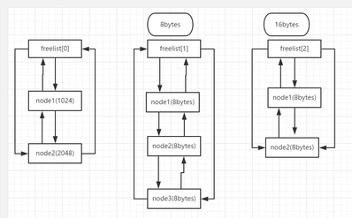
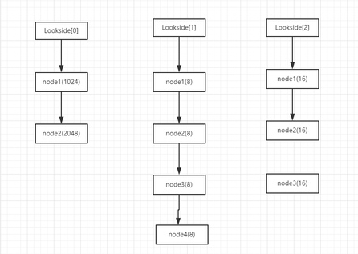
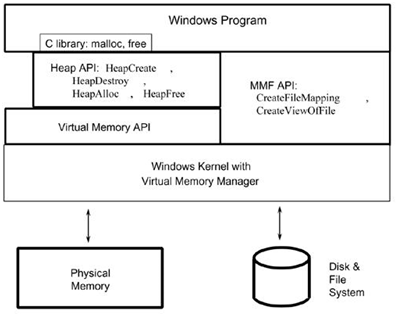

堆溢出
========================================

堆
----------------------------------------

简介
~~~~~~~~~~~~~~~~~~~~~~~~~~~~~~~~~~~~~~~~
堆(heap)是一种基本的数据结构，它可由开发人员自行分配、释放。一般系统使用链表来管理空闲的堆内存，所以堆是不连续的。其中，链表的遍历是由低地址向高地址进行的。一般称管理堆的那部分程序为堆管理器，处于用户程序与内核中间，主要做以下工作:

- 响应用户的申请内存请求，向操作系统申请内存，然后将其返回给用户程序.
- 管理用户所释放的内存。

系统调用
~~~~~~~~~~~~~~~~~~~~~~~~~~~~~~~~~~~~~~~~~
 | 在动态申请和释放内存时，无论是malloc，free，new等函数，它们并不是真正与系统交互的函数。
 | |heap5|
 | 第一层：Win32 API作为系统的接口，提供了一组操作虚拟内存的接口；
 | 第二层：Heap作为虚拟内存的一部分，Win32 API又提供了一组操作Heap内存的接口，但是这些接口是建立在操作虚拟内存的接口的基础上。
 | 第三层：Windows平台下的C Run-Time Library 又利用Heap API来实现malloc和free。
 | 由此我们可以看出，这些动态内存操作方式之间存有单一的层次关系，位于这个层次的最低层的是Virtual Memory API，可以说这些方式都是建立在Virtual Memory API的基础上。
 | 调用关系如下表所示为 : new -> malloc -> HeapAlloc -> VirtualAlloc -> 驱动程序的_PageAlloc.

堆数据结构
~~~~~~~~~~~~~~~~~~~~~~~~~~~~~~~~~~~~~~~~~
现代操作系统的堆数据结构一般包括堆块和堆首。

- 堆块
	堆块分为块首和块身，块首是一个堆块头部的8个字节，用于标识这个堆块自身的信息。
- 堆表（空表和快表）
	位于堆区的起始位置，堆表分为两种空闲双向链表Freelist（空表 128条）和快速单向链表Lookaside（快表 最多只有四项)。
	|heap1|

	- 空表
		| ①堆区空闲堆块的块首都包含一对指针，这对指针用于将空闲的堆块组织成双向链表，按照大小的不同，总共分为128条。
		| ②堆区一开始的堆表区，中有一个128项的指针数组，叫空表数组索引，该数组的每一项都包含两个指针，用来标示一条空表。
		| ③空表的结构如下图所示：

			|heap2|

		::
		
			●freelist[0]被称为零号空表 并且是节点从第一个 1024bytes 逐渐增减1024的整数倍。
			 第二个及以后的节点 >=1024 bytes
			●从第二个链表开始即：free list【1】 开始： free list【1】 此空闲链表中每个节
			 点是八个字节。free list【2】 = 16bytes,即：节点的字节数 = 下表 * 8
			●此处谨记零号空闲链表。在堆分配的时候很重要。
			●空表的特点：可以发生堆块合并，分配的效率低

	- 快表
		| ①快速单项链表。块表是windows加速堆块分配的一种链表。
		| ②快表特点：永远处于占用态意味着不会发生合并，快表只包含四个节点。同样的快表也是包含128条，组织结构跟空表很类似，块表总是被初始化为空。 
		| ③结构如下图：

			|heap3|

堆分配策略
~~~~~~~~~~~~~~~~~~~~~~~~~~~~~~~~~~~~~~~~~
- 堆块的分配
	- 快表的分配
		包括寻找到精确匹配大小的空闲块，将此空闲块标注为占用状态，从快表中卸下，返回指向堆块块身的指针供程序使用。
	- 零号空表的分配
		零号空表中所有的空闲块是按照从小到大的顺序排列的，因此在分配的时候先从最后的堆块进行分配，看能否满足要求，如果能满足要求，则正向寻找最小能满足要求的堆块进行分配。
	- 空表分配
		普通空表进行分配时候，寻找最优解决方案，若不满满足最优解决方案，则采用次优解决方案进行分配。空表分配中存在找零钱的现象，即：当无法找到最有解决方案，次优解决方案的时候，就会从大的尾块中进行割下一小快能够满足要求的堆块，最后进行尾块的块首的状态信息进行修改即可。
	- 堆块分配的特点
		快表中只存在精确分配，不存在找零钱现象。空表中存在找零钱现象（不考虑堆缓存，碎片化等情况）
- 堆块的释放
	堆表的释放包括将讲占用态该为空闲态，释放的堆块链入相应的堆表，所有释放的都链入相应的表尾，分配的时候先从表尾进行分配。块表只包含四个节点；
- 堆块的合并
	经过反反复复的堆块的分配与释放，堆区会出新很多凌乱的碎片，这时候就需要用到堆块的合并，堆块的合并包括几个动作：将堆块从空表中卸下，合并堆块，修改合并后的块首，链接入新的琏表。（合并的时候还有一种操作叫内存紧缩）。 合并的时候之会合并相邻的堆块。
- 堆分配和释放算法
	|heap4|

调试堆
-----------------------------------------
调试堆不能使用OllyDbg,WinDbg等调试器加载程序，否则堆管理器会检测到当前进程处于调试状态，而使用调试堆管理策略。

调试堆管理策略特点
~~~~~~~~~~~~~~~~~~~~~~~~~~~~~~~~~~~~~~~~~~
- 只用空表分配
- 所有堆块被加上8字节的0xAB和8字节的0x00，防止程序溢出
- 块首标志位不同

::

	为了避免程序检测调试器而使用调试堆管理策略，可以在创建堆之后加入人工断点：
	_asm int 3，然后让程序单独执行，然后用调试器附加进程，就可以看到真实的堆。

识别堆表
-----------------------------------------

示例代码
~~~~~~~~~~~~~~~~~~~~~~~~~~~~~~~~~~~~~~~~

::

	#include"stdafx.h"
	#include<Windows.h>

编译环境：
 | IDE：Visual Studio 2015，release
 | 编译选项：
 | 字符集：使用多字节字符集
 | c/c++->优化->优化：已禁用
 | c/c++->优化->启用内部函数：否
 | c/c++->优化->全程序优化：否
 | c/c++->预处理器->预处理定义：_CRT_SECURE_NO_WARNINGS（或禁用SDL）
 | c/c++->代码生成->安全检查：禁用安全检查（/GS-）
 | 链接器->高级->数据执行保护(DEP)-否
 | 链接器->高级->随机基址-否
 | 附件：`stackvuln.zip <..//_static//stackvuln.zip>`_

运行堆栈
~~~~~~~~~~~~~~~~~~~~~~~~~~~~~~~~~~~~~~~~

HeapSpray（堆喷）
-----------------------------------------

简介
~~~~~~~~~~~~~~~~~~~~~~~~~~~~~~~~~~~~~~~~~
 | Heap Spray是一种通过比较巧妙的方式控制堆上数据，继而把程序控制流导向ShellCode的古老艺术。
 | 在shellcode的前面加上大量的slidecode（滑板指令），组成一个注入代码段。然后向系统申请大量内存，并且反复用注入代码段来填充。这样就使得进程的地址空间被大量的注入代码所占据。然后结合其他的漏洞攻击技术控制程序流，使得程序执行到堆上，最终将导致shellcode的执行。
 | 传统slide code（滑板指令）一般是NOP指令，但是随着一些新的攻击技术的出现，逐渐开始使用更多的类NOP指令，譬如0x0C（0x0C0C代表的x86指令是OR AL 0x0C），0x0D等等，不管是NOP还是0C，他们的共同特点就是不会影响shellcode的执行。
 | Heap Spray只是一种辅助技术，需要结合其他的栈溢出或堆溢出等等各种溢出技术才能发挥作用。

示例代码
~~~~~~~~~~~~~~~~~~~~~~~~~~~~~~~~~~~~~~~~

::

	#include "stdafx.h"
	#include<string>

	class base
	{
		char m_buf[8];
	public:
		virtual int baseInit1()
		{
			printf("%s\n", "baseInit1");
			return 0;
		}
		virtual int baseInit2()
		{
			printf("%s\n", "baseInit2");
			return 0;
		}
	};

	int main()
	{
		getchar();
		unsigned int bufLen = 200 * 1024 * 1024;
		base *baseObj = new base;
		char buff[8] = { 0 };
		char *spray = new char[bufLen];
		memset(spray, 0x0c, sizeof(char)*bufLen);//此处存放shellcode
		memset(spray + bufLen - 0x10, 0xcc, 0x10);
		strcpy(buff, "12345678\x0c\x0c\x0c\x0c\x0c\x0c\x0c\x0c");//覆盖base类的虚表指针
		baseObj->baseInit1();
		return 0;
	}

编译环境：
 | IDE：Visual Studio 2015，release
 | 编译选项：
 | 字符集：使用多字节字符集
 | c/c++->优化->优化：已禁用
 | c/c++->优化->启用内部函数：否
 | c/c++->优化->全程序优化：否
 | c/c++->预处理器->预处理定义：_CRT_SECURE_NO_WARNINGS（或禁用SDL）
 | c/c++->代码生成->安全检查：禁用安全检查（/GS-）
 | 链接器->高级->数据执行保护(DEP)-否
 | 链接器->高级->随机基址-否
 | 附件：`HeapSpray.zip <..//_static//HeapSpray.zip>`_

Use After Free（释放重引用）
-----------------------------------------

简介
~~~~~~~~~~~~~~~~~~~~~~~~~~~~~~~~~~~~~~~~~
当申请的一个堆块在释放后，指向该堆块的指针没有清空（置NULL），就形成了一个悬挂指针（dangling pointer），而后再申请出堆块时会将刚刚释放出的堆块申请出来，并复写其内容，而悬挂指针此时仍然可以使用，使得出现了不可控的情况。攻击者一般利用该漏洞进行函数指针的控制，从而劫持程序执行流。

示例代码
~~~~~~~~~~~~~~~~~~~~~~~~~~~~~~~~~~~~~~~~

::

	#include "stdafx.h"
	#include<string>
	#include<stdio.h>

	class attack
	{
	public:
		unsigned int num;
		char buffer[8];
	public:
		attack(unsigned int n) { num = n; };
		virtual ~attack() {};
	public:
		virtual void printnum()
		{
			printf("num=%d\n", num);
		}
	};

	int main()
	{
		_asm int 3;
		
		attack *p1;
		char *p2;

		p1 = new attack(1);
		printf("p1：0x%p,size=%d\n", p1,sizeof(attack));
		delete p1;

		// 分配 p2 去“占坑”p1 的内存位置
		p2 = (char*)malloc(sizeof(attack));
		printf("p2：0x%p,size=%d\n", p2,sizeof(attack));
		memset(p2, 0x0c, 4);

		char *shellcode=new char[200 * 1024 * 1024];//堆喷
		memset(shellcode, 0x0c, 200 * 1024 * 1024);
		memset(shellcode + 200 * 1024 * 1024 - 0x10, 0xcc, 0x10);//shellcode

		// 重引用已释放的buf1指针，但却导致buf2值被篡改
		printf("==== Use After Free ===\n");
		p1->printnum();
		free(p2);
		delete[]shellcode;
		return 0;
	}

编译环境：
 | IDE：Visual Studio 2015，release
 | 编译选项：
 | 字符集：使用多字节字符集
 | c/c++->优化->优化：已禁用
 | c/c++->优化->启用内部函数：否
 | c/c++->优化->全程序优化：否
 | c/c++->预处理器->预处理定义：_CRT_SECURE_NO_WARNINGS（或禁用SDL）
 | c/c++->代码生成->安全检查：禁用安全检查（/GS-）
 | 链接器->高级->数据执行保护(DEP)-否
 | 链接器->高级->随机基址-否
 | 附件：`HeapUAF.zip <..//_static//HeapUAF.zip>`_

Double Free（双重释放）
-----------------------------------------

简介
~~~~~~~~~~~~~~~~~~~~~~~~~~~~~~~~~~~~~~~~~
double free是UAF的一种,相对其他类型漏洞比较少见。主要是由对同一个堆内存块进行二次释放导致的，利用好可以执行任意代码。

.. |heap4| image:: ../images/heap4.png
