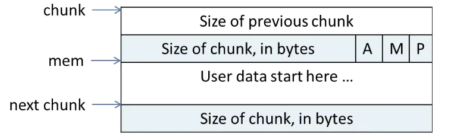
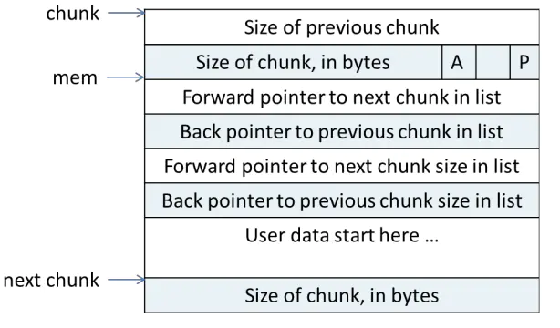

linux堆及溢出利用
========================================

基础
----------------------------------------
- 微观结构
	申请的内存chunk在ptmalloc内部用malloc_chunk结构体表示。
	根据空闲的chunk的大小以及使用状态将chunk初步分为4类：fast bins，small bins，large bins，unsorted bin。
	malloc申请内存时与内核交互主要通过brk和mmap函数来分配内存空间，首次申请的内存不大于128KB时，由brk申请，首次申请的内存大于等于128KB时，就由mmap与内核交互分配内存空间。
- 宏观结构
	arena,heap,chunk三种层级。Chunk为分配给用户的内存的一个单位。 heap是对chunk的一种组织方式，arena又是对heap的组织。

chunk
----------------------------------------
- 基础
	+ 在glibc中记录bin的数组有两个，fastbinY（记录所有的fastbins，共10个），bins（记录除fastbin之外的所有bins，共126个）
	+ 数组bin中包含有1个unsorted bin，62个small bins，63个large bins
	+ 处于各个free bins中的chunk通过fd与bk相互链接在一起。
- bin特点
	+ fastbin
		Fastbin是chunk最小的，也是分配起来最快的，因而得名fast bin.它可以分配的chunk的范围从0到80字节，总共有10个链表，分别对应不同的大小（在初始化的时候其实只设置到64字节，而不是80字节）：
		Fastbin链表中的chunk实际上没有使用chunk结构体中的bk指针，所以这个chunk链表就成为了单链表，使得操作更加迅速，另外，fastbin的chunk无法进行合并，所以指明前一个chunk是否被使用的标志为永远为1.
	+ small bin
		存储512字节以内的chunk。bin共62个，每一个bin的大小间距是8个字节，如果有两个相邻chunk都为空闲则需要合并，其中每一个bin的大小是固定的（也就是确定的，主要和large bin作比较）。
	+ large bin
		包含大于等于512字节的chunk。Bin共63个，组织方法如下：
		32个bin 每64个字节一个阶层，比如第一个512-568字节，第二个576 - 632字节……
		16个bin 每512字节一个阶层
		8个bin每4096字节一个阶层
		4个bin每32768字节一个阶层
		2个bin每262144字节一个阶层
		最后一个bin包括所有剩下的大小

		和small bin不同的地方在于，这里的每一个bin都保存的是一个范围而不是一个确定的值，每一个bin内的chunk大小是排好序的。不过和small bin一样也可以合并。

	+ unsorted bin
		当small或者large chunk（即small bin和large bin当中的chunk）被释放的时候会放入这个bin当中，这个bin只有一个，是一个循环链表，任意大小的chunk都可以放入这个bin

- bin分配方式
	+ 分配fastbin chunk
		刚初始化之后max size和索引值均为空，由small bin处理 -> 不为空的时候，计算索引，根据索引找到相应的bin -> 取走该bin的第一个chunk，第二个chunk成为第一个chunk -> 将chunk地址转换为用户的mem地址，返回
	+ 分配small bin chunk
		刚初始化之后small bin都为空。Small bin某一个bin为空的时候就交给unsorted bin处理 -> 不为空的时候，最后一个chunk被取走 -> 转换为mem地址，返回
	+ 分配 large chunk
		刚初始化之后，large bin都为空，为空或者large bin中最大的也无法满足要求，就交给下一个最大的bin来处理， -> 不为空的时候，如果最大的chunk大小比请求的空间大，从后往前找能够满足要求的chunk ->找到之后，切成两半，一个返回给用户，一个加入unsorted bin
	+ 释放
		释放基本上就是检查前后一个相邻的chunk是否是空闲的，是空闲的则合并，然后加入unsorted bin，否则直接加入unsorted bin
	
相关结构
----------------------------------------
- heap_info
	::

		typedef struct _heap_info
		{
		  mstate ar_ptr; /* 堆对应的 arena 的地址 */
		  struct _heap_info *prev; /* 由于一个线程申请一个堆之后，可能会使用完，之后就必须得再次申请。因此，一个可能会有多个堆。
						prev即记录了上一个 heap_info 的地址。这里可以看到每个堆的 heap_info 是通过单向链表进行链接的 */
		  size_t size;   /* size 表示当前堆的大小 */
		  size_t mprotect_size; /* 最后一部分确保对齐  */
		  /* Make sure the following data is properly aligned, particularly
			 that sizeof (heap_info) + 2 * SIZE_SZ is a multiple of
			 MALLOC_ALIGNMENT. */
		  char pad[-6 * SIZE_SZ & MALLOC_ALIGN_MASK];
		} heap_info;
		
- malloc_state
	该结构用于管理堆，记录每个arena当前申请的内存的具体状态，比如说是否有空闲chunk，有什么大小的空闲chunk等等。无论是thread arena还是main arena，它们都只有一个malloc state结构。由于thread的arena可能有多个，malloc state结构会在最新申请的arena中。注意，main arena的malloc_state并不是 heap segment的一部分，而是一个全局变量，存储在libc.so的数据段。
	
	::
	
		struct malloc_state {
			/* 该变量用于控制程序串行访问同一个分配区，当一个线程获取了分配区之后，其它线程要想访问该分配区，就必须等待该线程分配完成候才能够使用。  */
			__libc_lock_define(, mutex);

			/* flags记录了分配区的一些标志，比如 bit0 记录了分配区是否有 fast bin chunk ，bit1 标识分配区是否能返回连续的虚拟地址空间。  */
			int flags;

			/* 存放每个 fast chunk 链表头部的指针 */
			mfastbinptr fastbinsY[ NFASTBINS ];

			/* 指向分配区的 top chunk */
			mchunkptr top;

			/* 最新的 chunk 分割之后剩下的那部分 */
			mchunkptr last_remainder;

			/* 用于存储 unstored bin，small bins 和 large bins 的 chunk 链表。 */
			mchunkptr bins[ NBINS * 2 - 2 ];

			/* ptmalloc 用一个 bit 来标识某一个 bin 中是否包含空闲 chun..*/
			unsigned int binmap[ BINMAPSIZE ];

			/* Linked list, points to the next arena */
			struct malloc_state *next;

			/* Linked list for free arenas.  Access to this field is serialized
			   by free_list_lock in arena.c.  */
			struct malloc_state *next_free;

			/* Number of threads attached to this arena.  0 if the arena is on
			   the free list.  Access to this field is serialized by
			   free_list_lock in arena.c.  */
			INTERNAL_SIZE_T attached_threads;

			/* Memory allocated from the system in this arena.  */
			INTERNAL_SIZE_T system_mem;
			INTERNAL_SIZE_T max_system_mem;
		};
- malloc_chunk
	::
	
		struct malloc_chunk {

		  INTERNAL_SIZE_T      prev_size;  /* Size of previous chunk (if free).  */
		  INTERNAL_SIZE_T      size;       /* Size in bytes, including overhead. */

		  struct malloc_chunk* fd;         /* double links -- used only if free. */
		  struct malloc_chunk* bk;

		  /* Only used for large blocks: pointer to next larger size.  */
		  struct malloc_chunk* fd_nextsize; /* double links -- used only if free. */
		  struct malloc_chunk* bk_nextsize;
		};
		
- 使用堆内存布局
	一个使用中的 chunk（就是还没有 free 掉）在内存中的样子如下（从上到下，地址越来越大）：
	
	|linuxheap1|
	
	◆size of previous chunk
		这是前面一个 chunk 的大小，这里的前面一个指的是低地址的那一个
	◆size of chunk
		这个 chunk 的大小。而且这个 chunk 的大小一定是 8 的倍数。所以低三位是 0，由于低三位是 0，是固定值，可以将这些固定值，用来表示其他的含义，反正计算大小的时候，统一把他们当成 0 就好了。下面从高到低介绍这些标志的意思
	◆A
		是不是「主分配区」分配的内存 1 表示不是主分配区分配的，0 表示是主分配区分配的
	◆M
		是不是 Memory Mapped 分配的内存，1 表示是，0 表示是 heap
	◆P
		表示前一个 chunk 是否在使用，在初始化的时候通常为 1，防止使用不能访问的内存
	◆user data
		从这里开始才是 User Data,一共有两个位置记录了一个 chunk 的大小
		
- 空闲堆内存布局
	|linuxheap2|
	
	当一个 chunk 被用户 free 了以后，不是立即还给操作系统，而是被 ptmalloc 留了下来，等待用户下一次申请内存
	此时只有 AP 状态。
	原本是用来存用户数据的存储了四个指针，指针 fd 指向了后一个空闲的 chunk，而 bk 指向前一个空闲的chunk。
	ptmalloc 通过这种方法，将多个大小相近的 chunk 连成一个双向链表。又形成了一个新的数据结构 bin。
	
- 堆的空间复用
	当一个 chunk 在使用的时候，它的下一个 chunk 的 previous_size 记录了这个 chunk 的大小，由于这个记录没有什么用。所以当前 chunk 可以使用下一个 chunk 的 previous_size 空间，由于是连续的所以用起来也十分方便。

堆溢出利用
----------------------------------------
	

