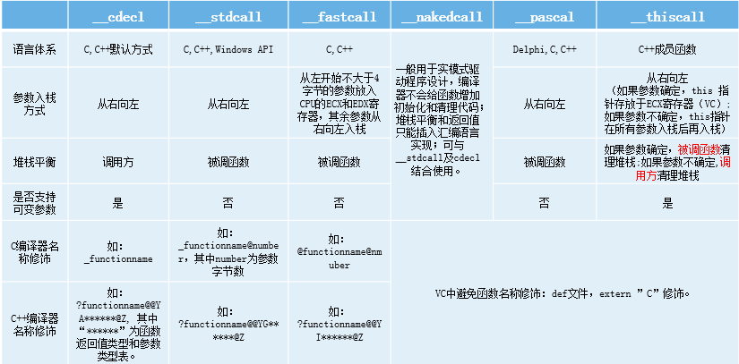
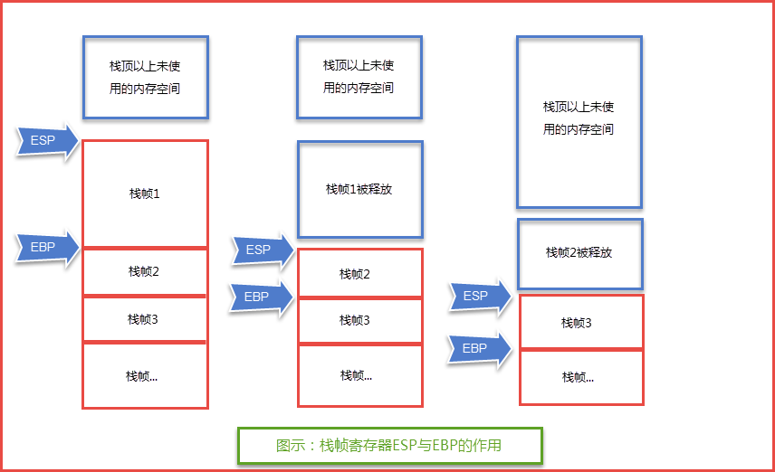
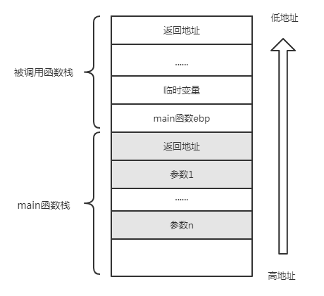
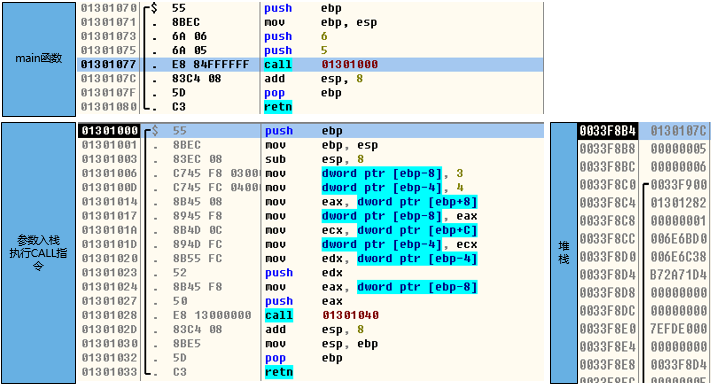
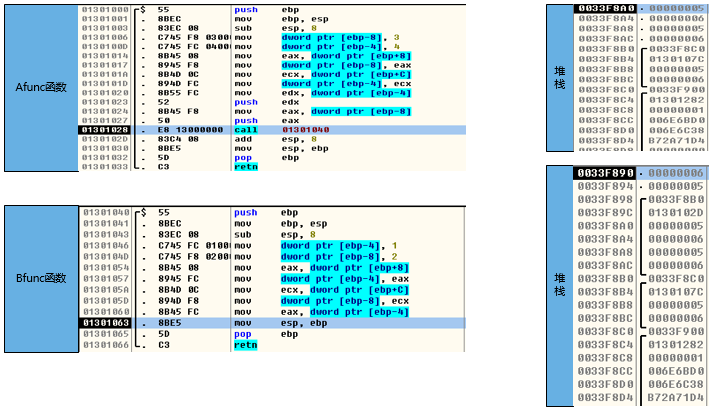
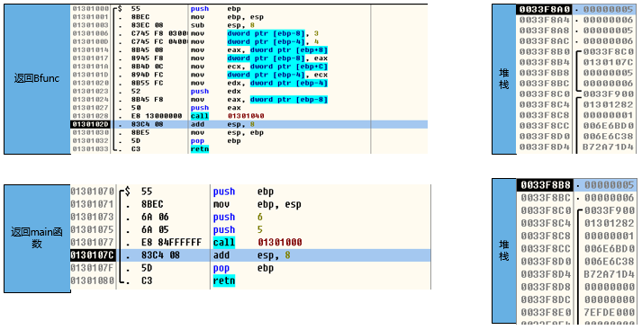

栈溢出
========================================

栈
----------------------------------------
栈一般指的就是 **系统栈** ，由操作系统 **自动** 维护，它用于实现高级语言中函数的调用。对于类似C语言这样的高级语言，系统栈的PUSH、POP等堆栈平衡细节是透明的。一般说来，只有在使用汇编语言开发程序的时候，才需要和它直接打交道。

主要用于存放函数的参数以及局部变量等，操作方式类似于数据结构中的栈（先进后出）。

函数调用约定
----------------------------------------
函数调用约定描述了函数 **传递参数方式** 和栈帧工作的技术细节。不同的操作系统、不同的语言、不同的编译器在实现函数调用时的原理虽然基本相同，但具体的调用约定还是有差别的。这包括参数传递方式， **参数入栈顺序** 是从右向左还是从左向右，函数返回时恢复 **堆栈平衡** 的操作在子函数中进行还是在母函数中进行。

|funcargu|

函数调用过程
----------------------------------------
	|stack|

- 参数入栈
	将参数从右向左依次压入系统栈中。
- 返回地址入栈
	将当前代码区调用指令的下一条指令地址压入栈中，供函数返回时继续执行。
- 代码区跳转
	处理器从当前代码区跳转到被调用函数的入口处。
- 栈帧调整,具体包括：
	- 保存当前栈帧状态值，已备后面恢复本栈帧时使用(EBP入栈)。
	- 将当前栈帧切换到新栈帧(将ESP值装入EBP，更新栈帧底部)。
	- 给新栈帧分配空间(把ESP减去所需空间的大小，抬高栈顶)。
	- 对于_stdcall调用约定，函数调用时用到的指令序列大致如下:

	::
	
			push 参数3      ;假设该函数有3个参数，将从右向做依次入栈
			push 参数2
			push 参数1
			call 函数地址   ;
			注：call指令将同时完成两项工作：a)向栈中压入当前指令地址的下一个指令地址，即保存返回地址。
			b)跳转到所调用函数的入口处。
			
			一般情况下函数入口处代码如下：
			push  ebp        ;保存旧栈帧的底部
			mov  ebp,esp     ;设置新栈帧的底部 (栈帧切换)
			sub   esp,xxx     ;设置新栈帧的顶部 (抬高栈顶，为新栈帧开辟空间)

函数返回过程
----------------------------------------
- 保存返回值，通常将函数的返回值保存在寄存器EAX中
- 弹出当前帧，恢复上一个栈帧。具体包括：
	- 在堆栈平衡的基础上，给ESP加上栈帧的大小，降低栈顶，回收当前栈帧的空间。
	- 将当前栈帧底部保存的前栈帧EBP值弹入EBP寄存器，恢复出上一个栈帧
	- 将函数返回地址弹给EIP寄存器。
- 按照函数返回地址跳回调用函数中继续执行。

以C语言和Win32平台为例，函数返回时的相关的指令序列如下：

::

		add esp,xxx		;降低栈顶，回收当前的栈帧
		pop ebp			;将上一个栈帧底部位置恢复到ebp
		retn			;a)弹出当前栈顶元素，即弹出栈帧中的返回地址，至此，栈帧恢复到上一个栈帧工作完成。
						 b)让处理器跳转到弹出的返回地址，恢复调用前代码区

寄存器与函数栈帧
----------------------------------------
每一个函数独占自己的栈帧空间。当前正在运行的函数的栈帧总是在栈顶。Win32系统提供两个特殊的寄存器用于标识位于系统栈顶端的栈帧。

- ESP
	栈指针寄存器(extended stack pointer)，其内存放着一个指针，该指针永远指向系统栈最上面一个栈帧的栈顶。
- EBP
	基址指针寄存器(extended base pointer)，其内存放着一个指针，该指针永远指向系统栈最上面一个栈帧的底部。 

	|ESP-EBP|

函数调用示例
----------------------------------------

示例代码
~~~~~~~~~~~~~~~~~~~~~~~~~~~~~~~~~~~~~~~~

::

	int BFunc(int i, int j)
	{
		int m = 1;
		int n = 2;
		m = i;
		n = j;
		return m;
	}
	int AFunc(int i, int j)
	{
	   int m = 3;
	   int n = 4;
	   m = i;
	   n = j;
	   return BFunc(m, n);
	}
	int _tmain(int argc, _TCHAR* argv[])
	{
		return AFunc(5, 6);
	}

编译环境:
 | IDE：Visual Studio 2015
 | 编译选项：
 | 无全程序优化
 | 禁用安全检查 (/GS-)
 | 附件：`stacksample.rar <..//_static//stacksample.rar>`_

运行堆栈
~~~~~~~~~~~~~~~~~~~~~~~~~~~~~~~~~~~~~~~~
|stack1|

|stack2|

|stack3|

栈溢出
----------------------------------------

示例代码
~~~~~~~~~~~~~~~~~~~~~~~~~~~~~~~~~~~~~~~~

::

	#include"stdafx.h"
	#include<Windows.h>

	#define PASSWORFD "1234567"

	int verify_password(char *password)
	{
		int authenticated;
		char buffer[44];
		authenticated = strcmp(PASSWORFD, password);
		strcpy(buffer, password);
		return authenticated;
	}

	int main(int argc, char* argv[])
	{
		
		if (argc > 1)
		{
			int valid_flag = 0;
			char password[1024];
			FILE *fp;
			LoadLibrary("user32.dll");
			if (!(fp = fopen(argv[1], "r")))
			{
				printf("password.txt open failed");
				exit(0);
			}
			fscanf(fp, "%s", password);
			valid_flag = verify_password(password);
			if (valid_flag)
				printf("incorrect password!\n");
			else
			{
				printf("Congratulation!You have passed the verification!");
			}
			fclose(fp);
		}
		else
			printf("main argu error!");
		return 0;
	}

编译环境：
 | IDE：Visual Studio 2015，release
 | 编译选项：
 | 字符集：使用多字节字符集
 | c/c++->优化->优化：已禁用
 | c/c++->优化->启用内部函数：否
 | c/c++->优化->全程序优化：否
 | c/c++->预处理器->预处理定义：_CRT_SECURE_NO_WARNINGS
 | c/c++->代码生成->安全检查：禁用安全检查（/GS-）
 | 附件：`stackvuln.zip <..//_static//stackvuln.zip>`_

运行堆栈
~~~~~~~~~~~~~~~~~~~~~~~~~~~~~~~~~~~~~~~~

