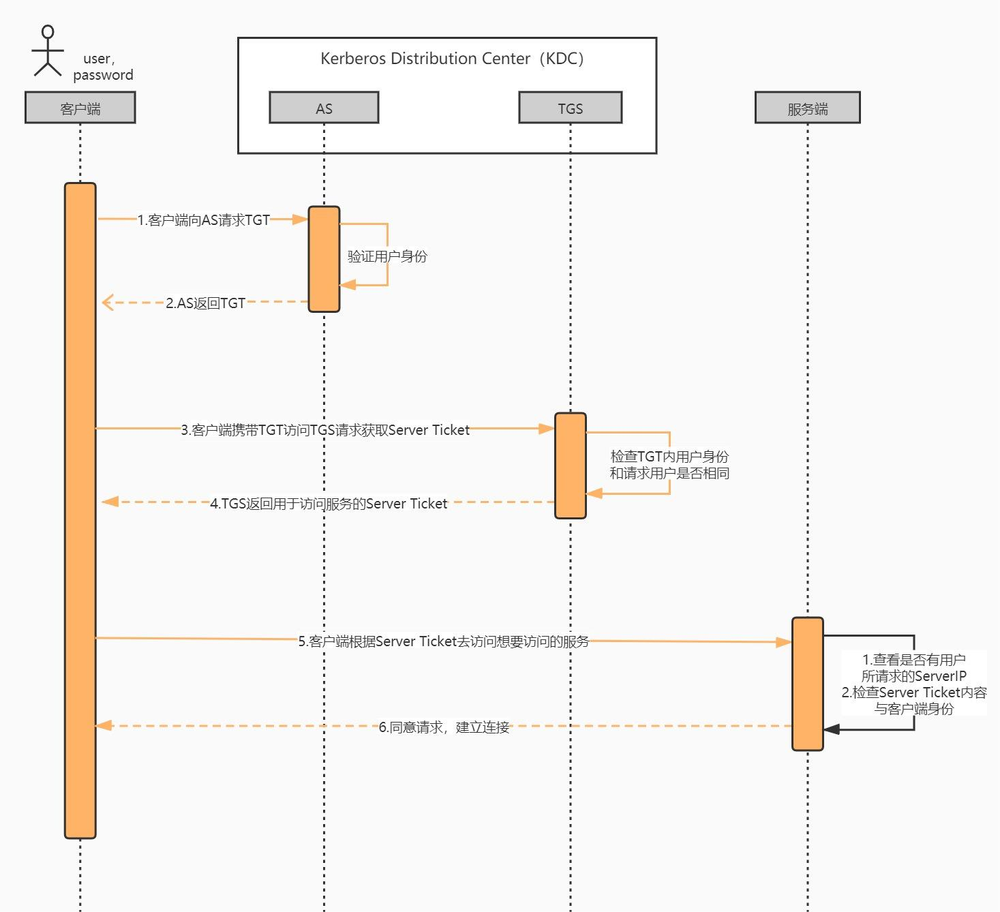

Windows
========================================

认证方式
----------------------------------------

本地用户认证
~~~~~~~~~~~~~~~~~~~~~~~~~~~~~~~~~~~~~~~~
Windows 在进行本地登录认证时操作系统会使用用户输入的密码作为凭证去与系统中的密码进行对比验证。通过 ``winlogon.exe`` 接收用户输入传递至 ``lsass.exe`` 进行认证。

``winlogon.exe`` 用于在用户注销、重启、锁屏后显示登录界面。 ``lsass.exe`` 用于将明文密码变成NTLM Hash的形式与SAM数据库比较认证。

网络认证
~~~~~~~~~~~~~~~~~~~~~~~~~~~~~~~~~~~~~~~~
用户在工作组环境下远程登录windows，通过随机数挑战/应答认证机制实现Net-NTLM Hash身份认证（NTLM Hash + 随机数）。

域内认证
~~~~~~~~~~~~~~~~~~~~~~~~~~~~~~~~~~~~~~~~
登录到域内windows，采用Kerberos协议，此时必须要有可信的第三方作为KDC（Key Distribution Center）密钥分发中心。

相关术语
----------------------------------------

SAM
~~~~~~~~~~~~~~~~~~~~~~~~~~~~~~~~~~~~~~~~
安全帐户管理器(Security Accounts Manager，SAM) 是Windows操作系统管理用户帐户的安全所使用的一种机制。用来存储Windows操作系统密码的数据库文件为了避免明文密码泄漏SAM文件中保存的是明文密码在经过一系列算法处理过的 Hash值被保存的Hash分为LM Hash、NTLM Hash。当用户进行身份认证时会将输入的Hash值与SAM文件中保存的Hash值进行对比。

SAM文件保存于 ``%SystemRoot%\system32\config\sam`` 中，在注册表中保存在 ``HKEY_LOCAL_MACHINE\SAM\SAM`` ， ``HKEY_LOCAL_MACHINE\SECURITY\SAM`` 。 在正常情况下 SAM 文件处于锁定状态不可直接访问、复制、移动仅有 system 用户权限才可以读写该文件。

HASH格式
~~~~~~~~~~~~~~~~~~~~~~~~~~~~~~~~~~~~~~~~
::

	Administrator:500:AAD3B435B51404EEAAD3B435B51404EE:31D6CFE0D16AE931B73C59D7E0C089C0::: 

	其中AAD3B435B51404EEAAD3B435B51404EE是LM Hash而31D6CFE0D16AE931B73C59D7E0C089C0是NTLM Hash。

LM Hash
~~~~~~~~~~~~~~~~~~~~~~~~~~~~~~~~~~~~~~~~
LM Hash(LAN Manager Hash) 是windows最早用的加密算法，由IBM设计。LM Hash 使用硬编码秘钥的DES，且存在缺陷。早期的Windows系统如XP、Server 2003等使用LM Hash，而后的系统默认禁用了LM Hash并使用NTLM Hash。

在LM Hash中，用户的密码会转换为大写，最长14字节，不足14字节则需要在其后添加0×00补足14字节。而后将14字节分为两段7字节的密码，通过处理得到两组8字节数据。而后以 ``KGS!@#$%`` 作为秘钥对这两组数据进行标准DES加密，拼接后得到最后的LM Hash。

NT Hash/NTLM
~~~~~~~~~~~~~~~~~~~~~~~~~~~~~~~~~~~~~~~~
为了解决LM Hash的安全问题，微软于1993年在Windows NT 3.1中引入了NTLM协议。将密码统一转换为unicode编码后计算md4 Hash，得到NT Hash。

从Windows Vista 和 Windows Server 2008开始，默认情况下只存储NTLM Hash，LM Hash将不再存在。

如果空密码或者不储蓄LM Hash的话，一般抓到的LM Hash是AAD3B435B51404EEAAD3B435B51404EE（win7）这里的LM Hash并没有价值

Kerberos认证过程
----------------------------------------

简介
~~~~~~~~~~~~~~~~~~~~~~~~~~~~~~~~~~~~~~~~
Kerberos提供了一种给予零知识证明原理的单点登录(SSO)的方法。考虑这样一个场景，在一个网络中有不同的服务器，比如，打印服务器、邮件服务器和文件服务器。这些服务器都有认证的需求。很自然的，不可能让每个服务器自己实现一套认证系统，而是提供一个中心认证服务器（AS-Authentication Server）供这些服务器使用。这样任何客户端就只需维护一个密码就能登录所有服务器。

概念
~~~~~~~~~~~~~~~~~~~~~~~~~~~~~~~~~~~~~~~~
+ KDC
	密钥分发中心（Key Distribution Center，KDC）是AS和TGS的组合，是Kerberos系统的核心组件，KDC负责颁发和管理凭据和票据，以及处理用户的身份验证请求
+ AS
	认证服务器（Authentication Server，AS） 是Kerberos系统中的第一个组件，负责用户的身份验证，用户向AS发送凭据以请求服务票据（Ticket Granting Ticket，TGT）
+ TGS
	服务票据授予服务器（Ticket Granting Server，TGS） 是Kerberos系统中的第二个组件，负责颁发服务票据，用户使用TGT向TGS请求服务票据，该票据用于访问特定服务。
+ Client
	客户端（Client） 是发起Kerberos身份验证过程的用户或应用程序，它请求TGT和服务票据，并使用它们访问受保护的资源。
+ Service
	服务（Service） 是提供特定功能或资源的网络应用程序或服务器，服务通过验证和解析服务票据来验证客户端的身份，并授权客户端访问资源。
+ Ticket
	凭据（ticket） 是客户端用于证明其身份的信息，在Kerberos中，通常使用用户名（Principal）和密码（Keytab）作为凭据进行身份验证（Principal是Kerberos中用于表示身份标识的字符串，通常采用"主体名称@REALM"的格式，Keytab文件是一个用于存储Principal和对应密钥的安全文件） 。
+ TGT
	TGT（Ticket Granting Ticket） 是由AS颁发给客户端的加密票据，用于请求服务票据，客户端在TGS请求过程中使用TGT进行身份验证。
+ Service Ticket
	服务票据（Service Ticket） 是由TGS颁发给客户端的加密票据，用于访问特定服务，客户端将服务票据发送给服务以证明其身份
+ Session Key
	会话密钥（Session Key） 是客户端和服务之间用于加密和解密通信的对称密钥，在Kerberos中，会话密钥在TGS颁发的服务票据中传递给客户端

过程
~~~~~~~~~~~~~~~~~~~~~~~~~~~~~~~~~~~~~~~~
|kerberos|

+ 1.客户端 -> AS
	- 客户端将 (客户端ID、用户名、目标HTTP服务ID、网站地址等身份信息）和用 NTLM-Hash 加密的时间戳发送给AS。
+ 2.AS -> 客户端
	- AS检查 客户端ID 是否在 KDC 数据库中。如果在，就会取出它的 NTLM-Hash，并对加密的时间戳进行解密，如果解密成功，则证明客户端提供的密码正确，如果时间戳在五分钟之内，则预认证成功。那么AS会随机生成⼀个key，用于客户端和 TGS之间的通信。这个Key一般称为 TGS session Key 。随后AS会发两条信息给客户端：
		+ TGT，由TGS密钥（即 Krbtgt 预设用户的 NTLM-Hash）加密，客户端无法解密，包含客户端ID、TGS Session Key 等信息。
		+ 另一条信息由客户端密钥加密，客户端可以正常解密，包含HTTP服务ID、TGS Session Key 等信息。
	- 此时，客户端已经有了 TGT （由于本地没有 TGS密钥，所以基本无法解出其数据） 与 TGS session key（有的文章直接称之为 session key）
+ 3.客户端 -> TGS
	- 客户端 不做任何处理将 AS 发过来的 TGT（由TGS密钥加密的）转发给 TGS。
	- 客户端利用本地密钥解密出第二条信息。如果本地密钥无法解密出信息，那么认证会失败。因为我们需要获得 TGS session key 并利用它来加密这些客户端信息以及时间戳发送给 TGS。这个数据我们称为Authenticator（身份验证器）
+ 4.TGS -> 客户端
	- TGS 将利用自身的密钥，从TGT中解密出 TGS session KEY，然后利用 TGS session Key 从 Authenticator（身份验证器）中解出客户端的信息。TGS 解密出所有数据后，进行身份检查并认证：将客户端ID 与 TGT的客户端ID进行比较。（判断用户是不是被替换了）比较来自 Authenticator 的时间戳和TGT的时间戳 (典型的Kerberos系统的容忍度是2分钟，但也可以另外配置)检查 TGT 是否过期检查Authenticator是否已经在TGS的缓存中（为了避免重放攻击）当所有检查都通过后， TGS 随机生成一个 Key （相当与有权限访问了）永于后续客户端与 HTTP 服务交互时进行通信加密使用，即 HTTP Session Key。
	- 同样地，TGS 将发送两条信息给客户端：（存在争论，多个文章结果不一致）
		+ 一条包含了 HTTP Server Ticket（即ST），由HTTP服务密钥（即server NTLM）进行加密 Ticket= HTTP Session Key + Client info + End Time；
		+ 另一条则由TGS Session Key加密，包含了 HTTP session KEY。客户端将利用TGS Session Key解密出其中一条信息，另一条信息由于是由目标HTTP服务加密，无法解密。
	- 这时候，客户端有了HTTP Ticket（由于本地没有HTTP服务的密钥，导致无法解密出其数据）与 HTTP SessionKey（TGS session 解密得到）。
+ 5.客户端 -> HTTP Service
	- 将 TGS 发送过来的 HTTP Server Ticket（ST） 转发给 目标 HTTP 服务。
	- 将 包含自身信息的 Authenticator（由HTTP Session key 加密） 发送给 HTTP 服务。
+ 6.HTTP -> 客户端
	- 首先 HTTP服务 利用自身的密钥解出 ST 信息，得到 HTTP Session Key后，利用HTTP session KEY解密出用户的 Authenticator 信息。解密完成后，HTTP服务做以下信息的检查：对比 Authenticator 的时间戳和HTTP Ticket 的时间戳 (典型的 Kerberos 系统对差异的容忍度是 2 分钟，但也可以另外配置)检查Ticket是否过期，检查 Authenticator 是否已经在HTTP服务器的缓存中（为了避免重播攻击）因此，所有的认证过程通过，客户端即可与远程HTTP服务完成了身份认证，可以进行后续的信息通信。

参考链接
----------------------------------------
- `Windows身份认证及利用思路 <https://www.freebuf.com/articles/system/224171.html>`_

