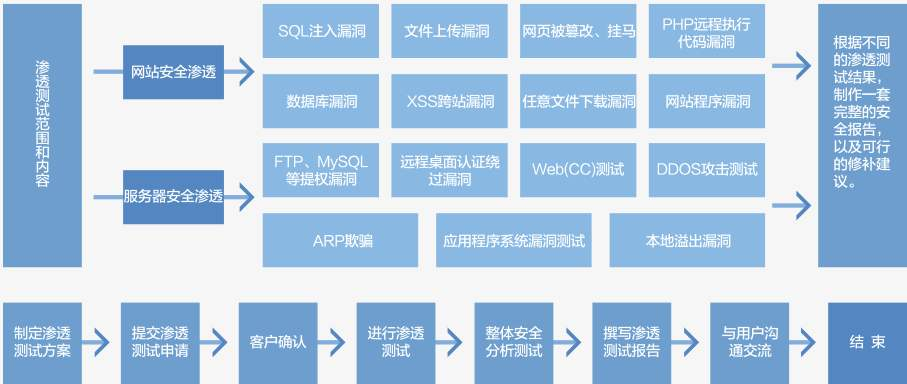

网络安全
========================================

简介
----------------------------------------
网络安全是指网络系统的硬件、软件及其系统中的数据受到保护，不因偶然的或者恶意的原因而遭受到破坏、更改、泄露，系统连续可靠正常地运行，网络服务不中断。具有保密性、完整性、可用性、可控性、可审查性的特性。

发展现状
----------------------------------------
随着国内外大规模安全事件的愈发升级，例如大批量CIA/NSA等核武器级网络攻击工具持续曝光、WannaCry病毒席卷全球、Apache Struts2高危漏洞刷爆安全圈，影响数千万在线服务，并且伴随国内的 **《网络安全法》** 正式成为法律法规， **《信息安全等保安全》** 系列政策更新，安全对于大部分企业来说，已经从可选项变成了必选项甚至是 **[强制项]** 。

以前安全的需求就是：甲方出钱向乙方购买安全服务。安全在以往企业和政企运转中，以类似 **插件** 的方式来实现

越来越多公司的的业务、应用、数据直接基于云端来开展，核心数据直接连接在互联网上，不同业务产生的安全问题（攻击面）也随着变化，甚至很多安全问题不是来源于技术层面的，而是 **业务** 和 **逻辑层面** 的，这些已经很难用单维度的安全产品来解决。

安全从单维度的以购买安全产品和服务的传统的 **被动防御** ，需要加入另外一个维度即 **主动防御** ，例如成立安全小组，主动了解黑客入侵方式，对攻击事件零延迟响应，对攻击路径进行回溯分析，对自家产品进行安全审计、安全测试等。

这两年，我们可以看到越来越多的 **SRC（安全响应中心）** 出现，各种各样的在线漏洞提交平台和众测安全服务出现，以一种全新的主动防御的方式，更加开放的、更加多维度的姿态来应对安全，例如邀请白帽子来为自己的业务系统挖洞并且给出奖励，组办高大上的安全会议和安全大赛拉拢各方大神。

行业领域
----------------------------------------
根据不同的安全规范、应用场景、技术实现等，安全可以有很多分类方法，在这里我们简单分为 **网络安全** 、 **Web安全** 、 **云安全** 、 **移动安全（手机）** 、 **桌面安全（电脑）** 、 **主机安全（服务器）** 、 **工控安全** 、 **无线安全** 、 **数据安全** 等不同领域。

网络安全
~~~~~~~~~~~~~~~~~~~~~~~~~~~~~~~~~~~~~~~~
网络安全是安全行业最经典最基本的领域，研究的技术范畴主要围绕防火墙/NGFW/UTM、网闸、入侵检测/防御、VPN网关（IPsec/SSL）、抗DDOS、上网行为管理、负载均衡/应用交付、流量分析、漏洞扫描等，例如启明星辰、绿盟科技、天融信这几个企业（“老三大” ）。主要服务集中在以政府/国企需求的政务网/税务网/社保网/电力网… 以运营商（移动/电信/联通）需求的电信网/城域网、以银行为主的金融网、以互联网企业需求的数据中心网，企业网、教育网等。

技能要求：
 | ①网络协议：TCP/IP、VLAN/Trunk/MSTP/VRRP/QoS/802.1x、OSPF/BGP/MPLS/IPv6、SDN/Vxlan/Openflow…
 | ②主流网络与安全设备部署：思科/华为/华三/锐捷/Juniper/飞塔、路由器/交换机、防火墙、IDS/IPS、VPN、AC/AD…
 | ③网络安全架构与设计：企业网/电信网/政务网/教育网/数据中心网设计与部署…信息安全等保/分保理论、金土/金税工程…

WEB安全
~~~~~~~~~~~~~~~~~~~~~~~~~~~~~~~~~~~~~~~~
Web安全领域从狭义的角度来看，就是一门研究[网站安全]的技术，相比[网络安全]领域，普通用户能够更加直观感知。Web安全关注上层应用和数据，网络安全关注底层网络安全。
相关产品：WAF（网页防火墙）、Web漏洞扫描、网页防篡改、网站入侵防护等。

技能要求：
 | ①通信协议：TCP、HTTP、HTTPs。
 | ②操作系统：Linux、Windows服务架设：Apache、Nginx、LAMP、LNMP、MVC架构。
 | ③数据库：MySQL、SQL Server、Oracle。
 | ④编程语言：前端语言（HTML/CSS/JavaScript）、后端语言（PHP/Java/ASP/Python）
 | ⑤安全理论：OWASP TOP 10 、PETS、ISO 27001等。
 | ⑥后端安全：SQL注入、文件上传、Webshell（木马）、文件包含、命令执行等。
 | ⑦前端安全：XSS跨站脚本攻击、CSRF跨站请求伪造…
 | ⑧安全产品：Web漏洞扫描（Burp/WVS/Appscan）、WAF（Web应用防火墙）、IDS/IPS（Web入侵防御）、Web主机防护等。

终端安全（移动安全/桌面安全）
~~~~~~~~~~~~~~~~~~~~~~~~~~~~~~~~~~~~~~~~
移动安全主要研究例如手机、平板、智能硬件等移动终端产品的安全，例如iOS和Android安全。
终端安全（移动安全加桌面安全）是一门to C的业务，更多面向最终个人和用户；而网络安全、Web安全、云安全更多是一门to B的业务，面向政企单位。

云安全
~~~~~~~~~~~~~~~~~~~~~~~~~~~~~~~~~~~~~~~~
云安全是基于云计算技术来开展的另外一个安全领域，云安全研究的话题包括：软件定义安全、超融合安全、虚拟化安全、机器学习+大数据+安全等。
主要产品：云防火墙、云抗DDOS、云漏扫、云桌面等。

工控安全
~~~~~~~~~~~~~~~~~~~~~~~~~~~~~~~~~~~~~~~~
以震网病毒（stuxnet）攻击伊朗核电厂并使其瘫痪的全球事件，从安全领域活生生撕开一道口并告诉我们，工控病毒才是真正代替核武器战争的代表。工控安全研究的攻防对象是工业基础设施，真正影响人类生活的方方面面，例如核电、电力、水力、城市交通等基础设施。随着万物互联/物联网的进程不断推进，工控安全会成为我们继互联网和移动互联网安全之后研究的重心。

行业发展趋势
----------------------------------------
- 从硬件到软件再到云安全、从被动防御到主动防御、从单点到全局。
- 机器学习+大数据+ 云安全” 或 “AI + 安全”。

安全岗位
----------------------------------------

研发系
~~~~~~~~~~~~~~~~~~~~~~~~~~~~~~~~~~~~~~~~
安全研发、安全攻防研究、逆向分析

工程系
~~~~~~~~~~~~~~~~~~~~~~~~~~~~~~~~~~~~~~~~
安全工程师、安全运维工程师、安全服务工程师、安全技术支持、安全售后、Web渗透测试工程师、Web安全工程师、应用安全审计、移动安全工程师

销售系
~~~~~~~~~~~~~~~~~~~~~~~~~~~~~~~~~~~~~~~~
安全销售工程师、安全售前工程师、技术解决方案工程师

安全行业薪酬
----------------------------------------
根据岗位的入职薪酬来看，一般都是遵循：【安全研发 > 安全服务/渗透测试/Web渗透 > 安全售后/安全技术支持】。

技术方向
----------------------------------------

渗透测试
~~~~~~~~~~~~~~~~~~~~~~~~~~~~~~~~~~~~~~~~

- 简介
	| 渗透测试(penetration test)是指渗透人员在不同的位置（比如从内网、从外网等位置）利用各种手段对某个特定网络进行 **测试** ，以期发现和挖掘系统中存在的漏洞，然后输出 **渗透测试报告** ，并提交给网络所有者。即通过模拟恶意黑客的攻击方法，来评估计算机网络系统安全的一种评估方法。

- 特点
	- 渐进的并且逐步深入的过程。
	- 选择不影响业务系统正常运行的攻击方法进行的测试。

- 流程和手段
	|STCS2|
	|STCS|

二进制漏洞挖掘
~~~~~~~~~~~~~~~~~~~~~~~~~~~~~~~~~~~~~~~~

- 分析对象
	| 二进制漏洞挖掘的主要对象是应用软件，操作系统，比较常见的软件是浏览器，office软件，adobe软件，windows操作系统，linux操作系统，还有移动设备上的app,智能硬件设备等。

- 二进制漏洞分类
	| 常见的二进制漏洞主要分为：栈溢出、堆溢出、整数溢出、格式化字符串、双重释放、释放重引用（UAF）、数组访问越界、内核级、类型混淆、沙盒逃逸以及PRC等。

- 挖掘方法
	| 主要的挖掘方法是Fuzzing和代码审计。

	- 手动法漏洞挖掘
		即不使用自动挖掘工具，手动分析软件可能出问题的地方。其中挖掘点是靠手动来寻找的，畸形数据也是手动来构造的。

		一般思路：
		
		- 确定挖掘点：凡是用户可控的数据点都可以作为挖掘点。包括程序路径，输入消息，文件内配置信息等等。由于是手动挖掘，因此挖掘点不适合选择的过于复杂。很明显office系列，各种图片声音等等这样复杂的文件格式，是不适合定位于手动挖掘点的。
		- 对挖掘点填充畸形数据：找到挖掘点后，就可以对挖掘点填充各种畸形数据。其中包括超长字符串，畸形字符，边界值数据等等。根据长期的挖掘经验来看，其中超长字符串的效果更好。并且超长字符串一般都为堆栈溢出，该漏洞一般情况下都是可以利用的。
		- 程序是否发生异常：程序崩溃，程序退出等。
		- 分析：如果发生异常，用反汇编工具和汇编级调试器深入分析(如WINDBG IDA OLLYDBG），找到异常原因，判断漏洞类型以及危害。
		
		::

			优点：不需要专业的fuzz工具，并且测试的漏洞主要是堆栈溢出漏洞，原理较为简单。
			因此手动挖掘的速度是非常快的，效率也是比较高的。可以在几十分钟内发现可利用的缓冲区溢出漏洞。
		
		::

			缺点：
			相对于文件格式漏洞难以挖掘。因为文件格式的处理逻辑一般都较为复杂，关于这一点手动挖掘方法效果不是很好。
		
	- 通用fuzz法漏洞挖掘
		即在不研究文件格式的情况下，用自动化测试工具对目标程序进行fuzz测试。
		
		一般思路：
		
		- 选取目标文件。
		- 使用工具对目标文件的格式进行变异，生成大量的畸形样本。
		- 让程序分别载入并解析这些畸形样本，监测程序是否会触发异常。
		- 通过逆向分析这些异常样本，查看是否是漏洞同时确定危害级别。
		
		::
		
			优点：上手容易，不需要了解文件格式即可对目标进行漏洞挖掘。全自动化，效率很高。
			
		::
		
			缺点：测试深度不够，只适合一些文件结构较为简单的文件格式，对复杂的文件格式无能为力。
			
		相关工具：Easyfuzzer。
		
	- 智能fuzz法漏洞挖掘
		智能fuzz是对文件的结构进行分析，编写出表述文件结构的代码。然后fuzzer工具根据该代码的约束生成畸形样本，接下来就和通用fuzz相同了：执行畸形样本，监控异常。
		
		一般思路：
		
		- 研究要挖掘程序处理的相应文件格式，包括该格式的各种数据结构，约束规则等信息。
		- 根据fuzzer规定的代码规则，编写相应规则的代码，来解析当前文件格式的结构。
		- 用fuzzer工具通过我们写的代码，生成大量的畸形样本。
		- 让fuzzer 执行并监控被挖掘程序处理畸形样本的运行情况，检测程序是否发生异常，如果异常保留异常样本和相关信息。
		- 用OLLYDBG WINDBG IDA等工具深入分析崩溃信息，查看是否是漏洞同时确定危害级别。
		
		::
		
			优点：执行效率高，效果好。可以挖掘其他方法挖掘不到的软件漏洞。
			
		::
		
			缺点：需要深入研究相应的文件格式，并写出相应的文件格式脚本。该过程需要的时间较长。
		
		相关工具：Easyfuzzer。

.. |STCS| image:: images/STCS-Mind-Map.png