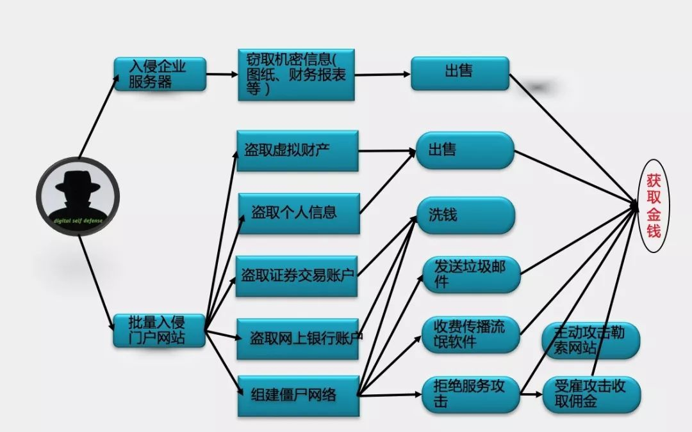
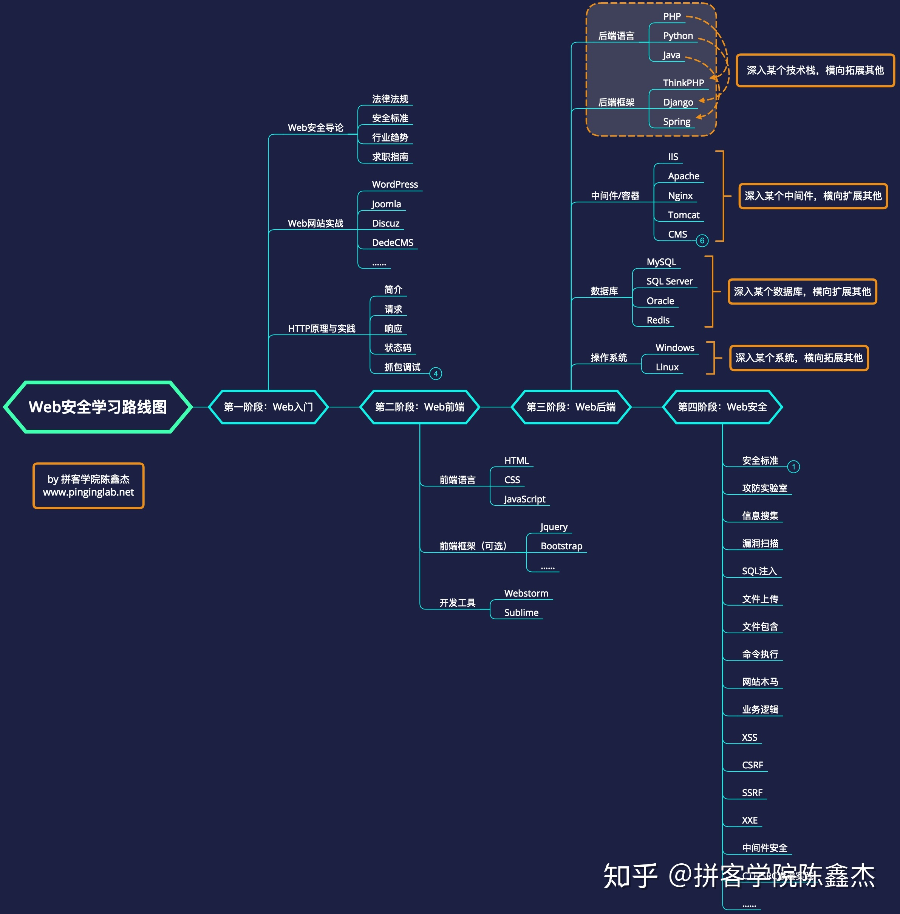
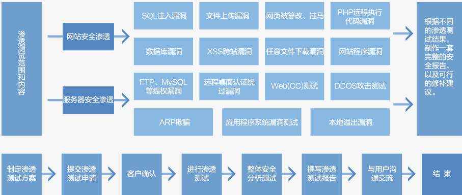

攻防路径
========================================

Web攻击常见模式
----------------------------------------
|attackmushi|

Web安全技术学习路线
----------------------------------------
|web-sec-learn|

渗透测试
----------------------------------------
|STCS2|

|STCS|

二进制漏洞挖掘
----------------------------------------

.. |STCS| image:: ../images/STCS-Mind-Map.png