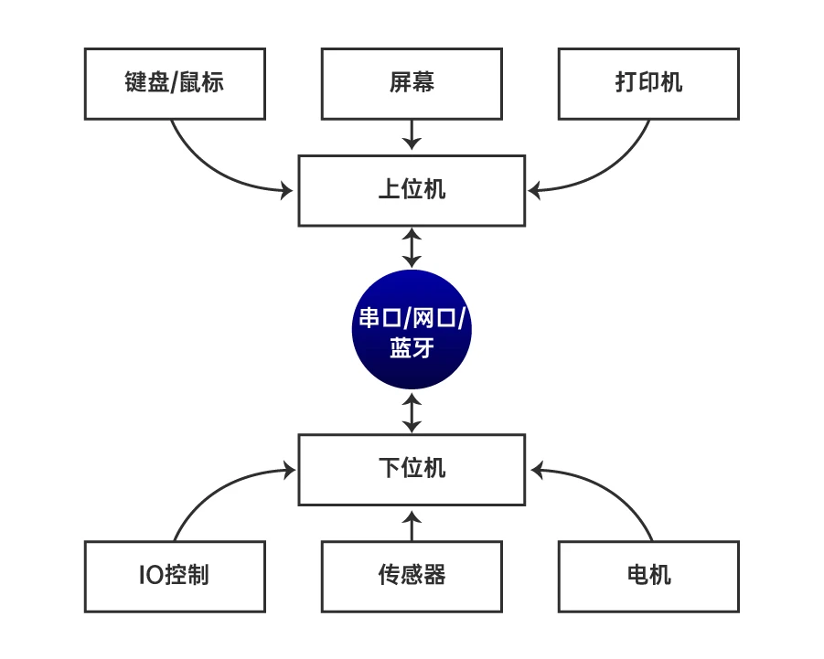
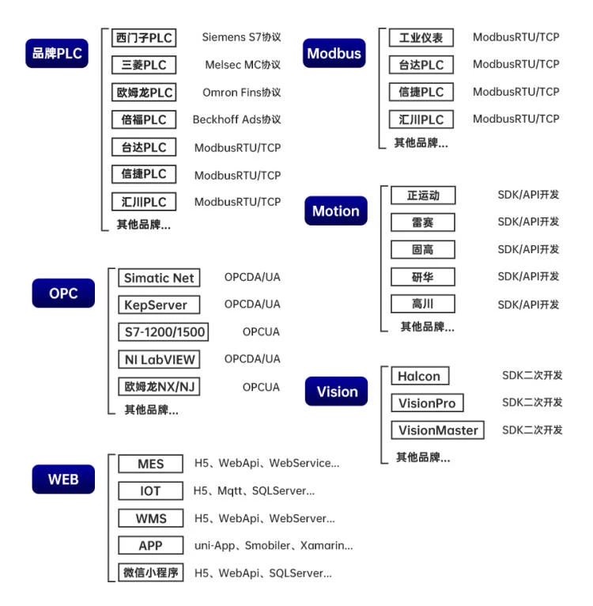

工业控制系统
========================================

概述
----------------------------------------
工业控制系统(Industrial Control Systems,ICS,简称工控系统),是由各种自动化控制组件以及对实时数据进行采集、监测的过程控制组件共同构成的确保工业基础设施自动化运行、过程控制与监控的业务流程管控系统。

核心组件
----------------------------------------

SCADA
~~~~~~~~~~~~~~~~~~~~~~~~~~~~~~~~~~~~~~~~
即数据采集与监控系统(Supervisory Control and Data Acquisition,SCADA)、SCADA控制中心是长期对现场进行集中监控的通信网络，包括监控报警和处理状态数据。可以将自动化或操作者驱动的监控命令推送到远程站控制设备，远程站设备通常被称为现场设备。现场设备控制本地诸如打开和关闭阀门和断路器的操作，从传感器系统收集数据，以及监控当地环境的报警条件等。

DCS
~~~~~~~~~~~~~~~~~~~~~~~~~~~~~~~~~~~~~~~~
即分布式控制系统(Distributed Control Systems,DCS)，DCS集成为一个控制架构，包含监督多个集成子系统的监督级别的控制它们负责控制本地化流程的细节。DCS用于控制工业过程，如发电，油气炼油，水和废水处理，以及化学，食品和汽车生产。
	
PLC
~~~~~~~~~~~~~~~~~~~~~~~~~~~~~~~~~~~~~~~~
即可编程控制器(Programmable Logic Controller,PLC)，PLC是基于计算机的固态设备，用于控制工业设备和工艺。而PLC是整个SCADA和DCS系统中使用的控制系统组件，它们通常是较小的控制系统配置中的主要组件用于提供监管控制汽车装配线和发电厂吹灰器控制等离散工艺。

HMI
~~~~~~~~~~~~~~~~~~~~~~~~~~~~~~~~~~~~~~~~
即人机交互界面设备(Human Machine Interface,HMI),也就是操作人员面前的显示屏，HMI和plc进行组态之后，可以通过HMI对PLC通信控制以达到控制终端设备的目的。
	
通信模块
~~~~~~~~~~~~~~~~~~~~~~~~~~~~~~~~~~~~~~~~

系统模型
----------------------------------------

典型模型
~~~~~~~~~~~~~~~~~~~~~~~~~~~~~~~~~~~~~~~~
|ics|

系统结构
~~~~~~~~~~~~~~~~~~~~~~~~~~~~~~~~~~~~~~~~
|ics1|

通信协议
~~~~~~~~~~~~~~~~~~~~~~~~~~~~~~~~~~~~~~~~
|ics2|

相关概念
~~~~~~~~~~~~~~~~~~~~~~~~~~~~~~~~~~~~~~~~
+ HMI、计算机、组态软件、应用软件、数据库、关联设备（如：打印机）侧重监控功能，主要起到远程监控、报警处理、数据存储以及与其他系统集合的作用。。
+ 下位机侧重现场仪表数据的采集和控制该节点具备数据采集、设备或过程的控制功能，并将状态信号转换为数字信号，通过各种通信方式传递到上位机系统，并且接受上位机的监控指令。常规的下位机包括RTU、PLC、PAC、智能仪表、底层设备等。
+ 工控机，工作站，触摸屏作为上位机， 通信控制PLC，单片机等作为下位机。

PLC软件系统
----------------------------------------

系统软件
~~~~~~~~~~~~~~~~~~~~~~~~~~~~~~~~~~~~~~~~
+ 系统管理程序
+ 用户指令解释程序
+ 标准程序模块
+ 系统调用

用户程序
~~~~~~~~~~~~~~~~~~~~~~~~~~~~~~~~~~~~~~~~
+ 用户程序是用户根据控制对象生产工艺及控制的要求而编制的应用程序。它是由PLC控制对象的要求而定的。
+ 为便于读出、检查和修改，用户程序一般存于CMOS静态RAM中，用锂电池作为后备电源，以保证掉电时不会丢失信息。
+ 为防止干扰对RAM中程序的破坏，当用户程序经过运行正常，不需要改变，可将其固化在EPROM中。
+ 现在有许多PLC直接采用EPROM作为用户存储器。

.. |ics| image:: ../images/ics.webp
	:height: 300px
	:width: 500 px

	
	