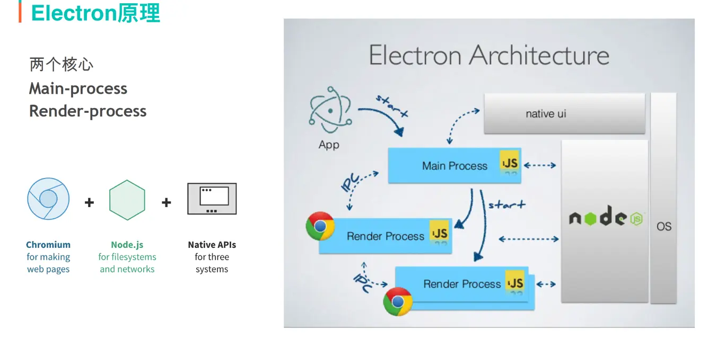

electron程序漏洞挖掘
========================================

概述
----------------------------------------
+ electron.js是一个运行时框架，使用web技术来创建跨平台原生桌面应用的框架。
+ electron负责硬件部分，Chromium负责页面UI渲染，Node.js负责业务逻辑，Native API则提供原生能力和跨平台。

特点
----------------------------------------
+ 摆脱了不同浏览器之间的差异和版本的限制，可以开发跨平台的桌面应用。
+ 通过内置Node.js提供原生系统的能力，如文件系统和网络的访问，有活跃的贡献者社区管理和第三方丰富的包支持。
+ 摆脱浏览器的沙盒机制，可以访问操作系统层面的东西。
+ 前端人员能在不学习其他语言的情况下，快速构建跨平台，带来统一的用户体验

逆向分析
----------------------------------------

文件结构
~~~~~~~~~~~~~~~~~~~~~~~~~~~~~~~~~~~~~~~~
+ 含有resources目录，包含一个app.asar文件。
+ app.asar是项目源码的归档文件。
+ exe文件是程序的启动文件。

asar文件
~~~~~~~~~~~~~~~~~~~~~~~~~~~~~~~~~~~~~~~~
+ 程序解包
    ::
    
        npm install asar -g
        asar extract app.asar app //解压拿到源码
+ 程序打包
    ::
    
        asar pack app app.asar //重新打包
+ 注意
    - app.asar一般都没有做进一步的加密处理，所以拿到源码不难
    - 不排除有的厂商可能在这方面做了一定的保护，就需要我们自己去逆向找到解密方法了，可以参考coco2d等。
    - 拿到的js源码一般都会做一定的混淆，通过搜索js混淆技术和反混淆、格式化等，基本可以恢复到能够方便阅览的源码。
    - 如果想验证某些功能，或者做些修改，可以通过重打包然后替换app.asar。

查看版本
~~~~~~~~~~~~~~~~~~~~~~~~~~~~~~~~~~~~~~~~
+ Devtool查看
    ::
    
        前提是App启用了node Integration属性。
        Devtool控制台输入：process.versions.electron
+ UA查看
    ::
    
        使用Devtool查看网络通信数据，查看User Agent头。
+ 重新封包法
    ::
    
        var fs = require("fs");
        var querystring= require('querystring');

        console.log("准备写入文件");
        fs.writeFile('input.txt', querystring.stringify(process.versions),  function(err) {
           if (err) {
               return console.error(err);
           }
           console.log("数据写入成功！");
           console.log("--------我是分割线-------------")
           console.log("读取写入的数据！");
           fs.readFile('input.txt', function (err, data) {
              if (err) {
                 return console.error(err);
              }
              console.log("异步读取文件数据: " + data.toString());
           });
        });
        保存以上js内容为getVersionInfo.js，保存于解包后的文件夹中
        修改package.json的main字段为getVersionInfo.js
        重新封包，替换原来的.asar文件。

程序结构
~~~~~~~~~~~~~~~~~~~~~~~~~~~~~~~~~~~~~~~~
+ 主进程
    - 特点
        + 处理原生应用逻辑，是一个node.js进程。
        + 每个Electron应用有且只有一个主进程，作为应用程序的入口点，即main脚本（package.json中main节点指定）的进程。
    - 职责
        + 创建渲染进程(可多个)
        + 控制应用生命周期 (启动、退出app以及对app的一些事件监听)
        + 调用系统底层功能、调用原生资源
    - 调用接口
        + NodeJS api
        + Electron提供的主进程api(包括一些系统功能和Electron附加功能)
+ 渲染进程
    - 特点
        + 由electron的BrowserWindow模块来进行创建和销毁，它可以加载web页面。
        + 渲染进程就是一个浏览器窗口，运行在各自的单个线程。
        + 渲染进程中执行的代码可以访问node的所有API,利用这个特性可以使用原生模块，实现与底层系统的交互。
        + 渲染器进程之间是相互隔离的不能够直接互相通信，并且不允许他们直接访问操作系统级别的API。
        + 要先与主进程进行通信，再由主进程进行转发或者由主进程访问安全级别API再返回。
    - 职责
        + 用HTML和CSS渲染界面
        + 用JS做界面交互
    - 可调用接口
        + DOM API
        + NodeJS API
        + Electron提供的渲染进程API
+ 进程通信
    + IPC通信
    + remote通信

|electron1|
|electron2|

程序调试
~~~~~~~~~~~~~~~~~~~~~~~~~~~~~~~~~~~~~~~~
+ 添加代码法
    ::
    
        asar extract app.asar app //解压拿到源码
        mainWindow.webContents.openDevTools();//找到main.js，加入这行代码
        asar pack app app.asar //重新打包，替换原始app.asar
        注：这里调试的是渲染进程。

+ 端口调试法
    ::
    
        安装chrome浏览器，打开chrome://inspect
        配置Discover network targets，添加9222，9229端口
        
        调试渲染进程：
        命令行启动目标程序 *.exe -remote-debugging-port=9222
        浏览器中即可出现对应的页面，点击inspect调试
        
        调试主进程：
        使用Electron提供的 ​--inspect​ 和 ​--inspect-brk​ 开关。
        --inspect-brk=[port] 和--inspector 一样，但是会在JavaScript 脚本的第一行暂停运行。
        使用以下命令：
        electron --inspect[=5858] your/app
        注：默认是9229端口。

+ Debugtron工具
    ::
    
        地址：https://github.com/pd4d10/debugtron
        注：可调试主进程和渲染进程。

核心选项
~~~~~~~~~~~~~~~~~~~~~~~~~~~~~~~~~~~~~~~~
+ Sandbox（沙箱）
    - 即Chromium的沙盒特性，如果开启了这个选项， 渲染进程将运行在沙箱中，限制了大多数系统资源的访问，包括文件读写，新进程启动等， preload.js和网页中的js都会受到这个选项的影响
    - 该选项会随着Node Integration的开启而关闭
    - Sandbox选项从Electron 20开始默认为开启状态
    - 检查方法
        ::
        
            1.查找 app.enableSandbox()函数调用
            2.查找sandbox: 选项设置，一般如下代码：
            const win = new BrowserWindow({
                webPreferences: {
                  sandbox: false
                }
              })
+ Node Integration（Node集成）
    - Node集成，是否开启网页Js Nodej共享库的访问，如果开启的话，网页js将拥有直接Nodejs的执行权限，包括进程启动，文件加载等
    - preload.js Node集成是一直开启的，不受这个选项影响
    - 即使这个选项开启，上下文隔离选项开启的话，网页Js仍然无法访问Nodejs共享库
    - 检查方法
        ::
        
            查找nodeIntegration: 选项设置，一般如下代码：
            const win = new BrowserWindow({
                webPreferences: {
                  nodeIntegration: true
                }
              })
+ Context Isolation（上下文隔离）
    - Electron的特性，使用了与Chromium相同的Content Scripts技术来实现。确保preload脚本和网页js在一个独立的上下文环境中
    - 开启后渲染页面的js中无法引入Electron和Node中的各种模块
    - 如果想在其中使用这部分功能，需要配置preload.js，使用contextBridge来暴露全局接口到渲染页面的脚本中
    - Electron 12开始默认启用
    - 检查方法
        ::
        
            查找contextIsolation: 选项设置

攻击面分析
----------------------------------------

利用渲染进程本身进行RCE
~~~~~~~~~~~~~~~~~~~~~~~~~~~~~~~~~~~~~~~~
+ 通过NodeJs共享库RCE
+ 通过chromium Nday RCE

通过IPC影响主进程进行RCE
~~~~~~~~~~~~~~~~~~~~~~~~~~~~~~~~~~~~~~~~
+ 需要主进程ipcmain，实现了危险方法
+ 需要当前执行上下文可以访问IPC

常规利用方法
~~~~~~~~~~~~~~~~~~~~~~~~~~~~~~~~~~~~~~~~
+ NI为true, CISO为 false，SBX为false
    - 允许了页面之间访问nodejs共享库，只要获取目标应用的一个XSS漏洞，就能直接通过访问NodeJS共享库，升级为XSS漏洞。
    - NI配置方法：在man.js中webPreferences中配置了nodeIntegration为true/false
+ NI为false, CISO为false，SBX为false
    - 关闭了Nodejs集成，导致我们不能在web页面上下文访问Nodejs共享库。
    - 因为上下文隔离没有开启，web页面和preload.js处于同一上下文中，导致我们可以通过污染原型链，获取preload,js的函数，进行ipcmain调用，命令执行等。
    - 限制条件
        ::
        
            Electron<10
            - 可以使用原型链污染获取remote/IPC模块
            - Remote模块可以直接通过主进程执行node js绕过沙箱
            Electron 10<version<14
            - 可以使用原型链污染获取remote/IPC模块
            - 需要Remote Module Explicitly Enabled，才可以使用remote模块RCE
            - 主进程IPC存在错误配置，通过进程间通信IPC，进行RCE
            Electron >14
            - 只能通过原型链污染获取IPC模块
+ NI为true/false, CISO为true，SBX为false
    - 因为没有开启沙箱，通过Chrome渲染进程远程代码执行漏洞，就可以直接RCE。
    - Chromium 83、86、87、88版本，如果electorn内置了Chromium就可以通过XSS，直接攻击，进行RCE。
+ NI:false, CISO:true, SBX为true
    - 有沙箱， 我们只能通过IPC进行攻击，但是如果我们js处于iframe之中，可能没有ipc访问权限,需要绕过。
    - 绕过思路
        + iframe下无ipc接口绕过
        + 关闭CISO,直接使用IPC，绕过限制
        + 关闭CISO,使用原型链污染获取remote模块进行RCE
        
自定义协议
~~~~~~~~~~~~~~~~~~~~~~~~~~~~~~~~~~~~~~
+ electron应用可以注册自己的url协议，例如custom://。
+ 这样可以通过浏览器直接打开应用，如果对url协议的处理不当可能导致rce等。
+ 检测方法
    ::
        
        查找registerHttpProtocol方法调用

代码审计
~~~~~~~~~~~~~~~~~~~~~~~~~~~~~~~~~~~~~~~
+ 寻找输入点
    - 如xss漏洞等

更新升级
~~~~~~~~~~~~~~~~~~~~~~~~~~~~~~~~~~~~~~~
+ LPE本地特权提升

挖掘思路
----------------------------------------
+ 分析选项开启状态
    ::
    
        grep -r "sandbox:" ./
        grep -r "nodeIntegration:" ./
        grep -r "contextIsolation:" ./
+ 分析组件版本
+ 查看是否有自定义协议
    ::
    
        grep -r "registerHttpProtocol" ./
+ 查找有无html内容拼接
    ::
    
        var $input2 = $("<input type='text' value='"+value+"' name='value' class='form-control' style=' width:20%; display: inline-block;' placeholder='value'>");
        分析拼接的输入点是否用户可控，查看是否有xss漏洞。

        

.. |electron2| image:: ../../images/electron2.png