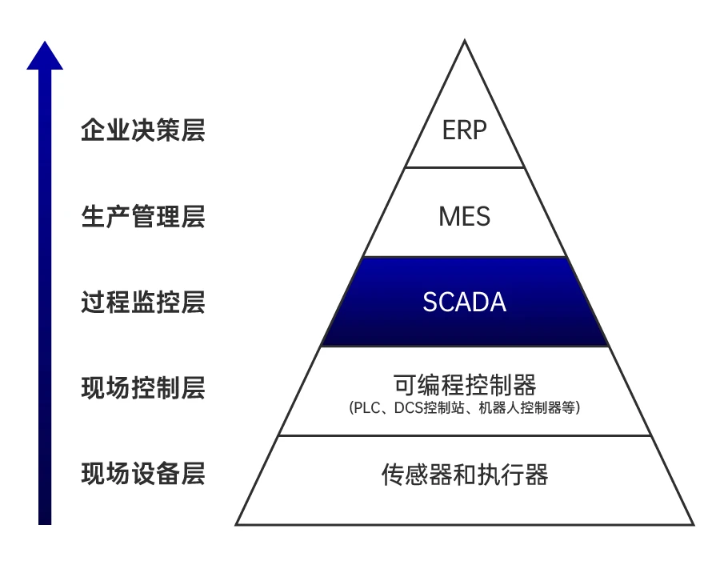
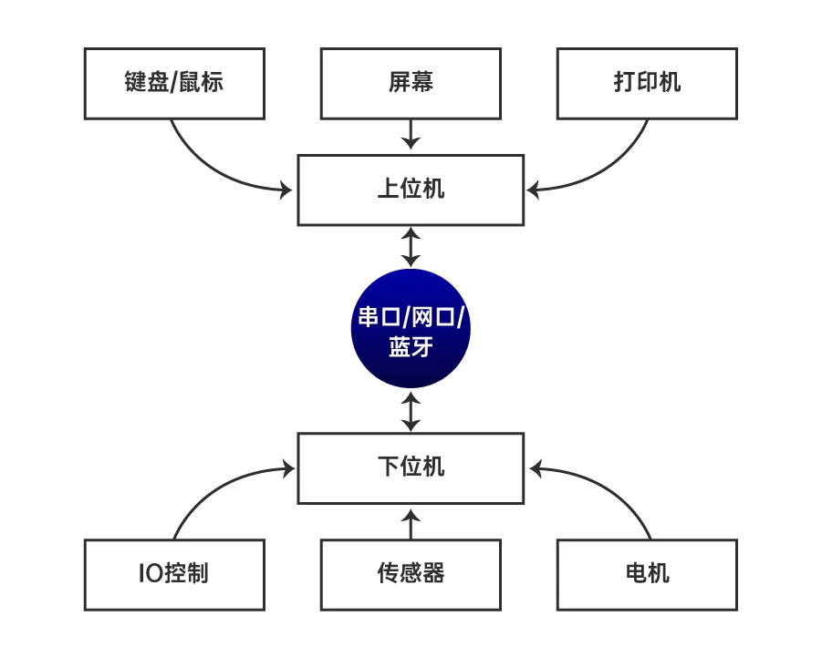
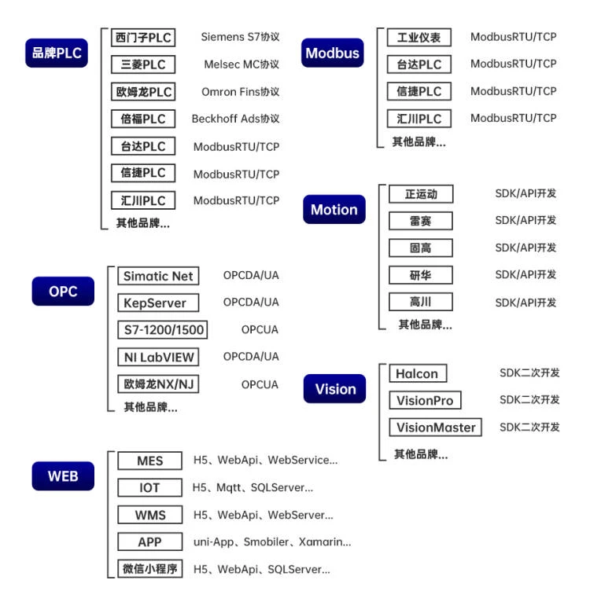

工业控制系统
========================================

概述
----------------------------------------
工业控制系统(Industrial Control Systems,ICS,简称工控系统),是由各种自动化控制组件以及对实时数据进行采集、监测的过程控制组件共同构成的确保工业基础设施自动化运行、过程控制与监控的业务流程管控系统。

核心组件
----------------------------------------

工控机(IPC)
~~~~~~~~~~~~~~~~~~~~~~~~~~~~~~~~~~~~~~~~
+ 基于PC总线的工业电脑。
+ 可靠性：工业PC具有在粉尘、烟雾、高/低温、潮湿、震动、腐蚀和快速诊断和可维护性，其MTTR（MeanTimetoRepair）一般为5min，MTTF10万小时以上，而普通PC的MTTF仅为10000～15000小时。
+ 实时性，工业PC对工业生产过程进行实时在线检测与控制，对工作状况的变化给予快速响应，及时进行采集和输出调节（看门狗功能这是普通PC所不具有的），遇险自复位，保证系统的正常运行。
+ 扩充性，工业PC由于采用底板+CPU卡结构，因而具有很强的输入输出功能，最多可扩充20个板卡，能与工业现场的各种外设、板卡如与道控制器、视频监控系统、车辆检测仪等相连，以完成各种任务。
+ 兼容性，能同时利用ISA与PCI及PICMG资源，并支持各种操作系统，多种语言汇编，多任务操作系统。

SCADA
~~~~~~~~~~~~~~~~~~~~~~~~~~~~~~~~~~~~~~~~
+ 即数据采集与监控系统(Supervisory Control and Data Acquisition,SCADA)
+ **控制分散** 的资产，以便进行 **集中数据采集管理**
+ 软，硬件设备多来自不同厂家
+ 一般为用户集成，可靠性低于DCS，开放性强
+ 用于测控点分布范围广，控制点数少
+ 成本相对低
+ 只有上位机，一般PLC作为SCADA系统的下位机设备

|ics3|

DCS
~~~~~~~~~~~~~~~~~~~~~~~~~~~~~~~~~~~~~~~~
+ 即分布式控制系统(Distributed Control Systems,DCS)
+ **控制分散** ， **集中管理**
+ 软硬件设备多来自同一DCS制造商
+ 完善成熟的体系结构，系统可靠性高，为 **专用系统** ，开放性差
+ 控制精度高，侧重 **控制**  ， **算法** 等
+ 成本较高
+ 上位机包含 **工程师站** ， **操作员站** ，下位机包含现场 **控制站（器）**

PLC
~~~~~~~~~~~~~~~~~~~~~~~~~~~~~~~~~~~~~~~~
+ 即可编程控制器(Programmable Logic Controller,PLC)，PLC是基于计算机的固态设备，用于控制工业设备和工艺。
+ PLC是整个SCADA和DCS系统中使用的控制系统组件。

软PLC
~~~~~~~~~~~~~~~~~~~~~~~~~~~~~~~~~~~~~~~~
+ 以通用操作系统和PC为软硬件平台，用软件实现传统硬件PLC 的控制功能。
+ 即将PLC 的控制功能封装在软件内，运行于PC环境中。

HMI
~~~~~~~~~~~~~~~~~~~~~~~~~~~~~~~~~~~~~~~~
即人机交互界面设备(Human Machine Interface,HMI),也就是操作人员面前的显示屏，HMI和plc进行组态之后，可以通过HMI对PLC通信控制以达到控制终端设备的目的。
	
通信协议
----------------------------------------

现场总线
~~~~~~~~~~~~~~~~~~~~~~~~~~~~~~~~~~~~~~~~
+ 主要解决工业现场的 **智能化仪器仪表** 、 **控制器** 、 执行机构等 **现场设备** 间的数字通信以及这些现场控制设备和高级控制系统之间的信息传递问题。
+ CAN，DeviceNet,CCL-Link,Profibus-DP,Profibus-PA,Modbus
+ DNP3
	- DNP(Distributed Network Protocol，分布式网络协议)是一种应用于自动化组件之间的通讯协议，常见于电力、水处理等行业。SCADA可以使用DNP协议与主站、RTU（远程终端设备）、及IED（智能电子设备）进行通讯。
	- DNP3协议是一个广泛应用于电力系统中子站与主站通讯的协议，因为DNP3协议可以封装在以太网TCP/IP上运行（默认端口为TCP的 20000端口），这样难免就会有暴露在公网的情况，而DNP3协议也比较特殊，其主要应用在电力行业，在暴露的数据中肯定不乏一些电力行业的设备以及系统。
	- 标准端口：20000
+ BACnet
	- 楼宇自动控制网络数据通讯协议（A Data Communication Protocol for Building Automation and Control Networks）是由美国暖通、空调和制冷工程师协会(ASHRAE )组织的标准项目委员会135P (Stand Project Committee即SPC 135P)历经八年半时间开发的。BACnet 协议是为计算机控制采暖、制冷、空调系统和其他建筑物设备系统定义服务和协议，从而使BACnet协议的应用以及建筑物自动控制技术的使用更为简单。
	- 标准端口：47808
+ Siemens S7
	- Siemens S7属于第7层的协议，用于西门子设备之间进行交换数据，通过TSAP（Transport Service Access Point,传输服务访问点），可加载MPI（Multi Point Interface，多点接口），DP（传输协议，实现控制CPU和分布式I/O之间快速、循环的数据交换），以太网等不同物理结构总线或网络上，PLC一般可以通过封装好的通讯功能块实现。
	- 标准端口：102
+ OMRON FINS
	- 欧姆龙是来自日本的知名电子和自控设备制造商，其中小型PLC在国内市场有较高的市场占有量，有CJ、CM等系列，PLC可以支持Fins，Host link等协议进行通信。支持以太网的欧姆龙PLC CPU、以太网通信模块根据型号的不同，一般都会支持FINS(Factory Interface Network Service)协议，一些模块也会支持EtherNet/IP协议，Omron fins协议使用TCP/UDP的9600端口进行通信，fins协议封装在TCP/UDP上进行通信，需要注意的是TCP模式下组包和UDP模式下在头部上有所差异。具体协议包的构造可以参考欧姆龙官方的协议文档。FINS协议实现了OMRON PLC与上位机以太网通信。
+ MELSEC-Q
	- 三菱Q系列PLC以太网模块系统默认开放了TCP的5007端口和UDP的5006端口用于与GX软件进行通信，通过对通讯协议的分析，可以实现对该系列PLC设备的识别和发现。
	- 标准端口：5007
+ Tridium Niagara Fox
	- Tridium是Honeywell旗下独立品牌运作的全资子公司。采用Tridium技术的世界著名品牌包括：Honeywell，Siemens，JCI，Schneider，Samsung 和IBM等。Tridium创造性的开发了软件框架“Niagara Framework”。基于Niagara框架可以集成、连接各种智能设备和系统，而无需考虑它们的制造厂家和所使用的协议，形成一个统一的平台，实现互联互通互操作，并可以通过互联网基于Web浏览器进行实时控制和管理。另外，基于Niagara框架，客户可以进行二次开发，实现其专有的应用，开发其专有的产品。
	- NiagaraAX平台到今天已经整合了不同层级的东西，之前谈论的大多数都是设备，硬件设备是为建筑或者园区提供基础设置的，另外一些包括安防系统、访客管理、能源计费系统、管理服务、设备、设施维护计划，资产管理、设施管理等系统，NiagaraAX可以把这些基础设备和系统相互衔接起来，使用专有的Tridium Niagara Fox协议通信，给客户创造价值。
	- 标准端口：1911
+ PCWorx
	- 2005年，菲尼克斯电气公司首次推出中文版大型工控软件 PCWORX，这是欧美公司推出的第一套中文版大型工控软件。该中文版工控软件的推出将极大地方便中国用户对于先进自动化技术的学习和使用，代表了欧美公司对中国市场的又一贡献。菲尼克斯电气的自动化技术 AUTOMATIONWORX 不仅由大量的硬件和支持软件所构成，可以形成各种典型的自动化系统，如单纯的总线系统，具有安全功能的总线系统，以太网与总线相结合的系统，以及正在推出的网络技术”E网到底”的自动化系统；它还涵盖了 INTERBUS、Ethernet PROFINET、工业无线通讯、光纤以及安全等技术，PCWORX3.11是菲尼克斯电气公司的专用协议。
	- 标准端口：1962
+ ProConOs
	- ProConOS是德国科维公司（KW-Software GmbH）开发的用于PLC的实时操作系统，ProConOS embedded CLR是新型的开放式标准化PLC运行时系统，符合IEC 61131标准，可执行不同的自动化任务（PLC、PAC、运动控制、CNC、机器人和传感器）。通过采用国际标准的微软中间语言（依据IEC/ISO 23271标准为MSIL/CIL）作为设备接口，可使用C＃或IEC 61131标准语言对ProConOS Embedded CLR编程，ProConOS Embedded CLR为客户提供了实时的嵌入式应用。该操作系统使用ProConOs专有的工控协议通讯，服务端口号是20547。
	- 标准端口：20547
+ IEC 60870-5-104
	- IEC 60870-5-104是国际电工委员会制定的一个规范，用于适应和引导电力系统调度自动化的发展，规范调度自动化及远动设备的技术性能。IEC 60870-5-104可用于交通行业，利用IEC104规约实现城市轨道交通中变电站与基于城域网的综合监控系统的集成通信是非常好的一个方法，它既保证了电力监控系统的开放性，又能很好的满足城市轨道交通系统对电力监控系统信息传输的实时、可靠等要求，又有利于利用标准化的优势带来开发的便捷性。
	- 标准端口：2404
+ Crimson v3.0
	- 红狮(Red Lion Controls)控制系统制造公司位于美国的宾西法尼亚州，可以制造多种工业控制产品从定时器和计数器到精密复杂的人机界面，具有最新的贴片安装和板上芯片的生产能力。红狮工程团队可以提供各种新产品设计，从应用范围很广的标准控制产品到根据客户和OEM的要求而定做的产品。美国红狮控制公司为其交货迅速、良好的客户服务和高质量的技术支持而引以为豪。
	- Crimson v3.0 是redlion公司最受欢迎的工控系统配置软件，产品协议成为自动化市场最受欢迎的协议之一，免费的Crimson3.0软件拥有强大的功能，支持拖拉式组态结构，显示，控制，数据记录仪功能，是为了充分发挥MC系列产品的功能而设计开发的。大部分简单的应用程序可以一步步建立，配置相关的通讯协议和数据标签。内置多种串口和以太网口驱动程序选择菜单，可以数秒内将数据下载到MC上，内置各种驱动程序，无需编写任何代码就可以和各种PLC，PC机和SCADA系统通讯。
	- 标准端口：789

工业以太网
~~~~~~~~~~~~~~~~~~~~~~~~~~~~~~~~~~~~~~~~
+ 采用TCP/IP协议，和IEEE 802.3标准兼容，在应用层会加入各自特有协议的通信技术。
+ PROFINET
+ ETHERNET/IP
	- EtherNet Industry Protoco1是适合工业环境应用的协议体系。它是基于控制与信息协议CIP(Control and Informal/on Protoco1)的网络，是一种是面向对象的协议，能够保证网络上隐式的实时I/0信息和显式信息(包括用于组态参数设置、诊断等)的有效传输。EtherNet/IP采用标准的EtherNet和TCP/IP技术来传送CIP通信包，通用且开放的应用层协议CIP加上已经被广泛使用的EtherNet和TCP/IP协议，就构成EtherNet/IP协议的体系结构。
	- 标准端口：44818
+ POWERLINK
+ ETHERCAT
+ MODBUS TCP
	- Modbus是由Modicon（现为施耐德电气公司的一个品牌）在1979年发明的，是全球第一个真正用于工业现场的总线协议。ModBus网络是一个工业通信系统，由带智能终端的可编程序控制器和计算机通过公用线路或局部专用线路连接而成，可应用于各种数据采集和过程监控。
	- ModBus网络只有一个主机，所有通信都由它发出。网络可支持247个之多的远程从属控制器，但实际所支持的从机数要由所用通信设备决定。采用这个系统，各PC可以和中心主机交换信息而不影响各PC执行本身的控制任务。
	- 标准端口：502

工业无线网协议
~~~~~~~~~~~~~~~~~~~~~~~~~~~~~~~~~~~~~~~~
+ 802.11.x 
+ Wi-Fi
+ 蓝牙
+ 蜂窝网络

opc标准
~~~~~~~~~~~~~~~~~~~~~~~~~~~~~~~~~~~~~~~~
+ OPC目的在于将PLC特定协议（如Modbus等）抽象为标准化接口，作为“中间人”角色将通用OPC“读写”请求转换为具体的设备协议来与SCADA系统对接。
+ 原始的OPC标准（现在称为OPC经典）仅限于Microsoft Windows操作系统。随着OPC UA的引入，该技术变得与平台无关。

系统模型
----------------------------------------

典型模型
~~~~~~~~~~~~~~~~~~~~~~~~~~~~~~~~~~~~~~~~
|ics|

系统结构
~~~~~~~~~~~~~~~~~~~~~~~~~~~~~~~~~~~~~~~~
|ics1|

相关概念
~~~~~~~~~~~~~~~~~~~~~~~~~~~~~~~~~~~~~~~~
+ HMI、计算机、组态软件、应用软件、数据库、关联设备（如：打印机）侧重 **监控功能** ，主要起到 **远程监控** 、 **报警处理** 、 **数据存储** 以及与其他系统集合的作用。
+ 下位机侧重现场仪表数据的 **采集** 和 **控制** 该节点具备数据采集、设备或过程的控制功能，并将状态信号转换为数字信号，通过各种通信方式传递到上位机系统，并且接受上位机的监控指令。常规的下位机包括RTU、PLC、PAC、智能仪表、底层设备等。
+ 上位机：工控机，工作站，触摸屏等。
+ 下位机：通信控制PLC，单片机等。

	
	