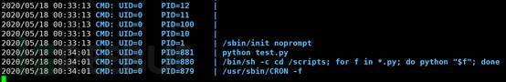

相关工具
========================================

目标信息
----------------------------------------

资产搜集
~~~~~~~~~~~~~~~~~~~~~~~~~~~~~~~~~~~~~~~~
- ENScan
	+ 项目地址：``https://github.com/wgpsec/ENScan_GO``

CDN判别
~~~~~~~~~~~~~~~~~~~~~~~~~~~~~~~~~~~~~~~~
- 在线多地超级ping
	+ 多地ping得到不同的IP地址，基本判断为开启了CDN。
	+ ``https://ping.chinaz.com/``
- dig/nslookup
	+ 多个IP则可能开启了CDN。
- DNS历史记录查询
	+ ``https://www.dnsdb.io/zh-cn/`` 
	+ ``https://viewdns.info/`` 
- cdncheck
	+ 安装：``go install -v github.com/projectdiscovery/cdncheck/cmd/cdncheck@latest``
	+ 示例
		::
		
			echo hackerone.com| cdncheck -resp
			subfinder -d hackerone.com| cdncheck -resp

子域爆破
~~~~~~~~~~~~~~~~~~~~~~~~~~~~~~~~~~~~~~~~
- `ESD <https://github.com/FeeiCN/ESD>`_
	| ``pip install esd``
	| ``esd -d baidu.com``
- `subDomainsBrute <https://github.com/lijiejie/subDomainsBrute>`_
	| ``python3 subDomainsBrute.py baidu.com``
- `broDomain <https://github.com/code-scan/BroDomain>`_
	+ 查询域名注册邮箱,查询备案号
	+ 通过备案号查询域名,反查注册邮箱,注册人
	+ 通过注册人查询到的域名在查询邮箱
	+ 通过上一步邮箱去查询域名
	+ 查询以上获取出的域名的子域名
- `aiodnsbrute <https://github.com/blark/aiodnsbrute>`_
	| ``pip install aiodnsbrute``
	| ``aiodnsbrute -w wordlist.txt -vv -t 1024 domain.com``
- `OneForAll <https://github.com/shmilylty/OneForAll>`_
- `subfinder <https://github.com/subfinder/subfinder>`_
	| ``subfinder -d yuanqisousou.com/``
- `wydomain <https://github.com/ring04h/wydomain>`_
- `chaos <https://github.com/projectdiscovery/chaos-client>`_

主机信息
----------------------------------------

IP信息
~~~~~~~~~~~~~~~~~~~~~~~~~~~~~~~~~~~~~~~~
- dig
	+ ``查询A记录：dig baidu.com A +noall +answer``
	+ ``查询MX记录：dig baidu.com MX +noall +answer``
	+ ``查询权威DNS：dig baidu.com NS +noall +answer``
	+ ``查询所有记录：dig baidu.com ANY +noall +answer``
	+ ``快速回答：+short``
	+ ``IP反查：dig -x 192.168.17.28 +short``
	+ ``指定域名服务器：dig baidu.com ANY @8.8.8.8``
	+ ``解析过程：dig www.ustc.edu.cn +trace``
	+ ``查询所有子域名：dig @192.168.56.102 greenoptic.vm axfr``
- nslookup
	+ ``查询A记录：nslookup -q=A baidu.com``
	+ ``指定域名服务器：nslookup baidu.com -type=any 8.8.8.8``
- dnsx
	+ 项目地址：``https://github.com/projectdiscovery/dnsx``
	+ 直接apt安装
	+ 示例
		::
		
			subfinder -silent -d hackerone.com | dnsx -silent
			echo hackerone.com| dnsx -a -re

- IP无法访问页面
	+ 服务器开启虚拟主机
		``如：www.ustc.edu.cn->218.22.21.21,页面显示400 Unknown Virtual Host``
	+ 反向代理服务器
		``如：nginx``

存活主机扫描
~~~~~~~~~~~~~~~~~~~~~~~~~~~~~~~~~~~~~~~~
- fping
	+ ``fping -a -g 14.215.177.1 14.215.177.100``
	+ ``fping -a -g 14.215.177.0/24``
- masscan
	+ ``masscan --ping 28.41.0.0/16 --rate 1000000``
	+ ``心脏出血漏洞：masscan -p443 28.41.0.0/16 --banners --heartbleed``
	+ ``masscan 192.168.1.1/24 --ports 445`` 
- nmap
	+ ``nmap -sP 192.168.0.1/24`` 
- arp-scan
	+ ``arp-scan -l`` 
- netdiscover

端口扫描
~~~~~~~~~~~~~~~~~~~~~~~~~~~~~~~~~~~~~~~~
- `nmap <https://github.com/nmap/nmap>`_
	+ 扫描方式
		- ``TCP:-sT``
		- ``SYN:-sS``
		- ``ACK:-sA``
		- ``UDP:-sU``
		- ``RPC:-sR``
		- ``ICMP:-sP``
		- 禁用端口扫描:-sn
	+ 技巧
		- ``--host-timeout 主机超时时间 通常设置18000``
		- ``--scan-delay 报文时间间隔 通常设置1000``
		- ``-S 源地址 定义扫描源地址，防止被发现``
	+ 输出
		- ``-oN <file>``
		- ``-oX <xml file>``
	+ 范围扫描
		- ``nmap 192.168.0.100-110``
		- ``nmap 192.168.0.1/24`` 
		- ``nmap -iL /root/target.txt`` 
	+ 指定端口
		- ``nmap 192.168.0.101 -p 80,8080,3306,3389`` 
		- ``所有端口：nmap -p- 192.168.100.104``
		- ``nmap --top-ports 1000 192.168.100.105``
	+ 路由追踪
		- ``nmap --traceroute 192.168.0.101`` 
	+ 服务版本
		- ``nmap -sV 192.168.0.101`` 
	+ 操作系统版本
		- ``nmap -O 192.168.0.101`` 
	+ 探测防火墙
		- ``nmap -sF -T4 192.168.0.101``
	+ 插件扫描
		- 插件列表:``ls /usr/share/nmap/scripts/ |sed 's/.nse//'>scripts.list``
		- 插件用法：``nmap --script-help ssh_brute``
		- 弱口令扫描:``--script=auth``
		- 暴力破解:``--script=brute``
		- 常见漏洞:``--script=vuln``
		- 默认脚本:``--script=default或者-sC``
		- 局域网服务探测:``--script=broadcast``
		- smb字典破解:``--script=smb-brute.nse --script-args=userdb=/var/passwd,passdb=/var/passwd``
		- smb漏洞：``--script=smb-check-vulns.nse --script-args=unsafe=1 192.168.137.4`` 
		- 查看共享目录:``nmap -p 445 --script smb-ls --script-args 'share=e$,path=\,smbuser=test,smbpass=test' 192.168.137.4``
		- ssh破解：``nmap -p22 --script ssh-brute --script-args userdb=cysec_user.txt,passdb=username.txt 172.16.226.5 -nP -vvv``
		- 目录扫描:``nmap -sV --script=http-enum -p 80,60000 192.168.100.105``
		- 永恒之蓝: ``nmap --script=smb-vuln-ms17-010 192.168.117.130``
	+ 注意
		::
		
			1.默认情况下，nmap只扫描默认端口。
			2.NMAP执行结果中，端口状态后经常标记tcpwrapped。tcpwrapped表示服务器运行TCP_Wrappers服务。
			TCP_Wrappers是一种应用级防火墙。它可以根据预设，对SSH、Telnet、FTP服务的请求进行拦截，判断
			是否符合预设要求。如果符合，就会转发给对应的服务进程；否则，会中断连接请求。
		
- `zmap <https://github.com/zmap/zmap>`_
- `masscan <https://github.com/robertdavidgraham/masscan>`_
	+ 全端口扫描：``masscan 192.168.1.1 -p 1-65535 --banner``
	+ 输出扫描结果：``masscan -p80,8000-8100 10.0.0.0/8 --echo > scan.conf``
	+ 输出文件：``-oL/-oJ/-oD/-oG/-oB/-oX/-oU <file>: Output scan in List/JSON/nDjson/Grepable/Binary/XML/Unicornscan format``

RPC信息搜集
~~~~~~~~~~~~~~~~~~~~~~~~~~~~~~~~~~~~~~~~
- rpcclient
	+ ``rpcclient -U "" 10.10.10.161``

Samba服务
~~~~~~~~~~~~~~~~~~~~~~~~~~~~~~~~~~~~~~~~
- smbmap
	+ 枚举整个域中的samba共享磁盘
	+ ``smbmap -H 192.168.1.40``
	+ 枚举特定用户共享：``smbmap -H 192.168.1.17 -u raj -p 123456``
- nmblookup
	+ 网络中查询NetBIOS名称，网络中查询NetBIOS名称
	+ ``nmblookup -A 192.168.1.17``
- nbtscan
	+ 扫描IP网络以获取NetBIOS名称信息
	+ ``nbtscan 192.168.1.17``
- enum4linux
- smbclient
	+ 无密码：``smbclient -L //192.168.99.4 -N``
	+ 查看共享文件夹：``smbclient -L //192.168.1.110 -U Jerry`` 
	+ 进入共享文件夹：``smbclient //192.168.1.110/share -U Jerry`` 
	+ 上传文件：``smbclient //192.168.1.110/share -c 'cd /home/dulingwen/Downloads; put shaolin.jpg'`` 
	+ smb直接上传：``put flower.jpg`` 
	+ smb下载文件：``get flower.jpg`` 
- nmap
	+ ``nmap --script smb-enum-shares -p139,445 192.168.1.17``
	+ ``nmap --script smb-os-discovery 192.168.1.17``
	+ 检测smb类型的所有漏洞：``nmap --script smb-vuln* 192.168.1.16``
- msf
	+ ``auxiliary/scanner/smb/smb_lookupsid``
		::
		
			set rhosts 192.168.1.17
			set smbuser raj
			set smbpass 

系统信息
~~~~~~~~~~~~~~~~~~~~~~~~~~~~~~~~~~~~~~~~
- `linux系统信息获取LinEnum <https://github.com/rebootuser/LinEnum>`_
- `系统信息获取PEASS-ng <https://github.com/carlospolop/PEASS-ng>`_

系统监控
~~~~~~~~~~~~~~~~~~~~~~~~~~~~~~~~~~~~~~~~
- `pspy64 <https://github.com/DominicBreuker/pspy/releases/download/v1.2.0/pspy64>`_
	|pspy|

	注：其中uid为0标识具有root权限运行的进程。

web系统
----------------------------------------

web指纹识别
~~~~~~~~~~~~~~~~~~~~~~~~~~~~~~~~~~~~~~~~
- `Wappalyzer <https://github.com/AliasIO/Wappalyzer>`_
- `CMS指纹识别 <https://github.com/n4xh4ck5/CMSsc4n>`_
- `云悉指纹 <https://www.yunsee.cn/>`_
- `whatweb <https://github.com/urbanadventurer/whatweb>`_
- `Webfinger <https://github.com/se55i0n/Webfinger>`_
- `CMSeek <https://github.com/Tuhinshubhra/CMSeeK>`_
- `EHole <https://github.com/EdgeSecurityTeam/EHole>`_ 红队重点攻击系统指纹探测工具

Waf指纹
~~~~~~~~~~~~~~~~~~~~~~~~~~~~~~~~~~~~~~~~
- `identywaf <https://github.com/enablesecurity/identywaf>`_
- `wafw00f <https://github.com/enablesecurity/wafw00f>`_
- `WhatWaf <https://github.com/Ekultek/WhatWaf>`_
- nmap脚本
	+ ``--script=http-waf-detect``
	+ ``--script=http-waf-fingerprint``
- sqlmap
	+ ``sqlmap -u “www.xxx.com/xxx?id=1” --identify-waf``

敏感信息
~~~~~~~~~~~~~~~~~~~~~~~~~~~~~~~~~~~~~~~~
+ FindSomething
	- 项目地址：https://github.com/momosecurity/FindSomething
+ JSINFO-SCAN
	- 递归爬取域名 (netloc/domain)，以及递归从 JS 中获取信息的工具。
	- 项目地址：``https://github.com/p1g3/JSINFO-SCAN``
+ JSFinder
	- 快速在网站的js文件中提取URL，子域名的工具。
	- 项目地址：``https://github.com/Threezh1/JSFinder``
	- 用法：
		+ 简单爬取: ``python JSFinder.py -u http://www.mi.com``
		+ 深度爬取: ``python JSFinder.py -u http://www.mi.com -d``
+ js_info_finder
	- 项目地址：``https://github.com/laohuan12138/js_info_finder``

备份文件扫描
~~~~~~~~~~~~~~~~~~~~~~~~~~~~~~~~~~~~~~~~
+ ihoneyBakFileScan_Modify
	- 项目地址：https://github.com/VMsec/ihoneyBakFileScan_Modify

路径及文件扫描
~~~~~~~~~~~~~~~~~~~~~~~~~~~~~~~~~~~~~~~~
- 注意
	+ 注意在目录探测中，对于关键的目录，需要递归进行扫描。
	+ 可根据robots.txt中的目录进行扫描。
- 路径爬虫
	+ gospider：``https://github.com/jaeles-project/gospider``
	+ crawlergo：``https://github.com/0Kee-Team/crawlergo``
	+ weakfilescan: ``https://github.com/ring04h/weakfilescan``
- dirbuster
	+ dirbuster -H headless方式启动
	+ dirbuster ，默认GUI方式启动
	+ ``dirbuster -H -u http://www.xxx.com -l SecLists/Discovery/Web-Content/raft-large-directories.txt``
- dirmap
	+ 项目地址：``https://github.com/H4ckForJob/dirmap.git``
	+ 安装：``python3 -m pip install -r requirement.txt``
	+ 扫描单个目标：``python3 dirmap.py -i https://site.com -lcf`` 
	+ 扫描多个目标：``python3 dirmap.py -iF urls.txt -lcf`` 
- dirb
	+ ``穷举特定扩展名文件：dirb http://172.16.100.102 /usr/share/wordlists/dirb/common.txt -X .pcap`` 
	+ ``使用代理：dirb http://192.168.1.116  -p 46.17.45.194:5210`` 
	+ ``添加UA和cookie：dirb http://192.168.1.116 -a "***" -c "***"`` 
	+ ``扫描目录：dirb http://192.168.91.133 common.txt -N 404`` 
- `dirsearch <https://github.com/maurosoria/dirsearch>`_
	+ -u 指定网址
	+ -e 指定网站语言
	+ -w 指定字典
	+ -r 递归目录（跑出目录后，继续跑目录下面的目录）
	+ -random-agents 使用随机UA
	+ -x 排除指定响应码
	+ -i 包含指定响应码
- nikto
	+ ``常规扫描：nikto -host/-h http://www.example.com`` 
	+ ``指定端口(https)：nikto -h http://www.example.com -p 443 -ssl`` 
	+ ``指定目录：nikto -host/-h http://www.example.com -c /dvma`` 
	+ ``绕过IDS检测：nikto -host/-h http://www.example.com -evasion`` 
	+ ``Nikto配合Nmap扫描：nmap -p80 x.x.x.x -oG - \|nikto -host -`` 
	+ ``使用代理：nikto -h URL -useproxy http://127.0.0.1:1080`` 
- gobuster
	+ ``目录扫描: gobuster dir -u http://192.168.100.106 -w /usr/share/dirbuster/wordlists/directory-list-2.3-medium.txt``
	+ ``文件扫描：gobuster dir -u http://192.168.100.106 -w /home/kali/Downloads/SecLists/Discovery/Web-Content/directory-list-1.0.txt -x php``
	+ ``不包含特定长度：--exclude-length 280``
	+ 批量脚本
	
		::
		
			trap "echo Terminating...; exit;" SIGINT SIGTERM

			if [ $# -eq 0 ]; then
				echo "Usage: ott http://host threads optionalExtensions"
				exit 1
			fi

			for f in /usr/share/dirb/wordlists/common.txt /usr/share/dirb/wordlists/big.txt /usr/share/wordlists/dirbuster/directory-list-lowercase-2.3-medium.txt /usr/share/wordlists/raft/data/wordlists/raft-large-directories-lowercase.txt /usr/share/wordlists/raft/data/wordlists/raft-large-files-lowercase.txt /usr/share/wordlists/raft/data/wordlists/raft-large-words-lowercase.txt
			do
			  echo "Scanning: " $f
			  echo "Extensions: " $3
			  if [ -z "$3" ]; then
				gobuster -t $2 dir -f --url $1 --wordlist $f | grep "Status"
			  else
				gobuster -t $2 dir -f --url $1 --wordlist $f -x $3 | grep "Status"
			  fi
			done
		
		+ example:
		+ ott http://192.168.56.121 50
		+ ott http://192.168.56.121 50 .phtml,.php,.txt,.html
		

- `DirBrute <https://github.com/Xyntax/DirBrute>`_
- auxiliary/scanner/http/dir_scanner
- auxiliary/scanner/http/dir_listing
- auxiliary/scanner/http/brute_dirs
- DirBuster
- 御剑

暴力破解
----------------------------------------

字典
~~~~~~~~~~~~~~~~~~~~~~~~~~~~~~~~~~~~~~~~
- `SecLists <https://github.com/danielmiessler/SecLists>`_
- `Blasting dictionary <https://github.com/rootphantomer/Blasting_dictionary>`_
- `pydictor <https://github.com/LandGrey/pydictor>`_
- `Probable Wordlists <https://github.com/berzerk0/Probable-Wordlists>`_ Wordlists sorted by probability originally created for password generation and testing
- `Common User Passwords Profiler <https://github.com/Mebus/cupp>`_
- `chrome password grabber <https://github.com/x899/chrome_password_grabber>`_
- kali自带字典：/usr/share/wordlists/
- cewl字典生成工具
	+ 根据url爬取并生成字典：cewl http://www.ignitetechnologies.in/ -w dict.txt
	+ 生成长度最小限制的字典：cewl http://www.ignitetechnologies.in/ -m 9
	+ 爬取email地址：cewl http://www.ignitetechnologies.in/ -n -e
	+ 生成包含数字和字符的字典：cewl http://testphp.vulnweb.com/ --with-numbers
	+ 设置代理：cewl --proxy_host 192.168.1.103 --proxy_port 3128 -w dict.txt http://192.168.1.103/wordpress/
- crunch字典生成工具
	+ ``crunch <min-len> <max-len> [<charset string>] [options]``
		::
		
			min-len crunch要开始的最小长度字符串。即使不使用参数的值，也需要此选项
			max-len crunch要开始的最大长度字符串。即使不使用参数的值，也需要此选项
			charset string 在命令行使用crunch你可能必须指定字符集设置，否则将使用缺省的字符集设置。
			-c 数字 指定写入输出文件的行数，也即包含密码的个数
			-o wordlist.txt，指定输出文件的名称
			-p 字符串 或者-p 单词1 单词2 ...以排列组合的方式来生成字典。
			-q filename.txt，读取filename.txt
	+ 生成最小1位，最大8位，由26个小写字母为元素的所有组合 ``crunch 1 8``
	+ 生成最小为1,最大为6，由字符串组成所有字符组合 ``crunch 1 6 abcdefg``
	+ 指定字符串加特殊字符的组合 ``crunch 1 6 abcdefg\``
	+ 生成pass01-pass99所有数字组合 ``crunch 6 6 -t pass%%  >>newpwd.txt`` 
	+ 生成六位小写字母密码，其中前四位为pass ``crunch 6 6 -t pass@@  >>newpwd.txt`` 
	+ 生成六位密码，其中前四位为pass，后二位为大写 ``crunch 6 6 -t pass,,  >>newpwd.txt`` 
	+ 生成六位密码，其中前四位为pass，后二位为特殊字符 ``crunch 6 6 -t pass^^  >>newpwd.txt`` 
	+ 制作8为数字字典 ``crunch 8 8 charset.lst numeric -o num8.dic`` 
	+ 制作6为数字字典 ``crunch 6 6  0123456789 –o num6.dic`` 
	+ 制作139开头的手机密码字典 ``crunch 11 11  +0123456789 -t 139%%%%%%%% -o num13.dic`` 

firefox缓存破解
~~~~~~~~~~~~~~~~~~~~~~~~~~~~~~~~~~~~~~~~
- `Firefox_Decrypt <https://github.com/unode/firefox_decrypt>`_
	+ ``python3 firefox_decrypt.py ../esmhp32w.default-default``

web破解
~~~~~~~~~~~~~~~~~~~~~~~~~~~~~~~~~~~~~~~~
- `Brute_force <..//_static//Brute_force.py>`_

弱密码爆破
~~~~~~~~~~~~~~~~~~~~~~~~~~~~~~~~~~~~~~~~
- 超级弱口令检查工具：``https://github.com/shack2/SNETCracker``
- golang工具： ``https://github.com/oksbsb/crack``
- `hydra(九头蛇) <https://github.com/vanhauser-thc/thc-hydra>`_
	+ ``GUI版本(xhydra)``
	+ ``支持协议：adam6500、asterisk、cisco、cisco-enable、cvs、firebird、ftp、ftps、http[s]-{head|get|post}、http[s]-{get|post}-form、http-proxy、http-proxy-urlenum、icq、imap[s]、irc、ldap2[s]、ldap3[-{cram|digest}md5][s]、mssql、mysql、nntp、oracle-listener、oracle-sid、pcanywhere、pcnfs、pop3[s]、postgres、radmin2、rdp、redis、rexec、rlogin、rpcap、rsh、rtsp、s7-300、sip、smb、smtp[s]、smtp-enum、snmp、socks5、ssh、sshkey、svn、teamspeak、telnet[s]、vmauthd、vnc、xmpp``
	+ ``查看模块用法：hydra -U http-form-post``
	+ ``smb破解：hydra -l Administrator -P pass.txt smb://192.168.47`` 
	+ ``3389破解：hydra -l Administrator -P pass.txt rdp://192.168.47.124 -t 1 -V`` 
	+ ``ssh破解：hydra -l msfadmin -P pass.txt ssh://192.168.47.133 -vV`` 
	+ ``ftp破解：hydra -L user.txt -P pass.txt ftp://192.168.47.133 -s 21 -e nsr -t 1 -vV`` 
	+ ``mysql破解：hydra 192.168.43.113 mysql -l root -P /usr/share/wordlists/rockyou.txt -t 1`` 
	+ ``HTTP身份认证破解：hydra -L user.txt -P pass.txt 192.168.0.105 http-get``
	+ ``HTTP身份认证破解：hydra -l admin -P /usr/share/wordlists/rockyou.txt door.legacyhangtuah.com http-get /webdav``
	+ ``hydra -l admin -P /usr/share/wordlists/metasploit/unix_users.txt 172.16.100.103 http-get-form "/dvwa/login.php:username=^USER^&password=^PASS^&login=login:Login failed" -V``

		::
		
				-l表示单个用户名（使用-L表示用户名列表）
				-P表示使用以下密码列表
				http-post-form表示表单的类型
				/ dvwa / login-php是登录页面URL
				username是输入用户名的表单字段
				^ USER ^告诉Hydra使用字段中的用户名或列表
				password是输入密码的表单字段（可以是passwd，pass等）
				^ PASS ^告诉Hydra使用提供的密码列表
				登录表示Hydra登录失败消息
				登录失败是表单返回的登录失败消息
				-V用于显示每次尝试的详细输出 
				注：此类模块是破解HTTP协议表单数据。
				
	+ ``hydra -l 用户名 -P password_file 127.0.0.1 http-get-form/http-post-form "vulnerabilities/brute/:username=^USER^&password=^PASS^&submit=login:F=Username and/or password incorrect.:H=Cookie: security=low;PHPSESSID=xxxxxxx"``

		::

				说明：引号内的部分是自行构建的参数，这些参数用冒号隔开。
				第一个参数是接受收据的地址；
				第二个参数是页面接受的数据，需要破解的参数用^符号包起来；
				第三个参数是判断破解是否成功的标志(F代表错误，S代表正确)；
				第四个参数是本次请求中的head cookie
				
	+ ``-f``：破解了一个密码就停止
	+ 注意：不支持含有token的http协议破解。
				
- `medusa(美杜莎) <https://github.com/jmk-foofus/medusa>`_
	+ ``查询模块用法：medusa -M http -q``
	+ ``medusa -H ssh1.txt -u root -P passwd.txt -M ssh``
	+ ``medusa -h 192.168.100.105 -u root -P /home/kali/Downloads/rockyou.txt -M mysql``
	+ ``medusa -M http -h 192.168.10.1 -u admin -P /usr/share/wfuzz/wordlist/fuzzdb/wordlists-user-passwd/passwds/john.txt -e ns -n 80 -F``

		::
		
				-M http 允许我们指定模块。
				-h 192.168.10.1 允许我们指定主机。
				-u admin 允许我们指定用户。
				-P [location of password list] 允许我们指定密码列表的位置。
				-e ns 允许我们指定额外的密码检查。 ns 变量允许我们使用用户名作为密码，并且使用空密码。
				-n 80 允许我们指定端口号码。
				-F 允许我们在成功找到用户名密码组合之后停止爆破。
				注：此模块是破解HTTP身份认证。
				medusa -M http -h door.legacyhangtuah.com -m DIR:webdav/ -u admin -P /usr/share/wordlists/rockyou.txt -e ns -n 80 -F

	+ HTTP表单破解: ``medusa -M web-form -q``
- `htpwdScan <https://github.com/lijiejie/htpwdScan>`_
	+ ``python htpwdScan.py -f dvwa.txt -d password=/usr/share/wordlists/metasploit/unix_users.txt  -err=\"password incorrect\"``
	+ ``python htpwdScan.py -d passwd=password.txt -u=\"http://xxx.com/index.php?m=login&username=test&passwd=test\" -get -err=\"success\":false\"``
- `patator <https://github.com/lanjelot/patator>`_
- ncrack
	+ HTTP身份认证破解：``ncrack -U /usr/share/wordlists/rockyou.txt -P /usr/share/wordlists/rockyou.txt http://door.legacyhangtuah.com/webdav``
- fcrackzip
	| ``fcrackzip -b -l 6-6 -c 1 -p 000000 passwd.zip`` 
		
		::
		
			-b 暴力破解
			-c 1 限制密码是数字
			-l 6-6 限制密码长度为6
			-p 000000 初始化破解起点
	
	| ``fcrackzip -u -D -p passwd passwd.zip``
		
		::
		
			-D -p passwd 密码本passwd文件
			-u 不显示错误密码冗余信息
		
- rarcrack
	+ ``rarcrack 文件名 --threads 线程数 --type rar|7z|zip``
		::
		
			启动软件，会在当前目录生成.rar.xml文件。
			修改abc节点，更该爆破使用的字符集。
- john
	+ 破解/etc/shadow
		| ``unshadow /etc/passwd /etc/shadow > passwd_shadow``
		
			::
			
				unshadow命令基本上会结合/etc/passwd的数据和/etc/shadow的数据，
				创建1个含有用户名和密码详细信息的文件。
				
		| ``unique -v -inp=allwords.txt uniques.txt``
		
			::
			
				unique工具可以从一个密码字典中去除重复行。
		
		| ``密码文件破解：john --wordlist=/usr/share/john/password.lst --rules passwd_shadow``
		| ``直接破解：john passwd_shadow``
		| ``查看上一次破解结果：john --show shadow``
	+ 破解单条记录
		| ``jeevan:$6$LXNakaBRJ/tL5F2a$bCgiylk/LY2MeFp5z9YZyiezsNsgj.5/cDohRgFRBNdrwi/2IPkUO0rqVIM3O8vysc48g3Zpo/sHuo.qwBf4U1:18430:0:99999:7:::``
		| 存入password.txt文件
		| ``john --wordlist=/usr/share/wordlists/rockyou.txt password.txt``
		
	+ 破解ssh私钥文件
		| ``查看ssh2john位置：locate ssh2john``
		| ``python /usr/share/john/ssh2john.py root>root.crack``
		| ``john --wordlist=/usr/share/wordlists/rockyou.txt root.crack``
	+ 破解zip密码
		| ``zip2john tom.zip>hash5``
		| ``john hash5 --format=PKZIP --wordlist=/home/kali/Downloads/rockyou.txt``
		
- wordpress密码破解
	+ ``auxiliary/scanner/http/wordpress_xmlrpc_login``
	+ ``wpscan --url https://www.xxxxxxx.wiki/ -U 'admin' -P /root/wordlist.txt``
	+ `WPCracker <https://github.com/JoniRinta-Kahila/WPCracker>`_
		- 枚举用户：``.\WPCracker.exe --enum -u <Url to victims WordPress page> -o <Output file path (OPTIONAL)>``
		- 暴力破解：``.\WPCracker.exe --brute -u <Url to victims WordPress page> -p <Path to wordlist> -n <Username> -o <Output file path (OPTIONAL)>``
- hashcat
	+ 基于规则密码突变
		- 在线文档：``https://hashcat.net/wiki/doku.php?id=rule_based_attack``
		- 示例：``hashcat --stdout pass.txt -r /usr/share/hashcat/rules/best64.rule > passlist.txt``

搜索引擎查询
----------------------------------------
- `Shodan <https://www.shodan.io/>`_
- `Zoomeye <https://www.zoomeye.org/>`_
- `fofa <https://fofa.so/>`_
	+ title="后台管理" 搜索页面标题中含有“后台管理”关键词的网站和IP
	+ header="thinkphp" 搜索HTTP响应头中含有“thinkphp”关键词的网站和IP
	+ body="管理后台" 搜索html正文中含有“管理后台”关键词的网站和IP
	+ body="Welcome to Burp Suite" 搜索公网上的BurpSuite代理
	+ domain="itellyou.cn" 搜索根域名中带有“itellyou.cn”的网站
	+ host="login" 搜索域名中带有"login"关键词的网站
	+ port="3388" && country=CN 搜索开放3388端口并且位于中国的IP
	+ ip="120.27.6.1/24" 搜索指定IP或IP段
	+ cert="phpinfo.me" 搜索证书(如https证书、imaps证书等)中含有"phpinfo.me"关键词的网站和IP
	+ ports="3306,443,22" 搜索同时开启3306端口、443端口和22端口的IP
	+ ports=="3306,443,22" 搜索只开启3306端口、443端口和22端口的IP
	+ && – 表示逻辑与
	+ || – 表示逻辑或
- `scans <https://scans.io/>`_
- `Just Metadata <https://github.com/FortyNorthSecurity/Just-Metadata>`_
- `publicwww - Find Web Pages via Snippet <https://publicwww.com/>`_

