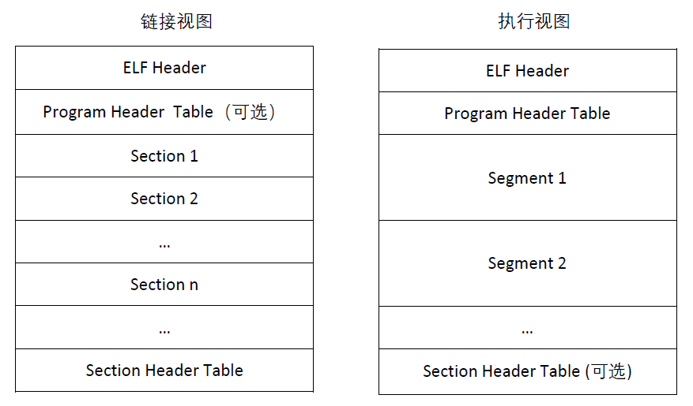
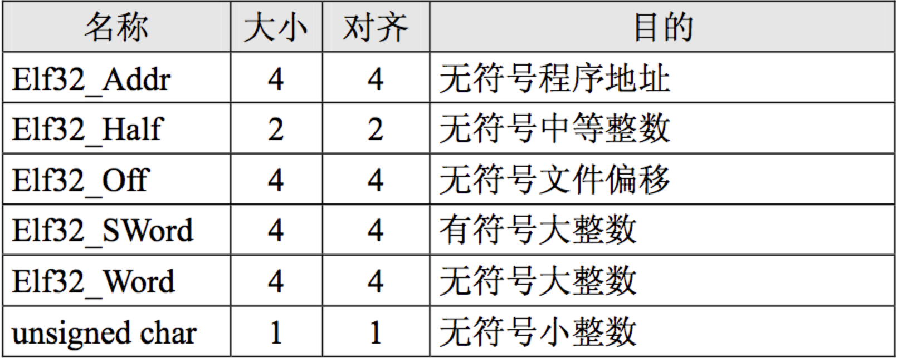
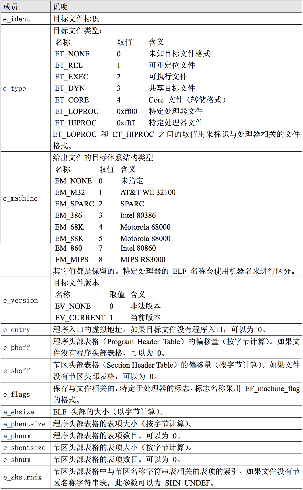
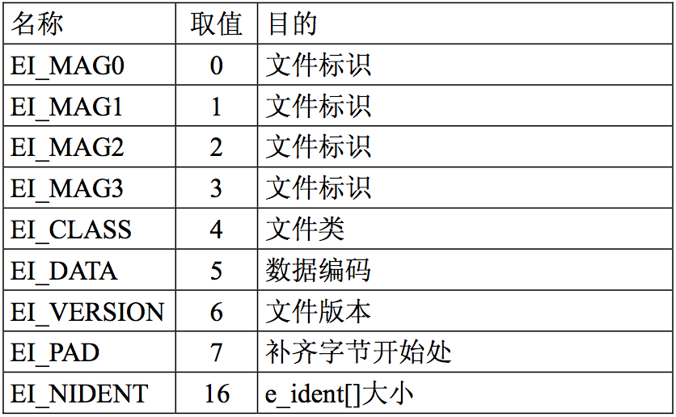
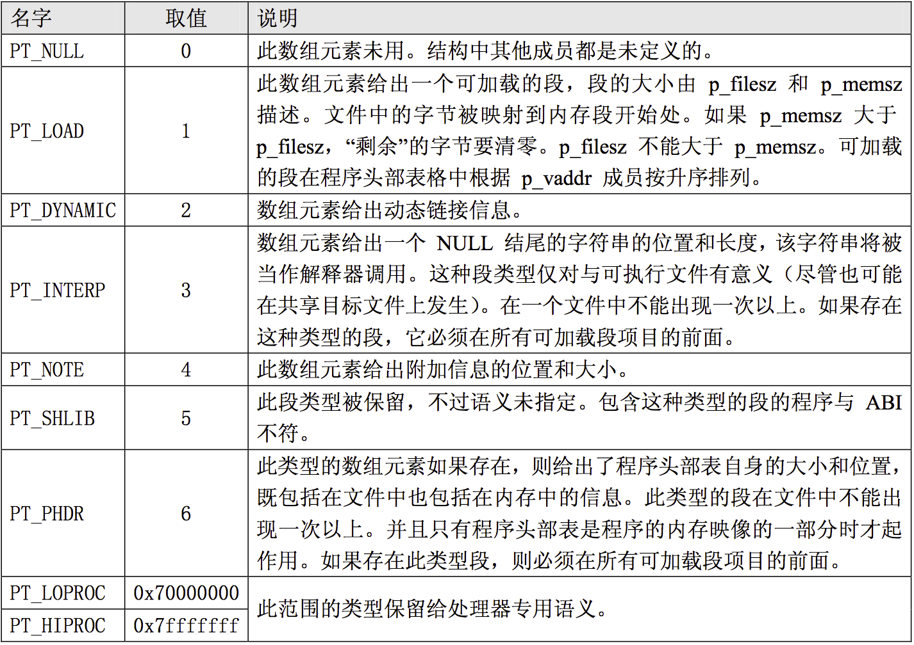
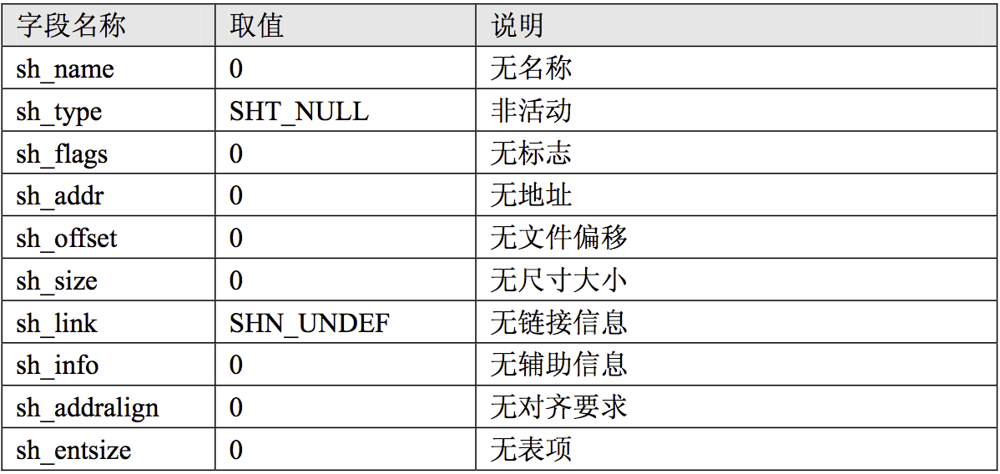
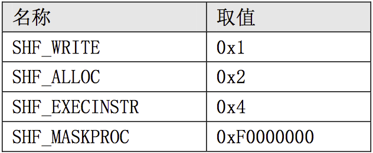
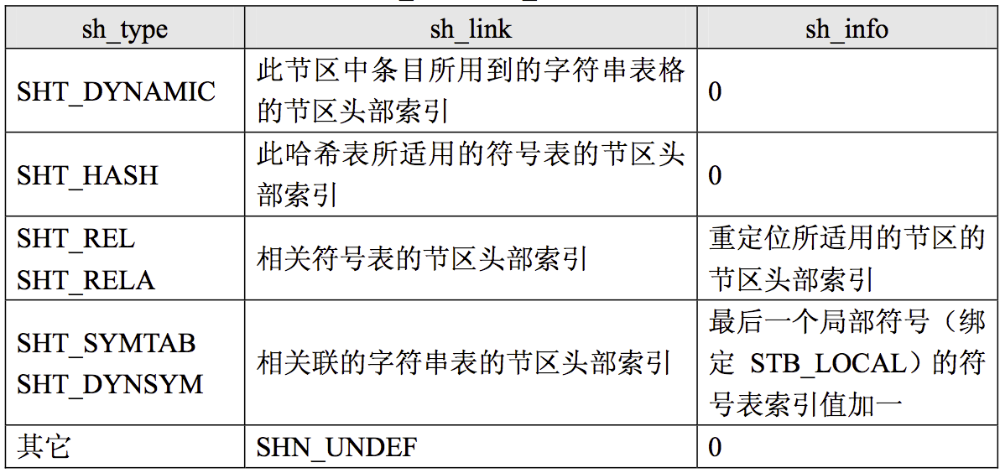

ELF文件格式
========================================

基础
----------------------------------------

表现视图
~~~~~~~~~~~~~~~~~~~~~~~~~~~~~~~~~~~~~~~~
|ELF1|

+ 文件开始处是一个 ELF 头部(ELF Header)，用来描述整个文件的组织。节区部分包含链接视图的大量信息:指令、数据、符号表、重定位信息等等。
+ 程序头部表，告诉系统如何创建进程映像。 用来构造进程映像的目标文件必须具有程序头部表，可重定位文件不需要这个表。
+ 节区头部表，包含了描述文件节区的信息，每个节区在表中都有一项，每一项给出诸如节区名称、节区大小这类信息。用于链接的目标文件必须包含节区头部表，其他目标文件可以有，也可以没有这个表。

数据表示
~~~~~~~~~~~~~~~~~~~~~~~~~~~~~~~~~~~~~~~~
|ELF2|

文件格式
----------------------------------------

ELF Hearder部分
~~~~~~~~~~~~~~~~~~~~~~~~~~~~~~~~~~~~~~~~
+ ELF头结构
	::
		
		/* ELF Header */
		typedef struct elfhdr {
			unsigned char    e_ident[EI_NIDENT]; /* ELF Identification */
			Elf32_Half    e_type;        /* object file type */
			Elf32_Half    e_machine;    /* machine */
			Elf32_Word    e_version;    /* object file version */
			Elf32_Addr    e_entry;    /* virtual entry point */
			Elf32_Off    e_phoff;    /* program header table offset */
			Elf32_Off    e_shoff;    /* section header table offset */
			Elf32_Word    e_flags;    /* processor-specific flags */
			Elf32_Half    e_ehsize;    /* ELF header size */
			Elf32_Half    e_phentsize;    /* program header entry size */
			Elf32_Half    e_phnum;    /* number of program header entries */
			Elf32_Half    e_shentsize;    /* section header entry size */
			Elf32_Half    e_shnum;    /* number of section header entries */
			Elf32_Half    e_shstrndx;    /* section header table's "section 
							   header string table" entry offset */
		} Elf32_Ehdr;

		typedef struct {
			unsigned char    e_ident[EI_NIDENT];    /* Id bytes */
			Elf64_Quarter    e_type;            /* file type */
			Elf64_Quarter    e_machine;        /* machine type */
			Elf64_Half    e_version;        /* version number */
			Elf64_Addr    e_entry;        /* entry point */
			Elf64_Off    e_phoff;        /* Program hdr offset */
			Elf64_Off    e_shoff;        /* Section hdr offset */
			Elf64_Half    e_flags;        /* Processor flags */
			Elf64_Quarter    e_ehsize;        /* sizeof ehdr */
			Elf64_Quarter    e_phentsize;        /* Program header entry size */
			Elf64_Quarter    e_phnum;        /* Number of program headers */
			Elf64_Quarter    e_shentsize;        /* Section header entry size */
			Elf64_Quarter    e_shnum;        /* Number of section headers */
			Elf64_Quarter    e_shstrndx;        /* String table index */
		} Elf64_Ehdr;
		
+ 字段含义
	|ELF3|
	
+ e_ident数组定义
	|ELF4|
	
+ 索引值定义
	|ELF5|

+ 示例
	::
	
		# readelf -h heap
		ELF 头：
		  Magic：  7f 45 4c 46 02 01 01 00 00 00 00 00 00 00 00 00 
		  类别:                              ELF64
		  数据:                              2 补码，小端序 (little endian)
		  Version:                           1 (current)
		  OS/ABI:                            UNIX - System V
		  ABI 版本:                          0
		  类型:                              DYN (Position-Independent Executable file)
		  系统架构:                          Advanced Micro Devices X86-64
		  版本:                              0x1
		  入口点地址：              0x10b0
		  程序头起点：              64 (bytes into file)
		  Start of section headers:          17168 (bytes into file)
		  标志：             0x0
		  Size of this header:               64 (bytes)
		  Size of program headers:           56 (bytes)
		  Number of program headers:         13
		  Size of section headers:           64 (bytes)
		  Number of section headers:         37
		  Section header string table index: 36

程序头部（Program Header）
~~~~~~~~~~~~~~~~~~~~~~~~~~~~~~~~~~~~~~~~
+ 说明
	可执行文件或者共享目标文件的程序头部是一个结构数组，每个结构描述了一个段 或者系统准备程序执行所必需的其它信息。可执行目标文件在 ELF 头部的 e_phentsize 和 e_phnum 成员中给出其自身程序头部 的大小。
+ 程序头结构：
	::
	
		typedef struct {
			Elf32_Word    p_type;        /* segment type */
			Elf32_Off    p_offset;    /* segment offset */
			Elf32_Addr    p_vaddr;    /* virtual address of segment */
			Elf32_Addr    p_paddr;    /* physical address - ignored? */
			Elf32_Word    p_filesz;    /* number of bytes in file for seg. */
			Elf32_Word    p_memsz;    /* number of bytes in mem. for seg. */
			Elf32_Word    p_flags;    /* flags */
			Elf32_Word    p_align;    /* memory alignment */
		} Elf32_Phdr;

		typedef struct {
			Elf64_Half    p_type;        /* entry type */
			Elf64_Half    p_flags;    /* flags */
			Elf64_Off    p_offset;    /* offset */
			Elf64_Addr    p_vaddr;    /* virtual address */
			Elf64_Addr    p_paddr;    /* physical address */
			Elf64_Xword    p_filesz;    /* file size */
			Elf64_Xword    p_memsz;    /* memory size */
			Elf64_Xword    p_align;    /* memory & file alignment */
		} Elf64_Phdr;
		
		字段说明：
		p_type 此数组元素描述的段的类型，或者如何解释此数组元素的信息。
		p_offset 此成员给出从文件头到该段第一个字节的偏移。
		p_vaddr 此成员给出段的第一个字节将被放到内存中的虚拟地址。
		p_paddr 此成员仅用于与物理地址相关的系统中。
		p_filesz 此成员给出段在文件映像中所占的字节数。可以为 0。
		p_memsz 此成员给出段在内存映像中占用的字节数。可以为 0。
		p_flags 此成员给出与段相关的标志。
		p_align 此成员给出段在文件中和内存中如何对齐。数值0和1表示不需要对齐。p_align应该是个正整数，并且是2的幂次数，
		        p_vaddr和p_offset对p_align取模后应该相等。

+ 段类型
	|ELF6| 
	
+ 示例
	::
	
		readelf -l heap

		Elf 文件类型为 DYN (Position-Independent Executable file)
		Entry point 0x10b0
		There are 13 program headers, starting at offset 64

		程序头：
		  Type           Offset             VirtAddr           PhysAddr
						 FileSiz            MemSiz              Flags  Align
		  PHDR           0x0000000000000040 0x0000000000000040 0x0000000000000040
						 0x00000000000002d8 0x00000000000002d8  R      0x8
		  INTERP         0x0000000000000318 0x0000000000000318 0x0000000000000318
						 0x000000000000001c 0x000000000000001c  R      0x1
			  [Requesting program interpreter: /lib64/ld-linux-x86-64.so.2]
		  LOAD           0x0000000000000000 0x0000000000000000 0x0000000000000000
						 0x0000000000000720 0x0000000000000720  R      0x1000
		  LOAD           0x0000000000001000 0x0000000000001000 0x0000000000001000
						 0x00000000000003a2 0x00000000000003a2  R E    0x1000
		  LOAD           0x0000000000002000 0x0000000000002000 0x0000000000002000
						 0x0000000000000270 0x0000000000000270  R      0x1000
		  LOAD           0x0000000000002e18 0x0000000000003e18 0x0000000000003e18
						 0x0000000000000240 0x0000000000000258  RW     0x1000
		  DYNAMIC        0x0000000000002e38 0x0000000000003e38 0x0000000000003e38
						 0x00000000000001a0 0x00000000000001a0  RW     0x8
		  NOTE           0x0000000000000338 0x0000000000000338 0x0000000000000338
						 0x0000000000000020 0x0000000000000020  R      0x8
		  NOTE           0x0000000000000358 0x0000000000000358 0x0000000000000358
						 0x0000000000000044 0x0000000000000044  R      0x4
		  GNU_PROPERTY   0x0000000000000338 0x0000000000000338 0x0000000000000338
						 0x0000000000000020 0x0000000000000020  R      0x8
		  GNU_EH_FRAME   0x00000000000020d8 0x00000000000020d8 0x00000000000020d8
						 0x000000000000004c 0x000000000000004c  R      0x4
		  GNU_STACK      0x0000000000000000 0x0000000000000000 0x0000000000000000
						 0x0000000000000000 0x0000000000000000  RW     0x10
		  GNU_RELRO      0x0000000000002e18 0x0000000000003e18 0x0000000000003e18
						 0x00000000000001e8 0x00000000000001e8  R      0x1

		 Section to Segment mapping:
		  段节...
		   00     
		   01     .interp 
		   02     .interp .note.gnu.property .note.gnu.build-id .note.ABI-tag .gnu.hash .dynsym .dynstr .gnu.version .gnu.version_r .rela.dyn .rela.plt 
		   03     .init .plt .plt.got .text .fini 
		   04     .rodata .eh_frame_hdr .eh_frame 
		   05     .ctors .dtors .dynamic .got .got.plt .data .bss 
		   06     .dynamic 
		   07     .note.gnu.property 
		   08     .note.gnu.build-id .note.ABI-tag 
		   09     .note.gnu.property 
		   10     .eh_frame_hdr 
		   11     
		   12     .ctors .dtors .dynamic .got 
	
节区（Sections）
~~~~~~~~~~~~~~~~~~~~~~~~~~~~~~~~~~~~~~~~
+ 说明
	- 目标文件中的每个节区都有对应的节区头部描述它，反过来，有节区头部不意 味着有节区。
	- 每个节区占用文件中一个连续字节区域(这个区域可能长度为 0)。
	- 文件中的节区不能重叠，不允许一个字节存在于两个节区中的情况发生。
	- 目标文件中可能包含非活动空间(INACTIVE SPACE)。这些区域不属于任何头部和节区，其内容指定。
+ .dynsym定义
	- .dynsym保存了引用来自外部文件符号的全局符号。如printf库函数。.dynsym保存的符号是.symtab所保存符合的子集，.symtab中还保存了可执行文件的本地符号。如全局变量，代码中定义的本地函数等。
	- .dynsym保存的符号只能在运行时被解析，因此是运行时动态链接器所需的唯一符号。.dynsym对于动态链接可执行文件的执行是必需的，而.symtab只是用来进行调试和链接的。
	- 结构如下：
		::
			
			typedef struct {
			  unsigned char st_name[4];     /* Symbol name, index in string tbl */
			  unsigned char st_value[4];        /* Value of the symbol */
			  unsigned char st_size[4];     /* Associated symbol size */
			  unsigned char st_info[1];     /* Type and binding attributes */
			  unsigned char st_other[1];        /* No defined meaning, 0 */
			  unsigned char st_shndx[2];        /* Associated section index */
			} Elf32_External_Sym;
			
			注：.dynstr 是和 .dynsym 相关的以 '\0' 结尾的动态符号表字符串信息。
			只要编译的应用程序中使用了动态库，就会包含这两个 section。
	- 示例
		::
		
			Symbol table '.dynsym' contains 13 entries:
			   Num:    Value          Size Type    Bind   Vis      Ndx Name
				 0: 0000000000000000     0 NOTYPE  LOCAL  DEFAULT  UND 
				 1: 0000000000000000     0 NOTYPE  WEAK   DEFAULT  UND _ITM_deregisterT[...]
				 2: 0000000000000000     0 FUNC    GLOBAL DEFAULT  UND [...]@GLIBC_2.2.5 (2)
				 3: 0000000000000000     0 FUNC    GLOBAL DEFAULT  UND puts@GLIBC_2.2.5 (2)
				 4: 0000000000000000     0 FUNC    GLOBAL DEFAULT  UND [...]@GLIBC_2.2.5 (2)
				 5: 0000000000000000     0 FUNC    GLOBAL DEFAULT  UND [...]@GLIBC_2.2.5 (2)
				 6: 0000000000000000     0 NOTYPE  WEAK   DEFAULT  UND __gmon_start__
				 7: 0000000000000000     0 FUNC    GLOBAL DEFAULT  UND [...]@GLIBC_2.2.5 (2)
				 8: 0000000000000000     0 FUNC    GLOBAL DEFAULT  UND [...]@GLIBC_2.2.5 (2)
				 9: 0000000000000000     0 FUNC    GLOBAL DEFAULT  UND exit@GLIBC_2.2.5 (2)
				10: 0000000000000000     0 NOTYPE  WEAK   DEFAULT  UND _ITM_registerTMC[...]
				11: 0000000000004058     8 OBJECT  GLOBAL DEFAULT   26 [...]@GLIBC_2.2.5 (2)
				12: 0000000000000000     0 FUNC    WEAK   DEFAULT  UND [...]@GLIBC_2.2.5 (2)
				
			Symbol table '.symtab' contains 52 entries:
			   Num:    Value          Size Type    Bind   Vis      Ndx Name
				 0: 0000000000000000     0 NOTYPE  LOCAL  DEFAULT  UND 
				 1: 0000000000000000     0 FILE    LOCAL  DEFAULT  ABS Scrt1.o
				 2: 000000000000037c    32 OBJECT  LOCAL  DEFAULT    4 __abi_tag
				 3: 0000000000000000     0 FILE    LOCAL  DEFAULT  ABS crtstuff.c
				 4: 0000000000003e18     0 OBJECT  LOCAL  DEFAULT   20 __CTOR_LIST__
				 5: 0000000000003e28     0 OBJECT  LOCAL  DEFAULT   21 __DTOR_LIST__
				 6: 00000000000010e0     0 FUNC    LOCAL  DEFAULT   15 deregister_tm_clones
				 7: 0000000000001110     0 FUNC    LOCAL  DEFAULT   15 register_tm_clones
				 8: 0000000000001150     0 FUNC    LOCAL  DEFAULT   15 __do_global_dtors_aux
				 9: 0000000000004060     1 OBJECT  LOCAL  DEFAULT   26 completed.1
				10: 0000000000004068     8 OBJECT  LOCAL  DEFAULT   26 dtor_idx.0
				11: 00000000000011e0     0 FUNC    LOCAL  DEFAULT   15 frame_dummy
				12: 0000000000000000     0 FILE    LOCAL  DEFAULT  ABS crtstuff.c
				13: 0000000000003e20     0 OBJECT  LOCAL  DEFAULT   20 __CTOR_END__
				14: 000000000000226c     0 OBJECT  LOCAL  DEFAULT   19 __FRAME_END__
				15: 0000000000001350     0 FUNC    LOCAL  DEFAULT   15 __do_global_ctors_aux
				16: 0000000000000000     0 FILE    LOCAL  DEFAULT  ABS heap.c
				17: 0000000000000000     0 FILE    LOCAL  DEFAULT  ABS 
				18: 0000000000003e18     0 NOTYPE  LOCAL  DEFAULT   20 __init_array_end
				19: 0000000000003e38     0 OBJECT  LOCAL  DEFAULT   22 _DYNAMIC
				20: 0000000000003e18     0 NOTYPE  LOCAL  DEFAULT   20 __init_array_start
				21: 00000000000020d8     0 NOTYPE  LOCAL  DEFAULT   18 __GNU_EH_FRAME_HDR
				22: 0000000000004000     0 OBJECT  LOCAL  DEFAULT   24 _GLOBAL_OFFSET_TABLE_
				23: 0000000000001000     0 FUNC    LOCAL  DEFAULT   12 _init
				24: 0000000000001340     1 FUNC    GLOBAL DEFAULT   15 __libc_csu_fini
				25: 0000000000000000     0 NOTYPE  WEAK   DEFAULT  UND _ITM_deregisterT[...]
				26: 0000000000004058     8 OBJECT  GLOBAL DEFAULT   26 stdout@GLIBC_2.2.5
				27: 0000000000004048     0 NOTYPE  WEAK   DEFAULT   25 data_start
				28: 0000000000000000     0 FUNC    GLOBAL DEFAULT  UND strcpy@GLIBC_2.2.5
				29: 0000000000000000     0 FUNC    GLOBAL DEFAULT  UND puts@GLIBC_2.2.5
				30: 0000000000004058     0 NOTYPE  GLOBAL DEFAULT   25 _edata
				31: 0000000000001394     0 FUNC    GLOBAL HIDDEN    16 _fini
				32: 0000000000000000     0 FUNC    GLOBAL DEFAULT  UND printf@GLIBC_2.2.5
				33: 0000000000003e30     0 OBJECT  GLOBAL HIDDEN    21 __DTOR_END__
				34: 0000000000000000     0 FUNC    GLOBAL DEFAULT  UND __libc_start_mai[...]
				35: 0000000000004048     0 NOTYPE  GLOBAL DEFAULT   25 __data_start
				36: 0000000000000000     0 NOTYPE  WEAK   DEFAULT  UND __gmon_start__
				37: 0000000000004050     0 OBJECT  GLOBAL HIDDEN    25 __dso_handle
				38: 0000000000002000     4 OBJECT  GLOBAL DEFAULT   17 _IO_stdin_used
				39: 00000000000012e0    93 FUNC    GLOBAL DEFAULT   15 __libc_csu_init
				40: 0000000000000000     0 FUNC    GLOBAL DEFAULT  UND malloc@GLIBC_2.2.5
				41: 0000000000000000     0 FUNC    GLOBAL DEFAULT  UND fflush@GLIBC_2.2.5
				42: 0000000000004070     0 NOTYPE  GLOBAL DEFAULT   26 _end
				43: 00000000000010b0    43 FUNC    GLOBAL DEFAULT   15 _start
				44: 0000000000004058     0 NOTYPE  GLOBAL DEFAULT   26 __bss_start
				45: 0000000000001215   188 FUNC    GLOBAL DEFAULT   15 main
				46: 00000000000011ff    22 FUNC    GLOBAL DEFAULT   15 nowinner
				47: 00000000000011e9    22 FUNC    GLOBAL DEFAULT   15 winner
				48: 0000000000000000     0 FUNC    GLOBAL DEFAULT  UND exit@GLIBC_2.2.5
				49: 0000000000004058     0 OBJECT  GLOBAL HIDDEN    25 __TMC_END__
				50: 0000000000000000     0 NOTYPE  WEAK   DEFAULT  UND _ITM_registerTMC[...]
				51: 0000000000000000     0 FUNC    WEAK   DEFAULT  UND __cxa_finalize@G[...]
			
+ .dynamic定义
	- 该section中保存的entry结构如下：
		::
		
			typedef struct {
			  unsigned char d_tag[4];       /* entry tag value */
			  union {
				unsigned char   d_val[4];
				unsigned char   d_ptr[4];
			  } d_un;
			} Elf32_External_Dyn;
	- tag类型的名义
		::
		
			DT_NEEDED(1)：该 elf 文件需要链接的动态库，名称被保存在 .dynstr 中，d_ptr 中保存其名称在 .dynstr 中的偏移地址。 
			DT_HASH(4)：动态链接 hash 表的位置，d_ptr 表示地址
			DT_STRTAB(5)：动态链接字符串表的位置，d_ptr 表示地址
			DT_SYMTAB(6)：符号表的位置DT_RELA(7)：：重定位表 rela 的位置
			DT_RELASZ(8)：重定位表 rela 的 size，d_val 表示 size
			DT_STRSZ(10)：字符串表的长度
			DT_INIT(12)：初始化代码的地址
			DT_FINI(13)：结束代码的地址
			DT_REL(17)：重定位表 rel 的位置
			DT_RELSZ(18)：重定位表 rel 的 size，rel 和 rela 的区别在于：rela 相对于 rel 而言多了一个 addend(加数)，这个加数用于重定位的过程，因为 rel 将加数放在了需要重定位的内存位置作为占位符，而 rela 类型的对应内存位置为0. 
			ssDT_SYMTAB_SHNDX(34)：符号表的 section header 的 index。 
	- 示例
		::
		
			Dynamic section at offset 0x2e38 contains 22 entries:
			  标记        类型                         名称/值
			 0x0000000000000001 (NEEDED)             共享库：[libc.so.6]
			 0x000000000000000c (INIT)               0x1000
			 0x000000000000000d (FINI)               0x1394
			 0x000000006ffffef5 (GNU_HASH)           0x3a0
			 0x0000000000000005 (STRTAB)             0x500
			 0x0000000000000006 (SYMTAB)             0x3c8
			 0x000000000000000a (STRSZ)              170 (bytes)
			 0x000000000000000b (SYMENT)             24 (bytes)
			 0x0000000000000015 (DEBUG)              0x0
			 0x0000000000000003 (PLTGOT)             0x4000
			 0x0000000000000002 (PLTRELSZ)           144 (bytes)
			 0x0000000000000014 (PLTREL)             RELA
			 0x0000000000000017 (JMPREL)             0x690
			 0x0000000000000007 (RELA)               0x5e8
			 0x0000000000000008 (RELASZ)             168 (bytes)
			 0x0000000000000009 (RELAENT)            24 (bytes)
			 0x000000006ffffffb (FLAGS_1)            标志： PIE
			 0x000000006ffffffe (VERNEED)            0x5c8
			 0x000000006fffffff (VERNEEDNUM)         1
			 0x000000006ffffff0 (VERSYM)             0x5aa
			 0x000000006ffffff9 (RELACOUNT)          1
			 0x0000000000000000 (NULL)               0x0
+ .rel.dyn/rel.plt
	- 数据结构如下：
		::
		
			typedef struct {
			  unsigned char r_offset[4];    /* Location at which to apply the action */
			  unsigned char r_info[4];  /* index and type of relocation */
			} Elf32_External_Rel;
	- 示例
		::
		
			重定位节 '.rela.dyn' at offset 0x5e8 contains 7 entries:
			  偏移量          信息           类型           符号值        符号名称 + 加数
			000000004050  000000000008 R_X86_64_RELATIVE                    4050
			000000003fd8  000100000006 R_X86_64_GLOB_DAT 0000000000000000 _ITM_deregisterTM[...] + 0
			000000003fe0  000500000006 R_X86_64_GLOB_DAT 0000000000000000 __libc_start_main@GLIBC_2.2.5 + 0
			000000003fe8  000600000006 R_X86_64_GLOB_DAT 0000000000000000 __gmon_start__ + 0
			000000003ff0  000a00000006 R_X86_64_GLOB_DAT 0000000000000000 _ITM_registerTMCl[...] + 0
			000000003ff8  000c00000006 R_X86_64_GLOB_DAT 0000000000000000 __cxa_finalize@GLIBC_2.2.5 + 0
			000000004058  000b00000005 R_X86_64_COPY     0000000000004058 stdout@GLIBC_2.2.5 + 0

			重定位节 '.rela.plt' at offset 0x690 contains 6 entries:
			  偏移量          信息           类型           符号值        符号名称 + 加数
			000000004018  000200000007 R_X86_64_JUMP_SLO 0000000000000000 strcpy@GLIBC_2.2.5 + 0
			000000004020  000300000007 R_X86_64_JUMP_SLO 0000000000000000 puts@GLIBC_2.2.5 + 0
			000000004028  000400000007 R_X86_64_JUMP_SLO 0000000000000000 printf@GLIBC_2.2.5 + 0
			000000004030  000700000007 R_X86_64_JUMP_SLO 0000000000000000 malloc@GLIBC_2.2.5 + 0
			000000004038  000800000007 R_X86_64_JUMP_SLO 0000000000000000 fflush@GLIBC_2.2.5 + 0
			000000004040  000900000007 R_X86_64_JUMP_SLO 0000000000000000 exit@GLIBC_2.2.5 + 0
			
			查看got：
			pwndbg> got
			GOT protection: Partial RELRO | GOT functions: 6
			 
			[0x555555558018] strcpy@GLIBC_2.2.5 -> 0x555555555046 (strcpy@plt+6) ◂— push   0 /* 'h' */
			[0x555555558020] puts@GLIBC_2.2.5 -> 0x555555555056 (puts@plt+6) ◂— push   1
			[0x555555558028] printf@GLIBC_2.2.5 -> 0x555555555066 (printf@plt+6) ◂— push   2
			[0x555555558030] malloc@GLIBC_2.2.5 -> 0x555555555076 (malloc@plt+6) ◂— push   3
			[0x555555558038] fflush@GLIBC_2.2.5 -> 0x555555555086 (fflush@plt+6) ◂— push   4
			[0x555555558040] exit@GLIBC_2.2.5 -> 0x555555555096 (exit@plt+6) ◂— push   5
			
			结合.rela.plt表文件中数据
			重定位节 '.rela.plt' at offset 0x690 contains 6 entries:
			  偏移量          信息           类型           符号值        符号名称 + 加数
			000000004018  000200000007 R_X86_64_JUMP_SLO 0000000000000000 strcpy@GLIBC_2.2.5 + 0
			000000004020  000300000007 R_X86_64_JUMP_SLO 0000000000000000 puts@GLIBC_2.2.5 + 0
			000000004028  000400000007 R_X86_64_JUMP_SLO 0000000000000000 printf@GLIBC_2.2.5 + 0
			000000004030  000700000007 R_X86_64_JUMP_SLO 0000000000000000 malloc@GLIBC_2.2.5 + 0
			000000004038  000800000007 R_X86_64_JUMP_SLO 0000000000000000 fflush@GLIBC_2.2.5 + 0
			000000004040  000900000007 R_X86_64_JUMP_SLO 0000000000000000 exit@GLIBC_2.2.5 + 0
			got需要进行重定位，查看文件中数据：
			hexdump -s 0x3018 heap -n 0x50 
			0003018 1046 0000 0000 0000 1056 0000 0000 0000
			0003028 1066 0000 0000 0000 1076 0000 0000 0000
			0003038 1086 0000 0000 0000 1096 0000 0000 0000
			0003048 0000 0000 0000 0000 4050 0000 0000 0000
			即0x0000000000001046重定位为0x555555555046。
			
+ .got
	- 位置：与got.plt一起存放于数据段。
	- 对于静态链接，重定位过程直接修改指令中对数据的引用地址，因为静态链接操作的是elf文本。而动态链接则做不到，因为这时候指令已经被加载到内存中，且映射为只读属性。 
	- 那么问题来了，如果不能修改指令，那怎么完成重定位过程？毕竟指令中编码的地址是不能直接使用的。答案是通过数据部分进行一次 **跳转** 。 
	- 这种实现的机制使用了GOT表，全名为global offset table，即全局偏移表。
	- 每个被目标模块引用的全局符号（函数和变量）都对应于GOT中一个8字节的条目。
	- 编译器还为GOT中每个条目生成一个重定位记录。
	- 示例：
		::
		
			查看got区段头：
			[23] .got              PROGBITS         0000000000003fd8  00002fd8
			0000000000000028  0000000000000008  WA       0     0     8
			查看区段数据：
			objdump -d --section=.got heap

			heap：     文件格式 elf64-x86-64
			Disassembly of section .got:
			0000000000003fd8 <.got>:
					...
			0x28字节全0数据。
			
			查看运行后数据：
			pwndbg> x/10x 0x0000555555557fd8
			0x555555557fd8: 0x00000000      0x00000000      0xf7dfe730      0x00007fff
			0x555555557fe8: 0x00000000      0x00000000      0x00000000      0x00000000
			0x555555557ff8: 0xf7e164a0      0x00007fff
			got[0]=0
			got[1]:指向__libc_start_main函数的地址。
			pwndbg> x/10i 0x00007ffff7dfe730
			0x7ffff7dfe730 <__libc_start_main>:  push   r15
			
			got[2]=0
			got[3]=0
			got[4]:指向__cxa_finalize函数的地址。
			pwndbg> x/10i 0x00007ffff7e164a0
			0x7ffff7e164a0 <__cxa_finalize>:     push   r15
			
- .got.plt
	+ 位置：与got一起存放于数据段。
	+ 作用：用于存放需要延迟绑定的函数的地址，并在运行时进行重定位。
	+ 示例
		::
			
			查看文件中.got.plt区段数据：
			objdump -d --section=.got.plt heap

			heap：     文件格式 elf64-x86-64
			Disassembly of section .got.plt:
			0000000000004000 <_GLOBAL_OFFSET_TABLE_>:
				4000:       38 3e 00 00 00 00 00 00 00 00 00 00 00 00 00 00     8>..............
					...
				4018:       46 10 00 00 00 00 00 00 56 10 00 00 00 00 00 00     F.......V.......
				4028:       66 10 00 00 00 00 00 00 76 10 00 00 00 00 00 00     f.......v.......
				4038:       86 10 00 00 00 00 00 00 96 10 00 00 00 00 00 00     ................
			查看运行时区段数据：
			pwndbg> x/18x 0x0000555555558000
			0x555555558000: 0x00003e38      0x00000000      0xf7ffe220      0x00007fff
			0x555555558010: 0xf7fe29d0      0x00007fff      0x55555046      0x00005555
			0x555555558020 <puts@got.plt>:  0x55555056      0x00005555      0x55555066      0x00005555
			0x555555558030 <malloc@got.plt>:        0x55555076      0x00005555      0x55555086      0x00005555
			0x555555558040 <exit@got.plt>:  0x55555096      0x00005555
			
			got.plt[0]=0x0000000000003e38：.dynamic section 的地址
			使用命令info files查看：0x0000555555557e38 - 0x0000555555557fd8 is .dynamic。
			got.plt[1]=0x00007ffff7ffe220（未知）
			got.plt[2]=0x00007ffff7fe29d0：_dl_runtime_resolve_xsavec函数的地址。
			pwndbg> u 0x00007ffff7fe29d0
				► 0x7ffff7fe29d0 <_dl_runtime_resolve_xsavec>       push   rbx
			got.plt[3]开始为导入函数/变量地址。
				
+ plt
	- 位置：与plt.got一起存放于代码段。
	- 延迟绑定的规则为只有在符号被真正引用时才进行重定位，一方面加快了程序的启动，，另一方面，对于共享库中没有用到的符号，不再进行重定位。 
	- plt 是一小段跳转指令，当程序中的指令引用到动态库中的函数时，执行顺序为：
		+ 指令跳转到plt表
		+ plt表判断其对应的got表项是否已经被重定位
		+ 如果重定位完成，plt代码跳转到目标地址执行
		+ 如果未重定位，调用动态链接器为当前的引用进行重定位，重定位完成之后再跳转。
		+ 示例:
			::
			
				查看.plt区段数据：
				└─# objdump -d --section=.plt heap
				heap：     文件格式 elf64-x86-64

				Disassembly of section .plt:
				0000000000001030 <strcpy@plt-0x10>:
					1030:       ff 35 d2 2f 00 00       push   0x2fd2(%rip)        # 4008 <_GLOBAL_OFFSET_TABLE_+0x8>
					1036:       ff 25 d4 2f 00 00       jmp    *0x2fd4(%rip)        # 4010 <_GLOBAL_OFFSET_TABLE_+0x10>
					103c:       0f 1f 40 00             nopl   0x0(%rax)
				0000000000001040 <strcpy@plt>:
					1040:       ff 25 d2 2f 00 00       jmp    *0x2fd2(%rip)        # 4018 <strcpy@GLIBC_2.2.5>
					1046:       68 00 00 00 00          push   $0x0
					104b:       e9 e0 ff ff ff          jmp    1030 <_init+0x30>
				0000000000001050 <puts@plt>:
					1050:       ff 25 ca 2f 00 00       jmp    *0x2fca(%rip)        # 4020 <puts@GLIBC_2.2.5>
					1056:       68 01 00 00 00          push   $0x1
					105b:       e9 d0 ff ff ff          jmp    1030 <_init+0x30>
				0000000000001060 <printf@plt>:
					1060:       ff 25 c2 2f 00 00       jmp    *0x2fc2(%rip)        # 4028 <printf@GLIBC_2.2.5>
					1066:       68 02 00 00 00          push   $0x2
					106b:       e9 c0 ff ff ff          jmp    1030 <_init+0x30>
				0000000000001070 <malloc@plt>:
					1070:       ff 25 ba 2f 00 00       jmp    *0x2fba(%rip)        # 4030 <malloc@GLIBC_2.2.5>
					1076:       68 03 00 00 00          push   $0x3
					107b:       e9 b0 ff ff ff          jmp    1030 <_init+0x30>
				0000000000001080 <fflush@plt>:
					1080:       ff 25 b2 2f 00 00       jmp    *0x2fb2(%rip)        # 4038 <fflush@GLIBC_2.2.5>
					1086:       68 04 00 00 00          push   $0x4
					108b:       e9 a0 ff ff ff          jmp    1030 <_init+0x30>
				0000000000001090 <exit@plt>:
					1090:       ff 25 aa 2f 00 00       jmp    *0x2faa(%rip)        # 4040 <exit@GLIBC_2.2.5>
					1096:       68 05 00 00 00          push   $0x5
					109b:       e9 90 ff ff ff          jmp    1030 <_init+0x30>
					
				查看运行时.plt数据:
				►  0x555555555030                    push   qword ptr [rip + 0x2fd2]      <0x555555558008>
				   0x555555555036                    jmp    qword ptr [rip + 0x2fd4]      <_dl_runtime_resolve_xsavec>
				 
				   0x55555555503c                    nop    dword ptr [rax]
				   0x555555555040 <strcpy@plt>       jmp    qword ptr [rip + 0x2fd2]      <0x555555558018>
				 
				   0x555555555046 <strcpy@plt+6>     push   0
				   0x55555555504b <strcpy@plt+11>    jmp    0x555555555030                <0x555555555030>
				 
				   0x555555555050 <puts@plt>         jmp    qword ptr [rip + 0x2fca]      <0x555555558020>
				   
				注：.plt section中的第1个条目用于跳转到动态链接器，跳转函数为_dl_runtime_resolve_avx。
				其中0x555555558008指向got.plt[1]
				_dl_runtime_resolve_avx函数作用是找到调用它的函数的真实地址，并将它填入到该函数对应的got.plt中。
					
- .plt.got
	- 位置：与plt一起存放在代码段。
	- 作用：用于存放__cxa_finalize函数对应的PLT条目
	- 示例
		::
			
			查看.plt.got数据：
			objdump -d --section=.plt.got heap
			heap：     文件格式 elf64-x86-64

			Disassembly of section .plt.got:
			00000000000010a0 <__cxa_finalize@plt>:
				10a0:       ff 25 52 2f 00 00       jmp    *0x2f52(%rip)        # 3ff8 <__cxa_finalize@GLIBC_2.2.5>
				10a6:       66 90                   xchg   %ax,%ax
			
			查看运行后.plt.got数据：
			pwndbg> u 0x5555555550a0
			► 0x5555555550a0 <__cxa_finalize@plt>      jmp    qword ptr [rip + 0x2f52]      <__cxa_finalize>
			  0x5555555550a6 <__cxa_finalize@plt+6>    nop    
			
			得出结论：
			.plt.got section的唯一条目中第一条指令跳转到0x555555557ff8(即.got[4]),
			即.plt.got section 用于存放__cxa_finalize函数对应的PLT条目。
			
			pwndbg> got

			GOT protection: Partial RELRO | GOT functions: 6
			 
			[0x555555558018] strcpy@GLIBC_2.2.5 -> 0x555555555046 (strcpy@plt+6) ◂— push   0 /* 'h' */
			[0x555555558020] puts@GLIBC_2.2.5 -> 0x555555555056 (puts@plt+6) ◂— push   1
			[0x555555558028] printf@GLIBC_2.2.5 -> 0x555555555066 (printf@plt+6) ◂— push   2
			[0x555555558030] malloc@GLIBC_2.2.5 -> 0x555555555076 (malloc@plt+6) ◂— push   3
			[0x555555558038] fflush@GLIBC_2.2.5 -> 0x555555555086 (fflush@plt+6) ◂— push   4
			[0x555555558040] exit@GLIBC_2.2.5 -> 0x555555555096 (exit@plt+6) ◂— push   5
			

		
节区头部表格
~~~~~~~~~~~~~~~~~~~~~~~~~~~~~~~~~~~~~~~~
+ 说明
	ELF 头部中，e_shoff 成员给出从文件头到节区头部表格的偏移字节数;e_shnum 给出表格中条目数目;e_shentsize 给出每个项目的字节数。
+ 节头定义
	::
	
		/* Section Header */
		typedef struct {
			Elf32_Word    sh_name;    /* name - index into section header
							   string table section */
			Elf32_Word    sh_type;    /* type */
			Elf32_Word    sh_flags;    /* flags */
			Elf32_Addr    sh_addr;    /* address */
			Elf32_Off    sh_offset;    /* file offset */
			Elf32_Word    sh_size;    /* section size */
			Elf32_Word    sh_link;    /* section header table index link */
			Elf32_Word    sh_info;    /* extra information */
			Elf32_Word    sh_addralign;    /* address alignment */
			Elf32_Word    sh_entsize;    /* section entry size */
		} Elf32_Shdr;

		typedef struct {
			Elf64_Half    sh_name;    /* section name */
			Elf64_Half    sh_type;    /* section type */
			Elf64_Xword    sh_flags;    /* section flags */
			Elf64_Addr    sh_addr;    /* virtual address */
			Elf64_Off    sh_offset;    /* file offset */
			Elf64_Xword    sh_size;    /* section size */
			Elf64_Half    sh_link;    /* link to another */
			Elf64_Half    sh_info;    /* misc info */
			Elf64_Xword    sh_addralign;    /* memory alignment */
			Elf64_Xword    sh_entsize;    /* table entry size */
		} Elf64_Shdr;
		
+ 字段说明
	|ELF7|
	
+ 索引为零（SHN_UNDEF）的节区头部是存在的，尽管此索引标记的是未定义的节区应用。这个节区固定为：
	|ELF8|
	
+ sh_type字段定义
	|ELF9|
	
+ sh_flags字段定义了一个节区中包含的内容是否可以修改,执行
	|ELF10|
	
+ sh_link和sh_info字段定义
	|ELF11|
	
+ 特殊节区（系统使用的节区）：
	|ELF12|
	
	节区说明：
		- 以“.”开头的节区名称是系统保留的。应用程序可以使用没有前缀的节区名称，以避 免与系统节区冲突。
		- 目标文件格式允许人们定义不在上述列表中的节区。
		- 目标文件中也可以包含多个名字相同的节区。
		- 保留给处理器体系结构的节区名称一般构成为:处理器体系结构名称简写 + 节区名称。
		- 处理器名称应该与e_machine中使用的名称相同。例如.FOO.psect节区是由FOO体系结构定义的psect节区。
		- 有些编译器对如上节区进行了扩展，这些已存在的扩展都使用约定俗成的名称，如（.sdata.tdesc，.sbss，.lit4，.lit8，.reginfo，.gptab，.liblist，.conflict等）
		
	示例
	::
	
		# readelf -S heap
		There are 37 section headers, starting at offset 0x4310:

		节头：
		  [号] 名称              类型             地址              偏移量
			   大小              全体大小          旗标   链接   信息   对齐
		  [ 0]                   NULL             0000000000000000  00000000
			   0000000000000000  0000000000000000           0     0     0
		  [ 1] .interp           PROGBITS         0000000000000318  00000318
			   000000000000001c  0000000000000000   A       0     0     1
		  [ 2] .note.gnu.pr[...] NOTE             0000000000000338  00000338
			   0000000000000020  0000000000000000   A       0     0     8
		  [ 3] .note.gnu.bu[...] NOTE             0000000000000358  00000358
			   0000000000000024  0000000000000000   A       0     0     4
		  [ 4] .note.ABI-tag     NOTE             000000000000037c  0000037c
			   0000000000000020  0000000000000000   A       0     0     4
		  [ 5] .gnu.hash         GNU_HASH         00000000000003a0  000003a0
			   0000000000000028  0000000000000000   A       6     0     8
		  [ 6] .dynsym           DYNSYM           00000000000003c8  000003c8
			   0000000000000138  0000000000000018   A       7     1     8
		  [ 7] .dynstr           STRTAB           0000000000000500  00000500
			   00000000000000aa  0000000000000000   A       0     0     1
		  [ 8] .gnu.version      VERSYM           00000000000005aa  000005aa
			   000000000000001a  0000000000000002   A       6     0     2
		  [ 9] .gnu.version_r    VERNEED          00000000000005c8  000005c8
			   0000000000000020  0000000000000000   A       7     1     8
		  [10] .rela.dyn         RELA             00000000000005e8  000005e8
			   00000000000000a8  0000000000000018   A       6     0     8
		  [11] .rela.plt         RELA             0000000000000690  00000690
			   0000000000000090  0000000000000018  AI       6    24     8
		  [12] .init             PROGBITS         0000000000001000  00001000
			   0000000000000021  0000000000000000  AX       0     0     4
		  [13] .plt              PROGBITS         0000000000001030  00001030
			   0000000000000070  0000000000000010  AX       0     0     16
		  [14] .plt.got          PROGBITS         00000000000010a0  000010a0
			   0000000000000008  0000000000000008  AX       0     0     8
		  [15] .text             PROGBITS         00000000000010b0  000010b0
			   00000000000002e1  0000000000000000  AX       0     0     16
		  [16] .fini             PROGBITS         0000000000001394  00001394
			   000000000000000e  0000000000000000  AX       0     0     4
		  [17] .rodata           PROGBITS         0000000000002000  00002000
			   00000000000000d8  0000000000000000   A       0     0     8
		  [18] .eh_frame_hdr     PROGBITS         00000000000020d8  000020d8
			   000000000000004c  0000000000000000   A       0     0     4
		  [19] .eh_frame         PROGBITS         0000000000002128  00002128
			   0000000000000148  0000000000000000   A       0     0     8
		  [20] .ctors            PROGBITS         0000000000003e18  00002e18
			   0000000000000010  0000000000000000  WA       0     0     8
		  [21] .dtors            PROGBITS         0000000000003e28  00002e28
			   0000000000000010  0000000000000000  WA       0     0     8
		  [22] .dynamic          DYNAMIC          0000000000003e38  00002e38
			   00000000000001a0  0000000000000010  WA       7     0     8
		  [23] .got              PROGBITS         0000000000003fd8  00002fd8
			   0000000000000028  0000000000000008  WA       0     0     8
		  [24] .got.plt          PROGBITS         0000000000004000  00003000
			   0000000000000048  0000000000000008  WA       0     0     8
		  [25] .data             PROGBITS         0000000000004048  00003048
			   0000000000000010  0000000000000000  WA       0     0     8
		  [26] .bss              NOBITS           0000000000004058  00003058
			   0000000000000018  0000000000000000  WA       0     0     8
		  [27] .comment          PROGBITS         0000000000000000  00003058
			   000000000000001f  0000000000000001  MS       0     0     1
		  [28] .debug_aranges    PROGBITS         0000000000000000  00003077
			   0000000000000030  0000000000000000           0     0     1
		  [29] .debug_info       PROGBITS         0000000000000000  000030a7
			   0000000000000417  0000000000000000           0     0     1
		  [30] .debug_abbrev     PROGBITS         0000000000000000  000034be
			   0000000000000185  0000000000000000           0     0     1
		  [31] .debug_line       PROGBITS         0000000000000000  00003643
			   00000000000000ba  0000000000000000           0     0     1
		  [32] .debug_str        PROGBITS         0000000000000000  000036fd
			   000000000000025f  0000000000000001  MS       0     0     1
		  [33] .debug_line_str   PROGBITS         0000000000000000  0000395c
			   00000000000000d9  0000000000000001  MS       0     0     1
		  [34] .symtab           SYMTAB           0000000000000000  00003a38
			   00000000000004e0  0000000000000018          35    24     8
		  [35] .strtab           STRTAB           0000000000000000  00003f18
			   0000000000000298  0000000000000000           0     0     1
		  [36] .shstrtab         STRTAB           0000000000000000  000041b0
			   0000000000000160  0000000000000000           0     0     1
		

.. |ELF5| image:: ../images/ELF5.png

.. |ELF7| image:: ../images/ELF7.png

.. |ELF9| image:: ../images/ELF9.png

.. |ELF12| image:: ../images/ELF12.png