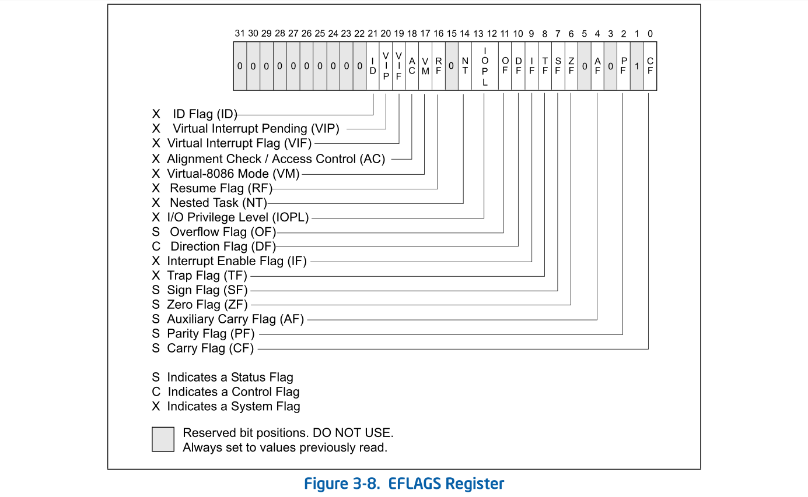

基础工具
========================================

file
----------------------------------------

ldd
----------------------------------------

ltrace
----------------------------------------

hexdump
----------------------------------------

strings
----------------------------------------

readelf
----------------------------------------

objdump
----------------------------------------

strace
----------------------------------------

nm
----------------------------------------

gcc
----------------------------------------
+ CANARY
	- 默认情况下，不开启Canary保护
	- gcc -fno-stack-protector -o test test.c  //禁用栈保护
	- gcc -fstack-protector -o test test.c   //启用堆栈保护，不过只为局部变量中含有 char 数组的函数插入保护代码
	- gcc -fstack-protector-all -o test test.c //启用堆栈保护，为所有函数插入保护代码
+ NX
	- 默认情况下，开启NX保护
	- gcc -z execstack -o test test.c		// 禁用NX保护
	- gcc -z noexecstack -o test test.c	// 开启NX保护
+ PIE（ASLR）
	- sudo -s echo 0 > /proc/sys/kernel/randomize_va_space
		+ 0 表示关闭进程地址空间随机化。
		+ 1 表示将mmap的基址，stack和vdso页面随机化。
		+ 2 表示在1的基础上增加栈（heap）的随机化。
	- 默认情况下，开启PIE保护
	- gcc -no-pie -o test test.c		// 禁用PIE保护
+ RELRO
	- 默认情况下，是Partial RELRO
	- gcc -z norelro -o test test.c			// 关闭，即No RELRO
	- gcc -z lazy -o test test.c				// 部分开启，即Partial RELRO
	- gcc -z now -o test test.c				// 全部开启，即
	
gdb
----------------------------------------

基础指令
~~~~~~~~~~~~~~~~~~~~~~~~~~~~~~~~~~~~~~~~
+ 编译程序时加上-g参数
+ 附加调试：gdb attach [PID]
+ 启动选项
	- -cd 设置工作目录；
	- -q 安静模式，不打印介绍信息和版本信息；
	- -d 添加文件查找路径；
	- -x 从指定文件中执行GDB指令；
	- -s 设置读取的符号表文件。
+ 设置参数
	- set args *
	- gdb --args dbfree AAAA BBBB
+ 过滤结果
	- info functions main：显示包含main关键字的函数

gdb反汇编
~~~~~~~~~~~~~~~~~~~~~~~~~~~~~~~~~~~~~~~~
+ disassemble 
	- ``set disassembly-flavor intel`` 转换为intel格式的汇编
	- ``set disassembly-flavor att`` 转换为AT&T格式的汇编
	- 基本格式：``disassemble[/m|/r|/s] START [, END]``
		+ /m 源码和汇编一起排列
		+ /r 还可以看到16进制代码
+ x/15i main
	- 查看x指令帮助

gdb调试指令
~~~~~~~~~~~~~~~~~~~~~~~~~~~~~~~~~~~~~~~~
- r/run：重新运行被调试的程序。
- q：Quit的简写，退出GDB调试环境。
- c：继续执行被调试程序
- finish：继续执行直到当前函数返回
- 断点指令
	+ b <行号>
	+ b <函数名称>
	+ b \*<函数名称>：在函数名称前面加*符号表示将断点设置在由编译器生成的prolog代码处
	+ b \*<代码地址> 
	+ delete [编号]：删除断点。断点编号从1开始递增。
	+ disable [编号]：禁用断点
	+ enable [编号]：启用断点
	+ clear 清空所有断点
- bt：打印调用堆栈
- s：执行一行源程序代码，如果此行代码中有函数调用，则进入该函数（Step Into (单步跟踪进入)）；
    + 在源文件server.cpp中PacketSenderThread函数加断点：` b server.cpp:PacketSenderThread`
    + 在源文件server.cpp中11行加断点：` b server.cpp:11`
- n：相当于其它调试器中的“Step Over (单步跟踪)”
- si：相当于s，针对汇编代码
- ni：相当于n，针对汇编代码

gdb查看变量
~~~~~~~~~~~~~~~~~~~~~~~~~~~~~~~~~~~~~~~~
- $：gdb中使用的变量要加上'$'符号，否则是被调试的程序中的变量。
- whatis：显示变量的值和类型
- ptype：显示变量的类型
- p：基本格式为 ``print /<f> <expr>``，显示指定变量（临时变量或全局变量）的值
	+ <expr>是表达式
		- @ 是一个和数组有关的操作符，如 ``p *array@len`` ,@的左边是数组的首地址的值，右边则是数据的长度。
		- :: 查看全局变量（指定文件或者函数范围）的值，如 ``p 'f2.c'::x`` 
	+ <f>是输出的格式
		- x 按十六进制格式显示变量。
		- d 按十进制格式显示变量。
		- u 按十六进制格式显示无符号整型。
		- o 按八进制格式显示变量。
		- t 按二进制格式显示变量。
		- a 按十六进制格式显示变量。
		- c 按字符格式显示变量。
		- f 按浮点数格式显示变量。
	+ 查看堆数据
		- ``p/x &main_arena``
		- ``p *((struct malloc_state *)0x7ffff7fafb80)``
	+ 查看数组@
		- p \*array\@len：\@的左边是数组的首地址的值，右边则是数据的长度，其保存在变量len中。
	+ &\/\*：取地址和取值
	+ 示例
		- p/x &main
		- p main

gdb内存指令
~~~~~~~~~~~~~~~~~~~~~~~~~~~~~~~~~~~~~~~~
- x：基本格式为 ``x/<n/f/u> <addr>`` ,显示指定内存数据
	+ n 是一个正整数，表示显示内存的长度，也就是说从当前地址向后显示几个地址的内容。
	+ f 表示显示的格式。
		- o(octal)
		- x(hex)
		- d(decimal)
		- u(unsigned decimal)
		- t(binary)
		- f(float)
		- a(address)
		- i(instruction),如x/15i @ main，显示汇编指令
		- c(char)
		- s(string)
		- z(hex, zero padded on the left)
	+ u 表示从当前地址往后请求的字节数，假如不指定的话，GDB默认是4个bytes。u参数可以用下面的字符来代替，b表示单字节，h表示双字节，w表示四字节，g表示八字节。
	+ n、f、u均是可选参数。
	+ 如：x/3uh 0x54320 表示，从内存地址0x54320读取内容，h表示以双字节为一个单位，3表示三个单位，u表示按十六进制显示。
- i：info的简写，用于显示各类信息，详情请查阅help i。
	+ info all-registers：查看所有寄存器内容
	+ info auxv：查看ELF文件加载信息集合
	+ info breakpoints：查看断点列表
	+ info catch：查看当前堆栈异常
	+ info classes：查看所有Objective-C类
	+ info selectors：All Objective-C selectors
	+ info files：查看区段映射地址
	+ info frame：显示当前栈帧信息
	+ info functions：显示所有 **函数名** 
	+ info locals：显示当前栈帧的局部变量
	+ info os
		::
		
			cpus       Listing of all cpus/cores on the system 
			files      Listing of all file descriptors 
			modules    Listing of all loaded kernel modules 
			msg        Listing of all message queues 
			processes  Listing of all processes 
			procgroups Listing of all process groups 
			semaphores Listing of all semaphores 
			shm        Listing of all shared-memory regions 
			sockets    Listing of all internet-domain sockets 
			threads    Listing of all threads 
	+ info registers：显示寄存器内容
	+ info sharedlibrary：显示加载的共享库
	+ info stack：显示函数堆栈
	+ info symbol [addr]：显示指定地址的符号信息
	+ info target ：类似info files
	+ info threads ：显示线程信息
	+ info variables：显示所有全局静态变量
	+ info watchpoints
	+ info win ：显示所有窗口
- 修改寄存器值
	+ set $rax = 1
	+ elfags图示
		|eflags|

中断显示设置
~~~~~~~~~~~~~~~~~~~~~~~~~~~~~~~~~~~~~~~~
+ display
	- 设置程序中断后欲显示的数据及其格式
	- 例如，如果希望每次程序中断后可以看到即将被执行的下一条汇编指令，可以使用命令 ``display /i $pc``
	- 其中 $pc 代表当前汇编指令，/i 表示以十六进行显示。
+ undispaly [编号]：取消先前的display设置，编号从1开始递增。

patchelf
----------------------------------------
+ 替换DT_NEEDED动态库
	- ``patchelf --replace-needed libc.so.6 ./libc_32.so.6 ./dubblesort``
+ 替换ld（ELF interpreter）加载器
	- ``patchelf --set-interpreter /lib/my-ld-linux.so.2 ./dubblesort``

