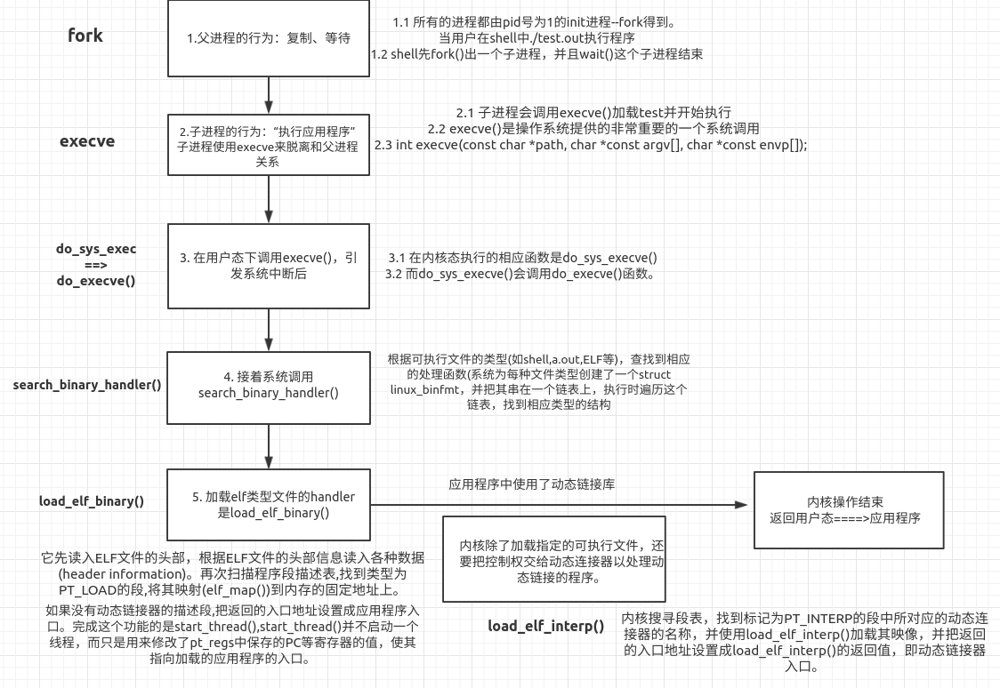

ELF加载原理
========================================

基础
----------------------------------------

两种映像格式
~~~~~~~~~~~~~~~~~~~~~~~~~~~~~~~~~~~~~~~~
+ 静态库加载
	静态库加载指的是程序链接到静态库生成的exe文件的加载，静态库的加载相对动态库要简单很多，因为全部工作已经由编译器的连接器ld给我们完成了，我们要做的只是把ELF文件map到相应运行地址空间，然后把PC指向entry即可。
+ 动态库加载
	动态库加载指的是程序链接到动态库生成的exe文件的加载，动态库的加载比静态库要复杂很多，程序在链接阶段，只是给我们初步进行了一个假链接，需要在程序加载的时候再去链接动态库。

elf加载
----------------------------------------

宏观过程
~~~~~~~~~~~~~~~~~~~~~~~~~~~~~~~~~~~~~~~~
+ 创建一个独立的虚拟地址空间（先共享父进程的页框，即COW机制）
+ 读取可执行文件头，并且建立虚拟空间与可执行文件的映射关系（在子进程需要加载新elf文件时）。
+ 将CPU的指令寄存器设置成可执行文件的入口地址，启动运行。

|elfload|

用户空间execve调用
~~~~~~~~~~~~~~~~~~~~~~~~~~~~~~~~~~~~~~~~
执行ELF文件在用户态的表现就是执行execve系统调用，随后陷入内核进行处理。
::

	sys_execve / sys_execveat
	└→ do_execve
		  └→ do_execveat_common
				└→ __do_execve_file
					└→ exec_binprm
						└→ search_binary_handler
							 └→ load_elf_binary
	
	注：
	在函数search_binary_handler()中，遍历系统注册的binary formats handler链表，
	直到找到匹配的格式。elf文件的处理函数就是load_elf_binary() 。
	
Linux可执行文件类型的注册机制
~~~~~~~~~~~~~~~~~~~~~~~~~~~~~~~~~~~~~~~~
+ linux支持其他不同格式的可执行程序, elf就是其中常见的一种可执行文件格式。在这种方式下, linux能运行其他操作系统所编译的程序, 如MS-DOS程序, BSD Unix的COFF可执行格式。
+ linux提供来了一种可执行文件类型的注册机制，核心数据结构是struct linux_binfmt：
	::
	
		struct linux_binfmt {
			struct list_head lh;
			struct module *module;
			int (*load_binary)(struct linux_binprm *);
			int (*load_shlib)(struct file *);
			int (*core_dump)(struct coredump_params *cprm);
			unsigned long min_coredump;	/* minimal dump size */
		} __randomize_layout;
+ 所有注册的的linux_binfmt对象都处于一个链表中（全局链表变量 formats），通过registre_fmt()注册一种linux_binfmt新类型。系统初始化时为每个编译进内核的可执行格式都执行registre_fmt()函数。
+ 当我们执行一个可执行程序的时候, 内核会list_for_each_entry遍历所有注册的linux_binfmt对象, 对其调用load_binrary方法来尝试加载, 直到加载成功为止（前面介绍的search_binary_handler() 函数）。

内核空间load_elf_binary
~~~~~~~~~~~~~~~~~~~~~~~~~~~~~~~~~~~~~~~~
+ 对ELF文件做一些基本检查，保证e_phentsize = sizeof(struct elf_phdr)并且e_phnum的个数在一定范围内；
+ 循环查看每一项program header，如果有PT_INTERP则使用open_exec加载进来，并替换原程序的bprm->buf;
+ 根据PT_GNU_STACK段中的flag设置栈是否可执行；
+ 使用flush_old_exec来更新当前可执行文件的所有引用；
+ 使用setup_new_exec设置新的可执行文件在内核中的状态；
+ setup_arg_pages在栈上设置程序调用参数的内存页；
+ 循环每一项PT_LOAD类型的段，elf_map映射到对应内存页中，初始化BSS；
+ 如果存在interpreter，将入口(elf_entry)设置为interpreter的函数入口，否则设置为原ELF的入口地址；
+ install_exec_creds(bprm)设置进程权限等信息；
+ create_elf_tables添加需要的信息到程序的栈中，比如ELF auxiliary vector；
+ 设置current->mm对应的字段；

注：从内核的处理流程上来看，如果是静态链接的程序，实际上内核返回用户空间执行的就是该程序的入口地址代码；如果是动态链接的程序，内核返回用户空间执行的则是interpreter的代码，并由其加载实际的ELF程序去执行。

用户空间
~~~~~~~~~~~~~~~~~~~~~~~~~~~~~~~~~~~~~~~~
+ 内核返回用户空间后，对于静态链接的程序是直接执行。
+ 对于动态链接的程序，执行interpreter的代码。
	- ELF的interpreter作为一个段，自然是编译链接的时候加进去的，因此和编译使用的工具链有关。对于Linux系统而言，使用的一般是GCC工具链。
	- interpreter又称为dynamic linker，以glibc2.27为例，它的大致功能如下:
		+ 将实际要执行的ELF程序中的内存段加载到当前进程空间中；
		+ 将动态库的内存段加载到当前进程空间中；
		+ 对ELF程序和动态库进行重定向操作(relocation)；
		+ 调用动态库的初始化函数(如.preinit_array, .init, .init_array)；
		+ 将控制流传递给目标ELF程序，让其看起来自己是直接启动的；
+ 关键数据
	- 程序头PT_DYNAMIC类型的Segment，与区段.dynamic指向文件同一位置。

动态库映射
~~~~~~~~~~~~~~~~~~~~~~~~~~~~~~~~~~~~~~~~
+ 主模块和共享库完成映射之后，需要建立主模块和共享库之间的连接（主模块需要引用动态库中的函数和数据），也就是重定位工作，是链接器的关键。
+ 共享库的代码段是被所有ELF共享的，数据段对于每个ELF来说是相互独立的，linux下通过cow（写时拷贝）技术实现这一机制，从根本上来说，是通过缺页异常来实现。
+ 两种重定位方式
	- 主模块重定位
		主要完成的工作是把引用的外部函数和变量的地址更新到got.plt表中去，这样才能完成函数跳转工作。 
		::
		
			示例：
			1.==============》由main函数调用，call plt部分代码。
				plt文件中偏移：
				0000000000001040 <strcpy@plt>:
				1040:       ff 25 d2 2f 00 00       jmp    *0x2fd2(%rip)        # 4018 <strcpy@GLIBC_2.2.5>
				1046:       68 00 00 00 00          push   $0x0
				104b:       e9 e0 ff ff ff          jmp    1030 <_init+0x30>
				运行程序（加载基址0x555555554000）：
				► 0x555555555282 <main+109>:   call   0x555555555040 <strcpy@plt>
				  0x555555555287 <main+114>:   mov    rax,QWORD PTR [rbp-0x10]
				pwndbg> si
				► 0x555555555040 <strcpy@plt>       jmp    qword ptr [rip + 0x2fd2]      <0x555555558018>
				  0x555555555046 <strcpy@plt+6>     push   0
				  0x55555555504b <strcpy@plt+11>    jmp    0x555555555030                <0x555555555030>
			2.==============》由plt跳转到got项指向的地址。
				0x555555558018即为got.plt数据如下：
				pwndbg> got
				GOT protection: Partial RELRO | GOT functions: 6 
				[0x555555558018] strcpy@GLIBC_2.2.5 -> 0x555555555046 (strcpy@plt+6) ◂— push   0 /* 'h' */
				[0x555555558020] puts@GLIBC_2.2.5 -> 0x555555555056 (puts@plt+6) ◂— push   1
				[0x555555558028] printf@GLIBC_2.2.5 -> 0x555555555066 (printf@plt+6) ◂— push   2
				[0x555555558030] malloc@GLIBC_2.2.5 -> 0x7ffff7e612f0 (malloc) ◂— mov    rax, qword ptr [rip + 0x143be1]
				[0x555555558038] fflush@GLIBC_2.2.5 -> 0x555555555086 (fflush@plt+6) ◂— push   4
				[0x555555558040] exit@GLIBC_2.2.5 -> 0x555555555096 (exit@plt+6) ◂— push   5
			3.==============》由got项值跳转到
				pwndbg> x/10i 0x555555555046
				0x555555555046 <strcpy@plt+6>:       push   0x0
				0x55555555504b <strcpy@plt+11>:      jmp    0x555555555030
			
				跳到下方地址继续执行：
				0x555555555030                                    push   qword ptr [rip + 0x2fd2]      <0x555555558008>
				0x555555555036                                    jmp    qword ptr [rip + 0x2fd4]      <_dl_runtime_resolve_xsavec>
				开始调用_dl_runtime_resolve_xsavec，执行完毕返回main函数下一行代码0x555555555287。
				这时，再次查看got.plt数据如下：
				pwndbg> got
				GOT protection: Partial RELRO | GOT functions: 6
				[0x555555558018] strcpy@GLIBC_2.2.5 -> 0x7ffff7f38250 (__strcpy_avx2) ◂— mov    rcx, rsi
				[0x555555558020] puts@GLIBC_2.2.5 -> 0x555555555056 (puts@plt+6) ◂— push   1
				[0x555555558028] printf@GLIBC_2.2.5 -> 0x555555555066 (printf@plt+6) ◂— push   2
				[0x555555558030] malloc@GLIBC_2.2.5 -> 0x7ffff7e612f0 (malloc) ◂— mov    rax, qword ptr [rip + 0x143be1]
				[0x555555558038] fflush@GLIBC_2.2.5 -> 0x555555555086 (fflush@plt+6) ◂— push   4
				[0x555555558040] exit@GLIBC_2.2.5 -> 0x555555555096 (exit@plt+6) ◂— push   5
				got.plt函数地址已经被填充为第三方库函数的真实地址。
			4.==============》strcpy非首次调用时，由于got.plt已经被真实地址填充，所以第3步时，直接跳到strcpy执行。
			  
	- 共享库重定位
		主要处理的是共享库内部的函数跳转和变量引用，共享库最后被编译成位置无关，各个源文件之间的函数跳转（非static函数）和变量引用（非static变量）都需要重定位后才能进行加载运行。
+ 判断是否需要链接器
	- 程序头中包含INTERP。
	- 一般包含了INTERP，同时也会有DYNAMIC段。

main函数启动过程
----------------------------------------

总览
~~~~~~~~~~~~~~~~~~~~~~~~~~~~~~~~~~~~~~~~
|mainload|

_start函数分析
~~~~~~~~~~~~~~~~~~~~~~~~~~~~~~~~~~~~~~~~
+ shell或者GUI会执行系统调用execve()
+ 控制权会传递给_start()

__libc_start_main
~~~~~~~~~~~~~~~~~~~~~~~~~~~~~~~~~~~~~~~~
+ 函数原型
	::
	
		int __libc_start_main(
				(int (*main) (int, char**, char**),
				int argc,
				char **argv,
				__typeof (main) init,
				void (*fini) (void),
				void (*rtld_fini) (void),
				void* stack_end
			)
			{
				...
				/* Register the destructor of the dynamic linker if there is any.  */
				if (__builtin_expect (rtld_fini != NULL, 1))
				__cxa_atexit ((void (*) (void *)) rtld_fini, NULL, NULL);

				/* Call the initializer of the libc.  This is only needed here if we
				 are compiling for the static library in which case we haven't
				 run the constructors in `_dl_start_user'.  */
				__libc_init_first (argc, argv, __environ);

				/* Register the destructor of the program, if any.  */
				if (fini)
				__cxa_atexit ((void (*) (void *)) fini, NULL, NULL);

				/* Call the initializer of the program, if any.  */
				if (init)
				(*init) (argc, argv, __environ MAIN_AUXVEC_PARAM);

				/* Nothing fancy, just call the function.  */
				result = main (argc, argv, __environ MAIN_AUXVEC_PARAM);

				exit (result);
			}
		注：
		init: main()的构造函数，即__libc_csu_init。
		fini: main()的析构函数，即__libc_csu_fini。
		rtld_fini: 动态链接器的析构函数

			
+ 主要功能
	- 处理关于setuid、setgid程序的安全问题
	- 启动线程
	- 通过atexit()注册fini与rtld_fini这两个参数
	- 调用其init参数
	- 调用main函数，并把argc和argv参数、环境变量传递给它
	- 调用exit函数，并将main函数的返回值传递给它
+ 其它知识点
	- main函数设置断点，发现此时ebp为0。原因可能为编译器生成的程序集代码中没有严格使用特定的调用约定。

__libc_csu_init
~~~~~~~~~~~~~~~~~~~~~~~~~~~~~~~~~~~~~~~~~
+ 主要功能
	- 对libc（动态链接库）进行初始化.
+ _init
	- gmon_start
		::
		
			如果它是空的，跳过它。否则，调用一个例程开始profiling，并且调用at_exit去调用另一个程序运行,
			并且在运行结束的时候生成gmon.out，是一个记录程序运行状态的文件，可以使用一个名为gprof的GNU 
			profiler工具来分析该文件从而获得程序各部分的运行时间，来反映其运行性能
	- frame_dummy
	- _do_global_ctors_aux
		+ 全局C++对象的构造函数
+ .init_array
	::
		
		void
		__libc_csu_init (int argc, char **argv, char **envp)
		{
		 
		  _init ();
		 
		  const size_t size = __init_array_end - __init_array_start;
		  for (size_t i = 0; i < size; i++)
			  (*__init_array_start [i]) (argc, argv, envp);
		}
		
		__init_array_start会执行.init_array段中所有的构造函数。

main
~~~~~~~~~~~~~~~~~~~~~~~~~~~~~~~~~~~~~~~~~

exit
~~~~~~~~~~~~~~~~~~~~~~~~~~~~~~~~~~~~~~~~~
+ rtdl_fini
	- rtdl_fini实际指向_dl_fini()函数, 源码再dl-fini.c文件中, 会被编译到ld.so.2中。
	- _dl_fini()的功能就是调用进程空间中所有模块的析构函数 （.fini_array段中）。
+ __libc_csu_fini
	::
	
		__libc_csu_fini (void)
		{
			#ifndef LIBC_NONSHARED
				size_t i = __fini_array_end - __fini_array_start;
				while (i-- > 0)
					(*__fini_array_start [i]) ();

				_fini();
			#endif
		}
		注:.fini_array中的函数是被倒着调用的。

.. |mainload| image:: ../images/mainload.png