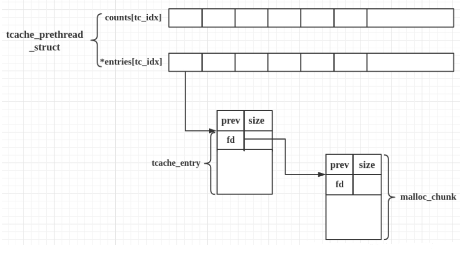

堆管理
========================================

基础
----------------------------------------
- 微观结构
	申请的内存chunk在ptmalloc内部用malloc_chunk结构体表示。
	根据空闲的chunk的大小以及使用状态将chunk初步分为4类：fast bins，small bins，large bins，unsorted bin。
	malloc申请内存时与内核交互主要通过brk和mmap函数来分配内存空间，首次申请的内存不大于128KB时，由brk申请，首次申请的内存大于等于128KB时，就由mmap与内核交互分配内存空间。
- 宏观结构
	arena,heap,chunk三种层级。Chunk为分配给用户的内存的一个单位。 heap是对chunk的一种组织方式，arena又是对heap的组织。

内存管理
----------------------------------------
- 基础
	+ glibc将空闲内存分为top chunk和bin chunk。
		- top chunk：指堆顶（内存的最高地址）的那一片连续内存。该内存主要用于分配大内存需求，当空闲的内存块都不满足分配需求时，可扩展top chunk。
		- bin是包括一类具有相同特点的内存chunk块集合。
	+ 在glibc中记录bin的数组有两个，fastbinY（记录所有的fastbins，共10个），bins（记录除fastbin之外的所有bins，共126个）
	+ 数组bin中包含有1个unsorted bin，62个small bins，63个large bins。
- TCACHE机制
	+ 特点
		- 与fastbin相似。
		- tcache全名thread local caching，它为每个线程创建一个缓存（cache），从而实现无锁的分配算法，有不错的性能提升。
		- 每个线程默认使用 64 个单链表结构的bins，每个bins最多存放7个chunk。chunk 的大小在64位机器上以16字节递增，从24到1032字节。32位机器上则是以8字节递增，从12到512字节。
		- libc-2.26 正式提供了该机制，并默认开启;Glibc2.31后结构进行了修改，引入了安全机制。
	+ glibc 2.26
		- 相关结构
			::
				
				typedef struct tcache_entry
				{
				  struct tcache_entry *next;
				} tcache_entry;
				tcache_entry 用于链接空闲的 chunk 结构体，其中的 next 指针指向下一个大小相同的 chunk。
				需要注意的是这里的 next 指向 chunk 的 user data，而 fastbin 的 fd 指向 chunk 开头的地址。
				
				typedef struct tcache_perthread_struct
				{
				  char counts[TCACHE_MAX_BINS];
				  tcache_entry *entries[TCACHE_MAX_BINS];
				} tcache_perthread_struct;
				
				# define TCACHE_MAX_BINS                64

				static __thread tcache_perthread_struct *tcache = NULL;
				
				◆tcache_perthread_struct是一块先于用户申请分配的堆空间，在堆起始处。
				◆若能泄露一个堆地址，就可以获得堆基址和tcache_perthread_struct的地址
				◆若能控制tcache_perthread_struct，可以把counts改为7，下一次free对应size的chunk就会进入unsorted bin
	
		- tcache_entry与malloc_chunk关系
			|tcache|
			
			+ tcache->entries 的每一项通过 单向链表链接 chunk 。
			+ tcache_entry 和 malloc chunk 是重叠的， tcache_entry->next 和 chunk->fd 是一个位置
		- 基本工作方式 
			+ 第一次 malloc 时，会先 malloc 一块内存用来存放 tcache_perthread_struct 。
			+ free 内存，且 size 小于 small bin size 时
			+ tcache 之前会放到 fastbin 或者 unsorted bin 中
			+ tcache 后：
				- 先放到对应的 tcache 中，直到 tcache 被填满（默认是 7 个）
				- tcache 被填满之后，再次 free 的内存和之前一样被放到 fastbin 或者 unsorted bin 中
				- tcache 中的 chunk 不会合并（不取消 inuse bit）
			+ malloc 内存，且 size 在 tcache 范围内
			+ 先从 tcache 取 chunk，直到 tcache 为空
			+ tcache 为空后，从 bin 中找
			+ tcache 为空时，如果 fastbin/smallbin/unsorted bin 中有 size 符合的 chunk，会先把 fastbin/smallbin/unsorted bin 中的 chunk 放到 tcache 中，直到填满。之后再从 tcache 中取；因此 chunk 在 bin 中和 tcache 中的顺序会反过来
	+ glibc 2.31
		- 相关结构
			::
			
				typedef struct tcache_entry
				{
				  struct tcache_entry *next;  //链表指针，对应chunk中的fd字段
				  /* This field exists to detect double frees.  */
				  struct tcache_perthread_struct *key;  //指向所属的tcache结构体，对应chunk中的bk字段
				} tcache_entry;
				
				在glibc2.31下，堆管理器在 取/放 chunk时不会检测 tcache 中的堆块地址的合法性，也没有任何的诸如 
				加密/解密 等一系列的防护手段，完全就是一个裸的单向链表结构，利用起来易如反掌，只需要一个诸如 
				UAF 之类的漏洞就可以直接进行任意地址写。
				
				注：对于每一个tcache中的chunk，增加了一个key指针，用于指向所属的tcache结构体。
	+ glibc 2.31
		- 新增保护机制
			::
			
				引入了两个新的宏对tcache中存/取chunk的操作进行了一层保护
				即在new chunk 链接tcache中old chunk时会进行一次异或运算，代码如下：

				#define PROTECT_PTR(pos, ptr) \
				  ((__typeof (ptr)) ((((size_t) pos) >> 12) ^ ((size_t) ptr)))
				#define REVEAL_PTR(ptr)  PROTECT_PTR (&ptr, ptr)
				
				/* Caller must ensure that we know tc_idx is valid and there's room
				   for more chunks.  */
				static __always_inline void
				tcache_put (mchunkptr chunk, size_t tc_idx)
				{
				  tcache_entry *e = (tcache_entry *) chunk2mem (chunk);

				  /* Mark this chunk as "in the tcache" so the test in _int_free will
					 detect a double free.  */
				  e->key = tcache;

				  e->next = PROTECT_PTR (&e->next, tcache->entries[tc_idx]);
				  tcache->entries[tc_idx] = e;
				  ++(tcache->counts[tc_idx]);
				}

				/* Caller must ensure that we know tc_idx is valid and there's
				   available chunks to remove.  */
				static __always_inline void *
				tcache_get (size_t tc_idx)
				{
				  tcache_entry *e = tcache->entries[tc_idx];
				  if (__glibc_unlikely (!aligned_OK (e)))
					malloc_printerr ("malloc(): unaligned tcache chunk detected");
				  tcache->entries[tc_idx] = REVEAL_PTR (e->next);
				  --(tcache->counts[tc_idx]);
				  e->key = NULL;
				  return (void *) e;
				}
				
				即tcache_entry->next中存放的chunk地址为与自身地址进行异或运算后所得到的值， 
				这就要求我们在利用tcache_entry进行任意地址写之前 需要我们提前泄漏出相应 chunk 的地址，
				即我们需要提前获得堆基址后才能进行任意地址写。
			
- bin特点
	|bins|
	
	+ fastbin
		- 同一个单向链表(仅使用fd指针)指向的内存chunk大小均相等，相邻的bin的内存块chunk大小相差8字节。
		- fast bin可存放16、24、32、40、48、56、64、72、80字节大小内存块（包括malloc_chunk的头结构），共10个。
		- fast bin无论是添加还是移除都是对链表尾进行操作，使用后入先出算法，所以fastbinY数组中每个fastbin元素都存放了该链表的尾结点，尾结点通过fd指针指向前一个结点。
		- 释放后的内存块chunk的各类标志位，如PRE_INUSE（即P位）等均不会改变，相邻的chunk也不会合并。
	+ small bin
		- 存储512字节以内的chunk。bin共62个，每一个bin的大小间距是8个字节。
		- 如果有两个相邻chunk都为空闲则需要合并。
		- 同一个small bin下的内存块大小相等。
	+ large bin
		- 每一个双向链表指向的内存chunk大小均不相等，从链表头部向尾部依次递减。
		- 相邻的large bin的内存块chunk大小相差不相等，且bins数组下标越大（即bins内存越大），相邻large bin的内存块chunk相差越来越大。
		- large bins保存大于等于512字节大小内存块（包括malloc_chunk的头结构）。
	+ unsorted bin
		当内存块chunk被释放后且大小不在fast bins范围内，则该内存块将被保存在unsorted bin中。unsorted bin中的内存块没有大小限制，且是无序的。unsorted bin采用的是一个单链表连接所有的内存，对应malloc_state中的bins中的bins[1]。
- bin分配方式
	分配顺序：
	|alloc_order|
	|heap_alloc| 

	+ 首先将用户申请的内存长度转化为需要分配的内存块chunk长度chunk_size，这里面需要将用户请求长度加上malloc_chunk的前两个成员uchunk_prev_size和mchunk_size所占用空间（32位系统下占用8字节）。此外，还需要考虑内存对齐问题。对于32位系统，8字节对齐；64位系统，16字节对齐。这里面还涉及最小分配长度问题。32位系统最小分配长度为16字节；64位系统最小分配长度为32字节。当我们在32位系统下调用malloc(0)，glibc也会分配16字节内存。
	+ 判断需要分配的内存块长度chunk_size是否小于等于fast bins管理内存的最大长度（初始时fast bins管理内存最大长度为64字节，后面为80字节）。当在范围内，则在fast bins里面查找满足需求的内存。若找到，则返回用户内存，结束；否则转到步骤3。
	+ 判断chunk_size是否在small bins范围内（<512字节）。若在范围内，则查找small bins。若找到满足需求内存，则返回用户内存，结束；否则跳转到步骤4.
	+ 遍历fast bins，合并相邻内存（保证虚拟地址连续）。将合并后的内存块chunk从fast bins中剥离并加入到unsorted bins。
	+ 遍历查找unsorted bins。若当前内存块不满足用户需求，则将该内存块根据其大小放到small bins或者large bins；若找到，则返回用户内存，结束。重复步骤5，直至找到满足需求内存或者遍历完也未找到，则跳转到步骤6。
	+ 遍历large bins。根据“small first，best fit”原则，找到最符合需求的内存块。当找到该内存块，若该内存块可以分割（剩余内存块不小于最小内存块大小），则分割该内存块，将一部分返回给用户，剩余部分放到unsorted bins中；若不能分割，则直接将该内存块返回给用户。若遍历完large bins也没有找到，则跳转到步骤7。
	+ 经过上述步骤后还没有找到满足需求的内存块，则表明fast bins、small bins、large bins均没有符合要求内存块，此时只能查看top chunk了。若top chunk当前大小能满足要求，则分割top chunk，将低地址返回给用户，高地址作为新的top chunk；否则，跳转到步骤8。
	+ 判断chunk_size是否已超过mmap分配阈值（128k）。若大于mmap分配阈值，则直接调用mmap分配需求内存空间。否则只能扩展堆区从而增大top chunk了，跳转到步骤9。
	+ 扩展堆区对于main area和thread area不同。若为main area，则通过调用sbrk系统调用向内核申请扩展堆顶以扩大堆空间；若为thread area，则通过mmap系统调用申请新的内存映射区，并将新的内存映射区添加到当前的分配区，同时，调整top chunk指向新分配的内存映射区，同时将老的top chunk改为普通的free chunk从而扩展堆空间 。通过上面操作，top chunk肯定能满足用户分配需求了，则跳转到步骤7，再次通过top chunk分配满足用户需求的内存块。
- bin释放方式
	|heap_free|
	
	+ 根据用户释放的内存地址获取对应的内存块chunk大小。
	+ 释放的内存块大小是否在fast bins范围内。若在，则将释放的内存放到fast bins中，结束；否则，跳转到步骤3。
	+ 判断释放的内存是否通过mmap申请的。若是，则直接通过unmmap释放该内存，结束；否则，跳转到步骤4。
	+ 判断释放内存块的前一个内存块是否为空闲内存（连续地址的低地址侧）。若是，则合并该空闲内存。
	+ 判断释放内存块的后一个内存块是否为空闲内存（连续地址的高地址侧）。若不是，则直接将内存块放到unsorted bin，结束；否则进一步看该内存块是否为top chunk。若为top chunk，则将待释放内存块合并到top chunk，并跳转到步骤6；否则，合并后一个空闲内存块，并将合并后的内存块放到unsorted bin中，结束。
	+ 判断当前分配区area是否为main area。若是，则跳转到步骤7；否则，跳转到步骤8。
	+ 判断当前的top chunk的大小是否超过了内存回收阈值（128k）。若是，则通过brk系统调用释放top chunk一部分内存给内核；否则，结束。
	+ 判断当前的top chunk所在的堆区内存（即heap_info数据结构管理对应的内存）是否已经全部释放了。若是，则调用unmmap释放该整个堆区（heap_info），将该部分内存返回给内核；否则，结束。
	+ 通过上述分析可知，我们通常调用free接口释放的内存最终有以下几个去处：
		- 1. fast bins
		- 2. unsorted bin
		- 3. top chunk
		- 4. 通过unmmap释放，将内存返回给内核。
			
	::
	
		注意，在释放内存时，若该内存最终是放到了fast bins中，为了提高下次分配效率，相邻空闲内存块不会合并，
		且该内存块和相邻的后一个内存块的头部结构malloc_chunk中的P（PREV_INUSE）、M（IS_MMAPPED）、N（NON_MAIN_AREA）
		均不会改变，维持原状。但若放在其他处，如unsorted bin、top chunk中，该内存块和相邻的后一个内存块对应的malloc_chunk
		中的P、M、N标志位均会做相应调整，特别是相邻的后一个内存块的P（PREV_INUSE）标志位会置为0，表示刚刚释放的内存块现处
		于空闲状态。

相关结构
----------------------------------------
- heap_info
	::

		typedef struct _heap_info
		{
		  mstate ar_ptr; /* 堆对应的 arena 的地址 */
		  struct _heap_info *prev; /* 由于一个线程申请一个堆之后，可能会使用完，之后就必须得再次申请。因此，一个可能会有多个堆。
						prev即记录了上一个 heap_info 的地址。这里可以看到每个堆的 heap_info 是通过单向链表进行链接的 */
		  size_t size;   /* size 表示当前堆的大小 */
		  size_t mprotect_size; /* 最后一部分确保对齐  */
		  /* Make sure the following data is properly aligned, particularly
			 that sizeof (heap_info) + 2 * SIZE_SZ is a multiple of
			 MALLOC_ALIGNMENT. */
		  char pad[-6 * SIZE_SZ & MALLOC_ALIGN_MASK];
		} heap_info;
		
- malloc_state
	该结构用于管理堆，记录每个arena当前申请的内存的具体状态，比如说是否有空闲chunk，有什么大小的空闲chunk等等。无论是thread arena还是main arena，它们都只有一个malloc state结构。由于thread的arena可能有多个，malloc state结构会在最新申请的arena中。注意，main arena的malloc_state并不是 heap segment的一部分，而是一个全局变量，存储在libc.so的数据段。
	
	::
	
		struct malloc_state {
			/* 该变量用于控制程序串行访问同一个分配区，当一个线程获取了分配区之后，其它线程要想访问该分配区，就必须等待该线程分配完成候才能够使用。  */
			__libc_lock_define(, mutex);

			/* flags记录了分配区的一些标志，比如 bit0 记录了分配区是否有 fast bin chunk ，bit1 标识分配区是否能返回连续的虚拟地址空间。  */
			int flags;

			/* 存放每个 fast chunk 链表头部的指针 */
			mfastbinptr fastbinsY[ NFASTBINS ];

			/* 指向分配区的 top chunk */
			mchunkptr top;

			/* 最新的 chunk 分割之后剩下的那部分 */
			mchunkptr last_remainder;

			/* 用于存储 unstored bin，small bins 和 large bins 的 chunk 链表。 */
			mchunkptr bins[ NBINS * 2 - 2 ];

			/* ptmalloc 用一个 bit 来标识某一个 bin 中是否包含空闲 chun..*/
			unsigned int binmap[ BINMAPSIZE ];

			/* Linked list, points to the next arena */
			struct malloc_state *next;

			/* Linked list for free arenas.  Access to this field is serialized
			   by free_list_lock in arena.c.  */
			struct malloc_state *next_free;

			/* Number of threads attached to this arena.  0 if the arena is on
			   the free list.  Access to this field is serialized by
			   free_list_lock in arena.c.  */
			INTERNAL_SIZE_T attached_threads;

			/* Memory allocated from the system in this arena.  */
			INTERNAL_SIZE_T system_mem;
			INTERNAL_SIZE_T max_system_mem;
		};
- malloc_chunk
	::
	
		struct malloc_chunk {

		  INTERNAL_SIZE_T      prev_size;  /* Size of previous chunk (if free).  */
		  INTERNAL_SIZE_T      size;       /* Size in bytes, including overhead. */

		  struct malloc_chunk* fd;         /* double links -- used only if free. */
		  struct malloc_chunk* bk;

		  /* Only used for large blocks: pointer to next larger size.  */
		  struct malloc_chunk* fd_nextsize; /* double links -- used only if free. */
		  struct malloc_chunk* bk_nextsize;
		};
		
- 使用堆内存布局（malloc后内存）
	一个使用中的 chunk（就是还没有 free 掉）在内存中的样子如下（从上到下，地址越来越大）：
	
	|linuxheap1|
	
	◆size of previous chunk
		这是前面一个 chunk 的大小，这里的前面一个指的是低地址的那一个
	◆size of chunk
		这个 chunk 的大小。而且这个 chunk 的大小一定是 8 的倍数。所以低三位是 0，由于低三位是 0，是固定值，可以将这些固定值，用来表示其他的含义，反正计算大小的时候，统一把他们当成 0 就好了。下面从高到低介绍这些标志的意思
	◆A
		是不是「主分配区」分配的内存 1 表示不是主分配区分配的，0 表示是主分配区分配的
	◆M
		是不是 Memory Mapped 分配的内存，1 表示是，0 表示是 heap
	◆P
		表示前一个 chunk 是否在使用，在初始化的时候通常为 1，防止使用不能访问的内存
	◆user data
		从这里开始才是 User Data,一共有两个位置记录了一个 chunk 的大小
		
- 空闲堆内存布局（free后内存）
	|linuxheap2|
	
	当一个 chunk 被用户 free 了以后，不是立即还给操作系统，而是被 ptmalloc 留了下来，等待用户下一次申请内存
	此时只有 AP 状态。
	原本是用来存用户数据的存储了四个指针，指针 fd 指向了后一个空闲的 chunk，而 bk 指向前一个空闲的chunk。
	ptmalloc 通过这种方法，将多个大小相近的 chunk 连成一个双向链表。又形成了一个新的数据结构 bin。
	
- 堆的空间复用
	当一个 chunk 在使用的时候，它的下一个 chunk 的 previous_size 记录了这个 chunk 的大小，由于这个记录没有什么用。所以当前 chunk 可以使用下一个 chunk 的 previous_size 空间，由于是连续的所以用起来也十分方便。

- Top Chunk
	当一个chunk处于一个arena的最顶部(即最高内存地址处)的时候，就称之为top chunk。该chunk并不属于任何bin，而是在系统当前的所有free chunk(无论那种bin)都无法满足用户请求的内存大小的时候，将此chunk当做一个应急消防员，分配给用户使用。

tcache分配示例代码
----------------------------------------

示例代码
~~~~~~~~~~~~~~~~~~~~~~~~~~~~~~~~~~~~~~~~
::

	#include <stdio.h>
	#include <stdlib.h>
	#include <string.h>

	int main()
	{
		char *a=malloc(10);
		char *b=malloc(20);
		free(a);
		char *c=malloc(30);
		char *d=malloc(10);
		free(b);
		free(c);
		free(d);

		return 0;
	}
	
调试过程
~~~~~~~~~~~~~~~~~~~~~~~~~~~~~~~~~~~~~~~~
::

		pwndbg> l
		1       #include <stdio.h>
		2       #include <stdlib.h>
		3       #include <string.h>
		4
		5       int main()
		6       {
		7           char *a=malloc(10);
		8           char *b=malloc(20);
		9           free(a);
		10          char *c=malloc(30);
		pwndbg> b 9
		Breakpoint 1 at 0x11cd: file tcache.c, line 9.
		pwndbg> r
		运行如下
		int main()
		6 {
		7     char *a=malloc(10);
		8     char *b=malloc(20);
	 ►  9     free(a);
	   10     char *c=malloc(30);
	   11     char *d=malloc(10);
	   12     free(b);
	   13     free(c);
	   14     free(d);
	────────────────────────────────────────────────────────────────────[ STACK ]─────────────────────────────────────────────────────────────────────
	00:0000│ rsp 0x7fffffffdfd0 ◂— 0x0
	01:0008│     0x7fffffffdfd8 —▸ 0x555555555070 (_start) ◂— xor    ebp, ebp
	02:0010│     0x7fffffffdfe0 —▸ 0x5555555592c0 ◂— 0x0
	03:0018│     0x7fffffffdfe8 —▸ 0x5555555592a0 ◂— 0x0
	04:0020│ rbp 0x7fffffffdff0 ◂— 0x0
	05:0028│     0x7fffffffdff8 —▸ 0x7ffff7dfe7fd (__libc_start_main+205) ◂— mov    edi, eax
	06:0030│     0x7fffffffe000 —▸ 0x7fffffffe0e8 —▸ 0x7fffffffe3b0 ◂— 0x616b2f656d6f682f ('/home/ka')
	07:0038│     0x7fffffffe008 ◂— 0x1f7fca000
	──────────────────────────────────────────────────────────────────[ BACKTRACE ]───────────────────────────────────────────────────────────────────
	 ► f 0   0x5555555551cd main+36
	   f 1   0x7ffff7dfe7fd __libc_start_main+205
	   
	查看堆地址：
	pwndbg> vmmap
	0x555555559000     0x55555557a000 rw-p    21000 0      [heap]
	注：堆起始地址为tcache_perthread_struct数据。
	
	查看tcache_perthread_struct数据：
	p *((struct tcache_perthread_struct *)0x555555559010)
	注：需要跳过0x10的chunk头部。
	
	查看bin：
	pwndbg> bin
	tcachebins
	empty
	fastbins
	0x20: 0x0
	0x30: 0x0
	0x40: 0x0
	0x50: 0x0
	0x60: 0x0
	0x70: 0x0
	0x80: 0x0
	unsortedbin
	all: 0x0
	smallbins
	empty
	largebins
	empty
	注：没有空闲free内存，bin均为空。
	
	查看chunk：
	pwndbg> heap
	Allocated chunk | PREV_INUSE
	Addr: 0x555555559000
	Size: 0x291

	Allocated chunk | PREV_INUSE
	Addr: 0x555555559290
	Size: 0x21

	Allocated chunk | PREV_INUSE
	Addr: 0x5555555592b0
	Size: 0x21

	Top chunk | PREV_INUSE
	Addr: 0x5555555592d0
	Size: 0x20d31
	
	运行到10行，查看chunk：
	pwndbg> heap
	Allocated chunk | PREV_INUSE
	Addr: 0x555555559000
	Size: 0x291

	Free chunk (tcache) | PREV_INUSE
	Addr: 0x555555559290
	Size: 0x21
	fd: 0x555555559

	Allocated chunk | PREV_INUSE
	Addr: 0x5555555592b0
	Size: 0x21

	Top chunk | PREV_INUSE
	Addr: 0x5555555592d0
	Size: 0x20d31
	
	查看tcachebin：
	pwndbg> tcachebin
	tcachebins
	0x20 [  1]: 0x5555555592a0 ◂— 0x0
	
	查看tcache_perthread_struct：
	pwndbg> p *((struct tcache_perthread_struct *)0x555555559010)
	$2 = {
	  counts = {1, 0 <repeats 63 times>},
	  entries = {0x5555555592a0, 0x0 <repeats 63 times>}
	}
	注：0x5555555592a0指向free的空闲chunk（即0x555555559290）的next。
	pwndbg> p *((struct malloc_chunk *)0x555555559290)
	$3 = {
	  mchunk_prev_size = 0,
	  mchunk_size = 33,
	  fd = 0x555555559,
	  bk = 0x555555559010,
	  fd_nextsize = 0x0,
	  bk_nextsize = 0x21
	}
	pwndbg> x/30x 0x555555559290
	0x555555559290: 0x00000000      0x00000000      0x00000021      0x00000000
	0x5555555592a0: 0x55555559      0x00000005      0x55559010      0x00005555
	注：第一个节点为0x5555555592a0，next值为堆地址右移12位（0x0000000555555559）。
	
	继续运行到下一个free（13行）：
	pwndbg> heap
	Allocated chunk | PREV_INUSE
	Addr: 0x555555559000
	Size: 0x291

	Allocated chunk | PREV_INUSE
	Addr: 0x555555559290
	Size: 0x21

	Free chunk (tcache) | PREV_INUSE
	Addr: 0x5555555592b0
	Size: 0x21
	fd: 0x555555559

	Allocated chunk | PREV_INUSE
	Addr: 0x5555555592d0
	Size: 0x31

	Top chunk | PREV_INUSE
	Addr: 0x555555559300
	Size: 0x20d01
	注：此时a=0x5555555592a0,b=0x5555555592c0,c=0x5555555592e0,d=0x5555555592a0
	其中a释放后，被新申请的d占用，c为top chunk中新申请内存。
	
	查看tcachebin，此时应该只存在一块空闲内存即b=0x5555555592c0。
	pwndbg> tcachebin
	tcachebins
	0x20 [  1]: 0x5555555592c0 ◂— 0x0
	
	执行到16行，查看tcachebin：
	pwndbg> tcachebin
	tcachebins
	0x20 [  2]: 0x5555555592a0 —▸ 0x5555555592c0 ◂— 0x0
	0x30 [  1]: 0x5555555592e0 ◂— 0x0
	注：此时共存在3块空闲内存,呈单链表结构。
	
	查看tcache_perthread_struct结构：
	pwndbg> p *((struct tcache_perthread_struct *)0x555555559010)
	$14 = {
	  counts = {2, 1, 0 <repeats 62 times>},
	  entries = {0x5555555592a0, 0x5555555592e0, 0x0 <repeats 62 times>}
	}
	
	运行vis_heap_chunks：
	pwndbg> vis_heap_chunks

	0x555555559000  0x0000000000000000      0x0000000000000291      ................
	0x555555559010  0x0000000000010002      0x0000000000000000      ................
	0x555555559020  0x0000000000000000      0x0000000000000000      ................
	0x555555559030  0x0000000000000000      0x0000000000000000      ................
	0x555555559040  0x0000000000000000      0x0000000000000000      ................
	0x555555559050  0x0000000000000000      0x0000000000000000      ................
	0x555555559060  0x0000000000000000      0x0000000000000000      ................
	0x555555559070  0x0000000000000000      0x0000000000000000      ................
	0x555555559080  0x0000000000000000      0x0000000000000000      ................
	0x555555559090  0x00005555555592a0      0x00005555555592e0      ..UUUU....UUUU..
	0x5555555590a0  0x0000000000000000      0x0000000000000000      ................
	0x5555555590b0  0x0000000000000000      0x0000000000000000      ................
	..........................................................
	0x555555559270  0x0000000000000000      0x0000000000000000      ................
	0x555555559280  0x0000000000000000      0x0000000000000000      ................
	0x555555559290  0x0000000000000000      0x0000000000000021      ........!.......
	0x5555555592a0  0x000055500000c799      0x0000555555559010      ....PU....UUUU..         <-- tcachebins[0x20][0/2]
	0x5555555592b0  0x0000000000000000      0x0000000000000021      ........!.......
	0x5555555592c0  0x0000000555555559      0x0000555555559010      YUUU......UUUU..         <-- tcachebins[0x20][1/2]
	0x5555555592d0  0x0000000000000000      0x0000000000000031      ........1.......
	0x5555555592e0  0x0000000555555559      0x0000555555559010      YUUU......UUUU..         <-- tcachebins[0x30][0/1]
	0x5555555592f0  0x0000000000000000      0x0000000000000000      ................
	0x555555559300  0x0000000000000000      0x0000000000020d01      ................         <-- Top chunk
	
	0x0000000555555559计算过程：
	当前写入内存地址0x5555555592c0与上一个空闲内存写入值0x000055500000c799进行异或：
	pwndbg> p/x 0x5555555592c0^0x000055500000c799
	$25 = 0x555555559

fastbin分配示例代码
----------------------------------------
与tcachebin相似。

	
.. |linuxheap1| image:: ../images/linuxheap1.webp
.. |linuxheap2| image:: ../images/linuxheap2.webp

