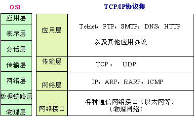
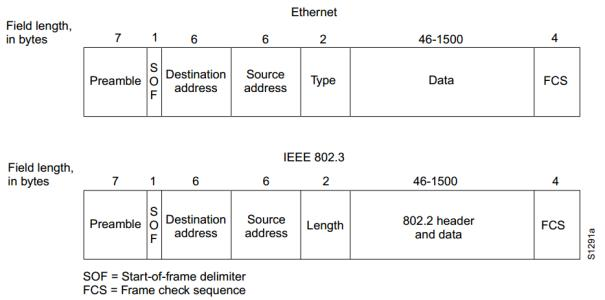

网络基础
========================================

计算机通信网的组成
----------------------------------------
计算机网络由 **通信子网** 和 **资源子网** 组成。其中通信子网负责数据的无差错和有序传递，其处理功能包括差错控制、流量控制、路由选择、网络互连等。

其中资源子网是计算机通信的本地系统环境，包括主机、终端和应用程序等， 资源子网的主要功能是用户资源配置、数据的处理和管理、软件和硬件共享以及负载 均衡等。

总的来说，计算机通信网就是一个由通信子网承载的、传输和共享资源子网的各类信息的系统。

通信协议
----------------------------------------
为了完成计算机之间有序的信息交换，提出了通信协议的概念，其定义是相互通信的双方（或多方）对如何进行 **信息交换** 所必须遵守的一整套规则。

协议涉及到三个要素，分别为：

- 语法：语法是用户数据与控制信息的结构与格式，以及数据出现顺序的意义
- 语义：用于解释比特流的每一部分的意义
- 时序：事件实现顺序的详细说明

OSI七层模型
----------------------------------------

简介
~~~~~~~~~~~~~~~~~~~~~~~~~~~~~~~~~~~~~~~~
OSI（Open System Interconnection）共分为物理层、数据链路层、网络层、传输层、会话层、表示层、应用层七层，其具体的功能如下。

+----------+-----------------------+-----------+---------------------+
|名称      |功能                   |数据形式   |主要网络协议         |
+==========+=======================+===========+=====================+
|物理层    |- 接口和媒体的物理特性 |比特流(0   | | EIA/TIA-232(RS-23 |
|          |- 比特的标识，同步     |与1的序列  | | 2C),V.35,V.24     |
|          |- 传输速率             |)          | | IEEE 802.3,FDDI   |
|          |- 线路配置             |           | | NRZ等             |
|          |- 线路拓扑             |           |                     |
|          |- 传输方式             |           |                     |
+----------+-----------------------+-----------+---------------------+
|数据链路层|- 链路管理             |帧         | | IEEE 802.2        |
|          |- 组帧                 |           | | 帧中继,ATM,PPPOE  |
|          |- 物理编址             |           | | HDLC，SDLC,IPX/SPX|
|          |- 流量控制             |           | | NetBIOS,NetBEUI   |
|          |- 差错控制             |           | | ARP/RARP,VLAN     |
|          |- 透明传输             |           | | L2F,L2TP,PPTP     |
+----------+-----------------------+-----------+---------------------+
|网络层    |- 分组路由或交换       |分组       |IP,IPX,X.25,ATM等    |
|          |- 逻辑编址             |           |  路由协议           |
|          |                       |           |  MPLS，ICMP         |
|          |                       |           |  IPSec              |
+----------+-----------------------+-----------+---------------------+
|传输层    |- 服务点编址           |报文，消息 |TCP/UDP等            |
|          |- 报文分段与重装       |           |                     |
|          |- 连接控制             |           |                     |
|          |- 流量控制             |           |                     |
|          |- 差错控制             |           |                     |
+----------+-----------------------+-----------+---------------------+
|会话层    |- 建立逻辑链路         |应用数据   |SSL等                |
|          |- 会话开始和结束       |           |                     |
+----------+-----------------------+-----------+---------------------+
|表示层    |- 数据编码，变换       |应用数据   | | ASCII编码         |
|          |- 数据解压缩           |           | | EBCDIC编码等      |
|          |- 数据加解密           |           |                     |
+----------+-----------------------+-----------+---------------------+
|应用层    |- 网络虚拟终端         |应用数据   | | HTTP,FTP,SMTP     |
|          |- 文件服务（FTP）      |           | | SNMP等            |
|          |- 邮件服务（SMTP）     |           |                     |
+----------+-----------------------+-----------+---------------------+

总结
~~~~~~~~~~~~~~~~~~~~~~~~~~~~~~~~~~~~~~~~
 | 低三层属于 **网络支撑层** ，任务是在物理上把数据从一个设备传送到另一个设备。
 | 高三层属于 **用户支撑层** ，任务是使一些本来没有关系的软件系统之间建立互操作性。
 | **传输层** 是高三层和低三层之间的 **接口** ，它是第一个端到端的层次，保证透明的端到端连接，满足用户的服务质量（QoS）要求，并向高三层提供合适的信息形式。

TCP/IP协议簇
----------------------------------------

简介
~~~~~~~~~~~~~~~~~~~~~~~~~~~~~~~~~~~~~~~~
TCP/IP协议簇的开发比OSI更早，共分为网络接口层、网际互联层、传输层、应用层四个层次。

TCP/IP协议与OSI对比
~~~~~~~~~~~~~~~~~~~~~~~~~~~~~~~~~~~~~~~~
	|ositcpip|

区别
~~~~~~~~~~~~~~~~~~~~~~~~~~~~~~~~~~~~~~~~
- OSI先有模型，后出现的协议。TCP/IP首先出现的协议，而后形成了模型。
- OSI网络层支持无连接和面向连接的通信，传输层仅支持面向连接通信。
- TCP/IP在网络层仅支持无连接通信，传输层支持无连接和面向连接通信。

LAN与以太网
----------------------------------------

DIX标准
~~~~~~~~~~~~~~~~~~~~~~~~~~~~~~~~~~~~~~~~
1980年9月，DEC公司，Intel公司和施乐公司联合发表了10Mb/s以太网规约的第一个版本DIX V1，1982年又修改为第二个版本（实际上也就是最后的版本），即DIX V2，成为世界上第一个局域网规约。

IEEE 802.3
~~~~~~~~~~~~~~~~~~~~~~~~~~~~~~~~~~~~~~~~
1980年2月，IEEE委员会制定了LAN技术的国际标准，1983年又以DIX以太网第2版为原型，制定了IEEE 802.3（10BASE5）标准。IEEE 802.3中的帧格式取消了DIX以太网标准中的以太网类型字段，取而代之的是使用标识数据长度的字段。

	|802.3|

以太网标准
~~~~~~~~~~~~~~~~~~~~~~~~~~~~~~~~~~~~~~~~
以太网原本仅指使用CSMA/CD（带有冲突检测的载波侦听多路访问）传输媒介的控制方式，实际通信速率为10Mbps的标准，即标准以太网。随着时间的推移，以太网一般用来表示使用以太网帧格式进行通信的网络。

