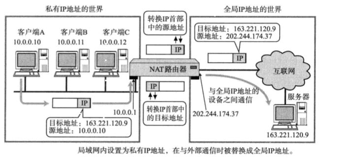
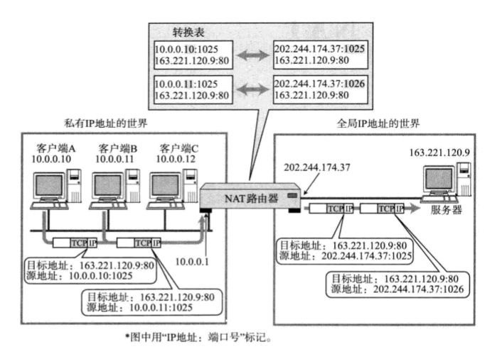

网络地址转换
========================================

NAT
---------------------------------------------
NAT(Network Address Translator)是用于在本地网络中使用私有地址，在连接互联网时转而使用全局IP地址的技术。

|nat|

NAPT
---------------------------------------------
NAPT(Network Address Ports Translator),实现了一个全局IP地址与多个局域网主机的通信。

|napt|

缺点
---------------------------------------------
- 无法从NAT的外部向内部服务器建立连接。
- 转换表的生成和转换时都会给设备造成负担。
- 当NAT异常时所有的TCP连接都会重置。

