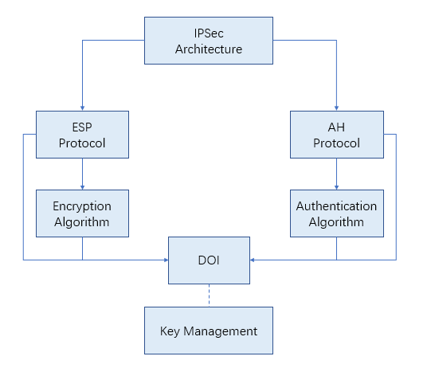
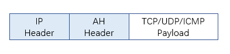
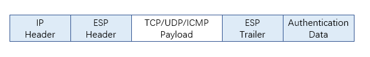
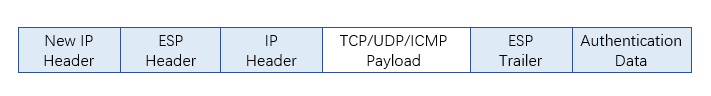
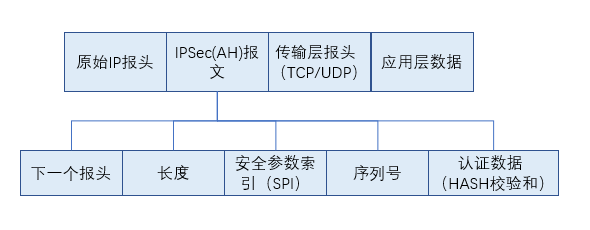
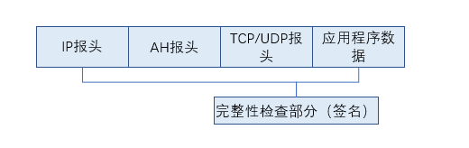
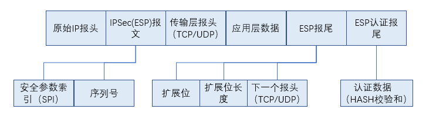
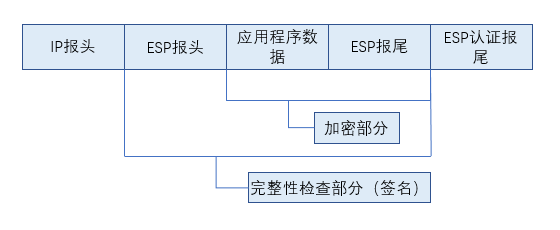

网络层原理及协议
========================================

简介
----------------------------------------
网络层被设计为一个分组交换网，报文在源点被分割成便于管理的分组，通常称为数据报，然后逐个将这些数据报从源点传送到终点，终点接收到的数据报经过组装后重新生成原始的报文。因特网的网络层在最初设计时只提供无连接的服务，不过最近的趋势是向面向连接的服务转变。

分组交换
----------------------------------------

无连接服务
~~~~~~~~~~~~~~~~~~~~~~~~~~~~~~~~~~~~~~~~
- 同一报文分组之间没有关联
- 同一报文的不同分组可能沿着不同路径到达终点

::

	转发方式：基于目的地址。
	依据：主机或路由器中的路由表。

面向连接的服务
~~~~~~~~~~~~~~~~~~~~~~~~~~~~~~~~~~~~~~~~
- 先建立虚连接指定分组经过的路径
- 同一报文分组之间具有关联
- 分组包含虚电路标识符，是分组转发的依据
- 建链，数据传送，拆链

::

	转发方式：基于标记。
	依据：附加在分组上的标记。如多协议标记交换（Multi-Protocol Label Switching,MPLS）。

网络层的服务
----------------------------------------

逻辑编址
~~~~~~~~~~~~~~~~~~~~~~~~~~~~~~~~~~~~~~~~
- IPv4
- IPv6

源计算机提供的服务
~~~~~~~~~~~~~~~~~~~~~~~~~~~~~~~~~~~~~~~~
- 分组化处理
- 查找下一跳的逻辑地址
- 查找下一跳的MAC地址
- 分片

路由器提供的服务
~~~~~~~~~~~~~~~~~~~~~~~~~~~~~~~~~~~~~~~~
- 数据报有效性检查
- 查找下一跳的逻辑地址
- 查找下一跳的MAC地址
- 分片

目的计算机提供的服务
~~~~~~~~~~~~~~~~~~~~~~~~~~~~~~~~~~~~~~~~
- 数据报有效性检查
- 重组
- 上层交付

其它
~~~~~~~~~~~~~~~~~~~~~~~~~~~~~~~~~~~~~~~~
- 差错控制
- 流量控制
- 拥塞控制

IP网和ATM网
----------------------------------------

区别
~~~~~~~~~~~~~~~~~~~~~~~~~~~~~~~~~~~~~~~~
- IP是面向非连接的，有相应的地址和选路功能，在进行任何数据传输之前，必须在两个通信实体之间建立一条端到端的连接;
- ATM是面向连接的，有自己的地址结构、选路方式和信令，它不需要在每个中间节点(交换机)为分组(信元)确定路由，在进行任何数据交换之前，两个通信实体之间的网络通路已经计算好，并且在整个连接期间保持不变。

融合
~~~~~~~~~~~~~~~~~~~~~~~~~~~~~~~~~~~~~~~~
- 重叠模型
	它将IP当成一个网络与ATM网络互联，不更改ATM网络的协议模块，而将IP协议的功能层叠加在ATM上。也就是说，在重叠模型中，IP协议是重叠在ATM上运行的，它需要定义两套地址结构及选路协议，同时需要两套维护和管理功能，ATM系统既要分配IP地址，也要分配ATM地址，所有在ATM网络上工作的协议均需解析协议，将高层地址(IP地址)与相应的ATM地址联系起来。

- 集成模型
	它将ATM单元实体与ATM网络地址分配策略和路由选择协议分高，ATM网络实体采用与IP协议完全相同的协议体系和地址分配策略，ATM系统仅需标识IP地址，网络不再需要ATM的地址解析规程。

网络层核心算法和协议
----------------------------------------

路由算法
~~~~~~~~~~~~~~~~~~~~~~~~~~~~~~~~~~~~~~~~
因特网的中，路由协议可以分为内部网关协议 IGP (Interior Gateway Protocol) 和外部网关协议 EGP (External Gateway Protocol)。

MPLS技术
~~~~~~~~~~~~~~~~~~~~~~~~~~~~~~~~~~~~~~~~

IPSec协议
~~~~~~~~~~~~~~~~~~~~~~~~~~~~~~~~~~~~~~~~
IPSec(IP Security)产生于IPv6的制定之中，用于提供IP层的安全性。由于所有支持TCP/IP协议的主机进行通信时，都要经过IP层的处理，所以提供了IP层的安全性就相当于为整个网络提供了安全通信的基础。

- 应用领域
	| IPsec可用于三个不同的安全域： **虚拟专用网络** 、 **应用程序级安全性** 和 **路由安全性** 。目前，IPsec主要用于VPN，当在应用程序级安全性或路由安全性中使用时，IPsec不是一个完整的解决方案，必须与其他安全措施结合才能发挥其有效作用。

- 两种安全机制
	| IPSec提供了两种安全机制： **认证** (采用ipsec的AH)和 **加密** (采用ipsec的ESP)。
	| ●认证机制使IP通信的数据接收方能够确认数据发送方的真实身份，以及数据在传输过程中是否遭篡改。
	| ●加密机制通过对数据进行编码来保证数据的机密性，以防数据在传输过程中被窃听。

	::

		IPSec还需要有密钥的管理和交换的功能，以便为加密和认证提供所需要的密钥并对密钥的使用进行管理。
		即IKE(Internet Key Exchange，Internet 密钥交换)协议,主要是对密钥交换进行管理,包括三个功能:
		●对使用的协议、加密算法和密钥进行协商。
		●方便的密钥交换机制(可能需要周期性地进行)。
		●跟踪对以上这些约定的实施。

	|ipsec1|

- 安全联盟(Security Association，SA)
	| IPsec在两个端点之间提供安全通信，端点被称为IPsec对等体。

	| SA是IPsec的基础，也是IPsec的本质。SA是通信对等体间对某些要素的约定，例如，使用哪种协议（AH、ESP还是两者结合使用）、协议的封装模式（传输模式和隧道模式）、加密算法（DES、3DES和AES）、特定流中保护数据的共享密钥以及密钥的生存周期等。建立SA的方式有手工配置和IKE自动协商两种。

	| SA是单向的，在两个对等体之间的双向通信，最少需要两个SA来分别对两个方向的数据流进行安全保护。同时，如果两个对等体希望同时使用AH和ESP来进行安全通信，则每个对等体都会针对每一种协议来构建一个独立的SA。

	| SA由一个三元组来唯一标识，这个三元组包括SPI（Security Parameter Index，安全参数索引）、目的IP地址、安全协议号（AH或ESP）。

	| SPI是用于唯一标识SA的一个32比特数值，它在AH和ESP头中传输。在手工配置SA时，需要手工指定SPI的取值。使用IKE协商产生SA时，SPI将随机生成。

- 工作模式

	- 传输模式的认证

	 | 传输模式只对IP数据包的有效负载进行认证。此时，继续使用以前的IP头部，只对IP头部的部分域进行修改，而IPSec协议头部插入到IP头部和传输层头部之间，如图所示。
		|ipsec2|

	- 隧道模式的认证

	 | 隧道模式对整个IP数据包进行认证。此时，需要新产生一个IP头部，IPSec头部被放在新产生的IP头部和以前的IP数据包之间，从而组成一个新的IP头部，如图所示。
		|ipsec3|

	- 传输模式的加密

	 | 传输模式只对IP数据包的有效负载进行加密。此时，继续使用以前的IP头部，只对IP头部的部分域进行修改，而IPSec协议头部插入到IP头部和传输层头部之间，如图所示。
		|ipsec4|

	- 隧道模式的加密

	 | 隧道模式对整个IP数据包进行加密。此时，需要新产生一个IP头部，IPSec头部被放在新产生的IP头部和以前的IP数据包之间，从而组成一个新的IP头部，如图所示。
		|ipsec5|

- AH头结构
	| AH协议为IP通信提供数据源认证、数据完整性和反重播保证，它能保护通信免受篡改，但不能防止窃听，适合用于传输非机密数据。AH的工作原理是在每一个数据包上添加一个身份验证报头。此报头包含一个带密钥的Hash散列(可以将其当作数字签名，只是它不使用证书)，此Hash散列在整个数据包中计算，因此对数据的任何更改将致使散列无效——这样就提供了完整性保护，如图所示。

	|ipsec6|

-----------------

	|ipsec7|

	::

		●Next Header(下一个报头)： 识别下一个使用IP协议号的报头，例如，Next Header值等于“6”，表示紧接其后的
		 是TCP报头。
		●Length(长度)：AH报头长度。
		●Security Parameters Index (SPI，安全参数索引)：这是一个为数据报识别安全关联的 32 位伪随机值。
		 SPI 值 0 被保留来表明“没有安全关联存在”。
		●Sequence Number(序列号)：从1开始的32位单增序列号，不允许重复，唯一地标识了每一个发送数据包，
		 为安全关联提供反重播保护。接收端校验序列号为该字段值的数据包是否已经被接收过，若是，则拒收该数据包。
		●Authentication Data(AD，认证数据)： 包含完整性检查和。接收端接收数据包后，首先执行Hash计算，再与发送
		 端所计算的该字段值比较，若两者相等，表示数据完整，若在传输过程中数据遭修改，两个计算结果不一致，则丢
		 弃该数据包。

- ESP头结构
	| ESP为IP数据包提供完整性检查、认证和加密，可以看作是“超级 AH”， 因为它提供机密性并可防止篡改。如图所示。

	|ipsec8|

------------------

	|ipsec9|

	::

		●Security Parameters Index(SPI，安全参数索引)：为数据包识别安全关联。
		●Sequence Number(序列号)：从1开始的32位单增序列号，不允许重复，唯一地标识了每一个发送数据包，为安全关联提供
		 反重播保护。接收端校验序列号为该字段值的数据包是否已经被接收过，若是，则拒收该数据包。ESP报尾字段包括：
		●Padding(扩展位)：0-255个字节。DH算法要求数据长度(以位为单位)模512为448，若应用数据长度不足，则用扩展位填充。
		●Padding Length(扩展位长度)：接收端根据该字段长度去除数据中扩展位。
		●Next Header(下一个报头)：识别下一个使用IP协议号的报头，如TCP或UDP。
		●ESP认证报尾字段：Authentication Data(AD，认证数据)，它包含完整性检查和。完整性检查部分包括ESP报头、有效载荷
		 (应用程序数据)和ESP报尾。

