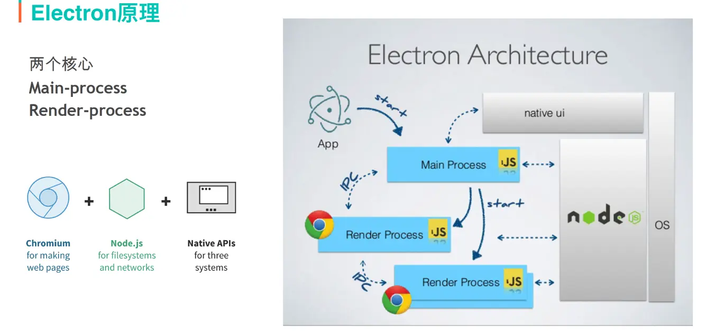
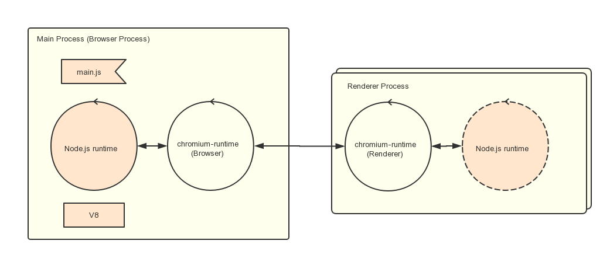

electron程序漏洞挖掘
========================================

概述
----------------------------------------
+ electron.js是一个运行时框架，使用web技术来创建跨平台原生桌面应用的框架。
+ electron负责硬件部分，Chromium负责页面UI渲染，Node.js负责业务逻辑，Native API则提供原生能力和跨平台。

特点
----------------------------------------
+ 摆脱了不同浏览器之间的差异和版本的限制，可以开发跨平台的桌面应用。
+ 通过内置Node.js提供原生系统的能力，如文件系统和网络的访问，有活跃的贡献者社区管理和第三方丰富的包支持。
+ 摆脱浏览器的沙盒机制，可以访问操作系统层面的东西。
+ 前端人员能在不学习其他语言的情况下，快速构建跨平台，带来统一的用户体验

逆向分析
----------------------------------------

文件结构
~~~~~~~~~~~~~~~~~~~~~~~~~~~~~~~~~~~~~~~~
+ 含有resources目录，包含一个app.asar文件。
+ app.asar是项目源码的归档文件。
+ exe文件是程序的启动文件。

程序结构
~~~~~~~~~~~~~~~~~~~~~~~~~~~~~~~~~~~~~~~~
+ 主进程
    - 特点
        + 处理原生应用逻辑，是一个node.js进程。
        + 每个Electron应用有且只有一个主进程，作为应用程序的入口点，即main脚本（package.json中main节点指定）的进程。
    - 职责
        + 创建渲染进程(可多个)
        + 控制应用生命周期 (启动、退出app以及对app的一些事件监听)
        + 调用系统底层功能、调用原生资源
    - 调用接口
        + NodeJS api
        + Electron提供的主进程api(包括一些系统功能和Electron附加功能)
+ 渲染进程
    - 特点
        + 由electron的BrowserWindow模块来进行创建和销毁，它可以加载web页面。
        + 渲染进程就是一个浏览器窗口，运行在各自的单个线程。
        + 渲染进程中执行的代码可以访问node的所有API,利用这个特性可以使用原生模块，实现与底层系统的交互。
        + 渲染器进程之间是相互隔离的不能够直接互相通信，并且不允许他们直接访问操作系统级别的API。
        + 要先与主进程进行通信，再由主进程进行转发或者由主进程访问安全级别API再返回。
    - 职责
        + 用HTML和CSS渲染界面
        + 用JS做界面交互
    - 可调用接口
        + DOM API
        + NodeJS API
        + Electron提供的渲染进程API
+ 进程通信
    + IPC通信
    + remote通信

|electron1|
|electron2|

asar文件
~~~~~~~~~~~~~~~~~~~~~~~~~~~~~~~~~~~~~~~~
+ 程序解包
    ::
    
        windows系统安装node.js
        在其目录中执行：npm install asar -g
        asar e app.asar app //解压拿到源码
+ 程序打包
    ::
    
        asar p app app.asar //重新打包
+ js格式美化
    ::
    
        npm install uglify-js -g
        uglifyjs main.js -b -o _main.js
+ 注意
    - app.asar一般都没有做进一步的加密处理，所以拿到源码不难
    - 不排除有的厂商可能在这方面做了一定的保护，就需要我们自己去逆向找到解密方法了，可以参考coco2d等。
    - 拿到的js源码一般都会做一定的混淆，通过搜索js混淆技术和反混淆、格式化等，基本可以恢复到能够方便阅览的源码。
    - 如果想验证某些功能，或者做些修改，可以通过重打包然后替换app.asar。

信息收集
~~~~~~~~~~~~~~~~~~~~~~~~~~~~~~~~~~~~~~~~
+ 查看版本
    ::
    
        Devtool查看法：
        前提是App启用了node Integration属性。
        Devtool控制台输入：process.versions.electron
        
        UA查看法：
        使用Devtool查看网络通信数据，查看User Agent头。
        
        修改代码法：
        var fs = require("fs");
        var querystring= require('querystring');

        console.log("准备写入文件");
        fs.writeFile('input.txt', querystring.stringify(process.versions),  function(err) {
           if (err) {
               return console.error(err);
           }
           console.log("数据写入成功！");
           console.log("--------我是分割线-------------")
           console.log("读取写入的数据！");
           fs.readFile('input.txt', function (err, data) {
              if (err) {
                 return console.error(err);
              }
              console.log("异步读取文件数据: " + data.toString());
           });
        });
        保存以上js内容为getVersionInfo.js，保存于解包后的文件夹中
        修改package.json的main字段为getVersionInfo.js
        重新封包，替换原来的.asar文件。
+ 功能特性
    - 查看特性: ``npx @electron/fuses read --app *.exe``
    - **runAsNode** ：是否考虑ELECTRON_RUN_AS_NODE环境变量。
    - **cookieEncryption** :磁盘上的cookie存储是否使用操作系统级别的加密密钥进行加密。
    - **nodeOptions** ：是否遵守--inspect、--inspect-brk 等标志。
    - **embeddedAsarIntegrityValidation** ：macOS上的一项实验性功能，该功能在加载app.asar文件时验证其内容。
    - **onlyLoadAppFromAsar** ： 改变了Electron用来定位应用程序代码的搜索系统。默认情况下，Electron将按照以下顺序搜索 app.asar -> app -> default_app.asar。
    - **loadBrowserProcessSpecificV8Snapshot** ：更改浏览器进程使用的V8快照文件。
    - **grantFileProtocolExtraPrivileges** ：从 file:// 协议加载的页面是否被赋予超出它们在传统Web浏览器中所获得的权限的权限。
    - 总结
        + **绕过验证** ：开启 EnableEmbeddedAsarIntegrityValidation 让程序在启动时检查 .asar 文件的完整性。程序执行时会读取.asar文件的头部，计算hash后和二进制程序内部的值进行对比，如果对比通过了就加载.asar文件进行执行。问题在于，程序只会校验头部计算后的hash，但不会校验头部中的记录的hash是否有效，因此如果修改了文件内容，文件大小不变，偏移也就不会变（偏移在头部），就能够绕过验证。
        + **asar劫持** ：onlyLoadAppFromAsar关闭后，劫持优先级高的文件。
+ Sandbox（沙箱）
    - 即Chromium的沙盒特性，如果开启了这个选项， 渲染进程将运行在沙箱中，限制了大多数系统资源的访问，包括文件读写，新进程启动等， preload.js和网页中的js都会受到这个选项的影响
    - 该选项会随着Node Integration的开启而关闭
    - Sandbox选项从Electron 20开始默认为开启状态
    - 检查方法
        ::
        
            1.查找 app.enableSandbox()函数调用
            2.查找sandbox: 选项设置，一般如下代码：
            const win = new BrowserWindow({
                webPreferences: {
                  sandbox: false
                }
              })
+ Node Integration（Node集成）
    - Node集成，是否开启网页Js Nodej共享库的访问，如果开启的话，网页js将拥有直接Nodejs的执行权限，包括进程启动，文件加载等
    - preload.js Node集成是一直开启的，不受这个选项影响
    - 即使这个选项开启，上下文隔离选项开启的话，网页Js仍然无法访问Nodejs共享库
    - 检查方法
        ::
        
            查找nodeIntegration: 选项设置，一般如下代码：
            const win = new BrowserWindow({
                webPreferences: {
                  nodeIntegration: true
                }
              })
+ Context Isolation（上下文隔离）
    - Electron的特性，使用了与Chromium相同的Content Scripts技术来实现。确保preload脚本和网页js在一个独立的上下文环境中
    - 开启后渲染页面的js中无法引入Electron和Node中的各种模块
    - 如果想在其中使用这部分功能，需要配置preload.js，使用contextBridge来暴露全局接口到渲染页面的脚本中
    - Electron 12开始默认启用
    - 检查方法
        ::
        
            查找contextIsolation: 选项设置
+ js敏感信息扫描
    - jsluice：``go install github.com/BishopFox/jsluice/cmd/jsluice@latest``
    - 查找urls
        ::
        
            linux:
            find . -type f -name "*.js" | jsluice urls | jq -r '.url' | sort -u
            windows:
            for /r C:/Users/Administrator/Desktop/app %i in (*.js) do @echo %i|jsluice urls
    - 查找敏感信息
        ::
        
            for /r C:/Users/Administrator/Desktop/app %i in (*.js) do @echo %i|jsluice secrets

程序调试
~~~~~~~~~~~~~~~~~~~~~~~~~~~~~~~~~~~~~~~~
+ 添加代码法
    ::
    
        asar extract app.asar app //解压拿到源码
        根据package.json文件main节点，查看入口代码文件：
        插入mainWindow.webContents.openDevTools();
        mainWindow.webContents.openDevTools({mode:'right'})；
        mainWindow.webContents.openDevTools({mode:'bottom'})；
        mainWindow.webContents.openDevTools({mode:'left'})；
        mainWindow.webContents.openDevTools({mode:'detach'})
        mainWindow.webContents.openDevTools({mode:'undocked'})
        注：如果代码进行了混淆，无法找到BowserWindow创建位置，就在文件头部或者末尾添加：
        let {BrowserWindow} = require('electron');
        let timer = null;
        timer = setInterval(()=>{
            let windows = BrowserWindow.getAllWindows();
            if(windows.length > 0){
                windows.forEach(v=>{
                    if(v){
                        v.webContents.openDevTools();
                    }
                })
                clearInterval(timer);
            }
        },5000);
        //重新打包，替换原始app.asar
        asar pack app app.asar 
        注：这里调试的是渲染进程。
        假如打开程序5s后，程序关闭，那么可能是对devtool窗口有监控，则可以关闭devtool打开的事件监听：
                let {BrowserWindow} = require('electron');
        let timer = null;
        timer = setInterval(()=>{
            let windows = BrowserWindow.getAllWindows();
            if(windows.length > 0){
                windows.forEach(v=>{
                    if(v){
                        v.webContents.removeAllListeners('devtools-opened');
                        v.webContents.openDevTools();
                    }
                })
                clearInterval(timer);
            }
        },5000);
        或者添加以下代码将窗口的close置空：
        v.close = () =>{};
+ 端口调试法
    ::
    
        调试渲染进程：
        命令行启动目标程序 *.exe -remote-debugging-port=9222
        浏览器中即可出现对应的页面，点击inspect调试
        
        调试主进程：
        下载对应版本的node和electron，然后将node添加到环境变量中。
        配置electron下载源，安装npm install electron@17.1.2
        npm config set ELECTRON_MIRROR https://npm.taobao.org/mirrors/electron/
        使用Electron提供的 ​--inspect​ 和 ​--inspect-brk​ 开关以调试模式打开程序。
        --inspect-brk=[port] 和--inspector 一样，但是会在JavaScript 脚本的第一行暂停运行。
        使用以下命令：
        electron --inspect[=5858] your/app
        注：默认是9229端口。
        
        安装chrome浏览器，打开chrome://inspect
        配置Discover network targets，添加9222，9229端口
        加载源码，在js入口处添加断点。
+ 初始调试法
    ::
    
        找到index.html，在body部分添加：
        
        重新封包，打开程序，在出现弹框时，按下enter的同时，按ctrl + shift + i就可以打开控制台。
+ Debugtron工具
    ::
    
        地址：https://github.com/pd4d10/debugtron
        注：可调试主进程和渲染进程。
+ 设置代理
    ::
    
        /app.exe --args --proxy-server=127.0.0.1:8080 --ignore-certificate-errors
+ 抓包工具
	- httptoolkit: ``https://httptoolkit.com/download/win-exe/``
+ 无法打开devtools
	- 原因分析
		+ 程序监听了控制台的打开事件，当发现控制台打开，则立刻将其关闭。
		+ 程序在用BrowserWindow创建窗口时，配置了webPreferences中的devTools为false。
		+ 程序在打包时，去除了Electron的控制台功能模块。
	- 绕过
		+ 第一种：通常是使用的是devtools-opened事件），可以通过解绑事件或移除相关代码的方式绕过。
		+ 第二种：程序入口文件寻找窗口的devTools配置项，并修改它。
		+ 第三种
			::
			
				(1)解压app.asar后，在app文件夹中新建一个js文件并写入以下代码：
				const { app, BrowserWindow } = require("electron");

				//创建窗口
				function createWindow () {
				let mainWindow = new BrowserWindow({
				title: "测试",
				width: 670,
				height: 420,
				offscreen: true,
				show: true,
				titleBarStyle: "customButtonsOnHover",
				backgroundColor: "#fff",
				acceptFirstMouse: true, //是否允许单击页面来激活窗口
				allowRunningInsecureContent: true,//允许一个 https 页面运行 http url 里的资源
				webPreferences: {
				devTools: true, //是否允许打开调试模式
				webSecurity: false,//禁用安全策略
				allowDisplayingInsecureContent: true,//允许一个使用 https的界面来展示由 http URLs 传过来的资源
				allowRunningInsecureContent: true, //允许一个 https 页面运行 http url 里的资源
				nodeIntegration: true//5.x以上版本，默认无法在渲染进程引入node模块，需要这里设置为true
				}
				});
				mainWindow.loadURL('about:blank');
				// 完成第一次绘制后显示
				mainWindow.on('ready-to-show', () => {
				mainWindow.webContents.openDevTools();
				})
				// 窗口关闭
				mainWindow.on('closed', function () {
				mainWindow = null
				});
				}
				// 主进程准备好以后创建窗口
				app.on('ready', () => {
				createWindow();
				});
				(2)打开app文件夹中的package.json文件，将入口（main）指向新建的js文件。
				(3)启动程序，看打开的窗口是否有控制台，若有，则说明程序内打包了控制台模块，若无，则说明没有打包。

注入hook
~~~~~~~~~~~~~~~~~~~~~~~~~~~~~~~~~~~~~~~~
+ did-finish-load事件
    ::
    
        首先在窗口创建部分添加事件：
        mainWindow.webContents.on("did-finish-load", function() {
        const js = fs.readFileSync(path.join(__dirname, 'netflixHook.js')).toString();
        mainWindow.webContents.executeJavaScript(js);
        });
        netflixHook.js文件如下：
        const injection = () => {
            //这里填写js hook代码
        };
        inject();

攻击面分析
----------------------------------------

利用渲染进程本身进行RCE
~~~~~~~~~~~~~~~~~~~~~~~~~~~~~~~~~~~~~~~~
+ 通过NodeJs共享库RCE
+ 通过chromium Nday RCE

通过IPC影响主进程进行RCE
~~~~~~~~~~~~~~~~~~~~~~~~~~~~~~~~~~~~~~~~
+ 需要主进程ipcmain，实现了危险方法
    ::
    
        例如主进程：
        ipcMain.on('fetch-data', (event, data) => {
            exec(data);  // Potentially dangerous function call
        });
        渲染进程：
        ipcRenderer.send('fetch-data', 'rm -rf /');
+ 需要当前执行上下文可以访问IPC

常规利用方法
~~~~~~~~~~~~~~~~~~~~~~~~~~~~~~~~~~~~~~~~
+ 分析选项开启状态
    ::
    
        grep -r "sandbox:" ./
        grep -r "nodeIntegration:" ./
        grep -r "contextIsolation:" ./
+ NI为true, CISO为 false，SBX为false
    - 允许了页面之间访问nodejs共享库，只要获取目标应用的一个XSS漏洞，就能直接通过访问NodeJS共享库，升级为XSS漏洞。
    - NI配置方法：在man.js中webPreferences中配置了nodeIntegration为true/false
+ NI为false, CISO为false，SBX为false
    - 关闭了Nodejs集成，导致我们不能在web页面上下文访问Nodejs共享库。
    - 因为上下文隔离没有开启，web页面和preload.js处于同一上下文中，导致我们可以通过污染原型链，获取preload,js的函数，进行ipcmain调用，命令执行等。
    - 限制条件
        ::
        
            Electron<10
            - 可以使用原型链污染获取remote/IPC模块
            - Remote模块可以直接通过主进程执行node js绕过沙箱
            Electron 10<version<14
            - 可以使用原型链污染获取remote/IPC模块
            - 需要Remote Module Explicitly Enabled，才可以使用remote模块RCE
            - 主进程IPC存在错误配置，通过进程间通信IPC，进行RCE
            Electron >14
            - 只能通过原型链污染获取IPC模块
+ NI为true/false, CISO为true，SBX为false
    - 因为没有开启沙箱，通过Chrome渲染进程远程代码执行漏洞，就可以直接RCE。
    - Chromium 83、86、87、88版本，如果electorn内置了Chromium就可以通过XSS，直接攻击，进行RCE。
+ NI:false, CISO:true, SBX为true
    - 有沙箱， 我们只能通过IPC进行攻击，但是如果我们js处于iframe之中，可能没有ipc访问权限,需要绕过。
    - 绕过思路
        + iframe下无ipc接口绕过
        + 关闭CISO,直接使用IPC，绕过限制
        + 关闭CISO,使用原型链污染获取remote模块进行RCE
        
自定义协议
~~~~~~~~~~~~~~~~~~~~~~~~~~~~~~~~~~~~~~
+ electron应用可以注册自己的url协议，例如custom://。
+ 这样可以通过浏览器直接打开应用，如果对url协议的处理不当可能导致rce等。
+ 检测方法
    ::
        
        查找registerHttpProtocol方法调用

代码审计
~~~~~~~~~~~~~~~~~~~~~~~~~~~~~~~~~~~~~~~
+ 寻找输入点
    - 如xss漏洞等

更新升级
~~~~~~~~~~~~~~~~~~~~~~~~~~~~~~~~~~~~~~~
+ MITM
    - HTTP方式升级
+ windows升级提权
    ::
    
        恶意工程：https://github.com/parsiya/evil-electron/
        1.告诉服务下载更新（windows一般通过命名管道）。
        2.将C:\Program Files (x86)\vendor\electron-app\ 中的所有内容复制到 C:\ProgramData\[redacted]\Updates（下载更新的位置）。
        3.删除下载的安装程序，但复制其文件名 (GUID.exe)。
        4.将electro-app.exe重命名为下载的安装程序的名称 (GUID.exe)。
        5.将目标中的 resources\app.asar文件替换为我自己的后门文件。
        6.继续Windows服务运行安装程序。
        7.弹出具有SYSTEM权限的cmd。
+ 免杀技术
    ::
    
        恶意代码藏于app.asar文件中。

挖掘思路
----------------------------------------
+ 组件漏洞
    ::
    
        使用asar解压程序文件，切换到解压目录中.
        执行 npm install --package-lock-only 生成package-lock.json文件。
        执行 npm audit --verbose进行组件漏洞分析。
+ XSS漏洞
    ::
    
        示例程序：https://github.com/MrH4r1/Electro-XSS
        payload：
        
        
        
+ IPC攻击
+ webview攻击
    ::
    
        webPreferences中启用webview：
        webviewTag: true
        <webview src="http://malicious.site"></webview>
+ 升级漏洞
+ 查看是否有自定义协议
    ::
    
        grep -r "registerHttpProtocol" ./
+ 查找有无html内容拼接
    ::
    
        var $input2 = $("<input type='text' value='"+value+"' name='value' class='form-control' style=' width:20%; display: inline-block;' placeholder='value'>");
        分析拼接的输入点是否用户可控，查看是否有xss漏洞。

        

