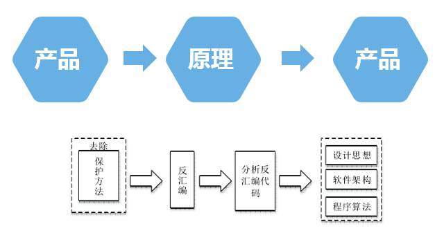
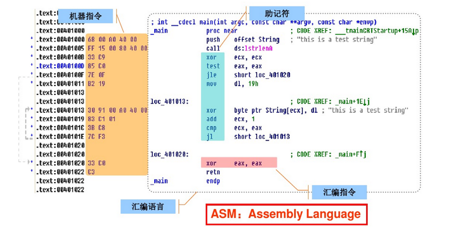
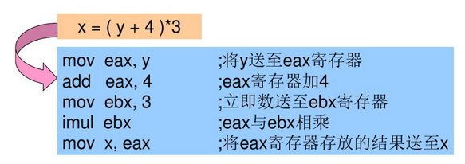
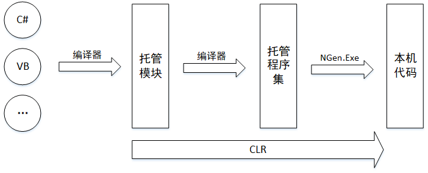

底层软件
========================================

分析视角
----------------------------------------
- 高阶视角
	- 程序结构
		模块（动态库，静态库），公共代码构造（过程，对象）。
	- 数据管理
		变量，用户自定义的数据结构，列表（数组，链表，树等）。
	- 控制流
		条件块，切换块，循环等。
	- 高级语言
		C语言，C++语言，JAVA语言，C#语言。

- 低阶视角
	- 数据管理
		寄存器，堆栈，堆，可执行数据区（全局变量，预初始化数据区域等）。
	- 控制流
		特定平台与特定语言相关（或者说与特定平台下的编译器相关）。

汇编语言
----------------------------------------

CPU
~~~~~~~~~~~~~~~~~~~~~~~~~~~~~~~~~~~~~~~~
- 指令集架构(ISA)
- 机器码
- 汇编语言
- CPU寄存器
- ...

机器码与汇编指令
~~~~~~~~~~~~~~~~~~~~~~~~~~~~~~~~~~~~~~~~
	|asm1|

关系
~~~~~~~~~~~~~~~~~~~~~~~~~~~~~~~~~~~~~~~~
	|asm2|

编译器与编译基础
----------------------------------------
	|asm3|

执行环境
----------------------------------------

基础
~~~~~~~~~~~~~~~~~~~~~~~~~~~~~~~~~~~~~~~~
+ 分类
	- CLR
		+ 公共语言运行时CLR（运行Microsoft.Net应用程序）
	- WinRT
	- JVM
		运行JAVA程序
+ 特点
	- 优点：平台独立，增强的功能（垃圾回收，运行时类型安全，内存安全访问）,可移植
	- 解释器（虚拟机的实现方法）：主要缺点性能缺失。
	- 逆向策略：字节码->高效的反编译器->高级语言表示。
	- 使用混淆器

CLR
~~~~~~~~~~~~~~~~~~~~~~~~~~~~~~~~~~~~~~~~
+ 基础
	- 即公共语言运行时（Common Language Runtime）,是.net虚拟机。
	- 实际运行的是一种字节码形态的 **中间语言** (MISL)。
+ 工作原理
	- 如下图
		|CLR|
	- 构建和部署
		+ 开发者使用 .NET 语言编写托管代码。
		+ 托管代码被编译器编译成 IL 代码 并打包，加上元数据和清单，形成 程序集。
		+ 程序集是部署到用户机器上的物理文件（.dll, .exe）,它是标准的Windows可移植执行体（PE），是受管制的代码，由公共语言运行库环境（而不是直接由操作系统）执行的代码。
			::
		
				其主要由四个部分组分组成。
				1.PE32（32位）或PE32+（64位）头
				2.CLR头:包含使这个模块成为一个托管模块的信息。
				3.元数据表：一种表描述源代码中定义的类型和成员，另一种表描述源代码引用的类型和成员。
				4.IL代码：编译器编译源代码时生成的代码。在运行时，CLR将IL编译成本地CPU指令。
	- 执行环境
		+ 当用户运行一个 .NET 应用程序（一个 .exe 程序集）时，操作系统会创建一个进程。
		+ CLR 会在此进程中自动创建一个默认的应用程序域。
		+ 应用程序的入口点程序集会被加载到这个默认的 AppDomain 中。
		+ JIT 编译器将程序集中的 IL 代码编译成本地机器码（托管代码开始执行）。
	- 加载与执行
		+ 在 AppDomain 执行过程中，它可以根据需要加载其他程序集。
		+ 这些程序集被加载到当前 AppDomain 中，其包含的托管代码被 JIT 编译后执行。
		+ 一个程序集可以被加载到同一个进程内的不同 AppDomain 中（在现代 .NET 中，通常只有一个 AppDomain）。每个加载都会创建程序集内容的独立副本（静态变量隔离）。
		+ 同一个程序集不能被加载到同一个 AppDomain 中多次（基于名称、版本等标识）。
	- 隔离边界
		+ AppDomain 是主要的逻辑隔离单元（故障、安全、配置）。
		+ 程序集 是类型标识和安全权限授予的边界。
		+ 托管代码 在 CLR 的监督下在 AppDomain 的边界内安全执行。

WinRT
~~~~~~~~~~~~~~~~~~~~~~~~~~~~~~~~~~~~~~~~
+ Windows Runtime,简称WinRT. WinRT是一个操作系统模块，在Win 8种首次引入。
+ 运行在用户态，介于Win32的上层和应用程序的下层。
+ WinRT在二进制模型上基于经典的COM。WinRT和CLR互不依赖，WinRT可以被CLR使用。

