逆向工程
========================================

基础
----------------------------------------

ABI
~~~~~~~~~~~~~~~~~~~~~~~~~~~~~~~~~~~~~~~~
+ 定义
	ABI（Application Binary Interface）为应用程序二进制接口，描述了应用程序和操作系统之间，一个应用和它的库之间，或者应用的组成部分之间的二进制层面的底层接口。
+ 涉及面：
	- （1）内置数据类型（如 char、int、float 等）的大小和在存储器中的存放方式（大端、小端、对齐方式等）；
	- （2）组合数据类型（struct、union 等）的存储方式和内存分布；
	- （3）外部符号和用户定义的符号之间的命名方式和解析方式。比如函数名func在C语言目标文件中是否会被解析成外部符号_func；
	- （4）函数调用方式，比如参数入栈顺序、返回值如何保存等；
	- （5）函数栈的分布方式，比如参数和局部变量在堆栈里的位置，参数传递方法等；
	- （6）寄存器使用约定，函数调用时哪些寄存器可以修改，哪些需要保存等。
+ C++额外增加的面：
	- （1）继承体系下的对象内存布局，比如基类、虚基类在继承类中的位置；
	- （2）指向类成员函数的指针（Pointer to Member）的内存分，如何通过指向成员函数的指针调用成员函数，如何传递this指针；
	- （3）如何调用虚函数，虚函数表的内容和分布形式，虚函数表指针在对象中的位置等；
	- （4）template如何实例化；
	- （5）外部符号的修饰；
	- （6）全局对象的构造和析构；
	- （7）异常的产生和捕获机制；
	- （8）标准库的细节问题、RTTI如何实现等；
	- （9）内联函数访问细节。
+ 相关资料
	- System V ABI AMD64

字符编码
~~~~~~~~~~~~~~~~~~~~~~~~~~~~~~~~~~~~~~~~
+ 常见的字符编码类型
	- 1.MBCS即ANSI编码(如ASSIC,GB2312,BIG5,JIS等),本地化编码方式
	- 2.UNICODE即世界符号统一编码（UTF-7，UTF-8，UTF-16）
	- 3.BASE64类
+ BOM
	即Byte Order Mark
+ 示例
	|reverse1|
	
+ 编码顺序
	- 端序
		+ Big-endian（大端序）
			MSB（最高有效位）存储在最低端地址
		+ Little-endian（小端序）
			LSB（最低有效位）存储在最低端地址
	- 主机字节序：
		+ 大端序的CPU架构
			PowerPC、SPARC和Motorola处理器
		+ 小端序的CPU架构
			IA架构(Intel、AMD)
	- 网络字节序
		为了使异构计算机系统能够交换协议信息而不会混淆，统一使用大端序,如TCP/IP协议栈。
	- 基本库函数
		htons(),ntohs(),htonl(),ntohl()。
	- 示例
		|reverse2|

函数调用约定
~~~~~~~~~~~~~~~~~~~~~~~~~~~~~~~~~~~~~~~~
+ 调用约定
	|reverse3|
	::

		1.使用vc sdk工具dumpbin.exe /SYMBOLS命令可获得obj/lib文件中的函数或变量名字列表。
		2.使用vc sdk工具undname.exe将修饰名转换为未修饰形式。
		3.所有的语言都支持_sdtcall调用规则。
+ 参数传递
	- 在x86模式下，主要是cdecl(C规范)/stdcall(WinAPI默认)/fastcall函数调用约定。
		+ 参数传递使用堆栈进行。
	- x64模式下，调用约定只有fastcall
		+ rcx，rdx, r8,r9传递前四个参数，然后利用堆栈来传递其他参数。

Windows堆栈原理
~~~~~~~~~~~~~~~~~~~~~~~~~~~~~~~~~~~~~~~~
	- 基本特征
		连续内存，先入后出，从高地址向低地址生长，每个线程都有单独的堆栈，POP/PUSH指令，ESP指向栈顶，EBP指向栈底。
	- 存储内容
		当前函数局部变量，函数返回地址，函数参数，EBP，其它通用寄存器，其它（安全cookie等）。
	- 空间大小
		线程创建之前创建堆栈，默认大小为1M，可通过编译选项更改初始大小
	- 函数调用
		参数入栈，CALL指令（调到目标地址，并EIP入栈），抬高栈顶分配堆栈空间，EBP入栈，函数局部变量入栈
	- 函数返回
		释放堆栈空间（恢复ESP），恢复EBP，恢复EIP
	- 示例
	
	::
	
		#include "stdafx.h"
		#include<Windows.h>

		int BFunc(int i, int j)
		{
			int m = 1;
			int n = 2;
			m = i;
			n = j;
			return m;
		}

		int AFunc(int i, int j)
		{
			int m = 3;
			int n = 4;
			m = i;
			n = j;
			return BFunc(m, n);
		}

		int _tmain(int argc, _TCHAR* argv[])
		{
			return AFunc(5, 6);
		}
	
	编译环境：
	 | IDE：Visual Studio 2015，release
	 | 编译选项：
	 | 字符集：使用多字节字符集
	 | c/c++->优化->优化：已禁用
	 | c/c++->优化->启用内部函数：否
	 | c/c++->优化->全程序优化：否
	 | c/c++->预处理器->预处理定义：_CRT_SECURE_NO_WARNINGS（或禁用SDL）
	 | c/c++->代码生成->安全检查：禁用安全检查（/GS-）
	 | 链接器->高级->数据执行保护(DEP)-否
	 | 链接器->高级->随机基址-否
	 | 附件：`test01.rar <..//_static//test01.rar>`_
	 
	 调试过程：
	 |reverse4|
	 |reverse5|
	 |reverse6|

c++类内存布局
~~~~~~~~~~~~~~~~~~~~~~~~~~~~~~~~~~~~~~~~
+ 不存在虚函数的内存布局与结构体类似
+ 存在虚函数的内存布局
	- 1.起始位置为虚表指针__vfptr，之后是类中的成员变量的内存数据。
	- 2.子类，起始为父类对象的拷贝（包含父类虚函数表指针和成员变量），之后是子类自己的成员变量数据。
		|cpp1|
		
		+ 单一继承，无虚函数重载
			|cpp2|
			
		+ 单一继承，重载了虚函数
			|cpp3|
			
		+ 多重继承
			|cpp4|
			|cpp5|
		+ 总结
			- 若类存在虚函数，编译阶段会创建虚函数表vtable，只存在一份，保存在常量区。
			- 当子类存在重载父类虚函数时，子类的vtable同名函数会指向子类重载函数地址，若子类中有新的虚函数，在vtable末尾添加。
			- 一个类（无论父类子类）只有一个vtable，一个类对象也只有一个__vfptr，继承类对象的__vfptr会与父类的vfptr合并。
			- 子类强行调用被重载的父类虚函数，编译阶段会直接进行call，不经过虚表指针。
			- 虚函数以及成员函数再内存代码区。

CrackMe示例
----------------------------------------
- 附件：`简单-关键跳 <..//_static//crackme20litefinal.zip>`_
- 附件：`编写注册机 <..//_static//k4n.zip>`_
- 附件：`压缩壳 <..//_static//MemoriesOnTV.rar>`_
- 附件：`加密壳 <..//_static//LibInquire.rar>`_
- 基本思路
	- PE信息（PE Loader）
	- 开始调试（打开，附加）
	- 基本指令
	- 程序入口点
	- VC启动函数（Stub Code）
	- winmain函数
	- 快速查找指定代码
	- 设置据点
	- 修改与破解目标程序
	- 分析加密算法

PE变形与补丁技术
----------------------------------------
- 变形技术
	- 结构重叠
	- 空间调整
	- 数据转移
	- 数据压缩
- 补丁技术
	- 动态补丁
	- 静态补丁
	- 嵌入补丁
	- 万能补丁技术
- PE重构

WindowsHook技术原理
----------------------------------------
- 原理
	|reverse7|
- 分类
	- 用户空间钩子
		| 导入表钩子
		| 内联函数钩子
		| DLL注入
	- 内核钩子
		| 系统服务描述符表钩子
		| 修改SSDT内存保护机制
		| 钩住SSDT表
		| IRP hook
		| SYSENTRY hook
	- 混合钩子
		| 进入进程的内存空间
		| 钩子的内存空间

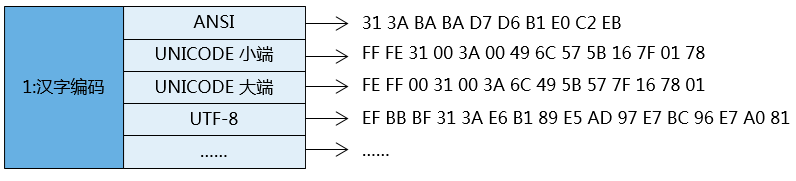
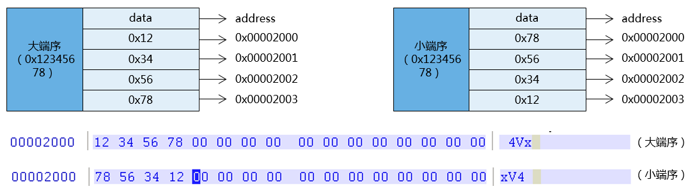
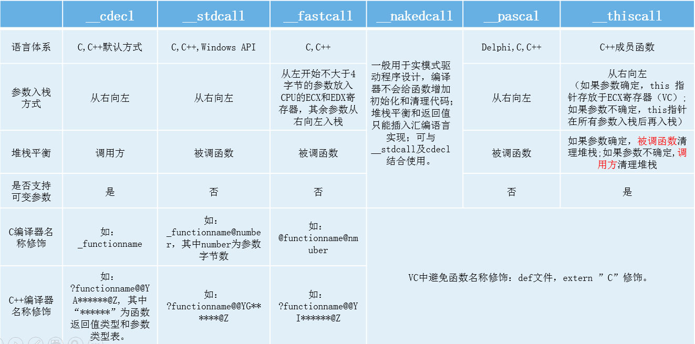
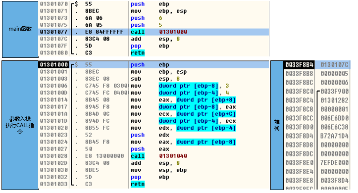
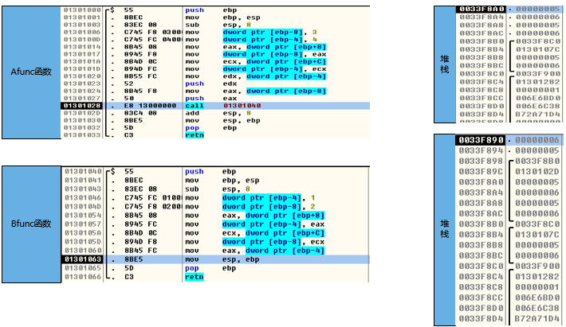
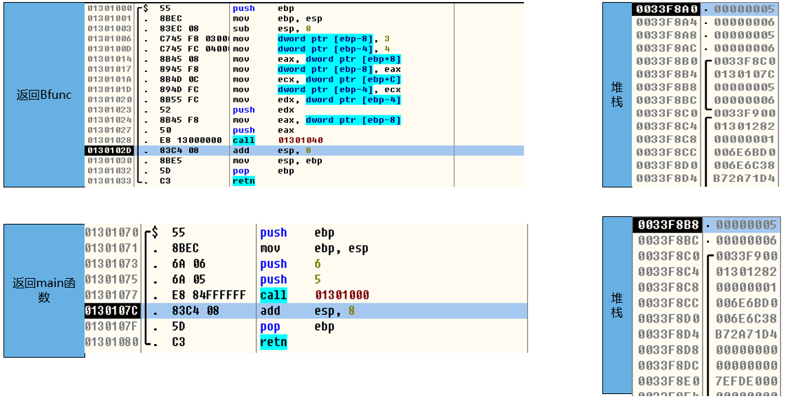
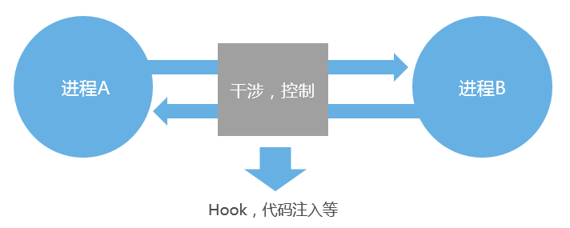
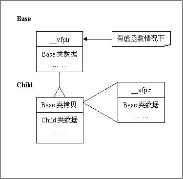
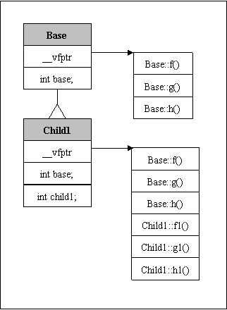
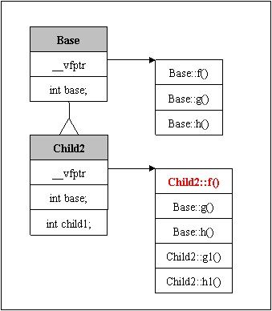
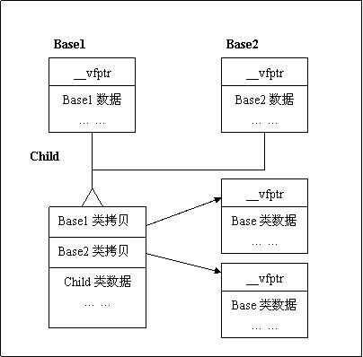
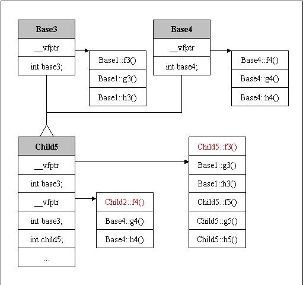