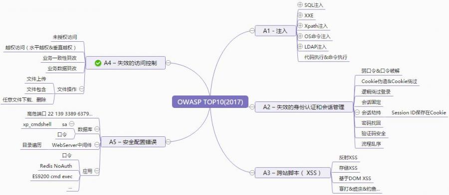
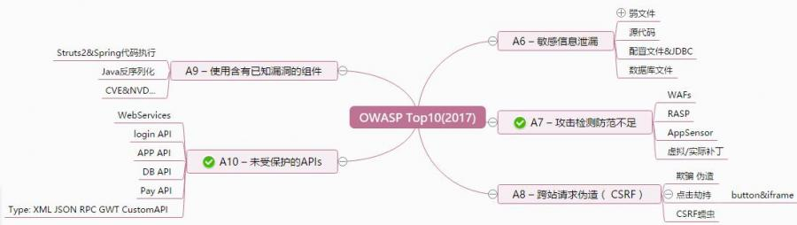
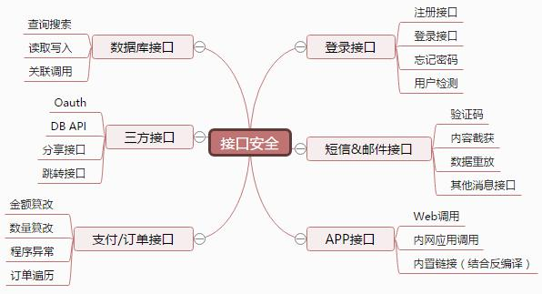

OWASPTop10
========================================

漏洞标准解读
~~~~~~~~~~~~~~~~~~~~~~~~~~~~~~~~~~~~~~~~
OWASP Top10漏洞体系长期以来作为Web攻防白帽子既基础又核心的一个标准。
官网：https://owasp.org/www-project-top-ten/

|owasp1|

::

	变化内容:
	合并了2013-A4“不安全的直接对象引用”和2013-A7“功能级访问控制功能缺失”到2017-A5“无效的访问控制”。
	增加了2017-A4：XML 外部处理器漏洞
	增加了2017-A8：不安全的反序列化
	增加了2017-A10：未受保护的API
	去掉了2013-A10：未验证的重定向和转发

A1-Injection（注入漏洞）
----------------------------------------

- 当 **不可信的数据** 作为命令或查询语句的一部分被发送给解释器的时候，会发生注入漏洞，包括 **SQL、NoSQL、OS以及LDAP注入** 等。
- 攻击者发送的恶意数据可能会诱使解释器执行计划外的命令，或在没有适当授权的情况下访问数据。

A2-BrokenAuthentication（中断身份认证）
----------------------------------------

- 与认证和会话管理相关的应用函数经常被错误地实现，从而允许攻击者破坏密码、密钥或是会话令牌。
- 或者利用其他的应用漏洞来暂时或永久地获取用户身份信息。

A3-Sensitive DataExposure（敏感数据泄露）
-----------------------------------------

- 许多 Web 应用程序和 API 不能正确的保护敏感数据，如金融、医疗保健和 PII（个人身份信息）等。攻击者可能会窃取或篡改这些弱保护的数据，从而进行信用卡欺诈、身份盗窃或其他犯罪行为。
- 在缺少额外保护（例如，在存放和传输过程中加密，且在与浏览器进行交换时需要特别谨慎）的情况下，敏感数据可能会受到损害。

A4-XML ExternalEntities（XXE）XML 外部处理器漏洞
-------------------------------------------------

- 许多过时的或配置不当的XML处理器在XML文档内进行外部实体引用。
- 外部实体可用于泄露内部文件，通过使用文件URI处理器、内部文件共享、内部端口扫描、远程代码执行以及拒绝服务攻击等手段。

A5-Broken AccessControl（中断访问控制）
----------------------------------------

- 限制“认证的用户可以实现哪些操作”的命令没有得到正确的执行。
- 攻击者可以利用这些漏洞访问未经授权的功能和数据，例如访问其他用户的账户，查看敏感文件，篡改其他用户的数据，更改访问权限等。

A6-SecurityMisconfiguration（安全配置错误）
-------------------------------------------

- 安全配置错误是最常见的问题。
- 这通常是由不安全的默认配置，不完整或 ad hoc 配置，开放云存储，错误配置的 HTTP 标头，以及包含敏感信息的详细错误信息造成的。
- 所有的操作系统、框架、库、应用程序都需要进行安全配置外，还必须要及时进行系统更新和升级。

A7-Cross-Siteing（XSS）跨站脚本攻击
----------------------------------------

- 如果应用程序在未经适当验证或转义的情况下，能够在新网页中包含不受信任的数据，或是使用可以创建 HTML 或者 Java 的浏览器 API 更新包含用户提供的数据的现有网页，就会出现 XSS 漏洞。
- XSS 允许攻击者在受害者的浏览器中执行脚本，这些脚本可以劫持用户会话、破坏网站或将用户重定向到恶意网站中。

A8-InsecureDeserialization（不安全的反序列化）
----------------------------------------------
- 不安全的反序列化漏洞通常会导致远程代码执行问题。
- 即使反序列化错误不会导致远程代码执行，也可以被用来执行攻击，包括重放攻击、注入攻击以及权限提升攻击等。

A9-UsingComponents with Known Vulnerabilities（使用含有已知漏洞的组件）
-----------------------------------------------------------------------
- 组件（如库、框架和其他软件模块）是以与应用程序相同的权限运行的。如果存在漏洞的组件被利用，这种攻击可能会导致严重的数据丢失或服务器接管危机。
- 使用已知漏洞组件的应用程序和API可能会破坏应用程序的防御系统，从而启动各种形式的攻击，造成更为严重的影响。

A10-InsufficientLogging& Monitoring（不足的记录和监控漏洞）
------------------------------------------------------------
- 不足的记录和监控漏洞，再加上事件响应能力欠缺以及缺少有效的整合，使得攻击者可以进一步攻击系统，维持其持久性，转而攻击更多的系统，并篡改、提取或销毁数据。
- 大部分的数据泄露研究显示，检测出发生数据泄漏的时间通常需要超过 200 天，而且通常是外部机构率先发现数据泄漏的事实，而不是通过内部发现的。

漏洞关联
~~~~~~~~~~~~~~~~~~~~~~~~~~~~~~~~~~~~~~~~

|owasp2|

|owasp3|

接口安全
~~~~~~~~~~~~~~~~~~~~~~~~~~~~~~~~~~~~~~~~

|owasp5|

.. |owasp1| image:: ../images/owasp1.jpg

