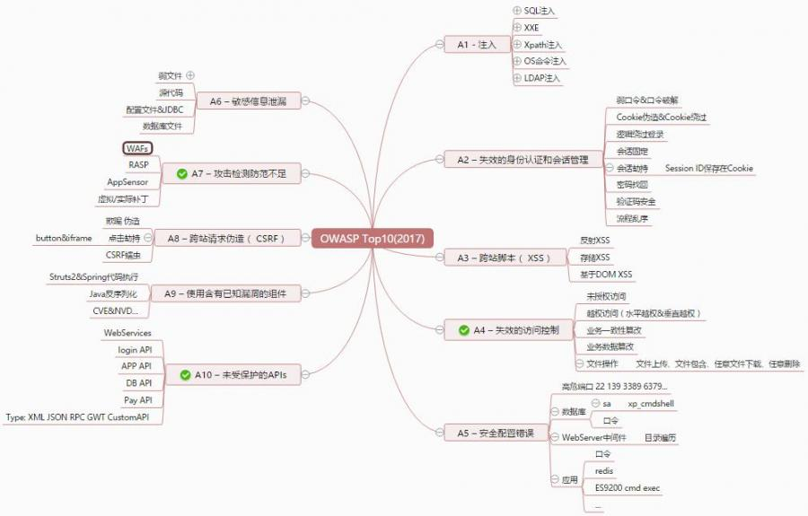

OWASPTop10
========================================

OWASP Top10漏洞体系长期以来作为Web攻防白帽子既基础又核心的一个标准。
官网：https://owasp.org/www-project-top-ten/
对2017漏洞标准变化解读如下：

|owasp1|

::

	变化内容:
	合并了2013-A4“不安全的直接对象引用”和2013-A7“功能级访问控制功能缺失”到2017-A4“无效的访问控制”。
	增加了2017-A7：攻击检测与防范不足
	增加了 2017-A10: 未受保护的API
	去掉了: 2013-A10:未验证的重定向和转发
	根据增删内容，标准中多次提到了API安全的关键字
	根据解说内容，标准逐渐向抽象性漏洞过渡和延伸，包括登录体系、会话权限等系列的逻辑漏洞

漏洞关联

|owasp2|

|owasp3|

|owasp4|

接口安全

|owasp5|

.. |owasp1| image:: ../images/owasp1.jpg
.. |owasp2| image:: ../images/owasp2.jpg
.. |owasp3| image:: ../images/owasp3.jpg

.. |owasp5| image:: ../images/owasp5.jpg