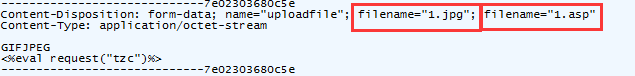
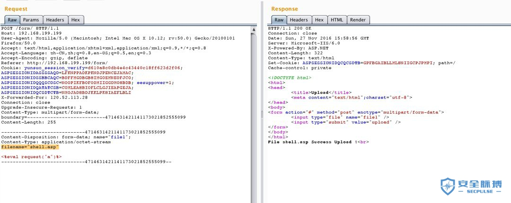

文件上传
========================================

客户端检测
----------------------------------------
- 文件扩展名检测
	+ burpsuite抓包修改网络请求中文件扩展名绕过
- MIME类型检测
	+ burpsuite抓包网络请求中http头部Content-Type值绕过

服务端检测
----------------------------------------
- 00截断绕过 ： ``www.xxx.com/qq.php%00.jpg => www.xxx.com/qq.php`` 

::

	注意：%00截断在GET中被url解码之后是空字符。但是在POST中%00不会被url解码，
	所以只能通过burpsuite修改hex值为00（URLdecode）进行截断。

+ 文件扩展名检测：一般有黑名单和白名单检测，白名单比黑名单的安全性高，攻击的手法较少。
	- 黑名单
	- 白名单

+ 文件内容检测
	- 文件头Magic检测绕过
		有的站点使用文件头来检测文件类型，这种检查可以在Shell前加入对应的字节以绕过检查。几种常见的文件类型的头字节如下表所示

		==============      ============================
		类型                二进制值
		==============      ============================
		JPG                 FF D8 FF E0 00 10 4A 46 49 46
		GIF                 47 49 46 38 39 61
		PNG                 89 50 4E 47
		TIF                 49 49 2A 00
		BMP                 42 4D
		==============      ============================

	- 文件加载检测
		即文件加载通过调用API重新渲染图片，测试图片加载是否成功，一般分为两种：

		- 渲染/加载测试

		::
		
			代码注入绕过
			相关工具(edjpgcom图片插入一句话工具)
			利用前提：
			1.存在文件包含漏洞,如/test.php?file=1.jpg
			2.nginx和php配置错误,访问/1.jpg/00000000000000.php,当php-fpm找不到00000000000000.php，
			然后向前查找，把1.jpg当成php文件访问。

		附件：`webshellimg.jpg <..//_static//webshellimg.jpg>`_

		- 二次渲染

		::
		
			攻击文件加载器自身
			参考：https://paper.seebug.org/387/#2-php-gdwebshell
			https://github.com/RickGray/Bypass-PHP-GD-Process-To-RCE
			http://www.secgeek.net/bookfresh-vulnerability/

+ WAF绕过
	- filename
		针对早期版本的安全狗，可以多加一个filename来绕过，

			|fileuploadfilename1|

		或者可以通过吧filename放在非常规的位置来绕过（这里的filename指在http请求头中上传的文件名字）。

			|fileuploadfilename2|

		另外，Waf和Web系统对 ``boundary`` 的处理不一致，可以使用错误的 ``boundary`` 来完成绕过。 

	- 竞争上传绕过
		有的服务器采用了先保存，再删除不合法文件的方式，在这种服务器中，可以反复上传一个会生成Web Shell的文件并尝试访问，多次之后即可获得Shell。

渗透测试
---------------------------------------
+ 识别上传点
	::

		# Common upload locations to investigate
		POST /upload
		POST /file-upload 
		POST /api/v1/media
		POST /profile/image
		POST /documents/import
		POST /attachments/add

		# Look for
		- Profile/avatar changes
		- Ticket/file attachments
		- CSV/Excel imports
		- Content management systems
		- Form builders

+ 服务端技术
	::

		# Identify server technology from responses
		$ curl -I https://target.com/upload
		Server: Apache → .htaccess testing possible
		Server: nginx → configuration review
		X-Powered-By: PHP → PHP-specific behaviors
		X-AspNet-Version → ASP.NET patterns

+ 文件名变形
	::

		# Test Cases - Observe Server Behavior
		test.jpg # Baseline
		TEST.JPG # Case sensitivity
		test.jpeg # Alternative extension
		test. # Trailing dot 
		test.jpg # Trailing space
		test.jpg/ # Trailing slash
		test.jpg; # Trailing semicolon

+ Content-Type变形
	::

		# Send same file with different Content-Type headers
		Content-Type: image/jpeg
		Content-Type: image/png 
		Content-Type: application/octet-stream
		Content-Type: multipart/form-data
		Content-Type: text/plain

+ 扩展名逻辑
	::

		# Systematic Extension Testing Matrix
		┌─────────────────┬─────────────────┬─────────────────┐
		│ Category        │ Test Values     │ Expected        │
		├─────────────────┼─────────────────┼─────────────────┤
		│ Baseline        │ test.jpg        │ 200 OK          │
		├─────────────────┼─────────────────┼─────────────────┤
		│ Double Ext      │ test.php.jpg    │ Should reject   │
		│                 │ test.asp.png    │                 │
		├─────────────────┼─────────────────┼─────────────────┤
		│ Case Manipulate │ test.pHp        │ Should reject   │
		│                 │ test.PhP        │                 │
		├─────────────────┼─────────────────┼─────────────────┤
		│ Special Chars   │ test.php;.jpg   │ Should reject   │
		│                 │ test.php..jpg   │                 │
		├─────────────────┼─────────────────┼─────────────────┤
		│ Alternative     │ test.php5       │ Should reject   │
		│                 │ test.phtml      │                 │
		└─────────────────┴─────────────────┴─────────────────┘

+ 上传路径Fuzz
	::

		# Common Upload Paths to Fuzz
		/upload
		/file-upload
		/api/v1/media
		/profile/image
		/documents/import
		/attachments/add
		/uploads/
		/files/
		/media/
		/static/uploads/
		/content/uploads/
		/images/profile/
		/attachments/
		/storage/
		/assets/

+ 服务端配置漏洞
	::

		# What to Test
		Apache:
		- Is .htaccess honored in upload directories?
		- Can .htaccess files be uploaded?
		- Directory indexing enabled?

		Nginx:
		- Try to upload nginx.conf
		- Test for alias traversal
		- Check try_files behavior

		IIS:
		- web.config upload attempts
		- ASP.NET request filtering
		- Handler mappings

		Cloud Storage:
		- Public read/write permissions
		- Bucket policy misconfigurations
		- Object versioning

+ 文件元数据测试
	::

		# Information Disclosure Through Metadata
		Test uploading files with:
		- Long filenames (500+ characters)
		- Unicode/UTF-8 characters
		- Emoji in filename
		- Newlines in filename
		- Path separators in filename

		Document:
		- How are filenames displayed?
		- Is there reflected XSS in filename?
		- Are filenames used in HTML without encoding?
		- Is metadata stripped or preserved?

+ 漏洞利用链测试
	::

		Chain 1: Upload → Stored XSS
		├── Upload SVG with embedded script
		├── Upload HTML file
		├── Upload file with XSS in filename
		└── Access file triggers JavaScript

		Chain 2: Upload → Path Traversal
		├── Upload with zip/tar
		├── Contains ../../ paths
		├── Extraction writes outside target dir
		└── Overwrite sensitive files

		Chain 3: Upload → SQL Injection
		├── Filename contains SQL payload
		├── Filename stored in database
		├── Unsafe query construction
		└── Payload executes in DB

		Chain 4: Upload → SSRF
		├── Upload profile from URL feature
		├── Supply internal IP addresses
		├── Server fetches from internal network
		└── Access cloud metadata services

+ 业务逻辑漏洞测试
	::

		# Test These Scenarios
		1. Privilege Escalation(权限提升):
		- Upload as low-privilege user
		- Access file as admin/higher privilege
		- Does access control fail?

		2. Quota Bypass（配额绕过测试）:
		- Fill storage quota
		- Find alternative upload paths
		- Bypass per-user limits

		3. Content Spoofing（内容欺骗）:
		- Upload PDF with malicious links
		- Upload document with credential forms
		- Social engineering potential

		4. Cache Poisoning（）:
		- Upload file with version parameter
		- Manipulate caching headers
		- Serve old content

攻击技巧
----------------------------------------

Apache重写GetShell
~~~~~~~~~~~~~~~~~~~~~~~~~~~~~~~~~~~~~~~~
Apache可根据是否允许重定向考虑上传.htaccess

内容为

::

    AddType application/x-httpd-php .png
    php_flag engine 1

就可以用png或者其他后缀的文件做php脚本了

软链接任意读文件
~~~~~~~~~~~~~~~~~~~~~~~~~~~~~~~~~~~~~~~~
上传的压缩包文件会被解压的文件时，可以考虑上传含符号链接的文件
若服务器没有做好防护，可实现任意文件读取的效果

防护技巧
----------------------------------------
- 使用白名单限制上传文件的类型
- 使用更严格的文件类型检查方式
- 限制Web Server对上传文件夹的解析

参考链接
----------------------------------------
- `构造优质上传漏洞Fuzz字典 <https://www.freebuf.com/articles/web/188464.html>`_

