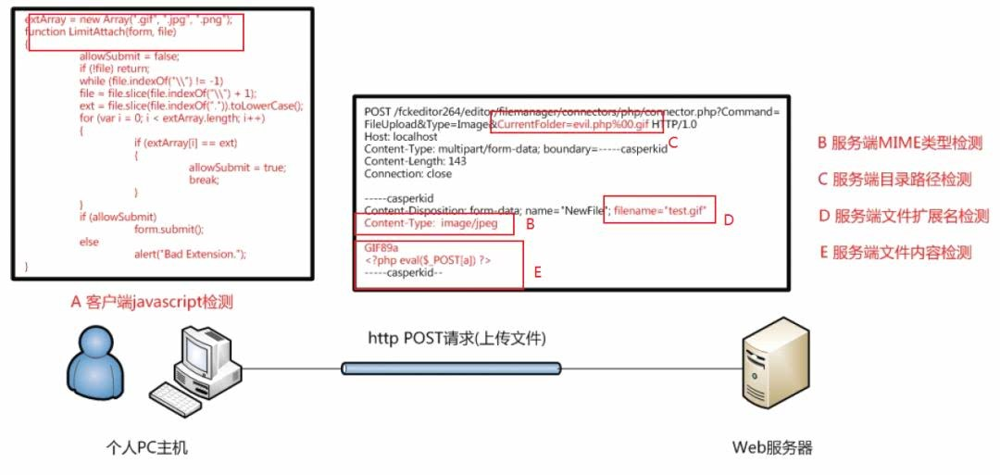
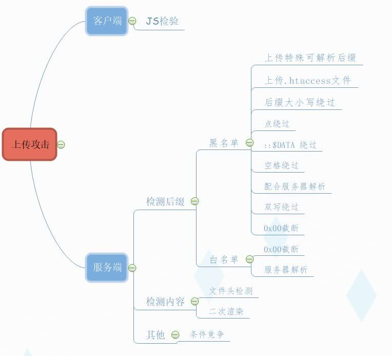
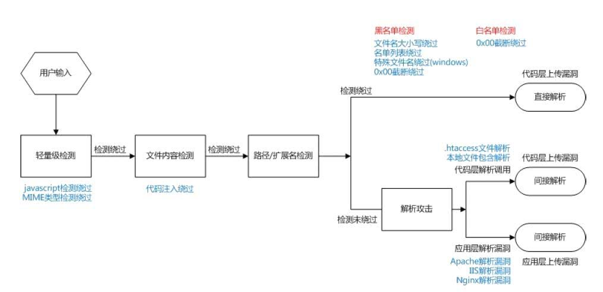

文件上传
========================================

检测方法
----------------------------------------

	|fileupload|

攻击流程
----------------------------------------

	|fileuploadattack1|
	|fileuploadattack2|

检测绕过
----------------------------------------

更改请求绕过
~~~~~~~~~~~~~~~~~~~~~~~~~~~~~~~~~~~~~~~~

- 客户端文件扩展名检测

::

	burpsuite抓包修改网络请求中文件扩展名绕过

- 服务端MIME类型检测

::

	burpsuite抓包网络请求中http头部Content-Type值绕过

服务端目录路径检测
~~~~~~~~~~~~~~~~~~~~~~~~~~~~~~~~~~~~~~~~

- 00截断绕过

 ``www.xxx.com/qq.php%00.jpg => www.xxx.com/qq.php`` 

::

	注意：%00截断在GET中被url解码之后是空字符。但是在POST中%00不会被url解码，
	所以只能通过burpsuite修改hex值为00（URLdecode）进行截断。

服务端文件扩展名检测
~~~~~~~~~~~~~~~~~~~~~~~~~~~~~~~~~~~~~~~~

::

	服务器文件扩展名检测一般有黑名单和白名单检测，白名单比黑名单的安全性高，攻击的手法较少。
	
- 黑名单
- 白名单

文件内容检测
~~~~~~~~~~~~~~~~~~~~~~~~~~~~~~~~~~~~~~~~

- 文件头Magic检测绕过
	有的站点使用文件头来检测文件类型，这种检查可以在Shell前加入对应的字节以绕过检查。几种常见的文件类型的头字节如下表所示

	==============      ============================
	类型                二进制值
	==============      ============================
	JPG                 FF D8 FF E0 00 10 4A 46 49 46
	GIF                 47 49 46 38 39 61
	PNG                 89 50 4E 47
	TIF                 49 49 2A 00
	BMP                 42 4D
	==============      ============================

- 文件加载检测
	即文件加载通过调用API重新渲染图片，测试图片加载是否成功，一般分为两种：

	- 渲染/加载测试

	::
	
		代码注入绕过
		相关工具(edjpgcom图片插入一句话工具)
		利用前提：
		1.存在文件包含漏洞,如/test.php?file=1.jpg
		2.nginx和php配置错误,访问/1.jpg/00000000000000.php,当php-fpm找不到00000000000000.php，
		然后向前查找，把1.jpg当成php文件访问。

	附件：`webshellimg.jpg <..//_static//webshellimg.jpg>`_

	- 二次渲染

	::
	
		攻击文件加载器自身
		参考：https://paper.seebug.org/387/#2-php-gdwebshell
		https://github.com/RickGray/Bypass-PHP-GD-Process-To-RCE
		http://www.secgeek.net/bookfresh-vulnerability/

后缀配置错误
~~~~~~~~~~~~~~~~~~~~~~~~~~~~~~~~~~~~~~~~
php由于历史原因，部分解释器可能支持符合正则 ``/ph(p[2-7]?|t(ml)?)/`` 的后缀，如 ``php`` / ``php5`` / ``pht`` / ``phtml`` / ``shtml`` / ``pwml`` / ``phtm`` 等 可在禁止上传php文件时测试该类型。

jsp引擎则可能会解析 ``jspx`` / ``jspf`` / ``jspa`` / ``jsw`` / ``jsv`` / ``jtml`` 等后缀，asp支持 ``asa`` / ``asax`` / ``cer`` / ``cdx`` / ``aspx`` / ``ascx`` / ``ashx`` / ``asmx`` / ``asp{80-90}`` 等后缀。

除了这些绕过，其他的后缀同样可能带来问题，如 ``vbs`` / ``asis`` / ``sh`` / ``reg`` / ``cgi`` / ``exe`` / ``dll`` / ``com`` / ``bat`` / ``pl`` / ``cfc`` / ``cfm`` / ``ini`` 等。

系统命名绕过
~~~~~~~~~~~~~~~~~~~~~~~~~~~~~~~~~~~~~~~~
在Windows系统中，上传 ``index.php.`` 会重命名为 ``.`` ，可以绕过后缀检查。
也可尝试 ``index.php%20`` ， ``index.php:1.jpg`` ``index.php::$DATA`` 等。
在Linux系统中，可以尝试上传名为 ``index.php/.`` 或 ``./aa/../index.php/.`` 的文件

.user.ini
~~~~~~~~~~~~~~~~~~~~~~~~~~~~~~~~~~~~~~~~
在php执行的过程中，除了主 ``php.ini`` 之外，PHP 还会在每个目录下扫描 INI 文件，从被执行的 PHP 文件所在目录开始一直上升到 web 根目录（$_SERVER['DOCUMENT_ROOT'] 所指定的）。如果被执行的 PHP 文件在 web 根目录之外，则只扫描该目录。 ``.user.ini`` 中可以定义除了PHP_INI_SYSTEM以外的模式的选项，故可以使用 ``.user.ini`` 加上非php后缀的文件构造一个shell，比如 ``auto_prepend_file=01.gif`` 。

WAF绕过
~~~~~~~~~~~~~~~~~~~~~~~~~~~~~~~~~~~~~~~~

- 大小上限

有的waf在编写过程中考虑到性能原因，只处理一部分数据，这时可以通过加入大量垃圾数据来绕过其处理函数。

- filename

针对早期版本的安全狗，可以多加一个filename来绕过，

	|fileuploadfilename1|

或者可以通过吧filename放在非常规的位置来绕过（这里的filename指在http请求头中上传的文件名字）。

	|fileuploadfilename2|

另外，Waf和Web系统对 ``boundary`` 的处理不一致，可以使用错误的 ``boundary`` 来完成绕过。 

竞争上传绕过
~~~~~~~~~~~~~~~~~~~~~~~~~~~~~~~~~~~~~~~~
有的服务器采用了先保存，再删除不合法文件的方式，在这种服务器中，可以反复上传一个会生成Web Shell的文件并尝试访问，多次之后即可获得Shell。

攻击技巧
----------------------------------------

Apache重写GetShell
~~~~~~~~~~~~~~~~~~~~~~~~~~~~~~~~~~~~~~~~
Apache可根据是否允许重定向考虑上传.htaccess

内容为

::

    AddType application/x-httpd-php .png
    php_flag engine 1

就可以用png或者其他后缀的文件做php脚本了

软链接任意读文件
~~~~~~~~~~~~~~~~~~~~~~~~~~~~~~~~~~~~~~~~
上传的压缩包文件会被解压的文件时，可以考虑上传含符号链接的文件
若服务器没有做好防护，可实现任意文件读取的效果

防护技巧
----------------------------------------
- 使用白名单限制上传文件的类型
- 使用更严格的文件类型检查方式
- 限制Web Server对上传文件夹的解析

参考链接
----------------------------------------
- `构造优质上传漏洞Fuzz字典 <https://www.freebuf.com/articles/web/188464.html>`_

.. |fileuploadfilename1| image:: ../../images/fileuploadfilename1.png
.. |fileuploadfilename2| image:: ../../images/fileuploadfilename2.jpg