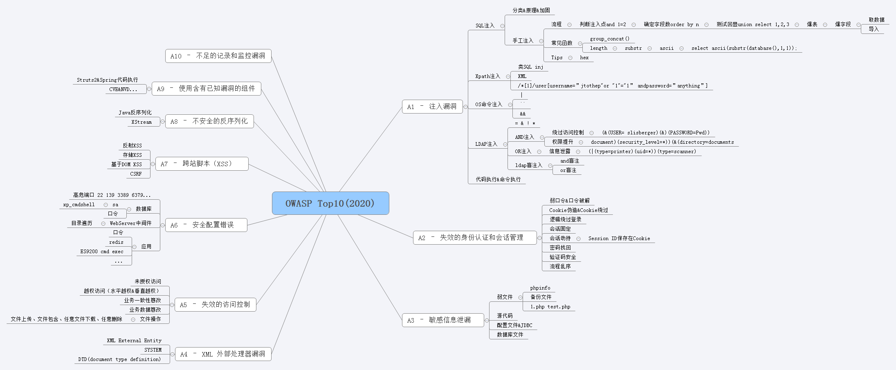
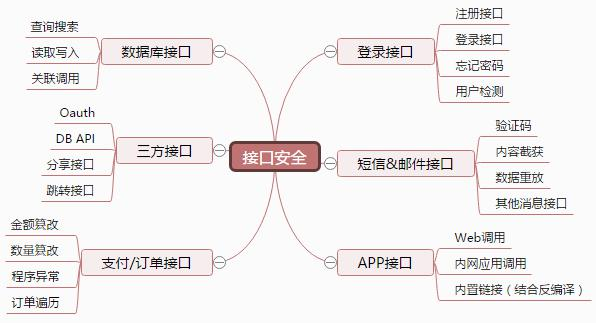

OWASPTop10
========================================

漏洞标准解读
~~~~~~~~~~~~~~~~~~~~~~~~~~~~~~~~~~~~~~~~
OWASP Top10漏洞体系长期以来作为Web攻防白帽子既基础又核心的一个标准。
官网：https://owasp.org/www-project-top-ten/

|owasp1|

A1-Injection（注入漏洞）
----------------------------------------

- 当不可信的数据作为命令或查询语句的一部分被发送给解释器的时候，会发生注入漏洞。
- 攻击者发送的恶意数据可能会诱使解释器执行计划外的命令，或在没有适当授权的情况下访问数据。
- 如： **SQL、NoSQL、OS命令注入，代码注入，表达式注入，模板注入以及LDAP注入** 等

A2-BrokenAuthentication（失效的身份认证）
-----------------------------------------

- 与认证和会话管理相关的应用函数经常被错误地实现，从而允许攻击者破坏密码、密钥或是会话令牌。
- 或者利用其他的应用漏洞来暂时或永久地获取用户身份信息。
- 如： **弱口令/口令破解，Cookie绕过/伪造，逻辑绕过登录，会话固定，会话劫持，密码找回，验证码安全，流程乱序** 

A3-Sensitive DataExposure（敏感数据泄露）
-----------------------------------------

- 许多 Web 应用程序和 API 不能正确的保护敏感数据，如金融、医疗保健和 PII（个人身份信息）等。攻击者可能会窃取或篡改这些弱保护的数据，从而进行信用卡欺诈、身份盗窃或其他犯罪行为。
- 在缺少额外保护（例如，在存放和传输过程中加密，且在与浏览器进行交换时需要特别谨慎）的情况下，敏感数据可能会受到损害。
- 如： **弱文件，源代码，配置文件/JDBC，数据库文件** 

A4-XML ExternalEntities（XXE）XML 外部处理器漏洞
-------------------------------------------------

- 许多过时的或配置不当的XML处理器在XML文档内进行外部实体引用。
- 外部实体可用于泄露内部文件，通过使用文件URI处理器、内部文件共享、内部端口扫描、远程代码执行以及拒绝服务攻击等手段。
- 如： **XXE** 

A5-Broken AccessControl（无效的访问控制）
-----------------------------------------

- 限制“认证的用户可以实现哪些操作”的命令没有得到正确的执行。
- 攻击者可以利用这些漏洞访问未经授权的功能和数据，例如访问其他用户的账户，查看敏感文件，篡改其他用户的数据，更改访问权限等。
- 如： **未授权访问，逻辑漏洞，越权访问，业务数据篡改，业务一致性篡改，文件上传，文件包含，任意文件下载/删除** 

A6-SecurityMisconfiguration（安全配置错误）
-------------------------------------------

- 安全配置错误是最常见的问题。
- 这通常是由不安全的默认配置，不完整或 ad hoc 配置，开放云存储，错误配置的 HTTP 标头，以及包含敏感信息的详细错误信息造成的。
- 所有的操作系统、框架、库、应用程序都需要进行安全配置外，还必须要及时进行系统更新和升级。
- **高危端口，目录遍历，webdav** 

A7-Cross-Siteing（XSS）跨站脚本攻击
----------------------------------------

- 如果应用程序在未经适当验证或转义的情况下，能够在新网页中包含不受信任的数据，或是使用可以创建 HTML 或者 Java 的浏览器 API 更新包含用户提供的数据的现有网页，就会出现 XSS 漏洞。
- XSS 允许攻击者在受害者的浏览器中执行脚本，这些脚本可以劫持用户会话、破坏网站或将用户重定向到恶意网站中。
- 如**反射XSS，存储XSS，DOM XSS等** 

A8-InsecureDeserialization（不安全的反序列化）
----------------------------------------------
- 不安全的反序列化漏洞通常会导致远程代码执行问题。
- 即使反序列化错误不会导致远程代码执行，也可以被用来执行攻击，包括重放攻击、注入攻击以及权限提升攻击等。

A9-UsingComponents with Known Vulnerabilities（使用含有已知漏洞的组件）
-----------------------------------------------------------------------
- 组件（如库、框架和其他软件模块）是以与应用程序相同的权限运行的。如果存在漏洞的组件被利用，这种攻击可能会导致严重的数据丢失或服务器接管危机。
- 使用已知漏洞组件的应用程序和API可能会破坏应用程序的防御系统，从而启动各种形式的攻击，造成更为严重的影响。
- 如 **structs&Spring代码执行等** 

A10-InsufficientLogging& Monitoring（不足的记录和监控漏洞）
------------------------------------------------------------
- 不足的记录和监控漏洞，再加上事件响应能力欠缺以及缺少有效的整合，使得攻击者可以进一步攻击系统，维持其持久性，转而攻击更多的系统，并篡改、提取或销毁数据。
- 大部分的数据泄露研究显示，检测出发生数据泄漏的时间通常需要超过 200 天，而且通常是外部机构率先发现数据泄漏的事实，而不是通过内部发现的。

接口安全
~~~~~~~~~~~~~~~~~~~~~~~~~~~~~~~~~~~~~~~~

|owasp5|

