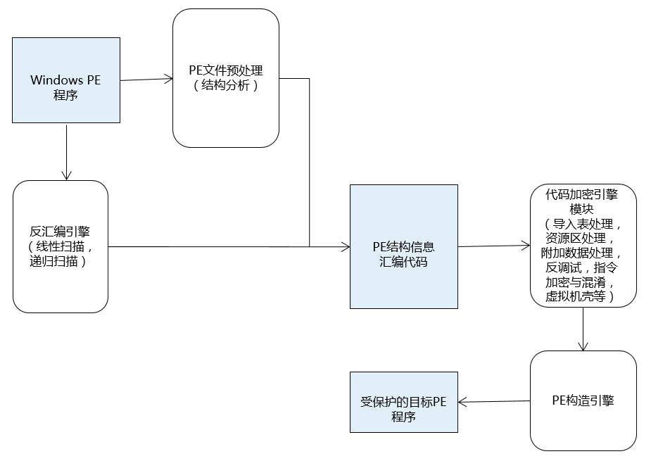
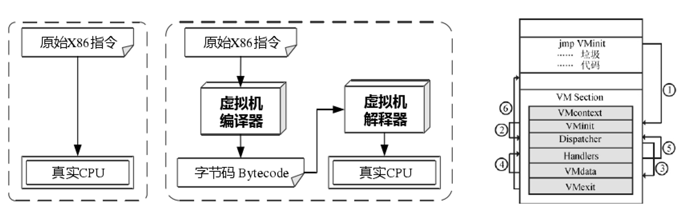
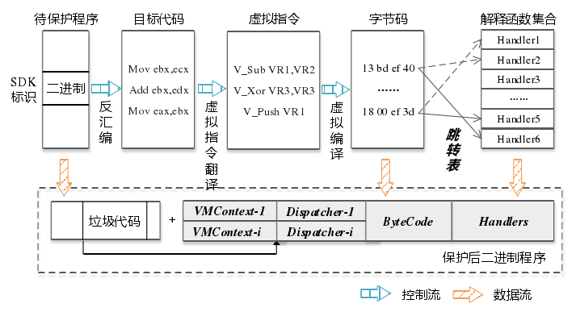
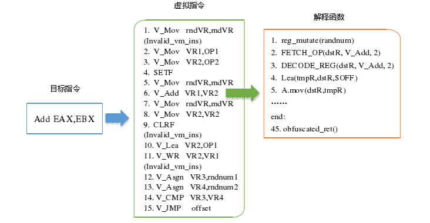

软件加密技术
========================================

程序保护构造思路
----------------------------------------
|packer1|

传统反逆向技术
----------------------------------------
- 符号消除
	| 字符串
	| 类名
	| 导入导出函数
	| 特征数据擦除
	| 密码算法魔数消除
- 花指令
	| 可执行式花指令
	| 不可执行花指令（垃圾指令，指令混淆）
- 迷惑反汇编
	| jmp、ret、call、垃圾数据

反调试技术
----------------------------------------
- 静态反调试
	- PEB
		| BeginDebbug：调试标志位
		| Ldr：内存状态
		| Heap（Flag，Force Flags）：堆状态
		| NtGlobalFlag：内核标志位
	- TEB
		| StaticUnicodeString：静态缓冲区
	- 原始API
		| NtQueryInformation()
		| ProcessDebugPort(0x07)
		| ProcessDebugObjectHandle(0x1E)
		| ProcessDebugFlag(0x1F)
		| NtQuerySystemInformation()
		| SystemKernelDebuggerInformation(0x23)
		| NtQueryObject():遍历内核对象
	- 攻击调试器
		| 分离调试器
		| NtSetInformationThread()
		| ThreadHideFromDebugger(0x11)
	- 进程检查
		SeDebugPrivilege：检查进程调试权限
	- TLS回调函数
	- 普通API
		| 父进程检查
		| 窗口名检查
		| 进程名遍历
		| 文件名及文件路径检查
		| 注册表检查

- 动态反调试
	- SEH
		异常，断点，SetUnhandleedExceptionFilter(),用户空间和系统空间跳变，干扰跟踪调试流程性能消耗
	- 时间检查
		RDTSC:汇编指令
	- 单步检查
		F7
	- 补丁检测
		| 0xCC内存扫描
		| Hash扫描
		| API断点扫描（第一个字节是否为0xCC）
	- 反反汇编
		| 指令截断
		| 指令混淆
		| 指令膨胀
		| 代码乱序
	- 偷取代码
		| 偷取OEP代码：将OEP代码移动到其他地方加密
		| 偷取API代码：将API部分起始代码移动到其他地方
	- 分页保护
		| 运行时保护分页：修改代码及数据段保护属性干扰分析
	- 壳
		| 压缩壳：配合OEP加密，干扰逆向分析
		| 加密壳：添加各种反调试手段，干扰逆向分析
	- 虚拟机
		| 函数虚拟机：部分函数放到虚拟机执行
		| 指令级虚拟机：所有指令经过虚拟机保护

- 虚拟机壳构造过程
	|packer2|
- 虚拟机壳构造细节
	|packer3|
- 虚拟机壳指令
	|packer4|

内核保护
----------------------------------------
- 驱动模块
- Hook检测
- 反外挂

