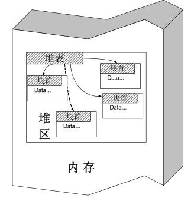
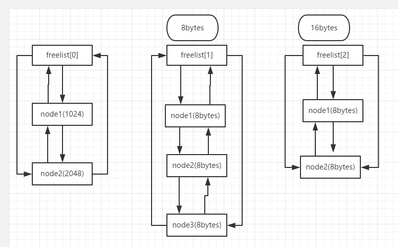
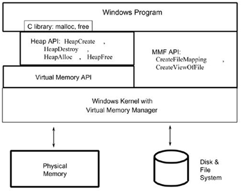

堆管理
========================================

堆
----------------------------------------

简介
~~~~~~~~~~~~~~~~~~~~~~~~~~~~~~~~~~~~~~~~
堆(heap)是一种基本的数据结构，它可由开发人员自行分配、释放。一般系统使用链表来管理空闲的堆内存，所以堆是不连续的。其中，链表的遍历是由低地址向高地址进行的。一般称管理堆的那部分程序为堆管理器，处于用户程序与内核中间，主要做以下工作:

- 响应用户的申请内存请求，向操作系统申请内存，然后将其返回给用户程序.
- 管理用户所释放的内存。

系统调用
~~~~~~~~~~~~~~~~~~~~~~~~~~~~~~~~~~~~~~~~~
 | 在动态申请和释放内存时，无论是malloc，free，new等函数，它们并不是真正与系统交互的函数。
 | |heap5|
 | 第一层：Win32 API作为系统的接口，提供了一组操作虚拟内存的接口；
 | 第二层：Heap作为虚拟内存的一部分，Win32 API又提供了一组操作Heap内存的接口，但是这些接口是建立在操作虚拟内存的接口的基础上。
 | 第三层：Windows平台下的C Run-Time Library 又利用Heap API来实现malloc和free。
 | 由此我们可以看出，这些动态内存操作方式之间存有单一的层次关系，位于这个层次的最低层的是Virtual Memory API，可以说这些方式都是建立在Virtual Memory API的基础上。
 | 调用关系如下表所示为 : new -> malloc -> HeapAlloc -> VirtualAlloc -> 驱动程序的_PageAlloc.

堆数据结构
~~~~~~~~~~~~~~~~~~~~~~~~~~~~~~~~~~~~~~~~~
现代操作系统的堆数据结构一般包括堆块和堆表。

	|heap1|

- 堆块
	堆块分为块首和块身，块首是一个堆块头部的8个字节，用于标识这个堆块自身的信息；块身是紧跟在块首后面的部分，也是最终分配给用户使用的数据区，堆管理系统所返回的指针一般指向块身的起始位置，在程序中是感觉不到块首的存在。
- 堆表（空表和快表）
	位于堆区的起始位置，堆表分为两种空闲双向链表Freelist（空表 128条）和快速单向链表Lookaside（快表 最多只有四项)。

	- 空表
		| ①堆区空闲堆块的块首都包含一对指针，这对指针用于将空闲的堆块组织成双向链表，按照大小的不同，总共分为128条。
		| ②堆区一开始的堆表区，中有一个128项的指针数组，叫空表数组索引，该数组的每一项都包含两个指针，用来标示一条空表。
		| ③空表的结构如下图所示：

			|heap2|

		::
		
			●freelist[0]被称为零号空表 并且是节点从第一个 1024bytes 逐渐增减1024的整数倍。
			 第二个及以后的节点 >=1024 bytes
			●从第二个链表开始即：free list【1】 开始： free list【1】 此空闲链表中每个节
			 点是八个字节。free list【2】 = 16bytes,即：节点的字节数 = 下表 * 8
			●此处谨记零号空闲链表。在堆分配的时候很重要。
			●空表的特点：可以发生堆块合并，分配的效率低

	- 快表
		| ①快速单项链表。块表是windows加速堆块分配的一种链表。
		| ②快表特点：永远处于占用态意味着不会发生合并，快表只包含四个节点。同样的快表也是包含128条，组织结构跟空表很类似，块表总是被初始化为空。 
		| ③结构如下图：

			|heap3|

堆分配策略
~~~~~~~~~~~~~~~~~~~~~~~~~~~~~~~~~~~~~~~~~
- 堆块的分配
	- 快表的分配
		包括寻找到精确匹配大小的空闲块，将此空闲块标注为占用状态，从快表中卸下，返回指向堆块块身的指针供程序使用。
	- 零号空表的分配
		零号空表中所有的空闲块是按照从小到大的顺序排列的，因此在分配的时候先从最后的堆块进行分配，看能否满足要求，如果能满足要求，则正向寻找最小能满足要求的堆块进行分配。
	- 空表分配
		普通空表进行分配时候，寻找最优解决方案，若不满满足最优解决方案，则采用次优解决方案进行分配。空表分配中存在找零钱的现象，即：当无法找到最有解决方案，次优解决方案的时候，就会从大的尾块中进行割下一小快能够满足要求的堆块，最后进行尾块的块首的状态信息进行修改即可。
	- 堆块分配的特点
		快表中只存在精确分配，不存在找零钱现象。空表中存在找零钱现象（不考虑堆缓存，碎片化等情况）
- 堆块的释放
	堆表的释放包括将讲占用态该为空闲态，释放的堆块链入相应的堆表，所有释放的都链入相应的表尾，分配的时候先从表尾进行分配。块表只包含四个节点；
- 堆块的合并
	经过反反复复的堆块的分配与释放，堆区会出新很多凌乱的碎片，这时候就需要用到堆块的合并，堆块的合并包括几个动作：将堆块从空表中卸下，合并堆块，修改合并后的块首，链接入新的琏表。（合并的时候还有一种操作叫内存紧缩）。 合并的时候之会合并相邻的堆块。
- 堆分配和释放算法
	|heap4|

调试堆
-----------------------------------------
调试堆不能使用OllyDbg,WinDbg等调试器加载程序，否则堆管理器会检测到当前进程处于调试状态，而使用调试堆管理策略。

 | **调试堆管理策略特点:** 
 | ●只用空表分配
 | ●所有堆块被加上8字节的0xAB和8字节的0x00，防止程序溢出
 | ●块首标志位不同

::

	为了避免程序检测调试器而使用调试堆管理策略，可以在创建堆之后加入人工断点：
	_asm int 3，然后让程序单独执行，然后用调试器附加进程，就可以看到真实的堆。

win7堆结构
-----------------------------------------

::

		typedef struct _HEAP_ENTRY
		{
			UINT SubSegmentCode;
			USHORT PreviousSize;
			BYTE SegmentOffset;
			BYTE UnusedBytes;
		}HEAP_ENTRY;
		 
		typedef struct _HEAP_SEGMENT
		 
		{
			HEAP_ENTRY Entry;
			UINT   SegmentSignature;
			UINT   SegmentFlags;
			LIST_ENTRY SegmentListEntry; //各heap_segment通过此字段连接
			PHEAP Heap;                  //指向所属的heap
			//...省略若干字段
			LIST_ENTRY UCRSegmentList;
		}HEAP_SEGMENT;
		 
		typedef struct _HEAP
		 
		{
			HEAP_SEGMENT Segment;
			UINT   Flags;
			UINT   ForceFlags;
			//...省略若干字段
			LIST_ENTRY SegmentList;	//通过此字段找到各heap_segment,从0号段开始，自然首先同HEAP最
						开始处那个HEAP_SEGMENT的SegmentListEntry链接
			//...省略若干字段
			HEAP_TUNING_PARAMETERS TuningParameters;
		}*PHEAP, HEAP;

- 区别
	HEAP结构记录HEAP_SEGMENT的方式采用了链表，这样不再受数组大小的约束，同时将HEAP_SEGMENT字段包含进HEAP，这样各堆段的起始便统一为HEAP_SEGMENT，不再有xp下0号段与其他段那种区别，可以统一进行管理了。
- 特点：
	在PEB中保存这进程的堆地址和数量。
	每个HEAP_SEGMENT都有多个堆块，每个堆块包含块首和块身，块身为我们申请得到的地址。

识别堆表
-----------------------------------------

示例代码
~~~~~~~~~~~~~~~~~~~~~~~~~~~~~~~~~~~~~~~~

::

	#include "stdafx.h"
	#include <windows.h>

	int main()
	{
		HLOCAL h1, h2, h3, h4, h5, h6;
		HANDLE hp;
		hp = HeapCreate(0, 0x1000, 0x10000);
		getchar();
		
		h1 = HeapAlloc(hp, HEAP_ZERO_MEMORY, 8);
		memset(h1, 0x11, 8);
		h2 = HeapAlloc(hp, HEAP_ZERO_MEMORY, 8);
		memset(h2, 0x22, 8);
		h3 = HeapAlloc(hp, HEAP_ZERO_MEMORY, 8);
		memset(h3, 0x33, 8);
		h4 = HeapAlloc(hp, HEAP_ZERO_MEMORY, 8);
		memset(h4, 0x44, 8);
		h5 = HeapAlloc(hp, HEAP_ZERO_MEMORY, 8);
		memset(h5, 0x55, 8);
		h6 = HeapAlloc(hp, HEAP_ZERO_MEMORY, 8);
		memset(h6, 0x66, 8);

		//free block and prevent coaleses
		HeapFree(hp, 0, h1); //free to freelist[2] 
		HeapFree(hp, 0, h3); //free to freelist[2] 
		HeapFree(hp, 0, h5); //free to freelist[4]

		h1= HeapAlloc(hp, HEAP_ZERO_MEMORY, 8);

		return 0;
	}

编译环境：
 | IDE：Visual Studio 2019，release
 | 编译选项：
 | 字符集：使用多字节字符集
 | c/c++->优化->优化：已禁用
 | c/c++->优化->启用内部函数：否
 | c/c++->优化->全程序优化：否
 | c/c++->预处理器->预处理定义：_CRT_SECURE_NO_WARNINGS（或禁用SDL）
 | c/c++->代码生成->安全检查：禁用安全检查（/GS-）
 | 链接器->高级->数据执行保护(DEP)-否
 | 链接器->高级->随机基址-否
 | 附件：`heapbase.zip <..//_static//heapbase.zip>`_

Win7-32-exe32
~~~~~~~~~~~~~~~~~~~~~~~~~~~~~~~~~~~~~~~~
- 运行环境
	Microsoft Windows 7 旗舰版 6.1.7601 Service Pack 1 Build 7601
- 设置_NT_SYMBOL_PATH环境变量
- 运行程序，并使用windbg附加
- .srcpath设置源代码路径
- 设置断点
	|heap6|
	 | ``u main main+50``
	 | ``bp 00401021``
	 | ``g``
- 查看堆栈

	::
	
		0:000> .process
		Implicit process is now 7ffd3000
		0:000> dt ntdll!_PEB 7ffd3000
		   +0x000 InheritedAddressSpace : 0 ''
		   +0x001 ReadImageFileExecOptions : 0 ''
		   +0x002 BeingDebugged    : 0x1 ''
		   +0x003 BitField         : 0 ''
		   +0x003 ImageUsesLargePages : 0y0
		   +0x003 IsProtectedProcess : 0y0
		   +0x003 IsLegacyProcess  : 0y0
		   +0x003 IsImageDynamicallyRelocated : 0y0
		   +0x003 SkipPatchingUser32Forwarders : 0y0
		   +0x003 SpareBits        : 0y000
		   +0x004 Mutant           : 0xffffffff Void
		   +0x008 ImageBaseAddress : 0x00400000 Void
		   +0x00c Ldr              : 0x777a7880 _PEB_LDR_DATA
		   +0x010 ProcessParameters : 0x002b1160 _RTL_USER_PROCESS_PARAMETERS
		   +0x014 SubSystemData    : (null) 
		   +0x018 ProcessHeap      : 0x002b0000 Void
		   +0x01c FastPebLock      : 0x777a7380 _RTL_CRITICAL_SECTION
		   +0x020 AtlThunkSListPtr : (null) 
		   +0x024 IFEOKey          : (null) 
		   +0x028 CrossProcessFlags : 0
		   +0x028 ProcessInJob     : 0y0
		   +0x028 ProcessInitializing : 0y0
		   +0x028 ProcessUsingVEH  : 0y0
		   +0x028 ProcessUsingVCH  : 0y0
		   +0x028 ProcessUsingFTH  : 0y0
		   +0x028 ReservedBits0    : 0y000000000000000000000000000 (0)
		   +0x02c KernelCallbackTable : (null) 
		   +0x02c UserSharedInfoPtr : (null) 
		   +0x030 SystemReserved   : [1] 0
		   +0x034 AtlThunkSListPtr32 : 0
		   +0x038 ApiSetMap        : 0x77910000 Void
		   +0x03c TlsExpansionCounter : 0
		   +0x040 TlsBitmap        : 0x777a7260 Void
		   +0x044 TlsBitmapBits    : [2] 1
		   +0x04c ReadOnlySharedMemoryBase : 0x7f6f0000 Void
		   +0x050 HotpatchInformation : (null) 
		   +0x054 ReadOnlyStaticServerData : 0x7f6f0590  -> (null) 
		   +0x058 AnsiCodePageData : 0x7ffa0000 Void
		   +0x05c OemCodePageData  : 0x7ffa0000 Void
		   +0x060 UnicodeCaseTableData : 0x7ffd0024 Void
		   +0x064 NumberOfProcessors : 1
		   +0x068 NtGlobalFlag     : 0
		   +0x070 CriticalSectionTimeout : _LARGE_INTEGER 0xffffe86d`079b8000
		   +0x078 HeapSegmentReserve : 0x100000
		   +0x07c HeapSegmentCommit : 0x2000
		   +0x080 HeapDeCommitTotalFreeThreshold : 0x10000
		   +0x084 HeapDeCommitFreeBlockThreshold : 0x1000
		   +0x088 NumberOfHeaps    : 4
		   +0x08c MaximumNumberOfHeaps : 0x10
		   +0x090 ProcessHeaps     : 0x777a7500  -> 0x002b0000 Void
		   +0x094 GdiSharedHandleTable : (null) 
		   +0x098 ProcessStarterHelper : (null) 
		   +0x09c GdiDCAttributeList : 0
		   +0x0a0 LoaderLock       : 0x777a7340 _RTL_CRITICAL_SECTION
		   +0x0a4 OSMajorVersion   : 6
		   +0x0a8 OSMinorVersion   : 1
		   +0x0ac OSBuildNumber    : 0x1db1
		   +0x0ae OSCSDVersion     : 0x100
		   +0x0b0 OSPlatformId     : 2
		   +0x0b4 ImageSubsystem   : 3
		   +0x0b8 ImageSubsystemMajorVersion : 6
		   +0x0bc ImageSubsystemMinorVersion : 0
		   +0x0c0 ActiveProcessAffinityMask : 1
		   +0x0c4 GdiHandleBuffer  : [34] 0
		   +0x14c PostProcessInitRoutine : (null) 
		   +0x150 TlsExpansionBitmap : 0x777a7268 Void
		   +0x154 TlsExpansionBitmapBits : [32] 1
		   +0x1d4 SessionId        : 1
		   +0x1d8 AppCompatFlags   : _ULARGE_INTEGER 0x0
		   +0x1e0 AppCompatFlagsUser : _ULARGE_INTEGER 0x0
		   +0x1e8 pShimData        : (null) 
		   +0x1ec AppCompatInfo    : (null) 
		   +0x1f0 CSDVersion       : _UNICODE_STRING "Service Pack 1"
		   +0x1f8 ActivationContextData : 0x00140000 _ACTIVATION_CONTEXT_DATA
		   +0x1fc ProcessAssemblyStorageMap : (null) 
		   +0x200 SystemDefaultActivationContextData : 0x00130000 _ACTIVATION_CONTEXT_DATA
		   +0x204 SystemAssemblyStorageMap : (null) 
		   +0x208 MinimumStackCommit : 0
		   +0x20c FlsCallback      : 0x002c0b30 _FLS_CALLBACK_INFO
		   +0x210 FlsListHead      : _LIST_ENTRY [ 0x2c0920 - 0x2c0920 ]
		   +0x218 FlsBitmap        : 0x777a7270 Void
		   +0x21c FlsBitmapBits    : [4] 0x1f
		   +0x22c FlsHighIndex     : 4
		   +0x230 WerRegistrationData : (null) 
		   +0x234 WerShipAssertPtr : (null) 
		   +0x238 pContextData     : 0x00150000 Void
		   +0x23c pImageHeaderHash : (null) 
		   +0x240 TracingFlags     : 0
		   +0x240 HeapTracingEnabled : 0y0
		   +0x240 CritSecTracingEnabled : 0y0
		   +0x240 SpareTracingBits : 0y000000000000000000000000000000 (0)
		0:000> !heap -l
		Searching the memory for potential unreachable busy blocks.
		Heap 002b0000
		Heap 00010000
		Heap 00020000
		Heap 00560000
		Scanning VM ...
		Scanning references from 234 busy blocks (0 MBytes) ...
		Entry     User      Heap      Segment       Size  PrevSize  Unused    Flags
		-----------------------------------------------------------------------------
		002c4108  002c4110  002b0000  002b0000        88       808         8  busy 
		1 potential unreachable blocks were detected.
		0:000> dt _HEAP 00560000
		ntdll!_HEAP
		   +0x000 Entry            : _HEAP_ENTRY
		   +0x008 SegmentSignature : 0xffeeffee
		   +0x00c SegmentFlags     : 0
		   +0x010 SegmentListEntry : _LIST_ENTRY [ 0x5600a8 - 0x5600a8 ]
		   +0x018 Heap             : 0x00560000 _HEAP
		   +0x01c BaseAddress      : 0x00560000 Void
		   +0x020 NumberOfPages    : 0x10
		   +0x024 FirstEntry       : 0x00560588 _HEAP_ENTRY
		   +0x028 LastValidEntry   : 0x00570000 _HEAP_ENTRY
		   +0x02c NumberOfUnCommittedPages : 0xf
		   +0x030 NumberOfUnCommittedRanges : 1
		   +0x034 SegmentAllocatorBackTraceIndex : 0
		   +0x036 Reserved         : 0
		   +0x038 UCRSegmentList   : _LIST_ENTRY [ 0x560ff0 - 0x560ff0 ]
		   +0x040 Flags            : 0x1000
		   +0x044 ForceFlags       : 0
		   +0x048 CompatibilityFlags : 0
		   +0x04c EncodeFlagMask   : 0x100000
		   +0x050 Encoding         : _HEAP_ENTRY
		   +0x058 PointerKey       : 0xf99011e
		   +0x05c Interceptor      : 0
		   +0x060 VirtualMemoryThreshold : 0xfe00
		   +0x064 Signature        : 0xeeffeeff
		   +0x068 SegmentReserve   : 0x100000
		   +0x06c SegmentCommit    : 0x2000
		   +0x070 DeCommitFreeBlockThreshold : 0x200
		   +0x074 DeCommitTotalFreeThreshold : 0x2000
		   +0x078 TotalFreeSize    : 0x14b
		   +0x07c MaximumAllocationSize : 0x7ffdefff
		   +0x080 ProcessHeapsListIndex : 4
		   +0x082 HeaderValidateLength : 0x138
		   +0x084 HeaderValidateCopy : (null) 
		   +0x088 NextAvailableTagIndex : 0
		   +0x08a MaximumTagIndex  : 0
		   +0x08c TagEntries       : (null) 
		   +0x090 UCRList          : _LIST_ENTRY [ 0x560fe8 - 0x560fe8 ]
		   +0x098 AlignRound       : 0xf
		   +0x09c AlignMask        : 0xfffffff8
		   +0x0a0 VirtualAllocdBlocks : _LIST_ENTRY [ 0x5600a0 - 0x5600a0 ]
		   +0x0a8 SegmentList      : _LIST_ENTRY [ 0x560010 - 0x560010 ]
		   +0x0b0 AllocatorBackTraceIndex : 0
		   +0x0b4 NonDedicatedListLength : 0
		   +0x0b8 BlocksIndex      : 0x00560150 Void
		   +0x0bc UCRIndex         : (null) 
		   +0x0c0 PseudoTagEntries : (null) 
		   +0x0c4 FreeLists        : _LIST_ENTRY [ 0x560590 - 0x560590 ]
		   +0x0cc LockVariable     : 0x00560138 _HEAP_LOCK
		   +0x0d0 CommitRoutine    : 0x0f99011e     long  +f99011e
		   +0x0d4 FrontEndHeap     : (null) 
		   +0x0d8 FrontHeapLockCount : 0
		   +0x0da FrontEndHeapType : 0 ''
		   +0x0dc Counters         : _HEAP_COUNTERS
		   +0x130 TuningParameters : _HEAP_TUNING_PARAMETERS
		0:000> !heap -a 00560000
		Index   Address  Name      Debugging options enabled
		  4:   00560000 
			Segment at 00560000 to 00570000 (00001000 bytes committed)
			Flags:                00001000
			ForceFlags:           00000000
			Granularity:          8 bytes
			Segment Reserve:      00100000
			Segment Commit:       00002000
			DeCommit Block Thres: 00000200
			DeCommit Total Thres: 00002000
			Total Free Size:      0000014b
			Max. Allocation Size: 7ffdefff
			Lock Variable at:     00560138
			Next TagIndex:        0000
			Maximum TagIndex:     0000
			Tag Entries:          00000000
			PsuedoTag Entries:    00000000
			Virtual Alloc List:   005600a0
			Uncommitted ranges:   00560090
					00561000: 0000f000  (61440 bytes)
			FreeList[ 00 ] at 005600c4: 00560590 . 00560590  
				00560588: 00588 . 00a58 [100] - free

			Segment00 at 00560000:
				Flags:           00000000
				Base:            00560000
				First Entry:     00560588
				Last Entry:      00570000
				Total Pages:     00000010
				Total UnCommit:  0000000f
				Largest UnCommit:00000000
				UnCommitted Ranges: (1)

			Heap entries for Segment00 in Heap 00560000
				00560000: 00000 . 00588 [101] - busy (587)
				00560588: 00588 . 00a58 [100]
				00560fe0: 00a58 . 00020 [111] - busy (1d)
				00561000:      0000f000      - uncommitted bytes.
		0:000> p
		eax=00560590 ebx=7ffd3000 ecx=77725dd3 edx=00000000 esi=002c4198 edi=002c3438
		eip=00401032 esp=0012ff24 ebp=0012ff40 iopl=0         nv up ei pl zr na pe nc
		cs=001b  ss=0023  ds=0023  es=0023  fs=003b  gs=0000             efl=00000246
		HeapBase!main+0x32:
		00401032 6a08            push    8
		0:000> !heap -a 00560000
		Index   Address  Name      Debugging options enabled
		  4:   00560000 
			Segment at 00560000 to 00570000 (00001000 bytes committed)
			Flags:                00001000
			ForceFlags:           00000000
			Granularity:          8 bytes
			Segment Reserve:      00100000
			Segment Commit:       00002000
			DeCommit Block Thres: 00000200
			DeCommit Total Thres: 00002000
			Total Free Size:      00000149
			Max. Allocation Size: 7ffdefff
			Lock Variable at:     00560138
			Next TagIndex:        0000
			Maximum TagIndex:     0000
			Tag Entries:          00000000
			PsuedoTag Entries:    00000000
			Virtual Alloc List:   005600a0
			Uncommitted ranges:   00560090
					00561000: 0000f000  (61440 bytes)
			FreeList[ 00 ] at 005600c4: 005605a0 . 005605a0  
				00560598: 00010 . 00a48 [100] - free

			Segment00 at 00560000:
				Flags:           00000000
				Base:            00560000
				First Entry:     00560588
				Last Entry:      00570000
				Total Pages:     00000010
				Total UnCommit:  0000000f
				Largest UnCommit:00000000
				UnCommitted Ranges: (1)

			Heap entries for Segment00 in Heap 00560000
				00560000: 00000 . 00588 [101] - busy (587)
				00560588: 00588 . 00010 [101] - busy (8)
				00560598: 00010 . 00a48 [100]
				00560fe0: 00a48 . 00020 [111] - busy (1d)
				00561000:      0000f000      - uncommitted bytes.
		0:000> dv h1
			h1 = 0x00560590
		此时分配的h1内存地址为0x00560590，0x00560590-0x8(sizeof(_HEAP_ENTRY))为0x00560588，
		即00560588: 00588 . 00010 [101] - busy (8)
		第一项为地址，第二项00588为上一项的堆块大小，00010为本堆块的大小，[101]为是这个内存的标志位，
		最右边的1表示内存块被占用，然后busy (8)表示这块内存被占用，申请的内存为0x8，加上块首的大小为
		0x8，一共是0x10.
		0:000> dd 00560588
		00560588  381043a3 080040c9 00000000 00000000
		00560598  731142e8 0000407a 005600c4 005600c4
		005605a8  00000000 00000000 00000000 00000000
		005605b8  00000000 00000000 00000000 00000000
		005605c8  00000000 00000000 00000000 00000000
		005605d8  00000000 00000000 00000000 00000000
		005605e8  00000000 00000000 00000000 00000000
		005605f8  00000000 00000000 00000000 00000000
		0:000> dt _HEAP_ENTRY 00560588
		ntdll!_HEAP_ENTRY
		   +0x000 Size             : 0x43a3
		   +0x002 Flags            : 0x10 ''
		   +0x003 SmallTagIndex    : 0x38 '8'
		   +0x000 SubSegmentCode   : 0x381043a3 Void
		   +0x004 PreviousSize     : 0x40c9
		   +0x006 SegmentOffset    : 0 ''
		   +0x006 LFHFlags         : 0 ''
		   +0x007 UnusedBytes      : 0x8 ''
		   +0x000 FunctionIndex    : 0x43a3
		   +0x002 ContextValue     : 0x3810
		   +0x000 InterceptorValue : 0x381043a3
		   +0x004 UnusedBytesLength : 0x40c9
		   +0x006 EntryOffset      : 0 ''
		   +0x007 ExtendedBlockSignature : 0x8 ''
		   +0x000 Code1            : 0x381043a3
		   +0x004 Code2            : 0x40c9
		   +0x006 Code3            : 0 ''
		   +0x007 Code4            : 0x8 ''
		   +0x000 AgregateCode     : 0x80040c9`381043a3
		注：相对于XP，Vista之后增加了对堆块的头结构(HEAP_ENTRY)的编码。编码的目的是引入随机性，增加堆
		的安全性，防止黑客轻易就可以预测堆的数据结构内容而实施攻击。在_HEAP结构中新增了如下两个字段：
		其中的EncodeFlagMask用来指示是否启用编码功能，Encoding字段是用来编码的，编码的方法就是用这个
		Encoding结构与每个堆块的头结构做亦或(XOR)。
		0:000> dd 00560000 +0x050
		00560050  3b1143a1 00004078 0f99011e 00000000
		00560060  0000fe00 eeffeeff 00100000 00002000
		00560070  00000200 00002000 00000149 7ffdefff
		00560080  01380004 00000000 00000000 00000000
		00560090  00560fe8 00560fe8 0000000f fffffff8
		005600a0  005600a0 005600a0 00560010 00560010
		005600b0  00000000 00000000 00560150 00000000
		005600c0  00000000 005605a0 005605a0 00560138
		0:000> dd 00560588
		00560588  381043a3 080040c9 00000000 00000000
		00560598  731142e8 0000407a 005600c4 005600c4
		005605a8  00000000 00000000 00000000 00000000
		005605b8  00000000 00000000 00000000 00000000
		005605c8  00000000 00000000 00000000 00000000
		005605d8  00000000 00000000 00000000 00000000
		005605e8  00000000 00000000 00000000 00000000
		005605f8  00000000 00000000 00000000 00000000
		0:000> ?3b1143a1^381043a3
		Evaluate expression: 50397186 = 03010002
		0:000> ?00004078^080040c9
		Evaluate expression: 134217905 = 080000b1
		低地址的word是Size字段，所以Size字段是0x2，因为是以0x8为内存粒度的，所以字节大小为
		0:000> ?0x2*8
		Evaluate expression: 16 = 00000010
		0:000> p
		eax=00560590 ebx=7ffd3000 ecx=00000000 edx=002c3438 esi=002c4198 edi=002c3438
		eip=00401042 esp=0012ff24 ebp=0012ff40 iopl=0         nv up ei pl nz ac pe nc
		cs=001b  ss=0023  ds=0023  es=0023  fs=003b  gs=0000             efl=00000216
		HeapBase!main+0x42:
		00401042 6a08            push    8
		0:000> !heap -a 00560000
		Index   Address  Name      Debugging options enabled
		  4:   00560000 
			Segment at 00560000 to 00570000 (00001000 bytes committed)
			Flags:                00001000
			ForceFlags:           00000000
			Granularity:          8 bytes
			Segment Reserve:      00100000
			Segment Commit:       00002000
			DeCommit Block Thres: 00000200
			DeCommit Total Thres: 00002000
			Total Free Size:      00000149
			Max. Allocation Size: 7ffdefff
			Lock Variable at:     00560138
			Next TagIndex:        0000
			Maximum TagIndex:     0000
			Tag Entries:          00000000
			PsuedoTag Entries:    00000000
			Virtual Alloc List:   005600a0
			Uncommitted ranges:   00560090
					00561000: 0000f000  (61440 bytes)
			FreeList[ 00 ] at 005600c4: 005605a0 . 005605a0  
				00560598: 00010 . 00a48 [100] - free

			Segment00 at 00560000:
				Flags:           00000000
				Base:            00560000
				First Entry:     00560588
				Last Entry:      00570000
				Total Pages:     00000010
				Total UnCommit:  0000000f
				Largest UnCommit:00000000
				UnCommitted Ranges: (1)

			Heap entries for Segment00 in Heap 00560000
				00560000: 00000 . 00588 [101] - busy (587)
				00560588: 00588 . 00010 [101] - busy (8)
				00560598: 00010 . 00a48 [100]
				00560fe0: 00a48 . 00020 [111] - busy (1d)
				00561000:      0000f000      - uncommitted bytes.

		0:000> db 00560588
		00560588  a3 43 10 38 c9 40 00 08-11 11 11 11 11 11 11 11  .C.8.@..........
		00560598  e8 42 11 73 7a 40 00 00-c4 00 56 00 c4 00 56 00  .B.sz@....V...V.
		005605a8  00 00 00 00 00 00 00 00-00 00 00 00 00 00 00 00  ................
		005605b8  00 00 00 00 00 00 00 00-00 00 00 00 00 00 00 00  ................
		005605c8  00 00 00 00 00 00 00 00-00 00 00 00 00 00 00 00  ................
		005605d8  00 00 00 00 00 00 00 00-00 00 00 00 00 00 00 00  ................
		005605e8  00 00 00 00 00 00 00 00-00 00 00 00 00 00 00 00  ................
		005605f8  00 00 00 00 00 00 00 00-00 00 00 00 00 00 00 00  ................
		
		此时空表指针：
		+0x0c4 FreeLists        : _LIST_ENTRY [ 0x5605a0 - 0x5605a0 ]
		0:000> p
		eax=005605a0 ebx=7ffd3000 ecx=77725dd3 edx=00000000 esi=002c4198 edi=002c3438
		eip=00401053 esp=0012ff24 ebp=0012ff40 iopl=0         nv up ei pl zr na pe nc
		cs=001b  ss=0023  ds=0023  es=0023  fs=003b  gs=0000             efl=00000246
		HeapBase!main+0x53:
		00401053 6a08            push    8
		0:000> !heap -a 00560000
		Index   Address  Name      Debugging options enabled
		  4:   00560000 
			Segment at 00560000 to 00570000 (00001000 bytes committed)
			Flags:                00001000
			ForceFlags:           00000000
			Granularity:          8 bytes
			Segment Reserve:      00100000
			Segment Commit:       00002000
			DeCommit Block Thres: 00000200
			DeCommit Total Thres: 00002000
			Total Free Size:      00000147
			Max. Allocation Size: 7ffdefff
			Lock Variable at:     00560138
			Next TagIndex:        0000
			Maximum TagIndex:     0000
			Tag Entries:          00000000
			PsuedoTag Entries:    00000000
			Virtual Alloc List:   005600a0
			Uncommitted ranges:   00560090
					00561000: 0000f000  (61440 bytes)
			FreeList[ 00 ] at 005600c4: 005605b0 . 005605b0  
				005605a8: 00010 . 00a38 [100] - free

			Segment00 at 00560000:
				Flags:           00000000
				Base:            00560000
				First Entry:     00560588
				Last Entry:      00570000
				Total Pages:     00000010
				Total UnCommit:  0000000f
				Largest UnCommit:00000000
				UnCommitted Ranges: (1)

			Heap entries for Segment00 in Heap 00560000
				00560000: 00000 . 00588 [101] - busy (587)
				00560588: 00588 . 00010 [101] - busy (8)
				00560598: 00010 . 00010 [101] - busy (8)
				005605a8: 00010 . 00a38 [100]
				00560fe0: 00a38 . 00020 [111] - busy (1d)
				00561000:      0000f000      - uncommitted bytes.
		此时空表指针：
		0x0c4 FreeLists        : _LIST_ENTRY [ 0x5605b0 - 0x5605b0 ]
		0:000> p
		eax=005605a0 ebx=7ffd3000 ecx=00000000 edx=002c3438 esi=002c4198 edi=002c3438
		eip=00401063 esp=0012ff24 ebp=0012ff40 iopl=0         nv up ei pl nz ac pe nc
		cs=001b  ss=0023  ds=0023  es=0023  fs=003b  gs=0000             efl=00000216
		HeapBase!main+0x63:
		00401063 6a08            push    8
		0:000> p
		eax=005605b0 ebx=7ffd3000 ecx=77725dd3 edx=00000000 esi=002c4198 edi=002c3438
		eip=00401074 esp=0012ff24 ebp=0012ff40 iopl=0         nv up ei pl zr na pe nc
		cs=001b  ss=0023  ds=0023  es=0023  fs=003b  gs=0000             efl=00000246
		HeapBase!main+0x74:
		00401074 6a08            push    8
		0:000> p
		eax=005605b0 ebx=7ffd3000 ecx=00000000 edx=002c3438 esi=002c4198 edi=002c3438
		eip=00401084 esp=0012ff24 ebp=0012ff40 iopl=0         nv up ei pl nz ac pe nc
		cs=001b  ss=0023  ds=0023  es=0023  fs=003b  gs=0000             efl=00000216
		HeapBase!main+0x84:
		00401084 6a08            push    8
		0:000> p
		eax=005605c0 ebx=7ffd3000 ecx=77725dd3 edx=00000000 esi=002c4198 edi=002c3438
		eip=00401095 esp=0012ff24 ebp=0012ff40 iopl=0         nv up ei pl zr na pe nc
		cs=001b  ss=0023  ds=0023  es=0023  fs=003b  gs=0000             efl=00000246
		HeapBase!main+0x95:
		00401095 6a08            push    8
		0:000> p
		eax=005605c0 ebx=7ffd3000 ecx=00000000 edx=002c3438 esi=002c4198 edi=002c3438
		eip=004010a5 esp=0012ff24 ebp=0012ff40 iopl=0         nv up ei pl nz ac pe nc
		cs=001b  ss=0023  ds=0023  es=0023  fs=003b  gs=0000             efl=00000216
		HeapBase!main+0xa5:
		004010a5 6a08            push    8
		0:000> p
		eax=005605d0 ebx=7ffd3000 ecx=77725dd3 edx=00000000 esi=002c4198 edi=002c3438
		eip=004010b6 esp=0012ff24 ebp=0012ff40 iopl=0         nv up ei pl zr na pe nc
		cs=001b  ss=0023  ds=0023  es=0023  fs=003b  gs=0000             efl=00000246
		HeapBase!main+0xb6:
		004010b6 6a08            push    8
		0:000> p
		eax=005605d0 ebx=7ffd3000 ecx=00000000 edx=002c3438 esi=002c4198 edi=002c3438
		eip=004010c6 esp=0012ff24 ebp=0012ff40 iopl=0         nv up ei pl nz ac pe nc
		cs=001b  ss=0023  ds=0023  es=0023  fs=003b  gs=0000             efl=00000216
		HeapBase!main+0xc6:
		004010c6 6a08            push    8
		0:000> p
		eax=005605e0 ebx=7ffd3000 ecx=77725dd3 edx=00000000 esi=002c4198 edi=002c3438
		eip=004010d7 esp=0012ff24 ebp=0012ff40 iopl=0         nv up ei pl zr na pe nc
		cs=001b  ss=0023  ds=0023  es=0023  fs=003b  gs=0000             efl=00000246
		HeapBase!main+0xd7:
		004010d7 6a08            push    8
		0:000> p
		eax=005605e0 ebx=7ffd3000 ecx=00000000 edx=002c3438 esi=002c4198 edi=002c3438
		eip=004010e7 esp=0012ff24 ebp=0012ff40 iopl=0         nv up ei pl nz ac pe nc
		cs=001b  ss=0023  ds=0023  es=0023  fs=003b  gs=0000             efl=00000216
		HeapBase!main+0xe7:
		004010e7 8b45f8          mov     eax,dword ptr [ebp-8] ss:0023:0012ff38=00560590
		执行到开始释放内存。
		0:000> !heap -a 00560000
		Index   Address  Name      Debugging options enabled
		  4:   00560000 
			Segment at 00560000 to 00570000 (00001000 bytes committed)
			Flags:                00001000
			ForceFlags:           00000000
			Granularity:          8 bytes
			Segment Reserve:      00100000
			Segment Commit:       00002000
			DeCommit Block Thres: 00000200
			DeCommit Total Thres: 00002000
			Total Free Size:      0000013f
			Max. Allocation Size: 7ffdefff
			Lock Variable at:     00560138
			Next TagIndex:        0000
			Maximum TagIndex:     0000
			Tag Entries:          00000000
			PsuedoTag Entries:    00000000
			Virtual Alloc List:   005600a0
			Uncommitted ranges:   00560090
					00561000: 0000f000  (61440 bytes)
			FreeList[ 00 ] at 005600c4: 005605f0 . 005605f0  
				005605e8: 00010 . 009f8 [100] - free

			Segment00 at 00560000:
				Flags:           00000000
				Base:            00560000
				First Entry:     00560588
				Last Entry:      00570000
				Total Pages:     00000010
				Total UnCommit:  0000000f
				Largest UnCommit:00000000
				UnCommitted Ranges: (1)

			Heap entries for Segment00 in Heap 00560000
				00560000: 00000 . 00588 [101] - busy (587)
				00560588: 00588 . 00010 [101] - busy (8)
				00560598: 00010 . 00010 [101] - busy (8)
				005605a8: 00010 . 00010 [101] - busy (8)
				005605b8: 00010 . 00010 [101] - busy (8)
				005605c8: 00010 . 00010 [101] - busy (8)
				005605d8: 00010 . 00010 [101] - busy (8)
				005605e8: 00010 . 009f8 [100]
				00560fe0: 009f8 . 00020 [111] - busy (1d)
				00561000:      0000f000      - uncommitted bytes.
		0:000> dd 00560588
		00560588  381043a3 080040c9 11111111 11111111
		00560598  381043a3 0800407a 22222222 22222222
		005605a8  381043a3 0800407a 33333333 33333333
		005605b8  381043a3 0800407a 44444444 44444444
		005605c8  381043a3 0800407a 55555555 55555555
		005605d8  381043a3 0800407a 66666666 66666666
		005605e8  0511429e 0000407a 005600c4 005600c4
		005605f8  00000000 00000000 00000000 00000000
		此时空表指针：
		+0x0c4 FreeLists        : _LIST_ENTRY [ 0x5605f0 - 0x5605f0 ]
		0:000> p
		eax=00000001 ebx=7ffd3000 ecx=77726570 edx=00560174 esi=002c4198 edi=002c3438
		eip=004010f7 esp=0012ff24 ebp=0012ff40 iopl=0         nv up ei pl zr na pe nc
		cs=001b  ss=0023  ds=0023  es=0023  fs=003b  gs=0000             efl=00000246
		HeapBase!main+0xf7:
		004010f7 8b55f4          mov     edx,dword ptr [ebp-0Ch] ss:0023:0012ff34=005605b0
		0:000> !heap -a 00560000
		Index   Address  Name      Debugging options enabled
		  4:   00560000 
			Segment at 00560000 to 00570000 (00001000 bytes committed)
			Flags:                00001000
			ForceFlags:           00000000
			Granularity:          8 bytes
			Segment Reserve:      00100000
			Segment Commit:       00002000
			DeCommit Block Thres: 00000200
			DeCommit Total Thres: 00002000
			Total Free Size:      00000141
			Max. Allocation Size: 7ffdefff
			Lock Variable at:     00560138
			Next TagIndex:        0000
			Maximum TagIndex:     0000
			Tag Entries:          00000000
			PsuedoTag Entries:    00000000
			Virtual Alloc List:   005600a0
			Uncommitted ranges:   00560090
					00561000: 0000f000  (61440 bytes)
			FreeList[ 00 ] at 005600c4: 005605f0 . 00560590  
				00560588: 00588 . 00010 [100] - free
				005605e8: 00010 . 009f8 [100] - free

			Segment00 at 00560000:
				Flags:           00000000
				Base:            00560000
				First Entry:     00560588
				Last Entry:      00570000
				Total Pages:     00000010
				Total UnCommit:  0000000f
				Largest UnCommit:00000000
				UnCommitted Ranges: (1)

			Heap entries for Segment00 in Heap 00560000
				00560000: 00000 . 00588 [101] - busy (587)
				00560588: 00588 . 00010 [100]
				00560598: 00010 . 00010 [101] - busy (8)
				005605a8: 00010 . 00010 [101] - busy (8)
				005605b8: 00010 . 00010 [101] - busy (8)
				005605c8: 00010 . 00010 [101] - busy (8)
				005605d8: 00010 . 00010 [101] - busy (8)
				005605e8: 00010 . 009f8 [100]
				00560fe0: 009f8 . 00020 [111] - busy (1d)
				00561000:      0000f000      - uncommitted bytes.
		此时空表指针：
		+0x0c4 FreeLists        : _LIST_ENTRY [ 0x560590 - 0x5605f0 ]
		0:000> dd 00560588
		00560588  391143a3 000040c9 005605f0 005600c4
		00560598  381043a3 0800407a 22222222 22222222
		005605a8  381043a3 0800407a 33333333 33333333
		005605b8  381043a3 0800407a 44444444 44444444
		005605c8  381043a3 0800407a 55555555 55555555
		005605d8  381043a3 0800407a 66666666 66666666
		005605e8  0511429e 0000407a 005600c4 00560590
		005605f8  00000000 00000000 00000000 00000000
		三次释放完毕后：
		0:000> dd 00560588
		00560588  391143a3 000040c9 005605f0 005605b0
		00560598  381043a3 0800407a 22222222 22222222
		005605a8  391143a3 0000407a 00560590 005605d0
		005605b8  381043a3 0800407a 44444444 44444444
		005605c8  391143a3 0000407a 005605b0 005600c4
		005605d8  381043a3 0800407a 66666666 66666666
		005605e8  0511429e 0000407a 005600c4 00560590
		005605f8  00000000 00000000 00000000 00000000
		此时被释放区域形成了一个双向链表，内存分配粒度为0x8，内存区域最少
		可容纳链表的前后向指针。
		再次分配:
		0:000> dv h1
			h1 = 0x005605d0
		0:000> !heap -a 00560000
		Index   Address  Name      Debugging options enabled
		  4:   00560000 
			Segment at 00560000 to 00570000 (00001000 bytes committed)
			Flags:                00001000
			ForceFlags:           00000000
			Granularity:          8 bytes
			Segment Reserve:      00100000
			Segment Commit:       00002000
			DeCommit Block Thres: 00000200
			DeCommit Total Thres: 00002000
			Total Free Size:      00000143
			Max. Allocation Size: 7ffdefff
			Lock Variable at:     00560138
			Next TagIndex:        0000
			Maximum TagIndex:     0000
			Tag Entries:          00000000
			PsuedoTag Entries:    00000000
			Virtual Alloc List:   005600a0
			Uncommitted ranges:   00560090
					00561000: 0000f000  (61440 bytes)
			FreeList[ 00 ] at 005600c4: 005605f0 . 005605b0  
				005605a8: 00010 . 00010 [100] - free
				00560588: 00588 . 00010 [100] - free
				005605e8: 00010 . 009f8 [100] - free

			Segment00 at 00560000:
				Flags:           00000000
				Base:            00560000
				First Entry:     00560588
				Last Entry:      00570000
				Total Pages:     00000010
				Total UnCommit:  0000000f
				Largest UnCommit:00000000
				UnCommitted Ranges: (1)

			Heap entries for Segment00 in Heap 00560000
				00560000: 00000 . 00588 [101] - busy (587)
				00560588: 00588 . 00010 [100]
				00560598: 00010 . 00010 [101] - busy (8)
				005605a8: 00010 . 00010 [100]
				005605b8: 00010 . 00010 [101] - busy (8)
				005605c8: 00010 . 00010 [101] - busy (8)
				005605d8: 00010 . 00010 [101] - busy (8)
				005605e8: 00010 . 009f8 [100]
				00560fe0: 009f8 . 00020 [111] - busy (1d)
				00561000:      0000f000      - uncommitted bytes.
		0:000> dd 00560588
		00560588  391143a3 000040c9 005605f0 005605b0
		00560598  381043a3 0800407a 22222222 22222222
		005605a8  391143a3 0000407a 00560590 005600c4
		005605b8  381043a3 0800407a 44444444 44444444
		005605c8  381043a3 0800407a 00000000 00000000
		005605d8  381043a3 0800407a 66666666 66666666
		005605e8  0511429e 0000407a 005600c4 00560590
		005605f8  00000000 00000000 00000000 00000000

Win7-64-exe32
~~~~~~~~~~~~~~~~~~~~~~~~~~~~~~~~~~~~~~~~
- 运行环境
	Microsoft Windows 7 旗舰版 6.1.7601 Service Pack 1 Build 7601
- 设置_NT_SYMBOL_PATH环境变量
- 运行程序，并使用windbg附加
- .srcpath设置源代码路径
- 设置断点
	|heap6|
	 | ``u main main+50``
	 | ``bp 00401021``
	 | ``g``
- 查看堆栈

Win7-64-exe64
~~~~~~~~~~~~~~~~~~~~~~~~~~~~~~~~~~~~~~~~
- 运行环境
	Microsoft Windows 7 旗舰版 6.1.7601 Service Pack 1 Build 7601
- 设置_NT_SYMBOL_PATH环境变量
- 运行程序，并使用windbg附加
- .srcpath设置源代码路径
- 设置断点
	|heap6|
	 | ``u main main+50``
	 | ``bp 00000001`3f6d1030``
	 | ``g``
- 查看堆栈

	::
		
		0:000> .process
		Implicit process is now 000007ff`fffd4000
		0:000> dt ntdll!_PEB 000007ff`fffd4000
		   +0x000 InheritedAddressSpace : 0 ''
		   +0x001 ReadImageFileExecOptions : 0 ''
		   +0x002 BeingDebugged    : 0x1 ''
		   +0x003 BitField         : 0x8 ''
		   +0x003 ImageUsesLargePages : 0y0
		   +0x003 IsProtectedProcess : 0y0
		   +0x003 IsLegacyProcess  : 0y0
		   +0x003 IsImageDynamicallyRelocated : 0y1
		   +0x003 SkipPatchingUser32Forwarders : 0y0
		   +0x003 SpareBits        : 0y000
		   +0x008 Mutant           : 0xffffffff`ffffffff Void
		   +0x010 ImageBaseAddress : 0x00000001`3f6d0000 Void
		   +0x018 Ldr              : 0x00000000`774a2e40 _PEB_LDR_DATA
		   +0x020 ProcessParameters : 0x00000000`00101f00 _RTL_USER_PROCESS_PARAMETERS
		   +0x028 SubSystemData    : (null) 
		   +0x030 ProcessHeap      : 0x00000000`00100000 Void
		   +0x038 FastPebLock      : 0x00000000`774a2ce0 _RTL_CRITICAL_SECTION
		   +0x040 AtlThunkSListPtr : (null) 
		   +0x048 IFEOKey          : (null) 
		   +0x050 CrossProcessFlags : 0
		   +0x050 ProcessInJob     : 0y0
		   +0x050 ProcessInitializing : 0y0
		   +0x050 ProcessUsingVEH  : 0y0
		   +0x050 ProcessUsingVCH  : 0y0
		   +0x050 ProcessUsingFTH  : 0y0
		   +0x050 ReservedBits0    : 0y000000000000000000000000000 (0)
		   +0x058 KernelCallbackTable : (null) 
		   +0x058 UserSharedInfoPtr : (null) 
		   +0x060 SystemReserved   : [1] 0
		   +0x064 AtlThunkSListPtr32 : 0
		   +0x068 ApiSetMap        : 0x000007fe`ff670000 Void
		   +0x070 TlsExpansionCounter : 0
		   +0x078 TlsBitmap        : 0x00000000`774a2ee0 Void
		   +0x080 TlsBitmapBits    : [2] 0x11
		   +0x088 ReadOnlySharedMemoryBase : 0x00000000`7efe0000 Void
		   +0x090 HotpatchInformation : (null) 
		   +0x098 ReadOnlyStaticServerData : 0x00000000`7efe0a90  -> (null) 
		   +0x0a0 AnsiCodePageData : 0x000007ff`fffa0000 Void
		   +0x0a8 OemCodePageData  : 0x000007ff`fffa0000 Void
		   +0x0b0 UnicodeCaseTableData : 0x000007ff`fffd0028 Void
		   +0x0b8 NumberOfProcessors : 4
		   +0x0bc NtGlobalFlag     : 0
		   +0x0c0 CriticalSectionTimeout : _LARGE_INTEGER 0xffffe86d`079b8000
		   +0x0c8 HeapSegmentReserve : 0x100000
		   +0x0d0 HeapSegmentCommit : 0x2000
		   +0x0d8 HeapDeCommitTotalFreeThreshold : 0x10000
		   +0x0e0 HeapDeCommitFreeBlockThreshold : 0x1000
		   +0x0e8 NumberOfHeaps    : 4
		   +0x0ec MaximumNumberOfHeaps : 0x10
		   +0x0f0 ProcessHeaps     : 0x00000000`774a1c40  -> 0x00000000`00100000 Void
		   +0x0f8 GdiSharedHandleTable : (null) 
		   +0x100 ProcessStarterHelper : (null) 
		   +0x108 GdiDCAttributeList : 0
		   +0x110 LoaderLock       : 0x00000000`774980d8 _RTL_CRITICAL_SECTION
		   +0x118 OSMajorVersion   : 6
		   +0x11c OSMinorVersion   : 1
		   +0x120 OSBuildNumber    : 0x1db1
		   +0x122 OSCSDVersion     : 0x100
		   +0x124 OSPlatformId     : 2
		   +0x128 ImageSubsystem   : 3
		   +0x12c ImageSubsystemMajorVersion : 6
		   +0x130 ImageSubsystemMinorVersion : 0
		   +0x138 ActiveProcessAffinityMask : 0xf
		   +0x140 GdiHandleBuffer  : [60] 0
		   +0x230 PostProcessInitRoutine : (null) 
		   +0x238 TlsExpansionBitmap : 0x00000000`774a2eb0 Void
		   +0x240 TlsExpansionBitmapBits : [32] 1
		   +0x2c0 SessionId        : 1
		   +0x2c8 AppCompatFlags   : _ULARGE_INTEGER 0x0
		   +0x2d0 AppCompatFlagsUser : _ULARGE_INTEGER 0x0
		   +0x2d8 pShimData        : (null) 
		   +0x2e0 AppCompatInfo    : (null) 
		   +0x2e8 CSDVersion       : _UNICODE_STRING "Service Pack 1"
		   +0x2f8 ActivationContextData : 0x00000000`00040000 _ACTIVATION_CONTEXT_DATA
		   +0x300 ProcessAssemblyStorageMap : (null) 
		   +0x308 SystemDefaultActivationContextData : 0x00000000`00030000 _ACTIVATION_CONTEXT_DATA
		   +0x310 SystemAssemblyStorageMap : (null) 
		   +0x318 MinimumStackCommit : 0
		   +0x320 FlsCallback      : 0x00000000`00142f20 _FLS_CALLBACK_INFO
		   +0x328 FlsListHead      : _LIST_ENTRY [ 0x00000000`00142b00 - 0x142b00 ]
		   +0x338 FlsBitmap        : 0x00000000`774a2d90 Void
		   +0x340 FlsBitmapBits    : [4] 0x1f
		   +0x350 FlsHighIndex     : 4
		   +0x358 WerRegistrationData : (null) 
		   +0x360 WerShipAssertPtr : (null) 
		   +0x368 pContextData     : 0x00000000`00050000 Void
		   +0x370 pImageHeaderHash : (null) 
		   +0x378 TracingFlags     : 0
		   +0x378 HeapTracingEnabled : 0y0
		   +0x378 CritSecTracingEnabled : 0y0
		   +0x378 SpareTracingBits : 0y000000000000000000000000000000 (0)
		0:000> !heap -l
		Searching the memory for potential unreachable busy blocks.
		Heap 0000000000100000
		Heap 0000000000010000
		Heap 0000000000020000
		Heap 00000000004a0000
		0:000> dt _HEAP 00000000004a0000
		ntdll!_HEAP
		   +0x000 Entry            : _HEAP_ENTRY
		   +0x010 SegmentSignature : 0xffeeffee
		   +0x014 SegmentFlags     : 0
		   +0x018 SegmentListEntry : _LIST_ENTRY [ 0x00000000`004a0128 - 0x4a0128 ]
		   +0x028 Heap             : 0x00000000`004a0000 _HEAP
		   +0x030 BaseAddress      : 0x00000000`004a0000 Void
		   +0x038 NumberOfPages    : 0x10
		   +0x040 FirstEntry       : 0x00000000`004a0a80 _HEAP_ENTRY
		   +0x048 LastValidEntry   : 0x00000000`004b0000 _HEAP_ENTRY
		   +0x050 NumberOfUnCommittedPages : 0xe
		   +0x054 NumberOfUnCommittedRanges : 1
		   +0x058 SegmentAllocatorBackTraceIndex : 0
		   +0x05a Reserved         : 0
		   +0x060 UCRSegmentList   : _LIST_ENTRY [ 0x00000000`004a1fe0 - 0x4a1fe0 ]
		   +0x070 Flags            : 0x1000
		   +0x074 ForceFlags       : 0
		   +0x078 CompatibilityFlags : 0
		   +0x07c EncodeFlagMask   : 0x100000
		   +0x080 Encoding         : _HEAP_ENTRY
		   +0x090 PointerKey       : 0x5ba666ca`1ede5f58
		   +0x098 Interceptor      : 0
		   +0x09c VirtualMemoryThreshold : 0xff00
		   +0x0a0 Signature        : 0xeeffeeff
		   +0x0a8 SegmentReserve   : 0x100000
		   +0x0b0 SegmentCommit    : 0x2000
		   +0x0b8 DeCommitFreeBlockThreshold : 0x100
		   +0x0c0 DeCommitTotalFreeThreshold : 0x1000
		   +0x0c8 TotalFreeSize    : 0x154
		   +0x0d0 MaximumAllocationSize : 0x7ff`fffdefff
		   +0x0d8 ProcessHeapsListIndex : 4		//本堆在进程堆列表中的索引
		   +0x0da HeaderValidateLength : 0x208
		   +0x0e0 HeaderValidateCopy : (null) 
		   +0x0e8 NextAvailableTagIndex : 0		//下一个可用的堆块标记索引
		   +0x0ea MaximumTagIndex  : 0
		   +0x0f0 TagEntries       : (null) 
		   +0x0f8 UCRList          : _LIST_ENTRY [ 0x00000000`004a1fd0 - 0x4a1fd0 ]
		   +0x108 AlignRound       : 0x1f
		   +0x110 AlignMask        : 0xffffffff`fffffff0
		   +0x118 VirtualAllocdBlocks : _LIST_ENTRY [ 0x00000000`004a0118 - 0x4a0118 ]
		   +0x128 SegmentList      : _LIST_ENTRY [ 0x00000000`004a0018 - 0x4a0018 ]
		   +0x138 AllocatorBackTraceIndex : 0
		   +0x13c NonDedicatedListLength : 0
		   +0x140 BlocksIndex      : 0x00000000`004a0230 Void
		   +0x148 UCRIndex         : (null) 
		   +0x150 PseudoTagEntries : (null) 
		   +0x158 FreeLists        : _LIST_ENTRY [ 0x00000000`004a0a90 - 0x4a0a90 ]
		   +0x168 LockVariable     : 0x00000000`004a0208 _HEAP_LOCK
		   +0x170 CommitRoutine    : 0x5ba666ca`1ede5f58     long  +5ba666ca1ede5f58
		   +0x178 FrontEndHeap     : (null) 
		   +0x180 FrontHeapLockCount : 0
		   +0x182 FrontEndHeapType : 0 ''
		   +0x188 Counters         : _HEAP_COUNTERS
		   +0x1f8 TuningParameters : _HEAP_TUNING_PARAMETERS
		0:000> dt _HEAP_SEGMENT 00000000`004a0000
		ntdll!_HEAP_SEGMENT
		   +0x000 Entry            : _HEAP_ENTRY
		   +0x010 SegmentSignature : 0xffeeffee
		   +0x014 SegmentFlags     : 0
		   +0x018 SegmentListEntry : _LIST_ENTRY [ 0x00000000`004a0128 - 0x4a0128 ]
		   +0x028 Heap             : 0x00000000`004a0000 _HEAP
		   +0x030 BaseAddress      : 0x00000000`004a0000 Void
		   +0x038 NumberOfPages    : 0x10
		   +0x040 FirstEntry       : 0x00000000`004a0a80 _HEAP_ENTRY
		   +0x048 LastValidEntry   : 0x00000000`004b0000 _HEAP_ENTRY
		   +0x050 NumberOfUnCommittedPages : 0xe
		   +0x054 NumberOfUnCommittedRanges : 1
		   +0x058 SegmentAllocatorBackTraceIndex : 0
		   +0x05a Reserved         : 0
		   +0x060 UCRSegmentList   : _LIST_ENTRY [ 0x00000000`004a1fe0 - 0x4a1fe0 ]
		注：其中FirstEntry字段指向了第一个堆块。
		0:000> !heap -a 00000000004a0000
		Index   Address  Name      Debugging options enabled
		  4:   004a0000 
			Segment at 00000000004a0000 to 00000000004b0000 (00002000 bytes committed)
			Flags:                00001000
			ForceFlags:           00000000
			Granularity:          16 bytes
			Segment Reserve:      00100000
			Segment Commit:       00002000
			DeCommit Block Thres: 00000100
			DeCommit Total Thres: 00001000
			Total Free Size:      00000154
			Max. Allocation Size: 000007fffffdefff
			Lock Variable at:     00000000004a0208
			Next TagIndex:        0000
			Maximum TagIndex:     0000
			Tag Entries:          00000000
			PsuedoTag Entries:    00000000
			Virtual Alloc List:   004a0118
			Uncommitted ranges:   004a00f8
					004a2000: 0000e000  (57344 bytes)
			FreeList[ 00 ] at 00000000004a0158: 00000000004a0a90 . 00000000004a0a90  
				00000000004a0a80: 00a80 . 01540 [100] - free

			Segment00 at 004a0000:
				Flags:           00000000
				Base:            004a0000
				First Entry:     004a0a80
				Last Entry:      004b0000
				Total Pages:     00000010
				Total UnCommit:  0000000e
				Largest UnCommit:00000000
				UnCommitted Ranges: (1)

			Heap entries for Segment00 in Heap 00000000004a0000
				00000000004a0000: 00000 . 00a80 [101] - busy (a7f)
				00000000004a0a80: 00a80 . 01540 [100]
				00000000004a1fc0: 01540 . 00040 [111] - busy (3d)
				00000000004a2000:      0000e000      - uncommitted bytes.
		执行到开始释放h1内存之后：
		0:000> p
		HeapBase!main+0x41:
		00000001`3f6d1041 ba08000000      mov     edx,8
		0:000> !heap -a 00000000004a0000
		Index   Address  Name      Debugging options enabled
		  4:   004a0000 
			Segment at 00000000004a0000 to 00000000004b0000 (00002000 bytes committed)
			Flags:                00001000
			ForceFlags:           00000000
			Granularity:          16 bytes
			Segment Reserve:      00100000
			Segment Commit:       00002000
			DeCommit Block Thres: 00000100
			DeCommit Total Thres: 00001000
			Total Free Size:      00000152
			Max. Allocation Size: 000007fffffdefff
			Lock Variable at:     00000000004a0208
			Next TagIndex:        0000
			Maximum TagIndex:     0000
			Tag Entries:          00000000
			PsuedoTag Entries:    00000000
			Virtual Alloc List:   004a0118
			Uncommitted ranges:   004a00f8
					004a2000: 0000e000  (57344 bytes)
			FreeList[ 00 ] at 00000000004a0158: 00000000004a0ab0 . 00000000004a0ab0  
				00000000004a0aa0: 00020 . 01520 [100] - free

			Segment00 at 004a0000:
				Flags:           00000000
				Base:            004a0000
				First Entry:     004a0a80
				Last Entry:      004b0000
				Total Pages:     00000010
				Total UnCommit:  0000000e
				Largest UnCommit:00000000
				UnCommitted Ranges: (1)

			Heap entries for Segment00 in Heap 00000000004a0000
				00000000004a0000: 00000 . 00a80 [101] - busy (a7f)
				00000000004a0a80: 00a80 . 00020 [101] - busy (8)
				00000000004a0aa0: 00020 . 01520 [100]
				00000000004a1fc0: 01520 . 00040 [111] - busy (3d)
				00000000004a2000:      0000e000      - uncommitted bytes.
		0:000> !heap -a 00000000004a0000
		Index   Address  Name      Debugging options enabled
		  4:   004a0000 
			Segment at 00000000004a0000 to 00000000004b0000 (00002000 bytes committed)
			Flags:                00001000
			ForceFlags:           00000000
			Granularity:          16 bytes
			Segment Reserve:      00100000
			Segment Commit:       00002000
			DeCommit Block Thres: 00000100
			DeCommit Total Thres: 00001000
			Total Free Size:      0000014a
			Max. Allocation Size: 000007fffffdefff
			Lock Variable at:     00000000004a0208
			Next TagIndex:        0000
			Maximum TagIndex:     0000
			Tag Entries:          00000000
			PsuedoTag Entries:    00000000
			Virtual Alloc List:   004a0118
			Uncommitted ranges:   004a00f8
					004a2000: 0000e000  (57344 bytes)
			FreeList[ 00 ] at 00000000004a0158: 00000000004a0b50 . 00000000004a0a90  
				00000000004a0a80: 00a80 . 00020 [100] - free
				00000000004a0b40: 00020 . 01480 [100] - free

			Segment00 at 004a0000:
				Flags:           00000000
				Base:            004a0000
				First Entry:     004a0a80
				Last Entry:      004b0000
				Total Pages:     00000010
				Total UnCommit:  0000000e
				Largest UnCommit:00000000
				UnCommitted Ranges: (1)

			Heap entries for Segment00 in Heap 00000000004a0000
				00000000004a0000: 00000 . 00a80 [101] - busy (a7f)
				00000000004a0a80: 00a80 . 00020 [100]
				00000000004a0aa0: 00020 . 00020 [101] - busy (8)
				00000000004a0ac0: 00020 . 00020 [101] - busy (8)
				00000000004a0ae0: 00020 . 00020 [101] - busy (8)
				00000000004a0b00: 00020 . 00020 [101] - busy (8)
				00000000004a0b20: 00020 . 00020 [101] - busy (8)
				00000000004a0b40: 00020 . 01480 [100]
				00000000004a1fc0: 01480 . 00040 [111] - busy (3d)
				00000000004a2000:      0000e000      - uncommitted bytes.
		0:000> dd 00000000004a0a80 00000000004a0a80+0x100
		00000000`004a0a80  00000000 00000000 2ab778d5 00002468
		00000000`004a0a90  004a0b50 00000000 004a0158 00000000
		00000000`004a0aa0  00000000 00000000 2bb678d5 180024c2
		00000000`004a0ab0  22222222 22222222 004a0158 00000000
		00000000`004a0ac0  00000000 00000000 2bb678d5 180024c2
		00000000`004a0ad0  33333333 33333333 004a0158 00000000
		00000000`004a0ae0  00000000 00000000 2bb678d5 180024c2
		00000000`004a0af0  44444444 44444444 004a0158 00000000
		00000000`004a0b00  00000000 00000000 2bb678d5 180024c2
		00000000`004a0b10  55555555 55555555 004a0158 00000000
		00000000`004a0b20  00000000 00000000 2bb678d5 180024c2
		00000000`004a0b30  66666666 66666666 004a0158 00000000
		00000000`004a0b40  00000000 00000000 61b7799f 000024c2
		00000000`004a0b50  004a0158 00000000 004a0a90 00000000
		00000000`004a0b60  00000000 00000000 00000000 00000000
		00000000`004a0b70  00000000 00000000 00000000 00000000
		00000000`004a0b80  00000000
		执行到释放h5之后：
		0:000> dd 00000000004a0a80 00000000004a0a80+0x100
		00000000`004a0a80  00000000 00000000 2ab778d5 00002468
		00000000`004a0a90  004a0b50 00000000 004a0ad0 00000000
		00000000`004a0aa0  00000000 00000000 2bb678d5 180024c2
		00000000`004a0ab0  22222222 22222222 004a0158 00000000
		00000000`004a0ac0  00000000 00000000 2ab778d5 000024c2
		00000000`004a0ad0  004a0a90 00000000 004a0b10 00000000
		00000000`004a0ae0  00000000 00000000 2bb678d5 180024c2
		00000000`004a0af0  44444444 44444444 004a0158 00000000
		00000000`004a0b00  00000000 00000000 2ab778d5 000024c2
		00000000`004a0b10  004a0ad0 00000000 004a0158 00000000
		00000000`004a0b20  00000000 00000000 2bb678d5 180024c2
		00000000`004a0b30  66666666 66666666 004a0158 00000000
		00000000`004a0b40  00000000 00000000 61b7799f 000024c2
		00000000`004a0b50  004a0158 00000000 004a0a90 00000000
		00000000`004a0b60  00000000 00000000 00000000 00000000
		00000000`004a0b70  00000000 00000000 00000000 00000000
		00000000`004a0b80  00000000
		申请一块内存：
		0:000> !heap -a 00000000004a0000
		Index   Address  Name      Debugging options enabled
		  4:   004a0000 
			Segment at 00000000004a0000 to 00000000004b0000 (00002000 bytes committed)
			Flags:                00001000
			ForceFlags:           00000000
			Granularity:          16 bytes
			Segment Reserve:      00100000
			Segment Commit:       00002000
			DeCommit Block Thres: 00000100
			DeCommit Total Thres: 00001000
			Total Free Size:      0000014c
			Max. Allocation Size: 000007fffffdefff
			Lock Variable at:     00000000004a0208
			Next TagIndex:        0000
			Maximum TagIndex:     0000
			Tag Entries:          00000000
			PsuedoTag Entries:    00000000
			Virtual Alloc List:   004a0118
			Uncommitted ranges:   004a00f8
					004a2000: 0000e000  (57344 bytes)
			FreeList[ 00 ] at 00000000004a0158: 00000000004a0b50 . 00000000004a0ad0  
				00000000004a0ac0: 00020 . 00020 [100] - free
				00000000004a0a80: 00a80 . 00020 [100] - free
				00000000004a0b40: 00020 . 01480 [100] - free

			Segment00 at 004a0000:
				Flags:           00000000
				Base:            004a0000
				First Entry:     004a0a80
				Last Entry:      004b0000
				Total Pages:     00000010
				Total UnCommit:  0000000e
				Largest UnCommit:00000000
				UnCommitted Ranges: (1)

			Heap entries for Segment00 in Heap 00000000004a0000
				00000000004a0000: 00000 . 00a80 [101] - busy (a7f)
				00000000004a0a80: 00a80 . 00020 [100]
				00000000004a0aa0: 00020 . 00020 [101] - busy (8)
				00000000004a0ac0: 00020 . 00020 [100]
				00000000004a0ae0: 00020 . 00020 [101] - busy (8)
				00000000004a0b00: 00020 . 00020 [101] - busy (8)
				00000000004a0b20: 00020 . 00020 [101] - busy (8)
				00000000004a0b40: 00020 . 01480 [100]
				00000000004a1fc0: 01480 . 00040 [111] - busy (3d)
				00000000004a2000:      0000e000      - uncommitted bytes.
		0:000> dd 00000000004a0a80 00000000004a0a80+0x100
		00000000`004a0a80  00000000 00000000 2ab778d5 00002468
		00000000`004a0a90  004a0b50 00000000 004a0ad0 00000000
		00000000`004a0aa0  00000000 00000000 2bb678d5 180024c2
		00000000`004a0ab0  22222222 22222222 004a0158 00000000
		00000000`004a0ac0  00000000 00000000 2ab778d5 000024c2
		00000000`004a0ad0  004a0a90 00000000 004a0158 00000000
		00000000`004a0ae0  00000000 00000000 2bb678d5 180024c2
		00000000`004a0af0  44444444 44444444 004a0158 00000000
		00000000`004a0b00  00000000 00000000 2bb678d5 180024c2
		00000000`004a0b10  00000000 00000000 004a0158 00000000
		00000000`004a0b20  00000000 00000000 2bb678d5 180024c2
		00000000`004a0b30  66666666 66666666 004a0158 00000000
		00000000`004a0b40  00000000 00000000 61b7799f 000024c2
		00000000`004a0b50  004a0158 00000000 004a0a90 00000000
		00000000`004a0b60  00000000 00000000 00000000 00000000
		00000000`004a0b70  00000000 00000000 00000000 00000000
		00000000`004a0b80  00000000

Win10-64-exe32
~~~~~~~~~~~~~~~~~~~~~~~~~~~~~~~~~~~~~~~~
**运行环境** ：Microsoft Windows 10 教育版 10.0.17134 暂缺 Build 17134 64位

Win10-64-exe64
~~~~~~~~~~~~~~~~~~~~~~~~~~~~~~~~~~~~~~~~
**运行环境** ：Microsoft Windows 10 教育版 10.0.17134 暂缺 Build 17134 64位

.. |heap3| image:: ../images/heap3.png
.. |heap4| image:: ../images/heap4.png

