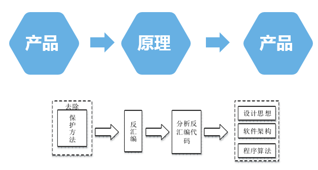

底层软件
========================================

分析视角
----------------------------------------
- 高阶视角
	- 程序结构
		模块（动态库，静态库），公共代码构造（过程，对象）。
	- 数据管理
		变量，用户自定义的数据结构，列表（数组，链表，树等）。
	- 控制流
		条件块，切换块，循环等。
	- 高级语言
		C语言，C++语言，JAVA语言，C#语言。

- 低阶视角
	- 数据管理
		寄存器，堆栈，堆，可执行数据区（全局变量，预初始化数据区域等）。
	- 控制流
		特定平台与特定语言相关（或者说与特定平台下的编译器相关）。

汇编语言
----------------------------------------

CPU
~~~~~~~~~~~~~~~~~~~~~~~~~~~~~~~~~~~~~~~~
- 指令集架构(ISA)
- 机器码
- 汇编语言
- CPU寄存器
- ...

机器码与汇编指令
~~~~~~~~~~~~~~~~~~~~~~~~~~~~~~~~~~~~~~~~
	|asm1|

关系
~~~~~~~~~~~~~~~~~~~~~~~~~~~~~~~~~~~~~~~~
	|asm2|

编译器与编译基础
----------------------------------------
	|asm3|

执行环境
----------------------------------------
- 运行时（CLR）
	通常来说，直接使用现有的硬件和操作系统标准是件好事，但它同样也会把语言规范与现有标准的抽象层次紧密捆绑起来。例如，常见的操作系统并没有支持垃圾回收的堆内存，因此我们就无法用现有的标准来描述一种能够利用垃圾回收优势的接口（例如，把一堆字符串传来传去而不用担心谁来删除它们）。同样，典型的可执行文件格式只提供了运行一个程序所需要的信息，但并没有提供足够的信息能让编译器把其他的二进制文件与这个可执行文件绑定。
	 | 由此可见，现有的可执行文件格式标准无法同时做到：
	 | 1、满足运行程序的需求；
	 | 2、提供使程序完整所必须的其他信息或二进制文件。
	基础功能
		| 垃圾回收
		| 内存安全和类型安全
		| 对编程语言的高级支持
	次要功能
		| AppDomains程序隔离
		| 程序安全与沙盒
	其他功能
		| 版本管理调试
		| 性能分析
		| 互操作

- 软件执行环境
	| JVM（运行JAVA程序）和公共语言运行时CLR（运行Microsoft.Net应用程序）。
	| 优点：平台独立，增强的功能（垃圾回收，运行时类型安全，内存安全访问）,可移植
	| 解释器（虚拟机的实现方法）：主要缺点性能缺失。
	| 字节码处理器（硬件）：Imsys公司，aJile公司。
	| 逆向策略：字节码->高效的反编译器->高级语言表示。
	| 使用混淆器

- 硬件执行环境
	| Intel NetBrust，Micro-Ops
	| 管线：三个阶段，前端，乱序核，收回区。
	| 分支预测

.. |asm1| image:: ../images/asm1.png
.. |asm2| image:: ../images/asm2.png
.. |asm3| image:: ../images/asm3.png