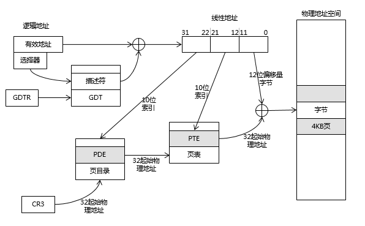

操作系统基础
========================================

组件与基本架构
----------------------------------------
- 版本回顾

::

	Windows 1.0-3.2
	Windows 95
	Windows 98
	Windows Me
	Windows 2000
	Windows xp
	Windows server 2003

- NT架构特征

::

	纯32位架构
	支持虚拟内存
	可移植性（C/C++）
	支持多线程
	支持多处理器
	安全性（ACL,NTFS）
	兼容性

- 硬件环境

::

	IA32
	DEC
	Alpha
	AMD64
	Intel IA-64
	Intel EMT-64

- 架构
	|osbase1|

工作模式
----------------------------------------
- 实模式

::

	20位物理地址
	所有段可读可写可执行

- 保护模式

::

	内存分段分页
	虚拟内存
	特权级
	GDTR,LDTR,页表
	多任务

- 虚拟8086模式

::

	运行在保护模式下的8086
	支持多任务
	地址保护

- 状态切换
	|osbase2|

内存管理
----------------------------------------
- windows32进程内存布局
	- 用户私有空间（2GB）
	- 内核共享空间（2GB）
- 进程私有内存布局
	|osbase3|
- 系统内核内存布局
	|osbase4|
- 逻辑地址到内存地址的转换
	|osbase5|
- 管理方式
	- 虚拟内存和分页
		虚拟内存：软件和物理内存之间的不可见层
		离散分配管理：分段，分页
	- 区段对象
		即内存映射文件，相关API：CreateFileMapping，MapViewofFileEx，UnmapViewofFile
	- VAD树
		映射分配：所有载入内存的可执行文件和区段对象。
		私有分配：私有局部分配，如堆，堆栈。
	- 用户模式内存分配
		私有分配（VirtualAlloc），堆，堆栈，可执行文件，映射视图
	- 内存管理API
		VirtualAlloc，VirtualProtect，VirtualQuery，VirtualFree，MapViewofFileEx，UnmapViewofFile等

对象管理
----------------------------------------
- 分类
	|osbase6|

- 特点
	| 1.引用计数
	| 2.安全性（SECURITY_ATTRIBUTES）
	| 3.CloseHandle()
	| 4.跨进程内核对象的共享

- 存储
	|osbase7|

应用程序编程接口
----------------------------------------
- win32 API
	| 2000多个
	| 组成：内核API，用户API，图形设备接口API
	| 高层接口体系：MFC，.NET Framework
- 本地 API
	| 组成： NTDLL.DLL（用户模式调用）和NTOSKRNL.EXE（内核模式调用）导出函数集合，包含内存管理器，I/O系统，对象管理器，进程与线程等直接接口，与GUI无关，Windows隐藏并未公开。
	| NTDLL.DLL本地API命名：Nt函数（真正实现），Zw函数
- 系统调用机制
	Int 2E，SYSENTER

可执行文件（PE）
----------------------------------------
- 特点
	| 可移植，可执行
	| 跨Win32平台的文件格式
	| 所有Win32执行体（exe，dll，kernel mode drivers）
- 结构
	|PE1|

中断和异常
----------------------------------------
- 中断
	| 中断源：外部输入输出设备（硬件）。
	| 本质：CPU与外部设备之间的通信方式,为了支持CPU与外部设备的并发操作。
	| 硬件级：中断控制器
	| 隐操作：程序状态及程序断点地址的进栈和出栈。
- 异常
	| 异常源：程序错误，特殊指令，机器检查异常；
	| 本质：CPU执行指令本身出现的问题。
	| CPU异常和软件异常
- 中断类型
	|osbase8|
- 中断处理过程-实模式
	|osbase9|

::

	1.CS和EIP入栈
	2.标志寄存器EFLAGS入栈
	3.关中断（清除IF标志）
	4.清除TF,RF,AC标志
	5.根据中断向量，查找IVT表
	6.执行“中断例程”
	7.执行IRET指令,弹出CS,EIP以及EFLAGS返回到被中断程序

- 中断处理过程-保护模式
	从中断描述符表IDT和全局描述符表GDT（或局部描述符表LDT）中经两级查找，形成32位中断处理程序首地址。
	|osbase10|

::

	kd> !idt -a

	Dumping IDT:

	00: 8053f19c nt!KiTrap00
	01: 8053f314 nt!KiTrap01
	02: Task Selector = 0x0058
	03: 8053f6e4 nt!KiTrap03
	04: 8053f864 nt!KiTrap04
	05: 8053f9c0 nt!KiTrap05
	06: 8053fb34 nt!KiTrap06
	07: 8054019c nt!KiTrap07
	08: Task Selector = 0x0050
	09: 805405c0 nt!KiTrap09
	0a: 805406e0 nt!KiTrap0A
	0b: 80540820 nt!KiTrap0B
	0c: 80540a7c nt!KiTrap0C
	0d: 80540d60 nt!KiTrap0D
	0e: 80541450 nt!KiTrap0E
	… …

- 结构化异常处理-高阶视角
	|osbase11|

::

	结束异常程序：
	—try{
	//受保护的代码
	}
	__finally{
	//结束处理
	}
	异常处理程序：
	—try{
	//受保护的代码
	}
	__except(/*异常过滤器 exception filter*/){
	//异常处理程序 exception handler
	}

- 结构化异常处理-低阶视角
	|osbase12|

::

	登记异常处理器：
	push	she_handler		//处理函数地址
	Push	FS:[0]			//前一个SHE处理器地址
	Push	FS:[0] , ESP	//登记新的结构

	注销异常处理器：
	mov	eax , [ESP]		//从栈顶取得前一个异常登记结构的地址
	mov	FS:[0] , EAX		//将前一个异常结构的地址赋给FS:[0]
	add	esp , 8				//清理栈上的异常登记结构

- 结构化异常处理-内核视角
	|osbase13|

::

	1.KiTrapXX-> CommonDispatchException-> KiDispatchException

	2.首先试图交给调试器处理

	3.每个异常最多两轮处理机会

	4.JIT调试器处理

	未处理的用户态异常=》GPF错误框
	未处理的内核态异常=》BSOD蓝屏

软件调试
----------------------------------------
- 调试器与应用程序关系
	|osbase14|

::

	1 . 控制被调试程序，包括中断到调试器，单步跟踪调试，恢复运行，设置断点。
	2 . 访问被调试程序代码和数据，读写寄存器。
	如：OllyDbg，IDA，WinDbg等

- 角色分工
	|osbase15|
- CPU调试支持
	| 1.INT 3指令
	| 2. EFLAGS中TF标志
	| 3. DR0~DR7
	| 4. 调试异常（#DB）
	| 5. 断点异常（#BP）
	| 6. 任务状态段（TSS）中T标志
	| 7. 分支记录机制
	| 8. 性能监控
	| 9. JTAG支持

.. |osbase1| image:: ../images/osbase1.png
.. |osbase2| image:: ../images/osbase2.png
.. |osbase3| image:: ../images/osbase3.png
.. |osbase4| image:: ../images/osbase4.png

.. |osbase6| image:: ../images/osbase6.png
.. |osbase7| image:: ../images/osbase7.png
.. |PE1| image:: ../images/PE1.png
.. |osbase8| image:: ../images/osbase8.png
.. |osbase9| image:: ../images/osbase9.png
.. |osbase10| image:: ../images/osbase10.png
.. |osbase11| image:: ../images/osbase11.jpg
.. |osbase12| image:: ../images/osbase12.png
.. |osbase13| image:: ../images/osbase13.png
.. |osbase14| image:: ../images/osbase14.png
.. |osbase15| image:: ../images/osbase15.png