操作系统基础
========================================

组件与基本架构
----------------------------------------

版本回顾
~~~~~~~~~~~~~~~~~~~~~~~~~~~~~~~~~~~~~~~~
::

	Windows 1.0-3.2
	Windows 95
	Windows 98
	Windows Me
	Windows 2000
	Windows xp
	Windows server 2003

处理器架构
~~~~~~~~~~~~~~~~~~~~~~~~~~~~~~~~~~~~~~~~
- x86
	+ 指令架构：可变指令长度的CISC（复杂指令集）
	+ IA32
	+ Intel IA-64
		- 是Intel独立开发，不兼容现在的传统的32位计算机，仅用于Itanium（安腾）以及后续产品Itanium 2。
		- intel使用与x86完全不同的IA64架构，由于与原来的X86完全不兼容，因此在PC领域没有得到应用，只在服务器领域有一些使用。
	+ Intel EMT-64
		- 类似AMD64，与其抗衡的产品，兼容x86指令集，后期称为Intel 64。
	+ AMD64
		- 又称“x86-64”或“x64”，是一种64位元的电脑处理器架构，由AMD公司开发。
		- 完全兼容x86指令集，不用任何修改就能运行老的操作系统和应用软件，在PC界得到广泛的应用。
- ARM架构
	+ 指令架构：32位元精简指令集（RISC）处理器架构，其广泛地使用在许多嵌入式系统设计。
- MIPS
	+ MIPS指令架构由MIPS公司所创，属于RISC（精简指令集）体系。
	+ MIPS的授权费用比较低，也就为除英特尔外的大多数芯片厂商所采用。

NT系统特征
~~~~~~~~~~~~~~~~~~~~~~~~~~~~~~~~~~~~~~~~
::

	纯32位架构
	支持虚拟内存
	可移植性（C/C++）
	支持多线程
	支持多处理器
	安全性（ACL,NTFS）
	兼容性

系统架构
~~~~~~~~~~~~~~~~~~~~~~~~~~~~~~~~~~~~~~~~
|osbase1|

工作模式
----------------------------------------
- 实模式

::

	20位物理地址
	所有段可读可写可执行

- 保护模式

::

	内存分段分页
	虚拟内存
	特权级
	GDTR,LDTR,页表
	多任务

- 虚拟8086模式

::

	运行在保护模式下的8086
	支持多任务
	地址保护

- 状态切换
	|osbase2|

内存管理
----------------------------------------
- windows32进程内存布局
	- 用户私有空间（2GB）
	- 内核共享空间（2GB）
- 进程私有内存布局
	|osbase3|
- 系统内核内存布局
	|osbase4|
- 逻辑地址到内存地址的转换
	+ 逻辑地址
		- 机器语言指令仍用这种地址指定一个操作数的地址或一条指令的地址。
		- 这种寻址方式在Intel的分段结构中表现得尤为具体，它使得MS-DOS或Windows程序员把程序分为若干段。
		- 每个逻辑地址都由一个段和偏移量组成。
	+ 线性地址
		- 针对32位CPU，线性地址是一个32位的无符号整数，可以表达高达2^32（4GB）的地址。
		- 通常用16进制表示线性地址，其取值范围为0x00000000～0xffffffff。对64位CPU，线性地址是一个64位的无符号整数，可以表达高达264。
	+ 物理地址
		- 也就是内存单元的实际地址，用于芯片级内存单元寻址。物理地址也由32位无符号整数表示。
	+ 操作系统将内存空间按照“页”为单位划分了很多页面，这个页的大小默认是4KB（当然可以改的），各进程拥有虚拟的完整的地址空间，进程中使用到的页面会映射到真实的物理内存上，程序中使用的地址是虚拟地址（分三段：页目录索引、页表索引、页内偏移。），CPU在运行时自动将其翻译成真实的物理地址。
		- 32位系统未开启PAE（10-10-12分页）
			|PAE1|
			
		::
		
			1.Directory Entry(PDE)     = PDBR[Directory];
			2.Page-Table Entry(PTE) = PDE + Table * 4;
			3.Physical Address  = PTE + Offset;
			
		- 32系统开启PAE（2-9-9-12分页）
			|PAE2|
			
		::
		
			1.Dir.Pointer Entry(PDPTE)  = PDPTR[Directory Pointer];
			2.Director Entry(PDE)  = PDPTE + Directory * 0x8;
			3.Page-Table Entry(PTE)  = PDE + Table * 0x8;
			4.Physical Address  = PTE+Offset;
			注：CR3不直接指向PDT表，而是指向一张新的表，叫做PDPT表（页目录指针表），每项占8个字节。
		
			kd> .formats 0x30001
			Evaluate expression:
			  Hex:     00030001
			  Decimal: 196609
			  Octal:   00000600001
			  Binary:  00000000 00000011 00000000 00000001
			  Chars:   ....
			  Time:    Sat Jan  3 14:36:49 1970
			  Float:   low 2.75508e-040 high 0
			  Double:  9.71378e-319
			
			VA为：
			2位：（30—31）页目录指针表的索引（00B）
			9位：（21—29）页目录表索引（000000000B）
			9位：（12—20）页表索引（000110000B）
			12位：（0—11）页内偏移（000000000001B）
			
			1.获取页目录指针表物理地址
			kd> r cr3
			cr3=7f145360
			2.定位页目录指针表并获取页目录表物理页地址
			kd> !dd 7f145360
			#7f145360 0915f801 00000000 07160801 00000000
			页目录指针表项的下标为0,所以就是0x0915f801,因此0x0915f000是页目录表物理页面的首地址。
			3.定位页表项
			kd> !dd 0x0915f000 + 0x0 * 8
			# 915f000 06c4a867 00000000 08bcd867 00000000
			0x06c4a867就是要找的页目录表项,因此页表物理内存页面首地址为0x06c4a000.
			4.定位物理页面
			kd> !dd 0x06c4a000 + 0x30 * 8
			# 6c4a180 6e607025 80000000 6e108025 80000000
			5.计算物理地址
			0x6e607000 + 0x1 = 0x6e607001即最终物理地址
			
			直接使用!pte命令查看：
			kd> !pte 0x30001
						   VA 00030001
			PDE at C0600000            PTE at C0000180
			contains 0000000006C4A867  contains 800000006E607025
			pfn 6c4a      ---DA--UWEV  pfn 6e607     ----A--UR-V
			kd> dc C0000180
			c0000180  6e607025 80000000 6e108025 80000000  %p`n....%..n....
			c0000190  6e709025 80000000 6e10a025 80000000  %.pn....%..n....

		- 64位系统（9-9-9-9-12分页）

- 管理方式
	+ 虚拟内存和分页
		- 虚拟内存：软件和物理内存之间的不可见层
		- 离散分配管理：分段
		
		::
		
			当前进程：
			kd> r
			eax=00000003 ebx=00000000 ecx=00002010 edx=0000006a esi=fffffffe edi=00000065
			eip=83c83110 esp=8d6735c0 ebp=8d67360c iopl=0         nv up ei pl zr na pe nc
			cs=0008  ss=0010  ds=0023  es=0023  fs=0030  gs=0000             efl=00000246
			查看描述符寄存器内容：
			kd> rM 100
			gdtr=80b99000   gdtl=03ff idtr=80b99400   idtl=07ff tr=0028  ldtr=0000
			即GDT地址从80b99000开始，大小为1023字节（8184二进制位），意味着GDT大约由127个段描述符构成，每个描述符占用64位。
			使用dg命令直观显示与段选择器对应的段描述符：
			kd> dg 0 50
											  P Si Gr Pr Lo
			Sel    Base     Limit     Type    l ze an es ng Flags
			---- -------- -------- ---------- - -- -- -- -- --------
			0000 00000000 00000000 <Reserved> 0 Nb By Np Nl 00000000
			0008 00000000 ffffffff Code RE Ac 0 Bg Pg P  Nl 00000c9b
			0010 00000000 ffffffff Data RW Ac 0 Bg Pg P  Nl 00000c93
			0018 00000000 ffffffff Code RE Ac 3 Bg Pg P  Nl 00000cfb
			0020 00000000 ffffffff Data RW Ac 3 Bg Pg P  Nl 00000cf3
			0028 801e3000 000020ab TSS32 Busy 0 Nb By P  Nl 0000008b
			0030 83d33c00 00003748 Data RW Ac 0 Bg By P  Nl 00000493
			0038 7ffde000 00000fff Data RW Ac 3 Bg By P  Nl 000004f3
			0040 00000400 0000ffff Data RW    3 Nb By P  Nl 000000f2
			0048 00000000 00000000 <Reserved> 0 Nb By Np Nl 00000000
			0050 83d31000 00000068 TSS32 Avl  0 Nb By P  Nl 00000089

			界限值都是0xffffffff。
			第1列表示选择子
			第2，3列表示基地址和边界。
			第4列表示段的类型，E代表只读和可执行,Ac表示被访问过。
			第5列表示特权级（环0或环3）
			第7列表示边界值的粒度单位（Byte或Page）。
			第8列表示段是否在内存中。
			注：
			kd> dg 08
											  P Si Gr Pr Lo
			Sel    Base     Limit     Type    l ze an es ng Flags
			---- -------- -------- ---------- - -- -- -- -- --------
			0008 00000000 ffffffff Code RE Ac 0 Bg Pg P  Nl 00000c9b
			kd> dg 0x10
											  P Si Gr Pr Lo
			Sel    Base     Limit     Type    l ze an es ng Flags
			---- -------- -------- ---------- - -- -- -- -- --------
			0010 00000000 ffffffff Data RW Ac 0 Bg Pg P  Nl 00000c93
			kd> dg 0x23
											  P Si Gr Pr Lo
			Sel    Base     Limit     Type    l ze an es ng Flags
			---- -------- -------- ---------- - -- -- -- -- --------
			0023 00000000 ffffffff Data RW Ac 3 Bg Pg P  Nl 00000cf3
			
			注：它们的基地址都是0x00000000，整个段的大小都是0xFFFFFFFF，这意味着整个进程的地址空间实际上就是一个段！
			
			操作系统这样分段，实际上是相当于把段给架空了！（linux系统同样存在这样情况）
			即Windows和Linux都选择了通过这种方式架空了CPU的分段内存管理机制。
			于是到了64位平台，段寄存器中指向的段基址无论是什么内容，都会被当成0来对待。（FS和GS寄存器例外）

		- 离散分配管理：分页
		
		::
		
			查看当前进程的一些线性地址：
			kd> !pte 0
			                   VA 00000000
			PDE at C0600000            PTE at C0000000
			contains 0000000006C4A867  contains 0000000000000000
			pfn 6c4a      ---DA--UWEV  not valid

			kd> !pte 0x7fffffff
			                   VA 7fffffff
			PDE at C0601FF8            PTE at C03FFFF8
			contains 00000000091C7867  contains 0000000000000000
			pfn 91c7      ---DA--UWEV  not valid

			kd> !pte 0x80000000
			                   VA 80000000
			PDE at C0602000            PTE at C0400000
			contains 0000000000191063  contains 0000000000000000
			pfn 191       ---DA--KWEV  not valid

			kd> !pte 0xffffffff
			                   VA ffffffff
			PDE at C0603FF8            PTE at C07FFFF8
			contains 000000000018B063  contains 0000000000000000
			pfn 18b       ---DA--KWEV  not valid
			
			从以上输出可知：
			1.页目录从线性地址0xC0600000处开始加载。
			2.页表从线性地址0xC0000000处开始加载。
			3.用户级页面在线性地址0x80000000处结束。
			注：如果目标机器没有启用PAE，页目录基地址从0xC0300000处开始。

	+ 区段对象
		即内存映射文件，相关API：CreateFileMapping，MapViewofFileEx，UnmapViewofFile
	+ VAD树
		映射分配：所有载入内存的可执行文件和区段对象。
		私有分配：私有局部分配，如堆，堆栈。
	+ 用户模式内存分配
		私有分配（VirtualAlloc），堆，堆栈，可执行文件，映射视图
	+ 内存管理API
		VirtualAlloc，VirtualProtect，VirtualQuery，VirtualFree，MapViewofFileEx，UnmapViewofFile等

对象管理
----------------------------------------
- 分类
	|osbase6|

- 特点
	| 1.引用计数
	| 2.安全性（SECURITY_ATTRIBUTES）
	| 3.CloseHandle()
	| 4.跨进程内核对象的共享

- 存储
	|osbase7|

- 分页池
	+ 分类
		- nonpaged pool
			+ 只能常驻于物理内存地址，不能映射。
			+ 只能在DPC/dispatch level或者更高IRQL才可以访问。
		- paged pool
			+ 可以映射。
			+ 任何级别的IRQL都可以访问，所以每个进程都可以访问。
		- 都使用ExAllocatePool()和ExFreePool()来分配和释放。
	+ paged pool
		::
		
			查看数量：
			kd> ln nt!ExpNumberOfPagedPools
			Browse module
			Set bu breakpoint

			(83daa014)   nt!ExpNumberOfPagedPools   |  (83daa018)   nt!WmipMaxKmWnodeEventSize
			Exact matches:
				nt!ExpNumberOfPagedPools = <no type information>
			kd> dd 83daa014
			83daa014  00000004 00080000 00000000 00000001
			4个paged pool。
			1.单处理器系统中，4个paged pool descriptors地址在nt!ExpPagedPoolDescriptor数组中存储(index of 1-4)。
			2.多处理器系统中，每一个node定义一个paged pool descriptor。
			3.还有一类特殊的按页分配的pool(prototype pools/full page allocations)，位于nt!ExpPagedPoolDescriptor的第一个索引(index 0)。
			
			查看_POOL_DESCRIPTOR：
			kd> ln nt!ExpPagedPoolDescriptor
			Browse module
			Set bu breakpoint

			(83d7cb60)   nt!ExpPagedPoolDescriptor   |  (83d7cba4)   nt!ExpLargePoolTableLock
			Exact matches:
				nt!ExpPagedPoolDescriptor = <no type information>
			kd> dd 83d7cb60
			83d7cb60  8633d000 8633e140 8633f280 863403c0
			83d7cb70  86341500 00000000 00000000 00000000
			83d7cb80  00000000 00000000 00000000 00000000
			83d7cb90  00000000 00000000 00000000 00000000
			83d7cba0  00000000 00000000 00000000 00000000
			83d7cbb0  83d77940 8633d000 00000000 00000000
			
			kd> ln nt!PoolVector
			Browse module
			Set bu breakpoint

			(83d7cbb0)   nt!PoolVector   |  (83d7cbc0)   nt!ExpNonPagedPoolDescriptor
			Exact matches:
				nt!PoolVector = <no type information>
			
			kd> dd 83d7cbb0
			83d7cbb0  83d77940 8633d000 00000000 00000000
			
			nt!ExpPagedPoolDescriptor[0]= PoolVector[1],即poi(0x83d7cb60)=poi(0x83d7cbb0+4) 
			
			查看 prototy pools ：
			kd>  dt nt!_POOL_DESCRIPTOR 8633d000
			   +0x000 PoolType         : 1 ( PagedPool )
			   +0x004 PagedLock        : _KGUARDED_MUTEX
			   +0x004 NonPagedLock     : 1
			   +0x040 RunningAllocs    : 0n16642
			   +0x044 RunningDeAllocs  : 0n3001
			   +0x048 TotalBigPages    : 0n14890
			   +0x04c ThreadsProcessingDeferrals : 0n0
			   +0x050 TotalBytes       : 0x3b2ece0
			   +0x080 PoolIndex        : 0
			   +0x0c0 TotalPages       : 0n265
			   +0x100 PendingFrees     : 0x96acdbc8  -> 0x91c93968 Void
			   +0x104 PendingFreeDepth : 0n7
			   +0x140 ListHeads        : [512] _LIST_ENTRY [ 0x8633d140 - 0x8633d140 ]
			查看正常的paged pool：
			kd>  dt nt!_POOL_DESCRIPTOR 8633e140
			   +0x000 PoolType         : 1 ( PagedPool )
			   +0x004 PagedLock        : _KGUARDED_MUTEX
			   +0x004 NonPagedLock     : 1
			   +0x040 RunningAllocs    : 0n889212
			   +0x044 RunningDeAllocs  : 0n857690
			   +0x048 TotalBigPages    : 0n482
			   +0x04c ThreadsProcessingDeferrals : 0n0
			   +0x050 TotalBytes       : 0x74e490
			   +0x080 PoolIndex        : 1
			   +0x0c0 TotalPages       : 0n1413
			   +0x100 PendingFrees     : 0x8c6160e8  -> 0x9b206938 Void
			   +0x104 PendingFreeDepth : 0n26
			   +0x140 ListHeads        : [512] _LIST_ENTRY [ 0x8633e280 - 0x8633e280 ]
	+ nonpaged pool
		::
		
			查看数量：
			kd> ln nt!ExpNumberOfNonPagedPools
			Browse module
			Set bu breakpoint

			(83d7cc00)   nt!ExpNumberOfNonPagedPools   |  (83d7cc04)   nt!ExpCacheLineSize
			Exact matches:
				nt!ExpNumberOfNonPagedPools = <no type information>
			
			kd> dd 83d7cc00
			83d7cc00  00000001 00000040 00000000 00010000
			存在1个无分页池。
			1.单处理器系统中，nt!PoolVector数组的第一成员就是nonpaged pool descriptor。
			2.多处理系统中，每一个node(NUMA system call processors and memory)都有自己的nonpaged pool descriptor。
			存储在nt!ExpNonPagedPoolDescriptor中。
			
			kd> ln nt!PoolVector
			Browse module
			Set bu breakpoint

			(83d7cbb0)   nt!PoolVector   |  (83d7cbc0)   nt!ExpNonPagedPoolDescriptor
			Exact matches:
				nt!PoolVector = <no type information>
			
			kd> dd 83d7cbb0
			83d7cbb0  83d77940 8633d000 00000000 00000000
			
			查看_POOL_DESCRIPTOR：
			kd> dt nt!_POOL_DESCRIPTOR 83d77940
			   +0x000 PoolType         : 0 ( NonPagedPool )
			   +0x004 PagedLock        : _KGUARDED_MUTEX
			   +0x004 NonPagedLock     : 0
			   +0x040 RunningAllocs    : 0n427096
			   +0x044 RunningDeAllocs  : 0n391902
			   +0x048 TotalBigPages    : 0n6608
			   +0x04c ThreadsProcessingDeferrals : 0n0
			   +0x050 TotalBytes       : 0x1d64b58
			   +0x080 PoolIndex        : 0
			   +0x0c0 TotalPages       : 0n1448
			   +0x100 PendingFrees     : 0x882f3008  -> 0x8812d840 Void
			   +0x104 PendingFreeDepth : 0n10
			   +0x140 ListHeads        : [512] _LIST_ENTRY [ 0x83d77a80 - 0x83d77a80 ]
			或使用以下命令：
			kd>  dt nt!_POOL_DESCRIPTOR poi(nt!PoolVector) 
			   +0x000 PoolType         : 0 ( NonPagedPool )
			   +0x004 PagedLock        : _KGUARDED_MUTEX
			   +0x004 NonPagedLock     : 0
			   +0x040 RunningAllocs    : 0n427096
			   +0x044 RunningDeAllocs  : 0n391902
			   +0x048 TotalBigPages    : 0n6608
			   +0x04c ThreadsProcessingDeferrals : 0n0
			   +0x050 TotalBytes       : 0x1d64b58
			   +0x080 PoolIndex        : 0
			   +0x0c0 TotalPages       : 0n1448
			   +0x100 PendingFrees     : 0x882f3008  -> 0x8812d840 Void
			   +0x104 PendingFreeDepth : 0n10
			   +0x140 ListHeads        : [512] _LIST_ENTRY [ 0x83d77a80 - 0x83d77a80 ]
	+ Session Pool
	+ ListHeads(x86)
	+ 相关资料
		- https://juejin.cn/post/6844903769331744781
		- https://www.likecs.com/show-983112.html
		- https://learn.microsoft.com/zh-tw/archive/blogs/ntdebugging/stop-0x19-in-a-large-pool-allocation
		- https://www.anquanke.com/post/id/86557
		- http://www.studyofnet.com/284903014.html

应用程序编程接口
----------------------------------------
- win32 API
	| 2000多个
	| 组成：内核API，用户API，图形设备接口API
	| 高层接口体系：MFC，.NET Framework
- 本地 API
	| 组成： NTDLL.DLL（用户模式调用）和NTOSKRNL.EXE（内核模式调用）导出函数集合，包含内存管理器，I/O系统，对象管理器，进程与线程等直接接口，与GUI无关，Windows隐藏并未公开。
	| NTDLL.DLL本地API命名：Nt函数（真正实现），Zw函数
- 系统调用机制
	Int 2E，SYSENTER

可执行文件（PE）
----------------------------------------
- 特点
	| 可移植，可执行
	| 跨Win32平台的文件格式
	| 所有Win32执行体（exe，dll，kernel mode drivers）
- 结构
	|PE1|

中断和异常
----------------------------------------
- 中断
	| 中断源：外部输入输出设备（硬件）。
	| 本质：CPU与外部设备之间的通信方式,为了支持CPU与外部设备的并发操作。
	| 硬件级：中断控制器
	| 隐操作：程序状态及程序断点地址的进栈和出栈。
- 异常
	| 异常源：程序错误，特殊指令，机器检查异常；
	| 本质：CPU执行指令本身出现的问题。
	| CPU异常和软件异常
- 中断类型
	|osbase8|
- 中断处理过程-实模式
	|osbase9|

::

	1.CS和EIP入栈
	2.标志寄存器EFLAGS入栈
	3.关中断（清除IF标志）
	4.清除TF,RF,AC标志
	5.根据中断向量，查找IVT表
	6.执行“中断例程”
	7.执行IRET指令,弹出CS,EIP以及EFLAGS返回到被中断程序

- 中断处理过程-保护模式
	从中断描述符表IDT和全局描述符表GDT（或局部描述符表LDT）中经两级查找，形成32位中断处理程序首地址。
	|osbase10|

::

	kd> !idt -a

	Dumping IDT:

	00: 8053f19c nt!KiTrap00
	01: 8053f314 nt!KiTrap01
	02: Task Selector = 0x0058
	03: 8053f6e4 nt!KiTrap03
	04: 8053f864 nt!KiTrap04
	05: 8053f9c0 nt!KiTrap05
	06: 8053fb34 nt!KiTrap06
	07: 8054019c nt!KiTrap07
	08: Task Selector = 0x0050
	09: 805405c0 nt!KiTrap09
	0a: 805406e0 nt!KiTrap0A
	0b: 80540820 nt!KiTrap0B
	0c: 80540a7c nt!KiTrap0C
	0d: 80540d60 nt!KiTrap0D
	0e: 80541450 nt!KiTrap0E
	… …

- 结构化异常处理-高阶视角
	|osbase11|

::

	结束异常程序：
	—try{
	//受保护的代码
	}
	__finally{
	//结束处理
	}
	异常处理程序：
	—try{
	//受保护的代码
	}
	__except(/*异常过滤器 exception filter*/){
	//异常处理程序 exception handler
	}

- 结构化异常处理-低阶视角
	|osbase12|

::

	登记异常处理器：
	push	she_handler		//处理函数地址
	Push	FS:[0]			//前一个SHE处理器地址
	Push	FS:[0] , ESP	//登记新的结构

	注销异常处理器：
	mov	eax , [ESP]		//从栈顶取得前一个异常登记结构的地址
	mov	FS:[0] , EAX		//将前一个异常结构的地址赋给FS:[0]
	add	esp , 8				//清理栈上的异常登记结构

- 结构化异常处理-内核视角
	|osbase13|

::

	1.KiTrapXX-> CommonDispatchException-> KiDispatchException

	2.首先试图交给调试器处理

	3.每个异常最多两轮处理机会

	4.JIT调试器处理

	未处理的用户态异常=》GPF错误框
	未处理的内核态异常=》BSOD蓝屏

软件调试
----------------------------------------
- 调试器与应用程序关系
	|osbase14|

::

	1 . 控制被调试程序，包括中断到调试器，单步跟踪调试，恢复运行，设置断点。
	2 . 访问被调试程序代码和数据，读写寄存器。
	如：OllyDbg，IDA，WinDbg等

- 角色分工
	|osbase15|
- CPU调试支持
	| 1.INT 3指令
	| 2. EFLAGS中TF标志
	| 3. DR0~DR7
	| 4. 调试异常（#DB）
	| 5. 断点异常（#BP）
	| 6. 任务状态段（TSS）中T标志
	| 7. 分支记录机制
	| 8. 性能监控
	| 9. JTAG支持

链接
----------------------------------------
+ 重解析点
    - NTFS重解析点（英语：NTFS reparse point），微软官方也译重分析点、重新解析点、重新分析点，是NTFS文件系统中的一种对象类型。
    - 一个重解析点包含一个重解析标签和数据，文件系统过滤器（file system filter）可以按标签解读它。
    - 微软提供了几个默认标签，包括 **NTFS符号链接** 、 **NTFS目录交接点** 和 **NTFS卷挂载点** 、 **硬链接** 。
+ 快捷方式
+ 软链接（junction point）
    - NTFS内置机制，从Windows2000/XP版本开始支持。
    - 只适用于 **目录** ，只能使用 **绝对路径** 。
    - 软链接必须与目标目录位于同一台电脑，不能跨主机可以 **跨盘符** 、不能使用UNC路径；
    - 删除目标目录，软链接仍将存在，但失效了，会指向不存在的目录。
        + 交接点（Junction），也称为"再分析点"，它是链接本地目录（可跨卷）的访问点，通过交接点的操作都会被系统映射到实际的目录上。
        + 对交接点内文件和子目录的 **建立、删除、修改** 等操作都被映射到对应的目录中的文件和子目录上，对交接点的"复制、粘贴、剪切、配置 ACL"，只会影响此交接点，在同一卷内移动交接点，只会影响此交接点，但在不同卷间移动交接点，会将此交接点转换为正常目录，并且交接点对应目录下的所有内容都会被移动。
    - CMD命令：mklink /J link dst（注：link目录必须不存在）
+ 硬链接（hard link）
    - NTFS内置机制，从Windows NT4版本开始支持。
    - 只适用于 **文件** ，只能使用 **绝对路径** 。
    - hard link与targetfile必须位于同一磁盘下，即 **不能跨盘符** 。
    - 删除硬链接，不影响目标文件。
    - 删除目标文件，不影响硬链接。
    - CMD命令：mklink /D to from
+ 符号链接（symbolic link）
    - 符号链接（Symlink，Softlink）是对 **文件或目录** 的引用，实际上符号链接本身是一个"记录着所引用文件或目录的绝对或相对路径"的特殊文件。
    - 可以使用 **相对、绝对路径** ，一种拥有综合能力的快捷方式，文件大小为0字节和不占用空间。
    - 可以 **跨盘符** ，可以 **跨主机** ，可以使用UNC路径、网络驱动器。
    - 通过对符号链接文件的 **读、写、遍历** 等操作都会被重定向到目标文件或目录。
    - 但对符号链接文件的"复制、删除、移动、配置 ACL"等操作只针对自身。
    - 删除目标对象，符号链接仍将存在，但失效了，变得不可用。
    - CMD指令：mklink /D to from

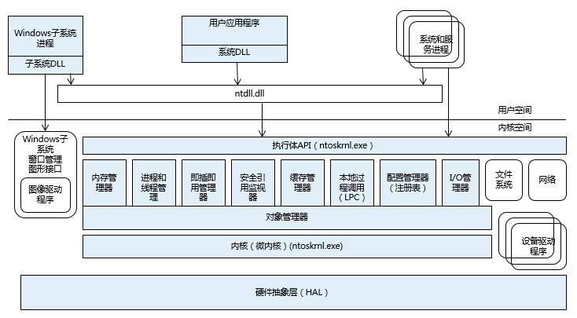
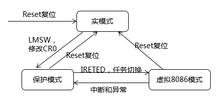
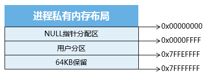
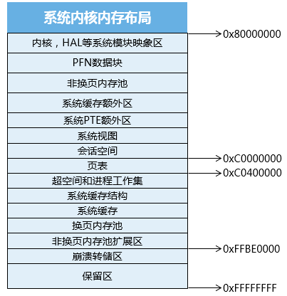
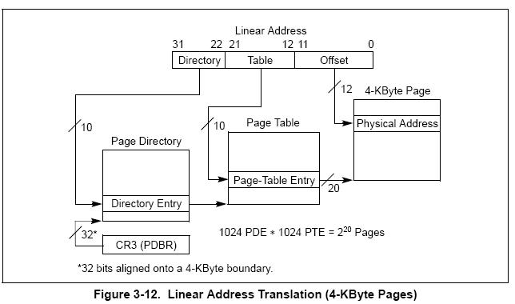
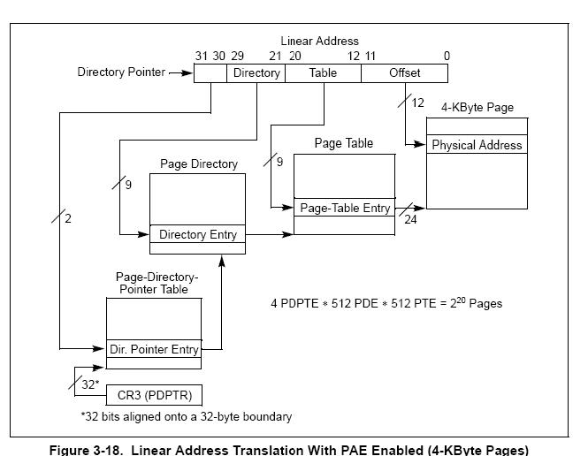
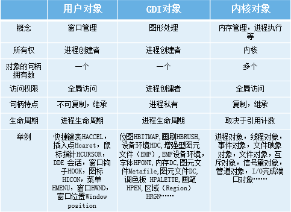
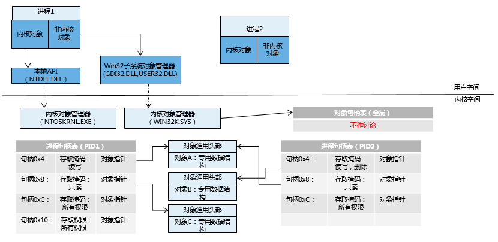
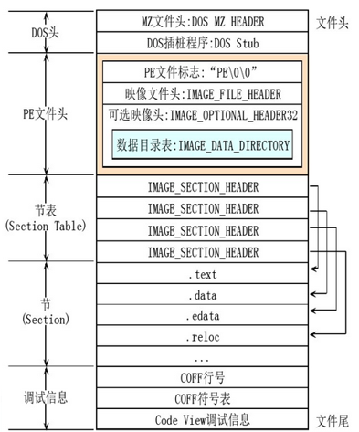
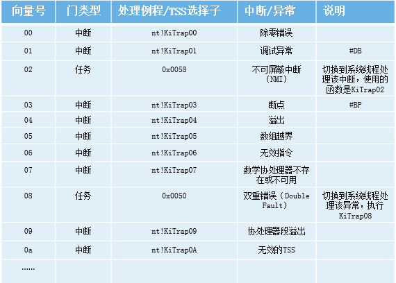
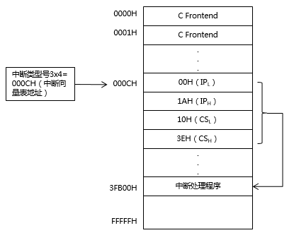
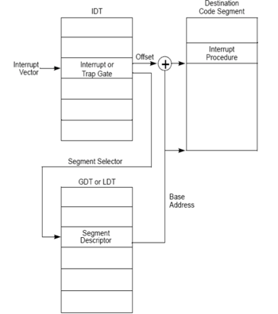
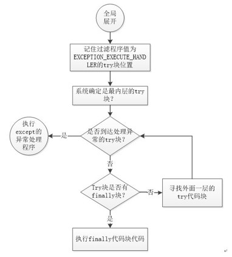
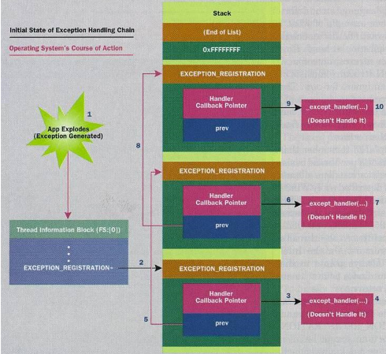
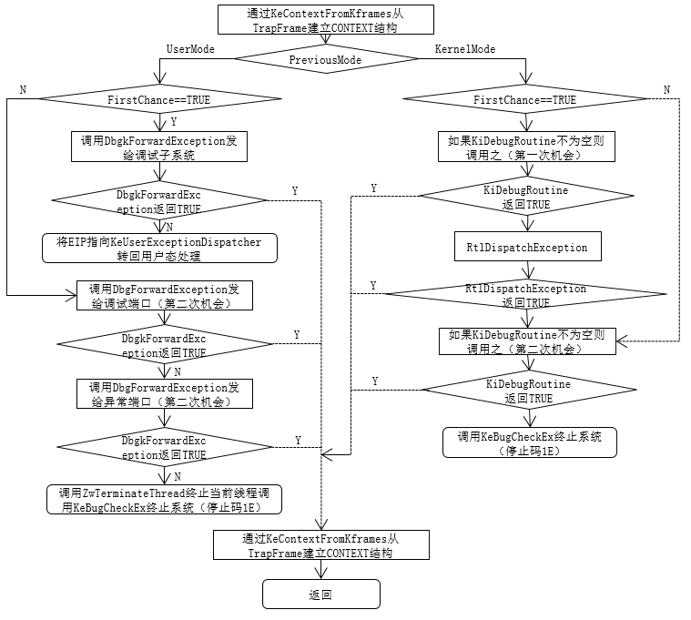

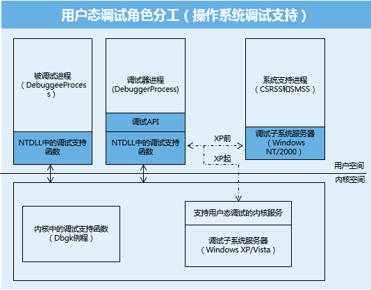